# 研究笔记 | 利率观察框架下的策略思路

市场参与者通常对利率方向有明确判断，但在表达观点时往往面临权衡：要么接受线性工具带来的非预期风险，要么为期权支付未必需要的保护成本。我们梳理了美元利率波动率曲面，识别出在不同市场环境下相对合适的期权表达方式。

## 核心要点

为平衡非预期风险与期权成本，我们基于当前市场驱动因素和波动率定价，识别出以下期权表达方式：

- 利率上行方向：3个月30年期payer价差。入场水平具备一定吸引力，当前ATM波动率较低，payer偏斜度较高。
- 利率下行方向：6个月5年期低行权价receiver。receiver偏斜度较低，且时间窗口足以容纳宏观数据对市场定价的检验。
- 曲线陡化：3个月5年/30年曲线cap。可覆盖多种陡化情景，同时将下行风险限制在已支付的权利金范围内。
- 曲线平坦化：1个月2年/5年bear flattener。仅在利率上行情景中针对曲线平坦化，且无需前期权利金。

---

## 利率上行方向

长期国债回报表现持续接近周期高位，但多次未能有效突破。与此同时，日度已实现波动率已降至多年低位附近，使得较高行权价的隐含波动率处于近期区间底部（见图1）。此外，payer偏斜度偏高，反映出在通胀和地缘风险背景下，对尾部对冲的需求持续存在。

我们建议关注3个月30年期F/F+25 payer价差作为利率上行方向的参考结构：

- 估值层面：低ATM波动率使入场成本相对可控，而较高的payer偏斜度允许读者通过价差结构利用上行波动率。
- 期限选择：1年以内的波动率曲面有一定斜率。1个月期限虽成本更低，但覆盖的宏观催化剂较少；更长期限虽包含更多事件风险，但成本也相应增加。10月下旬到期的合约在两者间取得平衡，覆盖三次CPI发布、三次非农报告及9月FOMC会议，为利率重新定价提供多次机会。

结构思路：买入等名义本金的3个月30年期F/F+25 payer价差，权利金约135c，相当于8bp运行成本。若30年互换利率在到期时高于高行权价，该结构最高可获得约3倍赔付。下行风险限于已支付的权利金。主要风险在于长期回报表现在未来三个月未能上行，例如若通胀数据偏软缓解了市场对长期通胀的担忧。

图1：3个月30年期波动率与偏斜度
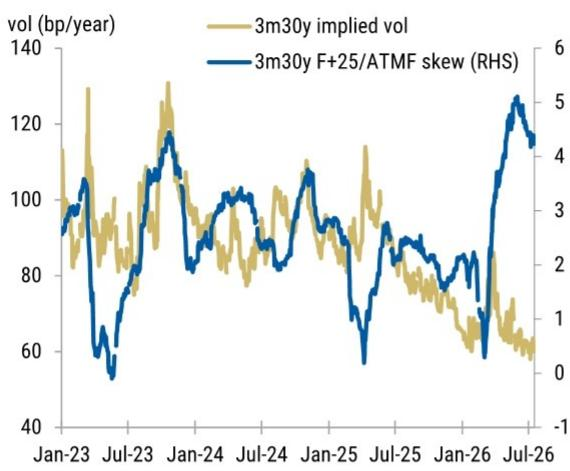
来源：Bloomberg, MS

图2：30年利率、3个月远期及最大赔付水平
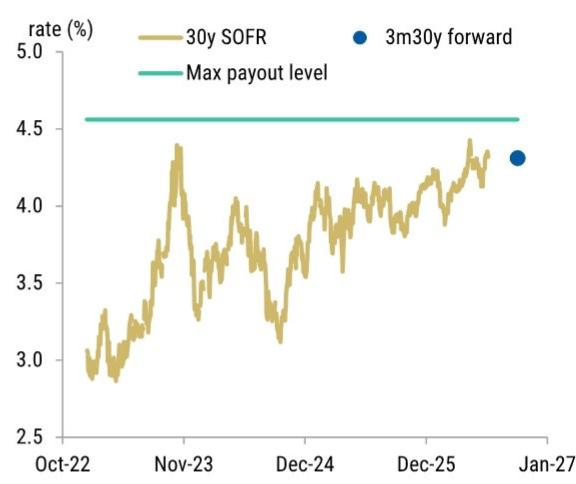
来源：Bloomberg, MS

## 利率下行方向

曲线前端目前定价了到2026年底约35bp的额外加息。除非出现外部冲击，利率下行更可能需要后续数据通过通胀放缓、劳动力市场走弱或两者兼有来挑战当前定价。因此，我们倾向于选择有足够时间让宏观数据展开的期权结构。

我们建议关注6个月5年期F-25 receiver作为利率下行方向的参考：

- 隐含波动率成本：6个月5年期隐含波动率仅比21天已实现波动率高出约10bp/年（见图3），低于1年和2年期限。
- 期限溢价有限：5年期波动率曲面是各流动性期限中最平坦的（见图4），允许读者以相对较低的成本将期限延长至6个月。
- receiver偏斜度：低行权价波动率略低于ATM波动率，接近2023年3月以来的最低水平。

结构思路：买入6个月5年期F-25 receiver，权利金约60c，相当于13bp运行成本。下行风险限于已支付的权利金。主要风险在于后续数据仍具韧性，足以支持美联储在未来六个月内实施一次或多次额外加息。

图3：6个月5年期波动率与21天已实现波动率
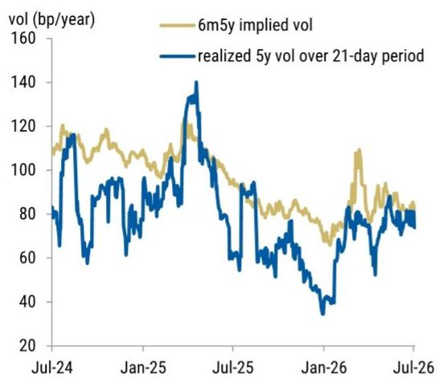
来源：Bloomberg, MS

图4：相对于1个月到期的波动率溢价（至1年到期）
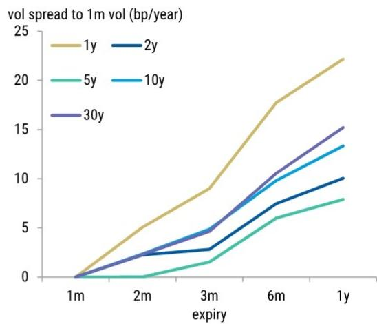
来源：Bloomberg, MS

## 曲线陡化

在利率上行和下行方向的讨论之后，我们偏好的曲线陡化结构是5年/30年。在近期的一份报告中，我们曾指出7年/30年陡化结构在波动率调整后的持有和滚动收益方面表现较佳。

我们建议关注3个月ATM 5年/30年曲线cap作为曲线陡化方向的参考：

- 宏观背景：历史上，5年/30年曲线在美联储降息周期中倾向于陡化。自2025年4月以来，现货5年/30年已回吐全部陡化幅度（见图5），尽管美联储在此期间已降息75bp。
- 风险暴露平衡：曲线cap提供对多种陡化情景的非对称暴露。该结构既受益于美联储宽松政策下前端重新定价，也受益于长期端的潜在突破。相关性节省接近历史中位数水平而非极端值，但我们认为平衡的收益结构足以弥补平均水平的估值。

结构思路：买入3个月ATM 5年/30年曲线cap，权利金约12c。下行风险限于已支付的权利金。主要风险在于未来三个月曲线出现平坦化，例如若美联储实施额外加息并释放重启加息周期的信号。

图5：5年/30年曲线及最新数值
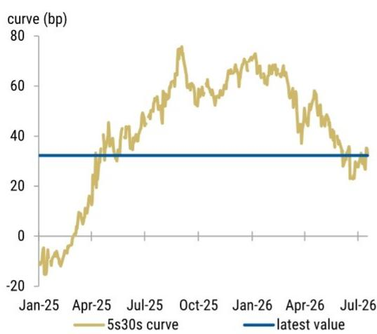
来源：Bloomberg, MS

图6：3个月5年/30年曲线期权的隐含曲线相关性
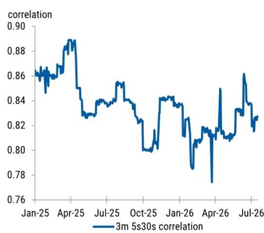
来源：Bloomberg, MS

## 曲线平坦化

曲线前端在未来一个月可能受到伊朗局势发展的影响。传导机制较为直接：能源供应中断推高商品价格，进而推升通胀和通胀预期，增加美联储更偏鹰派回应的风险，并导致2年/5年曲线出现bear flattening。

我们建议关注零成本的2年/5年bear flattener作为曲线平坦化方向的参考：

- 期限选择：7月底之前日历较为清淡，在7月FOMC会议前没有一级数据发布或重要的美联储沟通。因此，伊朗局势发展很可能成为一个月内市场的主要催化剂。
- 不确定性较高：bear flattener提供针对通胀预期上升驱动的鹰派重新定价的定向暴露，同时限制对其他利率情景的暴露。若地缘紧张局势缓解，通胀风险应会消退，曲线可能bull steepen，该结构将到期失效。在此情景下，读者无需为不预期的结果支付前期权利金。
- 波动率溢价：bear flattener通常包含波动率溢价。当前该溢价接近3月以来的最低水平，使该结构成为对冲地缘风险的一种方式。

结构思路：买入2.36倍ATM+1bp的1个月2年期payer，同时卖出1倍ATM的1个月5年期payer，实现零前期权利金。下行风险无上限。主要风险在于美联储在7月会议加息并释放更鹰派的政策路径信号。在此情景下，曲线可能bear steepen，导致该结构表现不佳。

图7：1个月2年/5年bear flattener的波动率收益
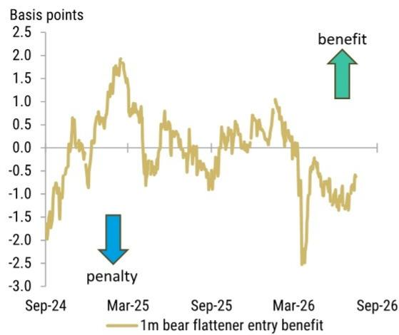
来源：Bloomberg, MS

图8：2年/5年曲线及盈亏平衡水平
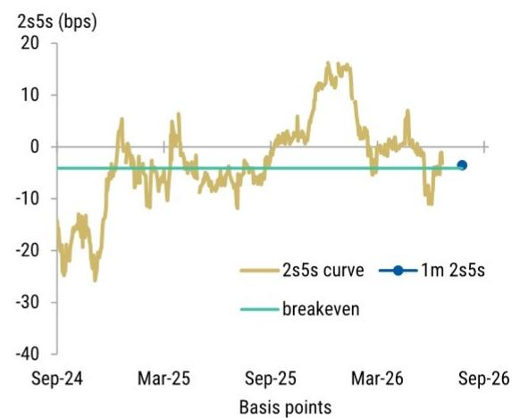
来源：Bloomberg, MS

---

## 波动率监测

读者近期重新开始卖出波动率。总体来看，交易商目前持有的gamma多头头寸约为过去一年观察到的最大水平的50%。

长期gamma曲线呈现两个明显峰值：一个在当前利率水平附近，另一个约低50bp。这表明读者在利率有限上行时愿意卖出gamma，但在任何下行行情中对做空gamma持谨慎态度。

图9：交易商净gamma暴露
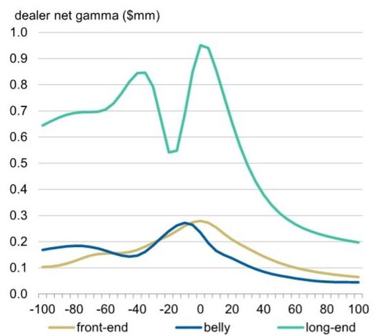
来源：DTCC, MS

图10：历史现货交易商净gamma
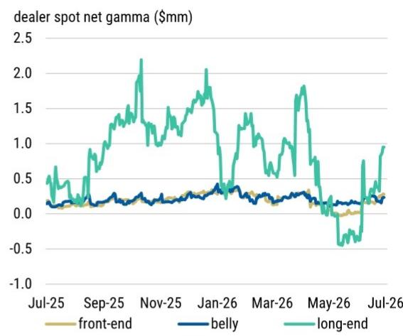
来源：DTCC, MS

图11：客户净gamma流量（千美元）

| 期限\尾部 | 1年 | 2年 | 3年 | 5年 | 10年 | 15年 | 20年 | 30年 |
|---------|-----|-----|-----|-----|------|------|------|------|
| 1个月 | 1 | (2) | (1) | (40) | (124) | (6) | (18) | (49) |
| 2个月 | 5 | (3) | 0 | (5) | 1 | 0 | 0 | 3 |
| 3个月 | (3) | 6 | 2 | (3) | 21 | 14 | 0 | (67) |
| 6个月 | (1) | (0) | 0 | 4 | (11) | 0 | (2) | (1) |
| 9个月 | 2 | 0 | 0 | 5 | 0 | 0 | (0) | 4 |
| 1年 | (1) | 1 | (0) | 0 | 10 | 0 | 0 | 39 |
| 18个月 | 2 | (1) | (0) | 0 | 0 | 0 | 0 | 0 |
| 2年 | (2) | (0) | (0) | 0 | (4) | 0 | 0 | (0) |
| 3年 | (0) | 0 | (1) | (1) | 0 | 0 | (0) | 0 |
| 5年 | (0) | 0 | 0 | (1) | (1) | 0 | (0) | (7) |
| 10年 | 0 | 0 | 0 | (1) | (1) | 0 | (1) | 0 |
| 15年 | 0 | 0 | 0 | (0) | (0) | 0 | 0 | 0 |
| 20年 | 0 | 0 | 0 | 0 | (1) | 0 | 0 | 0 |

来源：DTCC, MS

图12：客户净vega流量（千美元）

| 期限\尾部 | 1年 | 2年 | 3年 | 5年 | 10年 | 15年 | 20年 | 30年 |
|---------|-----|-----|-----|-----|------|------|------|------|
| 1个月 | 4 | (19) | (5) | (310) | (689) | (32) | (91) | (253) |
| 2个月 | 69 | (37) | 0 | (54) | 16 | 0 | 0 | 33 |
| 3个月 | (59) | 120 | 41 | (57) | 360 | 236 | 0 | (1,053) |
| 6个月 | (68) | (19) | 0 | 163 | (468) | 0 | (56) | (37) |
| 9个月 | 107 | 14 | 0 | 338 | 19 | 0 | (26) | 267 |
| 1年 | (51) | 90 | (2) | 22 | 819 | 0 | 0 | 2,828 |
| 18个月 | 334 | (98) | (5) | 51 | 34 | 0 | 0 | 33 |
| 2年 | (341) | (53) | (40) | 1 | (537) | 64 | 0 | (52) |
| 3年 | (70) | 2 | (146) | (220) | 213 | 0 | (47) | 110 |
| 5年 | (51) | 0 | 0 | (271) | (283) | 0 | (176) | (2,555) |
| 10年 | 88 | 0 | 0 | (632) | (579) | 0 | (848) | 0 |
| 15年 | 0 | 0 | 0 | (51) | (344) | 18 | 82 | 0 |
| 20年 | 0 | 0 | 0 | 0 | (775) | 0 | 0 | 0 |

来源：DTCC, MS

---

## 可赎回发行监测

与季节性模式一致，可赎回发行量已从6月的低点回升。

然而，超国家发行仍基本缺席。我们认为这反映了几家超国家发行人的资金状况较为充裕，并为波动率曲面的2年/10年部分提供了结构性支撑。

图13：可赎回发行带来的vega供给
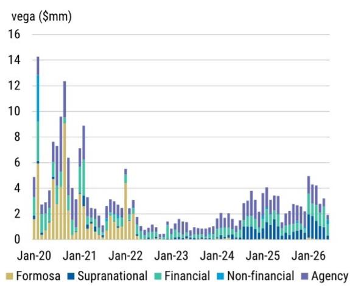
来源：Bloomberg, MS

图14：按定价日期划分的近期vega供给
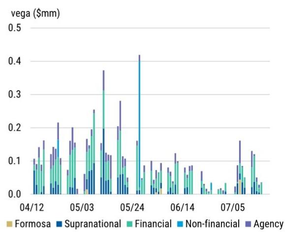
来源：Bloomberg, MS

---

## 偏斜度信号监测

3个月10年期OTC偏斜度信号仍指向久期多头。当前建议的头寸约为模型最大多头暴露的50%。

图15：偏斜度变化与久期头寸
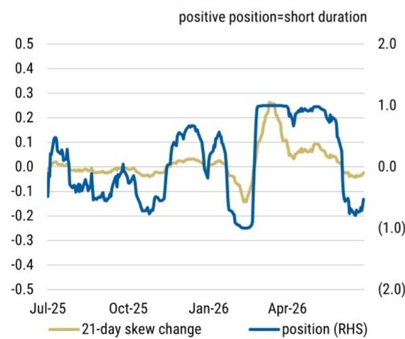
来源：Bloomberg, S&P, MS

图16：久期头寸与信号表现
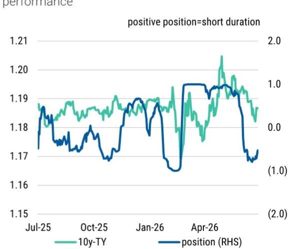
来源：Bloomberg, S&P, MS

---

## 估值方法与风险

以下为当前结构思路、参考水平、参考日期、逻辑及风险汇总。

| 结构 | 参考水平 | 参考日期 | 逻辑 | 风险 |
|------|---------|---------|------|------|
| 买入3个月30年期F/F+25 payer价差 | 135c | 2026/7/20 | 低ATM波动率和较高payer偏斜度提供相对有吸引力的入场水平 | 主要风险是长期回报表现在未来三个月未能上行，例如通胀数据偏软缓解长期通胀担忧 |
| 买入6个月5年期F-25 receiver | 60c | 2026/7/20 | 6个月5年期隐含波动率相对已实现波动率溢价有限，曲面期限溢价有限，且时间足以容纳宏观数据对美联储周期定价的检验 | 主要风险是后续数据仍具韧性，足以支持美联储在未来六个月内实施额外加息 |
| 买入3个月5年/30年ATM曲线cap | 12c | 2026/7/20 | 曲线cap提供对多种陡化情景的非对称暴露，既受益于美联储宽松下前端重新定价，也受益于长期端潜在突破 | 主要风险是未来三个月曲线平坦化，例如美联储额外加息并释放重启加息周期信号 |
| 买入2.36倍1个月2年期F+1bp payer，卖出1倍1个月5年期ATM payer | 0c | 2026/7/20 | bear flattener提供针对通胀预期上升驱动的鹰派重新定价的定向暴露，同时限制对其他利率情景的暴露 | 主要风险是美联储在7月会议加息并释放更鹰派政策路径信号，导致曲线bear steepen |
| 买入2年/10年跨式组合 | 670c | 2026/6/10 | 2年/10年预计受抵押贷款对冲需求的结构性流入和可赎回发行供给减少支撑 | 风险在于波动率大幅下降而利率仍锚定在行权价附近 |
| 买入1年1年期F/F+25/F+50 payer ladder | 0c | 2026/3/10 | 近期利率下行和波动率回升为1年1年期payer ladder创造了窗口，盈亏平衡水平隐含未来两年美联储加息 | 风险在于能源驱动的通胀变得可持续，迫使美联储加息应对 |

---

*本文内容仅供研究参考，不构成任何操作建议或承诺。市场有风险，决策需谨慎。*
