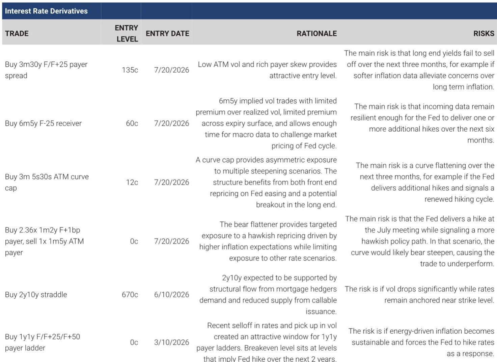

# The Right Option Structure, Not the Right View Alone, Separates Alpha from Basis Risk in USD Rates

Investors routinely report a directional conviction on rates yet struggle to translate that view into a trade that does not introduce unwanted risks or overpay for protection against scenarios they do not expect. The tension is structural: a linear instrument such as a futures contract exposes the holder to unlimited adverse moves, while a vanilla option bundles the desired directional exposure with insurance against tail events the investor does not believe will occur. The cost of that insurance has become a material drag on returns, particularly when implied volatility is elevated relative to realized volatility across the curve.

A systematic scan of the USD rates option surface with expiries under one year reveals that the current pricing environment offers unusually clear opportunities to resolve this trade-off. Low at-the-money volatility in the long end, cheap receiver skew in the front end, and compressed term premiums across the 5-year sector have created entry points where the cost of optionality is low relative to the macro events that could trigger a repricing. The report identifies four distinct expressions — higher rates, lower rates, steeper curves, and flatter curves — each calibrated to a specific combination of expiry, strike, and structure that maximizes payoff asymmetry while minimizing premium outlay.

The strategic insight is not that rates will move in a particular direction. It is that the option surface is currently mispricing the probability of certain macro outcomes relative to the market's own forward pricing of the Fed cycle. Investors who can separate the signal from the noise in volatility pricing have a tactical advantage that linear instruments cannot capture.

## A 3-Month Payer Spread in the 30-Year Sector Captures Rich Skew at a Time When ATM Vol Is Near Multi-Year Lows

Long-end Treasury yields have approached cycle highs repeatedly but have failed to break higher, creating a pattern of failed breakouts that has compressed daily realized volatility close to multi-year lows. At the same time, elevated payer skew in the 30-year sector reflects persistent demand for tail hedges driven by inflation and geopolitical risk premia. This combination — low at-the-money volatility and rich high-strike skew — creates an ideal entry point for a payer spread.

The recommended structure is a 3-month 30-year payer spread with a 25-basis-point width, struck at forward plus 25 basis points. The trade costs 135 cents, equivalent to 8 basis points running, and offers a maximum payout of roughly three times the premium if the 30-year swap rate finishes above the high strike at expiry. The downside is limited to the premium paid.

The 3-month expiry is not arbitrary. The sub-one-year volatility surface is reasonably steep, but the 1-month expiry captures too few macro catalysts to justify the risk of being short gamma through a data-heavy period. The October expiry strikes a balance, capturing three CPI releases, three payroll reports, and the September FOMC meeting. Each of these events has the potential to challenge the prevailing narrative that long-end yields are capped by structural demand. The primary risk is that softer inflation data alleviate long-term inflation concerns, preventing the realization of the trade targets.

## A 6-Month Low-Strike Receiver in the 5-Year Sector Exploits the Cheapest Receiver Skew Since March 2023

The front end of the curve is pricing 35 basis points of additional Fed hikes by the end of 2026. For a rally to materialize without an exogenous shock, incoming data must challenge that pricing through softer inflation, weaker labor market data, or both. That process takes time, and the option must provide enough duration for the macro data to play out.

The 6-month 5-year receiver struck at forward minus 25 basis points meets that requirement at a cost of 60 cents, equivalent to 13 basis points running. The implied volatility on this structure trades at only a 10-basis-point-per-year premium to 21-day realized volatility, which is lower than both the 1-year and 2-year tails. The 5-year volatility surface is the flattest among liquid tails, allowing investors to extend into a six-month expiry at relatively little additional cost. Low-strike volatility trades slightly below at-the-money volatility, close to the cheapest level since March 2023.

The trade is not a bet on immediate easing. It is a bet that the market's hawkish pricing will be eroded by data over a six-month window. The risk is that incoming data remain resilient enough for the Fed to deliver one or more additional hikes, which would push rates higher and cause the receiver to expire worthless. That risk is real, but the asymmetry favors the receiver given the cheapness of the skew and the time available for the macro picture to shift.

## A 3-Month Curve Cap on the 5s30s Sector Provides Asymmetric Exposure to Multiple Steepening Scenarios at a Low Premium

The 5s30s curve has historically steepened during Fed cutting cycles, yet spot 5s30s has retraced all of the steepening that occurred since April 2025, despite the Fed having cut 75 basis points since then. This disconnect between policy action and curve behavior creates an opportunity for a curve steepener, but the choice of instrument matters.

A curve cap on the 5s30s sector offers asymmetric exposure to multiple steepening scenarios. The structure benefits from both front-end repricing on Fed easing and a potential breakout in the long end. The correlation savings on this structure are close to historical median levels rather than an extreme, but the balanced payoff profile more than offsets the average valuation. The trade costs 12 cents, with downside limited to the premium paid.

The 3-month expiry aligns with the same macro calendar that drives the long-end payer spread — three CPI releases, three payroll reports, and the September FOMC meeting. Each of these events could trigger a steepening if the data supports a more dovish Fed path or a breakout in term premiums. The risk is a curve flattening over the next three months, for example if the Fed delivers additional hikes and signals a renewed hiking cycle. That scenario would cause the cap to expire worthless, but the limited premium keeps the cost of being wrong manageable.

## A Zero-Cost Bear Flattener on the 2s5s Sector Targets Geopolitical Risk with No Upfront Premium

The front end of the curve is likely to be driven by developments in Iran over the coming month. The transmission mechanism is direct: disruption to energy supply pushes commodity prices higher, lifting inflation and inflation expectations, and increasing the risk of a more hawkish Fed response. The result would be a bear flattening of the 2s5s curve.

The recommended expression is a zero-cost bear flattener using a 1-month expiry. The structure involves buying 2.36 times the at-the-money-plus-1-basis-point 2-year payer and selling 1 times the at-the-money 5-year payer. The ratio achieves zero upfront premium, making the trade accessible to investors who want exposure to a flattening scenario without paying for optionality they do not expect to use.

The 1-month expiry is the correct choice because the calendar is light until the end of July, with no first-tier data releases or meaningful Fed communication before the July FOMC meeting. Developments in Iran are likely to be the dominant market catalyst for most of the 1-month period. If geopolitical tensions ease, inflation risk should fade and the curve would likely bull steepen, allowing the structure to expire worthless. In that scenario, the investor avoids paying upfront premium for an outcome they do not expect.

The volatility premium on a bear flattener is currently near the cheapest level since March, making the structure an attractive way to hedge geopolitical risks. The downside is unlimited, and the main risk is that the Fed delivers a hike at the July meeting while signaling a more hawkish policy path. In that scenario, the curve would likely bear steepen, causing the trade to realize losses.

## A Decision Framework for Translating Rates Views into Option Structures

The four trades described above can be organized into a decision framework that helps investors match their directional conviction with the appropriate option structure. The framework has three dimensions: conviction horizon, risk tolerance, and macro catalyst density.

For investors with a conviction horizon of one to three months and a desire to limit downside to a fixed premium, the 3-month payer spread on the 30-year sector or the 3-month curve cap on the 5s30s sector are appropriate. Both structures have a defined maximum loss and benefit from a high density of macro catalysts within the expiry window. The payer spread is the better choice when the investor expects a realization of higher long-end yields, while the curve cap is preferred when the investor expects a steepening driven by either front-end easing or long-end breakout.

For investors with a longer conviction horizon of three to six months and a willingness to accept a higher premium for more time, the 6-month receiver on the 5-year sector is the appropriate choice. This structure is designed for investors who believe the market's hawkish pricing will be challenged by incoming data but need sufficient time for that data to accumulate. The cheap receiver skew and flat term premium make this the most cost-effective way to express a lower-rates view over a multi-month window.

For investors with a short conviction horizon of one month and a desire to avoid any upfront premium, the zero-cost bear flattener on the 2s5s sector is the appropriate choice. This structure is designed for investors who want to hedge a specific geopolitical risk without paying for optionality they do not expect to use. The trade-off is unlimited downside, which means the investor must be confident that the flattening scenario is more likely than a bear steepening.

The framework is not exhaustive, but it provides a systematic way to translate a directional view into a structure that balances cost, risk, and catalyst exposure.

*For informational purposes only. Portions may be generated, translated, summarized, or edited with AI assistance based on source materials and may contain omissions or errors. Please verify independently. This is not investment, legal, tax, accounting, or other professional advice.*

For informational purposes only. Portions may be generated, translated, summarized, or edited with AI assistance based on source materials and may contain omissions or errors. Please verify independently. This is not investment, legal, tax, accounting, or other professional advice.

