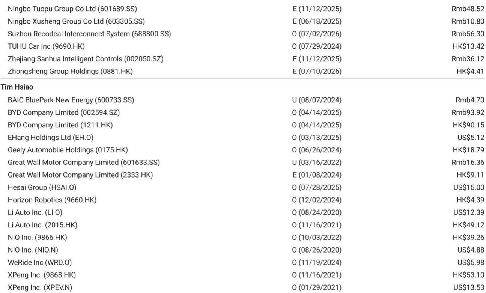
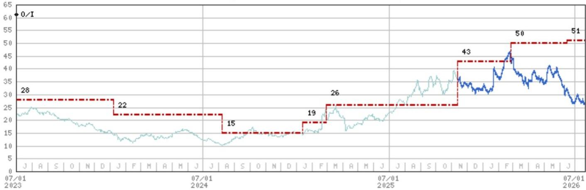

# 汽车零部件供应商如何把握人形机器人机遇：在结构性优势消退前做出战略选择

2026年上海世界人工智能大会展示了超过300款人形机器人，数量较2025年翻了一番多。然而，这种硬件多样性的爆发给许多观察者认为会自然受益的汽车零部件供应商带来了一个悖论。机器人集成商的丰富使得客户选择变得更加困难，而非更容易，而组件供应的快速趋同正威胁着供应商希望借以差异化的产品本身变得同质化。汽车零部件公司在服务这一新兴行业方面拥有真实的结构性优势，但这些优势是暂时的，并且取决于战略纪律。

核心矛盾很直接。汽车零部件供应商可以利用现有的研发资源、数控加工设备和材料采购渠道来服务人形机器人客户，其前期投入远低于纯新进入者。这种在位优势是真实且可衡量的。然而，同一场大会在展示机遇的同时，也揭示了三个日益严峻的挑战，它们将决定哪些供应商能捕获价值，哪些会过度扩张。客户选择、产品差异化和人才保留已不再是理论上的风险，而是需要立即关注的现实战略问题。

一份全球研究机构的报告明确指出，来自国内汽车需求变化、持续的价格竞争以及原材料成本上升所带来的近期盈利压力将持续到2026年上半年。这造成了一种危险的动态：供应商需要人形机器人机遇来支撑当前的估值，但他们必须在核心汽车业务承压的同时去执行这一战略。胜出者将是那些不把人形机器人视为投机性副业，而是将其视为一种连接近期盈利现实与长期选择权的资本配置纪律的公司。

## 客户选择已成为人形机器人供应链中风险最高的决策

人形机器人集成商在一年内从大约150家激增至超过300家，已将客户选择问题从一项可控的筛选工作转变为一个战略雷区。从特斯拉和宇树科技等领先企业赢得订单仍然困难，需要严格的资质审核流程、有竞争力的报价，以及通常限制供应商灵活性的排他性安排。然而，另一种选择——接受来自较小、未经证实的集成商的业务——也带有许多供应商可能低估的自身风险。

关键在于，为小批量客户投入的前期研发和产能分配，可能在其他地方获得更有利的回报。一个将工程资源用于为每季度仅出货50台的初创公司定制执行器的供应商，实际上是在婉拒一个来自可能扩展到数千台的一级集成商的项目。这不仅仅是收入潜力的问题，更是在工程带宽成为最稀缺资源的环境下的机会成本问题。

汽车零部件供应商在此拥有一个必须审慎运用的真实优势。他们现有的研发基础设施、数控加工能力和材料采购关系，意味着他们可以比新进入者以更低的增量成本为机器人客户制作原型和生产组件。但这一优势只有在服务于具有现实产量轨迹的客户时才重要。风险在于，供应商急于向市场展示人形机器人收入，接受了太多低产量的项目，从而将工程精力分散在永远无法产生有意义回报的零散客户群上。

最严谨的方法是建立一个基于三个标准的正式客户分级体系：已证明的生产能力、持续的资本获取渠道，以及可信的商业化时间表。供应商应愿意放弃未能达到这些门槛的客户，即使这意味着初期人形机器人收入确认较慢。市场将奖励长期定位，而非追逐短期公告。

## 产品趋同正在加速，将比大多数供应商预期的更快压缩利润空间

去年，人形机器人组件供应商往往有专注的专业领域。2026年的WAIC揭示了一个截然不同的格局。均胜电子推出了名为TeleHand的灵巧手，以及AI头部总成、电子皮肤、大脑域控制器和固液混合电池。三花智控将其产品组合从执行器扩展到手部模块和传感器。中鼎、振宇和蓝思现在都制造关节、手部、肢体和传感器。趋势显而易见：供应商正竞相提供完整的子系统，而非专业化的组件。

这种趋同带有明确的战略含义。当每个主要供应商都能提供相同的产品组合时，竞争的基础就从技术差异化转向价格和交付。人形机器人集成商自身也面临降低物料清单成本的压力，他们将利用这种供应商重叠来推动竞价。结果是利润压缩周期，这反映了汽车行业过去十年的经历，但被压缩在更短的时间框架内。

该报告未量化对利润的影响，但从历史先例来看，机制是清晰的。当产品供应趋同时，曾支撑溢价定价的差异化消失了。那些大力投资开发独特执行器技术的供应商会发现，这些技术在一到两个产品周期内就会被复制或逆向工程。在人形机器人组件研发上获得超额回报的窗口正在收窄。

战略应对必须是识别那些真正的差异化仍然可被捍卫的少数领域。灵巧操作、传感器融合算法以及高密度驱动的热管理，是专有知识和制造工艺专长能创造难以快速复制的壁垒的领域。供应商应将其研发投资集中在这些可防御的利基领域，并愿意从外部采购同质化的组件，而不是试图内部制造所有东西。目标不是提供最广泛的产品范围，而是拥有价值链中最有价值的环节。

## 人才保留将迫使许多供应商尚未准备好的组织创新

汽车零部件供应商在人形机器人领域面临的最被低估的挑战不是技术或商业上的，而是组织上的。由于国内汽车需求变化、持续的价格竞争和原材料成本上升，大多数上市汽车零部件供应商在2026年上半年经历了盈利和报价压力。与此同时，人形机器人初创公司正以可观的估值吸引风险投资和私募股权资金，使它们能够提供传统供应商无法匹配的股权激励。

结果是人才套利，这威胁到供应商执行其人形机器人战略所需的团队。开发了汽车驱动系统或传感器集成能力的工程师，现在正被那些能提供与更激动人心的增长叙事挂钩的显著股权收益的初创公司招募。供应商的核心汽车业务提供了资助人形机器人研发的现金流，但同时也是导致其股权激励吸引力下降的报价表现不佳的根源。

报告表明，这种动态可能促使供应商考虑分拆内部人形机器人团队并提供股权激励。这不仅仅是一种防御措施，更是一种战略必要性。一个设在传统汽车零部件供应商内部的人形机器人部门，在吸引和留住人才方面面临结构性劣势。两个行业的薪酬基准、职业发展期望和文化规范根本不同。

最有效的组织解决方案涉及为机器人业务创建一个独立的法人实体，拥有自己的股权结构，允许团队成员直接参与他们创造的价值。该实体可以与母公司保持运营和财务联系，利用其制造能力和供应链关系，同时提供与纯机器人公司具有竞争力的薪酬方案。母公司保留战略控制和财务整合的好处，同时消除了否则会驱赶人才的组织摩擦。

报告将敏实集团视为参与人形机器人主题的一个值得关注的案例，因为它结合了稳健的盈利前景——2026财年两位数的同比增长指引——以及人形机器人相关业务。这种近期盈利与长期选择权之间的联系正是观察者应寻找的。一个核心汽车业务面临严重压力的供应商，将难以同时资助人形机器人投资和留住人才。人形机器人机遇放大了基础盈利质量的重要性，而非取代它。

## 在汽车核心业务与人形机器人选择权之间配置资本的决策框架

汽车零部件供应商面临的战略挑战可以简化为一个包含四个象限的资本配置框架。横轴衡量终端市场的成熟度和可预测性，从已知产量的成熟汽车项目到轨迹不确定的新兴人形机器人项目。纵轴衡量与现有能力的技术和制造重叠程度，从现有资产可被利用的高重叠到需要全新投资的低重叠。

第一象限，高重叠与成熟市场，代表核心汽车业务，供应商应在此捍卫其地位并优化现金生成。这不是一个增长故事，而是一个现金流故事。供应商应在这些项目中对成本削减和营运资本效率采取严格态度，接受定价压力将持续。

第二象限，高重叠与新兴市场，是人形机器人投资的理想区域。这些是现有制造能力、材料专长或工程人才可以以最小增量投资直接应用于机器人应用的组件。执行器、结构件和热管理系统属于此类。供应商应将其大部分人形机器人研发预算分配于此，追求提供现实产量轨迹的客户关系。

第三象限，低重叠与成熟市场，代表向需要新能力的汽车相关业务的多元化。除非这些投资具有明确的战略逻辑，例如垂直整合或接触新客户，否则供应商应谨慎对待。其回报通常低于人形机器人机遇。

第四象限，低重叠与新兴市场，是最危险的。这些是需要全新制造工艺、材料或工程学科的人形机器人组件，而供应商并不具备这些能力。例如，对于核心能力是结构冲压或注塑成型的供应商，具有复杂传感器集成的灵巧手可能属于此类。为了战略定位而追求这些机会的诱惑，必须与成本超支和回报延迟的高概率进行权衡。

该框架明确指出，最优策略不是平等地追求所有人形机器人机会，而是将投资集中在与现有能力重叠度最高且终端市场轨迹最可信的领域。遵循这一纪律的供应商将在其人形机器人研发投资上产生更高的回报，同时保持财务实力，以抵御核心汽车业务的持续压力。

对汽车零部件供应商而言，人形机器人机遇是真实的，但并非自动获得。现有制造基础设施、供应链关系和工程人才的结构性优势，提供了一个纯竞争性对手所缺乏的真正切入点。然而，随着客户选择变得更加复杂、产品供应趋同以及人才竞争加剧，这些优势将会消退。能够捕获价值的供应商，是那些将人形机器人机遇视为战略配置问题而非技术竞赛的供应商。他们将根据产量可信度选择客户，将研发集中在可防御的利基领域，重组其人形机器人团队以留住人才，并根据现有能力与新兴需求之间的重叠来配置资本。其余的供应商将会发现，人形机器人市场，如同此前的汽车市场一样，奖励纪律，惩罚过度扩张。

*仅供参考。部分内容可能基于源材料通过AI辅助生成、翻译、总结或编辑，可能存在遗漏或错误。请独立核实。本文不构成任何专业建议。*

仅供参考。部分内容可能基于源材料通过AI辅助生成、翻译、总结或编辑，可能存在遗漏或错误。请独立核实。本文不构成任何专业建议。

