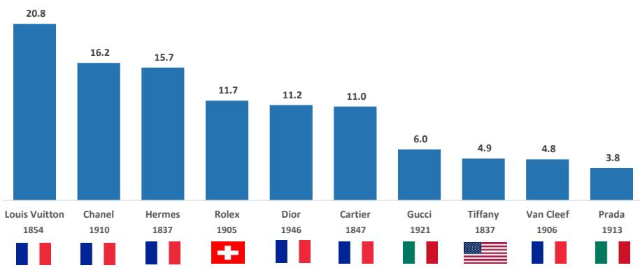
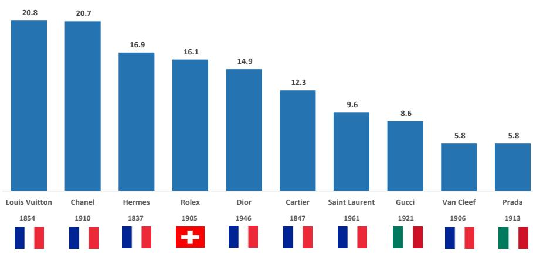
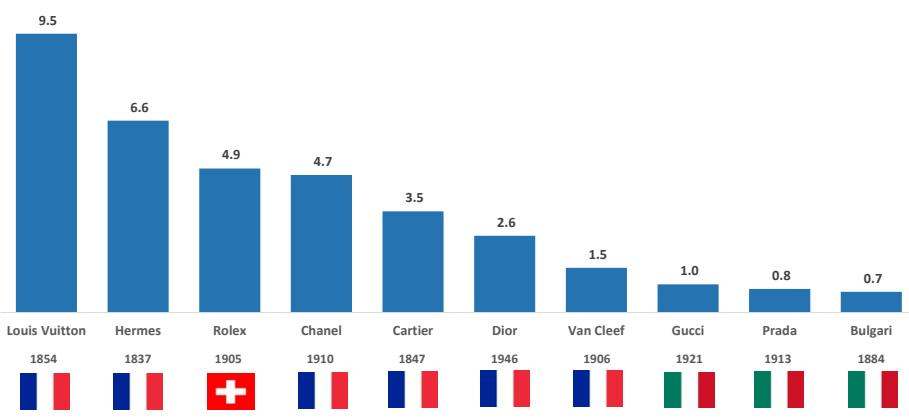
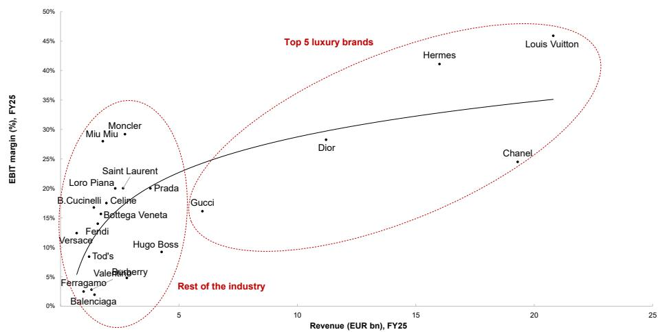
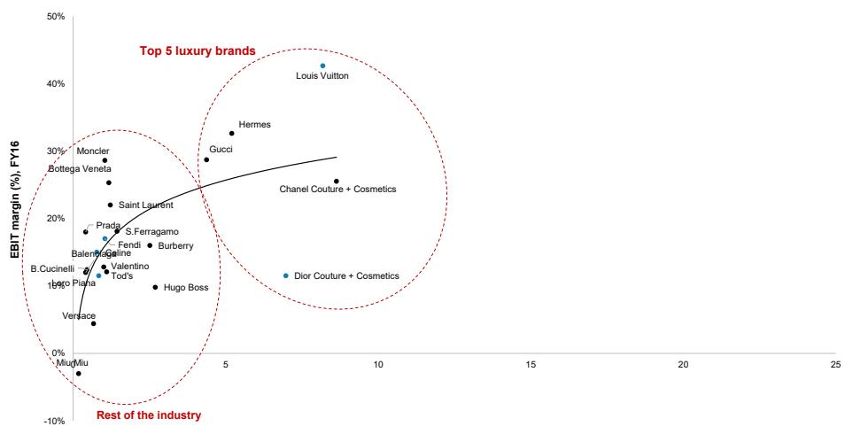
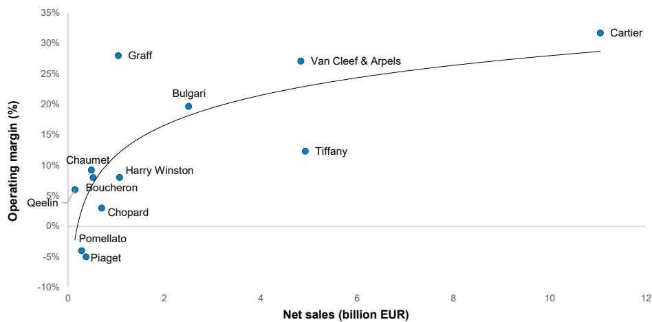
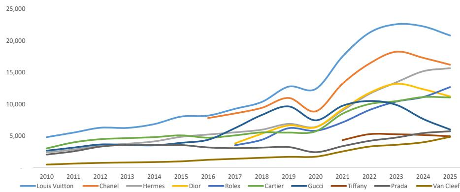
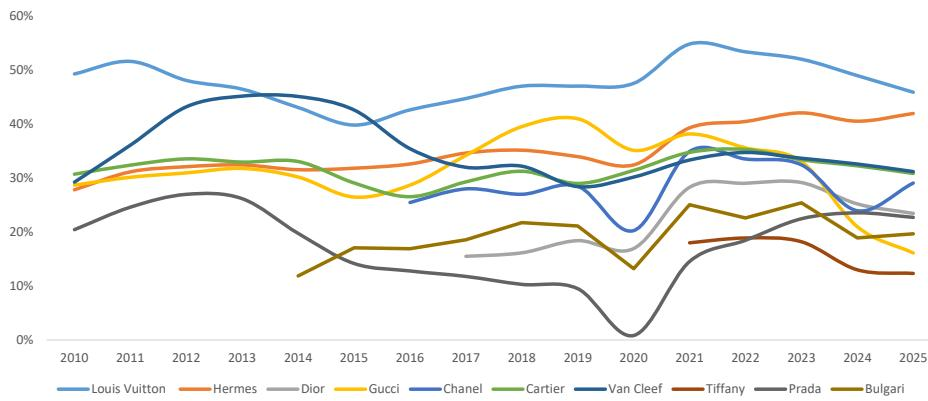

# 奢侈品行业 | 欧洲

## 按营收排名的十大品牌——关键要点

图1：2025年按营收排名的十大奢侈品牌（单位：十亿欧元）（MS估算）  
  
来源：MS估算

注：Dior包括Dior Couture（约73亿欧元）和Dior Parfums（约39亿欧元）。Chanel集团报告截至2025年12月的年度营收为193亿美元（170亿欧元）。然而，我们估算非Chanel品牌产生的销售额约为31亿欧元。因此，我们估算Chanel品牌2025年的营收约为162亿欧元（包括时装与皮具、手表与珠宝以及化妆品）。Hermès集团2025年营收为160亿欧元。然而，我们估算Hermès品牌销售额仅为约157亿欧元（剔除John Lobb、Saint-Louis和Puiforcat）。Richemont按财年报告（3月财年结束）。按日历年2025年计算，我们估算Richemont珠宝品牌同比增长9%，其中Cartier同比增长8%，Van Cleef同比增长10%。  
来源：MS估算

最新动态？在Chanel几天前发布全年业绩后，我们发布了个人奢侈品品牌按a）营收、b）零售总额和c）营业利润的排名。如下文所述，其中一些数据由公司报告，而其他数据是我们的估算。此外，在附录中，我们列出了计算零售总额的方法（调整批发销售和特许权使用费收入）。

#1 – 2025年十大排名：与去年相同的参与者，排名略有不同。Rolex和Dior在2025年互换了第5和第4的位置，因为Rolex的营收估计增长了5%，达到117亿欧元，而Dior的营收估计收缩了-9%，降至112亿欧元。十大品牌中的所有其他品牌与2024年相比保持了其位置。因此，在2025年，十大品牌中有六个是法国品牌，两个意大利品牌（Gucci和Prada），一个瑞士品牌（Rolex）和一个美国品牌（Tiffany）。按成立日期计算，最新的品牌是Dior，大约80年前（1946年）在巴黎成立。所有其他领先品牌都成立于100多年前。这突显了传承和渊源在个人奢侈品领域的重要性。

#2 – 该行业是否仍在分化？二十多年来，最大的奢侈品牌一直在获得份额，导致该行业出现分化（这有点反直觉）。根据我们的分析，在2016年至2025年间，时装与皮具领域的五大品牌——Vuitton、Chanel、Dior、Hermès和Gucci——贡献了约80%的行业增长（以及约85%的利润增长）——我们使用前21大品牌作为行业的代表。2025年，五大品牌的年度市场份额增长暂停——事实上，总体而言，它们略微失去了份额——在一个收缩的行业中（部分原因是Gucci市场份额的显著流失）。

<table><tr><td colspan="2">MS & CO. INTERNATIONAL PLC+</td></tr><tr><td colspan="2">Edouard Aubin</td></tr><tr><td colspan="2">股票分析师</td></tr><tr><td>Edouard.Aubin@morganstanley.com</td><td>+44 20 7425-3160</td></tr><tr><td colspan="2">Grace Smalley, CFA</td></tr><tr><td colspan="2">股票分析师</td></tr><tr><td>Grace.Smalley@morganstanley.com</td><td>+44 20 7425-9629</td></tr><tr><td colspan="2">Natasha Bonnet</td></tr><tr><td colspan="2">股票分析师</td></tr><tr><td>Natasha.Bonnet@morganstanley.com</td><td>+44 20 7677-5723</td></tr><tr><td colspan="2">Cedric Norest</td></tr><tr><td colspan="2">研究助理</td></tr><tr><td>Cedric.Norest@morganstanley.com</td><td>+44 20 7425-1462</td></tr></table>

## 品牌

行业观点：中性

MS与本研究报告中涵盖的公司有业务往来，并寻求开展业务。因此，读者应注意，该公司可能存在影响MS客观性的利益冲突。读者应将MS视为其决策的单一因素之一。

有关分析师认证和其他重要披露，请参阅本报告末尾的披露部分。

+= 非美国关联公司雇用的分析师未在FINRA注册，可能不是该成员的关联人士，并且可能不受FINRA关于与主题公司沟通、公开露面以及交易研究分析师账户持有的证券的限制。

#3 – Vuitton：仍然是最大、最赚钱的奢侈品牌，但与Chanel的差距已接近弥合。Vuitton在各项指标上仍然是最大的品牌，但其估计营收连续第二年下降，下降约-6%至208亿欧元（继2024年下降-1.5%之后），息税前利润下降幅度更大，为-13%至95亿欧元。Chanel品牌的营收下降-1%至162亿欧元（见下文）。更有趣的比较是在零售总额方面：我们估算Chanel品牌（207亿欧元）现在仅落后Vuitton（208亿欧元）10亿欧元，低于2024年的60亿欧元差距以及2023年更大的差距。如果Vuitton以直营为主的零售基础继续收缩，而Chanel保持得更好，Chanel最早可能在2026年在这一特定指标上超越Vuitton（信用卡数据显示，Vuitton在2026年上半年营收同比相对持平，而Chanel增长约+10%）。也就是说，鉴于其远高于同行的利润率结构（这得益于其100%直营渠道组合和对皮具的高度依赖），Vuitton今年在营收和利润方面应保持明显领先地位。

#4 – Chanel：第二大品牌。Chanel集团2025年营收下降-1%至170亿欧元（193亿美元）。从2016年（Chanel合并账目首次公开可用的年份）到2025年，Chanel集团营收以欧元计复合年增长率增长+9%至170亿欧元。我们估算Chanel品牌约占Chanel 2025年合并营收的95%，其中还包括Eres、OrleBar Brown和Goossens等品牌，以及Desrues Metier d'Art、Maison Michel等制造业务。这意味着Chanel品牌的营收为162亿欧元，使其成为仅次于Vuitton的第二大品牌。但是，虽然Chanel品牌在营收方面比Vuitton小约22%，但在零售总额方面仅小约1%（分别为207亿欧元和208亿欧元），因为Vuitton是100%直营，而Chanel的绝大部分化妆品是通过第三方零售商销售的。根据我们最近的报告，我们估算2025年化妆品部门占总销售额的23%，时装与皮具（67%）和手表与珠宝（约5%）。

#5 – Hermès：稳固的第三名。Hermès是营收第三大品牌，与2024年相比没有变化。2025年，Hermès集团营收增长+5.5%至160亿欧元（自2013年以来最慢的速度——2020年疫情期间除外——但仍然是去年增长的仅有的四个十大品牌之一）。该集团2025年营收为160亿欧元。然而，我们估算Hermès品牌销售额仅为约157亿欧元（剔除John Lobb、Saint-Louis和Puiforcat，以及向第三方销售皮料的收入）。考虑到批发占2025年集团销售额的8%（主要是特许经营和旅游零售），我们估算Hermès品牌去年的零售额达到169亿欧元。因此，在零售总额方面，Hermès稳居第三位，仅次于Vuitton和Chanel。2025年息税前利润增长+6.8%至66亿欧元（营业利润率为41.1%）。

#6 – Dior的下滑范围扩大。根据我们的估算，Dior现已连续两年营收收缩，营收从2023年估计的128亿欧元降至2024年的123亿欧元和2025年的112亿欧元——合并Dior Couture（约73亿欧元）和Dior Parfums（约39亿欧元）。请注意，LVMH将Dior Couture报告在其“时装与皮具部门”内，而Dior Parfums的销售额包含在其“化妆品”部门内（例如，与Vuitton不同，后者的全部营收包含在LVMH的“时装与皮具部门”中）。Dior的营收从第4位下滑至第5位（估计下降-9%至112亿欧元，加上2024年已经录得的约-6%的下降，这是从峰值到谷底累计下降接近-15%）。在Jonathan Anderson于2025年被任命为相对少见创意总监后，我们预计Dior Couture的销售额将在2026年出现转折（按固定汇率计算，销售额在2026年第二季度已经转为同比正增长+1-2%，而根据我们的估算，2026年第一季度同比估计下降-2%至-3%）。然而，我们预计2026年营收复苏的步伐将比最初预期的更为平缓，全年销售额可能仅实现低个位数增长（原因之一是，我们认为竞争对手Chanel正在抢占该细分市场不成比例的增长份额）。

#7 – Rolex。2025年，我们估算Rolex品牌销售额为110亿瑞士法郎（+4%），或约117亿欧元（+5.4%），销量为115万只（-2%）。参见我们的第九份年度瑞士手表报告。价值的增长再次主要由价格驱动：平均售价同比上涨约+6%至约14,000瑞士法郎，足以抵消销量的下降（见此处）。这是20多年来Rolex销量首次连续两年下降，反映了该品牌在稀缺性方面的自律态度。按营收衡量，它在2025年从第五大个人奢侈品牌升至第四位，超过了Dior（112亿欧元），现在仅落后于Louis Vuitton（208亿欧元）、Chanel（162亿欧元）和Hermès（157亿欧元）。鉴于估计约92%的Rolex销售继续通过第三方零售商进行，Rolex的零售价值销售额显著更高：约161亿瑞士法郎（约206亿美元或约170亿欧元），我们估算它现在已经超过了Apple Watch的估计全球收入（约190亿美元），巩固了Rolex在更广泛的全球手表市场中的领导地位。考虑到Rolex仅存在于一个产品类别（瑞士手表）中，而上述品牌通常存在于10个或更多类别中，这仍然是一项令人印象深刻的成就。没有其他品牌比Rolex更能主导其竞争的品类。2025年，我们估算该品牌在瑞士手表市场中的份额为33%（零售价值），高于2019年的26%。今年，我们估算Rolex的销量将基本持平，由平均售价进一步推动的增长可能足以使该品牌保持在全球个人奢侈品行业的最高排名之列。

#8 – Cartier。截至2025年12月的日历年，Cartier的营收估计增长+8%至110亿欧元（2024年为103亿欧元），使该品牌在营收方面保持第六位，略低于Dior（112亿欧元）和Rolex（117亿欧元）。零售额为123亿欧元，息税前利润为35亿欧元，两者均在排名品牌中位列前六。自2016年Cyrille Vigneron被任命为首席执行官以来，Cartier的境况显著改善（并自2024年起在首席执行官Louis Ferla的领导下继续改善）：我们估算在2015年至2025年间，Cartier的营收复合年增长率以欧元计约为+10%，使其成为珠宝类别中的明显佼佼者。进入2026年，我们认为该品牌以欧元计同比上涨超过+12%，Cartier很可能继续在珠宝和瑞士手表两个细分市场获得份额。如果其营收势头在2026年下半年与上半年相比以类似速度持续，Cartier的营收可能在2026年超过Dior。

#9 – Gucci。Gucci的营收在2025年报告下降-22%至60亿欧元（2024年为77亿欧元）——连续第二年成为十大品牌中降幅最大的，反映出比同行更深、更持久的调整。尽管如此，该品牌在营收方面仍保持第七位，零售额为86亿欧元，息税前利润为10亿欧元。

#10 – Tiffany。我们估算Tiffany在2025日历年的销售额达到49亿欧元，较2024日历年（51亿欧元）下降-3%。与Richemont一样，LVMH不披露单个品牌的销售额，因此这仍然是我们的估算。这意味着Tiffany在2025年占LVMH手表与珠宝部门销售额的47%（其他品牌包括Bulgari、Chaumet、Fred、Hublot、Tag Heuer和Zenith）。自2021年1月完成对Tiffany的收购后，LVMH一直致力于提升该品牌，这体现在产品、沟通和分销方面的重要变化。然而，这些变化是在一个具有挑战性的背景下实施的，虽然Tiffany面向中等收入消费者（尤其是在美国）的销售面临压力（加上Tiffany近年来实施的非常大幅度的提价，这是珠宝行业中最高的提价之一），但该品牌尚未能够通过销售更高价位的标志性黄金系列（例如Lock、Tiffany T、Hardware等）来完全弥补这一缺口。Tiffany在2025年跌出了按零售额和息税前利润排名的十大品牌，其在2024年按零售额排名第10位（56亿欧元）。

#11 – Prada。在十大个人奢侈品牌（按营收）中，Prada品牌以欧元计下降-4.8%至38亿欧元（2024年为40亿欧元）。2025年零售额达到令人印象深刻的58亿欧元（主要是大型眼镜和化妆品授权的结果），我们估算2025年息税前利润为8亿欧元（约21%的利润率）。

#12 – Van Cleef & Arpels。Van Cleef的营收在2025年（截至2025年12月的12个月）估计扩大至48亿欧元，较2024年的44亿欧元增长+10%。这延续了其自2024年首次进入十大个人奢侈品牌排名以来的轨迹，该品牌在前任首席执行官Nicolas Bos的领导下从2013年的约7.5亿欧元增长而来。Van Cleef 2025年的息税前利润达到15亿欧元，现在超过了Gucci，尽管Gucci的营收更大，而零售额为58亿欧元。

#13 – Saint Laurent。该品牌在2025年未进入我们的营收十大排名（去年也未进入）。2025年报告销售额为26.43亿欧元，下降-8.3%，我们估算Saint Laurent仅能排在第13位。然而，有趣的是，当以零售额衡量时，该品牌的重要性有多大（我们估算2025年为96亿欧元，排名第7，如下页所示）。这是两个大型授权业务的结果：眼镜（属于Kering眼镜部门），可能在2025年产生了2亿欧元的零售额，以及更重要的化妆品（授权给L'Oréal）。根据L'Oréal近几个月的评论，我们估算L'Oréal通过Saint Laurent Beauté产生了约31亿欧元的营收（因此，考虑到第三方零售商的加价，零售额约为62亿欧元）。因此，Saint Laurent在大型奢侈品牌中是独一无二的，因为其2025年的化妆品营收（约31亿欧元）超过了时装与皮具营收（26亿欧元）。Chanel、Dior、Gucci等品牌的时装与皮具营收去年都显著超过了化妆品营收。

附录

图2：2025年按营收排名的十大奢侈品牌（单位：十亿欧元）（MS估算）  
  
来源：MS估算  
注：Dior包括Dior Couture（约73亿欧元）和Dior Parfums（约39亿欧元）。Chanel集团报告截至2025年12月的年度营收为193亿美元（170亿欧元）。然而，我们估算非Chanel品牌产生的销售额约为31亿欧元。因此，我们估算Chanel品牌2025年的营收约为162亿欧元（包括时装与皮具、手表与珠宝以及化妆品）。Hermès集团2025年营收为160亿欧元。然而，我们估算Hermès品牌销售额仅为约157亿欧元（剔除John Lobb、Saint-Louis和Puiforcat）。Richemont按财年报告（3月财年结束）。按日历年2025年计算，我们估算Richemont珠宝品牌同比增长9%，其中Cartier同比增长8%，Van Cleef同比增长10%。

图3：2024年按营收排名的十大奢侈品牌（单位：十亿欧元）（MS估算）  
  
来源：MS估算  
注：Dior包括Dior Couture和Dior Parfums。

图4：2025年按零售额排名的十大奢侈品牌（单位：十亿欧元）（MS估算）  
  
来源：MS估算  
注：我们对批发活动应用2倍乘数，对授权活动（主要是化妆品和眼镜）应用10倍乘数。

图5：2025年按息税前利润排名的十大奢侈品牌（单位：十亿欧元）（MS估算）  
  
来源：MS估算  
注：Dior包括Dior Couture和Dior Parfums。

图6：2025年主要奢侈品公司的息税前利润率和营收  
  
来源：公司数据，MS估算

注：Burberry为2026财年（3月财年结束）。Versace按2025日历年计算。Louis Vuitton、Dior、Loro Piana、Balenciaga、Burberry、Fendi和Celine为MS估算。对于行业中按销售额排名的前21个品牌，我们计算出前五名在2016-2025年贡献了约83%的营收增长和约87%的利润增长。  
图7：2016年主要奢侈品公司的息税前利润率和营收  
  
来源：公司数据，MS估算。  
注：Burberry为2016财年（3月财年结束）。Louis Vuitton、Loro Piana、Balenciaga、Burberry、Fendi、Saint Laurent、Bottega Veneta、Prada、Miu Miu和Celine为MS估算。

图8：2025年主要奢侈珠宝品牌的营收和营业利润率 – MS估算  
  
来源：MS估算  
注：1/财务数据包括所有类别（包括手表和珠宝）。2/ Graff数据为对Graff Diamonds Holdings Limited的估算，该公司注册于英属维尔京群岛，持有Graff Diamonds International（注册于英国）100%的股份。基于渠道调研以及与公司的讨论，我们估算Graff Diamonds Holding Limited在2024年产生了10.51亿美元的销售额和23%的营业利润率。3/ Cartier和Van Cleef的财年于3月结束。

图9：2010年至2025年十大品牌营收（百万欧元）  
  
来源：公司数据，MS估算

图10：2010年至2025年十大品牌息税前利润率  
  
来源：公司数据，MS估算

## 方法论

我们的品牌营收排名是通过汇编已发布数据完成的。例如，Kering披露了Gucci、Saint Laurent和Bottega Veneta的营收，Hermès在其“其他”部分披露了其其他品牌（如John Lobb或Puyforcat）的销售额，使我们能够计算Hermès品牌的确切营收。在估算其他品牌营收时，这些品牌通常属于各自集团报告的部门。例如，Vuitton和Dior Couture的营收合并到时装与皮具部门，而Cartier和Van Cleef则合并到Richemont的珠宝品牌部门。Rolex是一家私营实体，不披露其账目（与Chanel不同，后者在英国注册，因此有法律义务公布其合并财务报表）。关于我们如何评估Rolex销售额的详细信息，请参见我们的第九份年度瑞士手表报告。

为了计算按零售总额排名的品牌，我们进行了各种调整和假设。这些主要包括每个品牌的零售、批发和授权收入之间的销售额划分，以及来自相邻类别（主要是眼镜和化妆品）的收入。例如，对于Gucci品牌，我们进行以下调整以计算2024年的零售总额。我们的起点是77亿欧元的已公布营收。鉴于去年批发销售额占Gucci销售额的9%，这意味着零售（70亿欧元）+批发（6.9亿欧元），我们对其应用2倍乘数，总销售额为83亿欧元。由此，我们分别减去化妆品和眼镜的授权收入5000万欧元和5000万欧元，这些收入分别来自Coty和Kering眼镜。然后，我们加上Gucci眼镜零售价值（Kering Eyewear产生的6亿欧元，我们乘以2以考虑第三方零售商的加价）并加上Gucci的化妆品零售价值（Coty产生的5亿欧元，我们也乘以2——Coty由Darah Mosehnian覆盖）。这使我们得到2024年总计104亿欧元的零售价值。

## 披露部分

MS中的信息和意见由MS Europe S.E.（受德国联邦金融监管局监管）和/或MS & Co. International plc（由审慎监管局授权并受金融行为监管局和审慎监管局监管）准备或传播。MS & Co. International plc在英国传播其已准备的研究报告，以及由其任何关联公司准备的研究报告，仅面向以下人士：(i) 属于《2000年金融服务与市场法（金融促进）令2005》（经修订，“该法令”）第19(5)条范围内的专业读者；(ii) 属于该法令第49(2)(a)至(d)条范围内的高净值实体；或 (iii) 可以合法地以其他方式向其传达或促使其参与投资活动（根据经修订的《2000年金融服务与市场法》第21条的含义）的人士。如本披露部分所用，MS包括RMB MS Proprietary Limited、MS Europe S.E.、MS & Co International plc及其关联公司。

有关重要披露、股票价格图表以及本报告所涉公司的股权评级历史，请参阅MS披露网站 www.morganstanley.com/eqr/disclosures/webapp/generalresearch，或联系您的投资代表或MS，地址：1585 Broadway, (Attention: Research Management), New York, NY, 10036 USA。

有关本研究报告中所引用的任何推荐、评级或目标价的估值方法和风险，请联系客户支持团队，联系方式如下：美国/加拿大 +1 800 303-2495；香港 +852 2848-5999；拉丁美洲 +1 718 754-5444（美国）；伦敦 +44 (0)20-7425-8169；新加坡 +65 6834-6860；悉尼 +61 (0)2-9770-1505；东京 +81 (0)3-6836-9000。或者，您可以联系您的投资代表或MS，地址：1585 Broadway, (Attention: Research Management), New York, NY 10036 USA。

## 分析师认证

以下分析师特此证明，他们对本报告中讨论的公司及其证券的看法准确表达，并且他们没有也不会因表达具体的推荐或观点而直接或间接获得补偿：Edouard Aubin；Natasha Bonnet；Grace Smalley, CFA。

## 全球研究冲突管理政策

MS已根据我们的冲突管理政策发布，该政策可在 www.morganstanley.com/institutional/research/conflictpolicies 获取。该政策的葡萄牙语版本可在 www.morganstanley.com.br 找到。

## 关于主题公司的重要监管披露

截至2026年6月30日，MS实益拥有MS所涵盖的以下公司一类普通股证券的1%或以上：Adidas, Avolta AG, Birkenstock Holding plc, Burberry, Ferrari NV, Hermes International S.C.A., Hugo Boss AG, Kering, Moncler SpA, Pandora A/S, PUMA SE。

在过去12个月内，MS已因投资银行服务从Avolta AG, LVMH Moet Hennessy Louis Vuitton SA, Richemont SA获得补偿。

在未来3个月内，MS预计将收到或打算寻求因投资银行服务从Adidas, Avolta AG, Burberry, EssilorLuxottica SA, Ferrari NV, Hermes International S.C.A., Kering, Luxexperience BV, LVMH Moet Hennessy Louis Vuitton SA, Moncler SpA, Pandora A/S, Prada SpA, PUMA SE, Richemont SA, Salvatore Ferragamo Spa获得补偿。在过去12个月内，MS已因投资银行服务以外的产品和服务从Adidas, Avolta AG, EssilorLuxottica SA, Ferrari NV, Kering, LVMH Moet Hennessy Louis Vuitton SA, Richemont SA, Salvatore Ferragamo Spa获得补偿。

在过去12个月内，MS已向或正在向以下公司提供投资银行服务，或与以下公司存在投资银行客户关系：Adidas, Avolta AG, Burberry, EssilorLuxottica SA, Ferrari NV, Hermes International S.C.A., Kering, Luxexperience BV, LVMH Moet Hennessy Louis Vuitton SA, Moncler SpA, Pandora A/S, Prada SpA, PUMA SE, Richemont SA, Salvatore Ferragamo Spa。

在过去12个月内，MS已向或正在向以下公司提供非投资银行、证券相关服务，和/或过去已签订协议提供服务或与以下公司存在客户关系：Adidas, Avolta AG, Burberry, EssilorLuxottica SA, Ferrari NV, Kering, LVMH Moet Hennessy Louis Vuitton SA, Richemont SA, Salvatore Ferragamo Spa。

MS & Co. LLC 是 Ermenegildo Zegna 证券的做市商。

MS & Co. International plc 是 Burberry 的公司经纪人。

主要负责准备MS的股票研究分析师或策略师的薪酬基于多种因素，包括研究质量、读者客户反馈、选股能力、竞争因素、公司收入和整体投资银行收入。股票研究分析师或策略师的薪酬不与MS执行的投行或资本市场交易或特定交易台的盈利能力或收入挂钩。

MS及其关联公司与MS所涵盖的公司/工具有业务往来，包括做市、提供流动性、基金管理、商业银行、信贷扩展、投资服务和投资银行。MS以自营方式向客户买卖MS所涵盖公司的证券/工具。MS可能持有本报告讨论的公司债务或工具的头寸。MS作为自营交易商交易或可能交易债务证券（或相关衍生品），这些是债务研究报告的主题。

上述某些披露也是为了遵守非美国司法管辖区的适用法规。

## 股票评级

MS使用相对评级系统，术语包括“增持”、“等权重”、“未评级”或“减持”（定义见下文）。MS不对其覆盖的股票分配“买入”、“持有”或“卖出”评级。“增持”、“等权重”、“未评级”和“减持”不等同于买入、持有和卖出。读者应仔细阅读MS中使用的所有评级的定义。此外，由于MS包含分析师观点的更完整信息，读者应仔细阅读完整的MS，而不应仅从评级推断内容。在任何情况下，评级（或研究）都不应被用作或依赖为研究交流。读者买卖股票的决定应取决于个人情况（例如读者现有的持仓）和其他考虑因素。

## 全球股票评级分布

（截至2026年6月30日）

下文所述的股票评级适用于MS的基本股票研究，不适用于公司生产的债务研究。

仅为披露目的（根据FINRA要求），我们在“增持”、“等权重”、“未评级”和“减持”评级旁边包含了“买入”、“持有”和“卖出”的类别标题。MS不对其覆盖的股票分配“买入”、“持有”或“卖出”评级。“增持”、“等权重”、“未评级”和“减持”不等同于买入、持有和卖出，而是代表推荐的相对权重（见下文定义）。为满足监管要求，我们将“增持”（我们最积极的股票评级）对应为买入推荐；我们将“等权重”和“未评级”对应为持有，将“减持”对应为卖出推荐。

<table><tr><td></td><td colspan="2">覆盖范围</td><td colspan="3">投资银行客户</td><td colspan="2">其他重大投资服务客户</td></tr><tr><td>股票评级类别</td><td>数量</td><td>占总计百分比</td><td>数量</td><td>占IBC总计百分比</td><td>占评级类别百分比</td><td>数量</td><td>占其他MISC总计百分比</td></tr><tr><td>增持/买入</td><td>1544</td><td>42%</td><td>453</td><td>49%</td><td>29%</td><td>757</td><td>44%</td></tr><tr><td>等权重/持有</td><td>1577</td><td>43%</td><td>390</td><td>42%</td><td>25%</td><td>769</td><td>44%</td></tr><tr><td>未评级/持有</td><td>3</td><td>0%</td><td>1</td><td>0%</td><td>33%</td><td>1</td><td>0%</td></tr><tr><td>减持/卖出</td><td>544</td><td>15%</td><td>89</td><td>10%</td><td>16%</td><td>204</td><td>12%</td></tr><tr><td>总计</td><td>3,668</td><td></td><td>933</td><td></td><td></td><td>1731</td><td></td></tr></table>

数据包括当前已分配评级的普通股和ADR。投资银行客户是MS在过去12个月内从中获得投资银行补偿的公司。由于四舍五入，“占总计百分比”列中提供的百分比可能无法精确加总至100%。

## 分析师股票评级

增持 (O)：预计该股票的总回报率在风险调整后的未来12-18个月内将超过分析师行业（或行业团队）覆盖范围的平均总回报率。

等权重 (E)：预计该股票的总回报率在风险调整后的未来12-18个月内将与分析师行业（或行业团队）覆盖范围的平均总回报率保持一致。

未评级 (NR)：目前分析师对该股票相对于分析师行业（或行业团队）覆盖范围的平均总回报率在风险调整后的未来12-18个月内的表现没有足够的信心。

减持 (U)：预计该股票的总回报率在风险调整后的未来12-18个月内将低于分析师行业（或行业团队）覆盖范围的平均总回报率。

除非另有说明，MS中包含的目标价时间范围为12至18个月。

## 分析师行业观点

有吸引力 (A)：分析师预计其行业覆盖范围在未来12-18个月内的表现相对于相关的广泛市场基准（如下所示）具有吸引力。

中性 (I)：分析师预计其行业覆盖范围在未来12-18个月内的表现将与相关的广泛市场基准（如下所示）保持一致。

谨慎 (C)：分析师对其行业覆盖范围在未来12-18个月内的表现相对于相关的广泛市场基准（如下所示）持谨慎态度。各地区的基准如下：北美 – 标普500指数；拉丁美洲 – 相关的MSCI国家指数或MSCI拉丁美洲指数；欧洲 – MSCI欧洲指数；日本 – TOPIX指数；亚洲 – 相关的MSCI国家指数或MSCI次区域指数或MSCI AC亚太（除日本）指数。

## 对MS Smith Barney LLC客户的重要披露

关于任何可能合理预期会影响MS Smith Barney LLC选择第三方研究提供商或第三方研究报告主题公司的重大利益冲突的重要披露，可在MS财富管理披露网站 www.morganstanley.com/online/researchdisclosures 上获取。有关MS的具体披露，您可以参考 https://www.morganstanley.com/eqr/disclosures/webapp/generalresearch。

每份MS报告均由代表MS Smith Barney LLC的人员审阅和批准。此审阅和批准由审阅MS研究报告的同一人进行。这可能会产生利益冲突。

## 其他重要披露

MS的政策是根据研究分析师和研究管理层认为适当的情况更新研究报告，基于发行人、行业或市场的发展，这些发展可能对其中所述的研究观点或意见产生重大影响。此外，某些研究出版物旨在定期（每周/每月/每季度/每年）更新，并且通常会按该频率更新，除非研究分析师和研究管理层根据当前情况确定不同的发布计划是适当的。

MS不担任市政顾问，本文所含的意见或观点无意构成，也不构成《多德-弗兰克华尔街改革和消费者保护法》第975条含义内的建议。

MS生产一种名为“战术观点”的股票研究产品。关于特定股票的“战术观点”中包含的观点可能与同一股票的研究中表达的建议或观点相反。这可能是由于不同的时间范围、方法论、市场事件或其他因素造成的。如需获取特定股票的所有可用研究，请联系您的销售代表或访问Matrix网站 http://www.morganstanley.com/matrix。

MS通过我们专有的研究门户网站Matrix向客户提供，并由MS以电子方式分发给客户。某些（但非全部）MS产品也通过第三方供应商提供给客户，或通过替代电子方式重新分发给客户，以方便客户。如需访问所有可用的MS，请联系您的销售代表或访问Matrix网站 http://www.morganstanley.com/matrix。

任何对MS的访问和/或使用均受MS使用条款 (http://www.morganstanley.com/terms.html) 的约束。通过访问和/或使用MS，您表示您已阅读并同意受我们的使用条款 (http://www.morganstanley.com/terms.html) 的约束。此外，您同意MS根据我们的隐私政策和全球Cookie政策 (http://www.morganstanley.com/privacy_pledge.html) 处理您的个人数据并使用Cookie，包括用于设置您的偏好和收集读者数据，以便我们为您提供更好、更个性化的服务和产品。要了解有关MS如何处理个人数据、我们如何使用Cookie以及如何拒绝Cookie的更多信息，请参阅我们的隐私政策和全球Cookie政策 (http://www.morganstanley.com/privacy_pledge.html)。请使用提供的链接查看MS India Company Private Limited的条款和条件以及最重要的条款和条件 (https://www.morganstanley.com/assets/pdfs/about-us-global-offices/india/Terms_and_conditions.pdf)，并使用以下链接查看审计报告 (https://ny.matrix.ms.com/eqr/research/webapp/researchdocs/

## MSICPL_Morgan_Stanley_Research_Audit_Report.pdf)。

如果您不同意我们的使用条款和/或您不希望同意MS处理您的个人数据或使用Cookie，请不要访问我们的研究。MS不提供针对个人的定制研究交流。MS的编写未考虑接收者的具体情况和目标。MS建议读者独立评估特定的投资和策略，并鼓励读者寻求财务顾问的建议。投资或策略的适当性将取决于读者的具体情况和目标。MS中讨论的证券、工具或策略可能并非适合所有读者，某些读者可能没有资格购买或参与其中部分或全部。MS不是购买或出售任何证券/工具或参与任何特定交易策略的要约或招揽。您的研究价值和收入可能因利率、外汇汇率、违约率、提前还款率、证券/工具价格、市场指数、公司的运营或财务状况或其他因素的变化而有所不同。期权或其他证券/工具交易权利的行使可能存在时间限制。过往表现并不一定是未来表现的指南。对未来表现的估计基于可能无法实现的假设。如果提供，除非另有说明，封面上的收盘价是主题公司证券/工具主要交易所的价格。

主要负责准备MS的固定收益研究分析师、策略师或经济学家的薪酬基于多种因素，包括研究的质量、准确性和价值、公司盈利能力或收入（其中包括固定收益交易和资本市场盈利能力或收入）、客户反馈和竞争因素。固定收益研究分析师、策略师或经济学家的薪酬不与MS执行的投行或资本市场交易或特定交易台的盈利能力或收入挂钩。

MS中的“关于主题公司的重要监管披露”部分列出了MS拥有公司一类普通股证券1%或以上的所有提及公司。对于MS中提及的所有其他公司，MS可能持有少于1%的证券/工具或公司证券/工具的衍生品，并且可能以与MS中讨论的方式不同的方式进行交易。未参与MS准备的MS员工可能持有提及公司的证券/工具或衍生品，并且可能以与MS中讨论的方式不同的方式进行交易。衍生品可能由MS或关联人士发行。

除有关MS的信息外，
