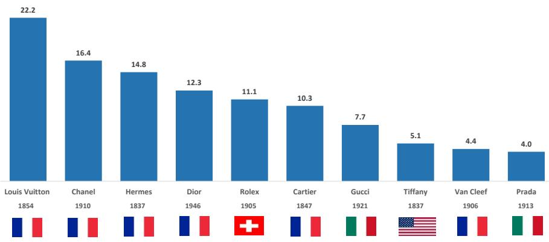

# MS：十大品牌业务与近期数据观察

2025年全球个人奢侈品品牌排名出现了一个值得关注的信号：路易威登与香奈儿在零售额上的差距已缩小至约1亿欧元，而香奈儿可能在2026年超越路易威登成为零售额第一。MS在最新发布的报告中，基于公司公开数据与自身估算，给出了2025年全球十大奢侈品牌的营收、零售额与营业利润排名。这份排名显示，行业集中度在连续多年提升后首次出现停顿，头部品牌内部正在发生位置变动。

报告覆盖的品牌包括路易威登、香奈儿、爱马仕、迪奥、劳力士、卡地亚、古驰、蒂芙尼、普拉达和梵克雅宝。其中，六家为法国品牌，两家意大利品牌，一家瑞士品牌，一家美国品牌。所有品牌中成立最晚的是1946年创立的迪奥，其余均超过百年。报告认为，历史传承在个人奢侈品领域仍是不可替代的竞争壁垒。

## 1. 路易威登仍居营收与利润首位，但零售额领先优势收窄

路易威登2025年营收估算为208亿欧元，同比下降约6%，已是连续第二年下滑。营业利润下降更为明显，约为13%至95亿欧元。尽管在营收和利润维度上，路易威登仍显著领先其他品牌，但在零售额维度上，其与香奈儿的差距已从2024年的6亿欧元缩小至约1亿欧元。报告指出，路易威登为100%直营模式，而香奈儿大量化妆品通过第三方零售商销售，因此零售额更能反映品牌对终端消费者的实际吸引力。信用卡数据显示，2026年上半年路易威登零售额同比大致持平，而香奈儿增长约10%。若这一趋势延续，香奈儿可能在2026年首次在零售额上超越路易威登。

> **KC评论：** 零售额与营收的差异，本质上是渠道结构问题。香奈儿化妆品通过第三方零售产生的销售额，在零售端被放大，而路易威登的直营模式则没有这一层放大效应。因此，零售额排名变动并不直接等同于品牌实力反转，但确实反映出两个品牌在终端消费者争夺中的不同节奏。

## 2. 香奈儿与爱马仕保持稳定，迪奥连续两年下滑

香奈儿集团2025年营收为170亿欧元，同比下降1%。报告估算香奈儿品牌营收约为162亿欧元，其中时尚与皮具占67%，化妆品占23%，腕表与珠宝约占5%。香奈儿在零售额维度上已接近路易威登，但在营收和利润上仍有明显差距，主要因其化妆品业务利润率较低。

爱马仕集团2025年营收增长5.5%至160亿欧元，为2013年以来最慢增速（除2020年外），但仍是前十品牌中少数实现增长的品牌之一。报告估算爱马仕品牌营收约为157亿欧元，零售额约为169亿欧元，稳居第三位。其营业利润率高达41.1%，在行业中仅次于路易威登。

迪奥的情况则更为明显。报告估算迪奥2025年营收为112亿欧元，同比下降约9%，已是连续第二年调整，累计峰值至谷底降幅接近15%。迪奥从2024年的第四位滑落至第五位，被劳力士超越。报告认为，新任创意总监Jonathan Anderson的任命可能带来2026年的销售改善，但复苏节奏可能慢于预期，部分原因是香奈儿正在该细分市场获取不成比例的份额。

## 3. 劳力士与卡地亚逆势增长，古驰持续承压

劳力士2025年营收估算为117亿欧元，同比增长约5.4%，从第五位升至第四位。报告特别指出，劳力士销量连续两年下降，这是20多年来首次，但平均售价上涨约6%至约14000瑞士法郎，完全抵消了销量下滑的影响。劳力士在零售额维度上估算为约170亿欧元，已超过苹果手表的全球营收，巩固了其在全球手表市场的领导地位。报告估算劳力士在瑞士手表零售额中的份额已从2019年的26%升至2025年的33%。

卡地亚2025年营收估算为110亿欧元，同比增长8%，保持第六位。报告认为，卡地亚自2016年更换CEO以来表现持续改善，2015至2025年营收年复合增长率约为10%，在珠宝类别中明显跑赢。2026年上半年，卡地亚营收同比增长超过12%，若这一势头延续，其营收可能在2026年超过迪奥。

古驰2025年营收下降22%至60亿欧元，为前十品牌中连续第二年最大降幅。报告认为，古驰正处于比同行更深、更持久的调整周期中。尽管营收排名仍居第七位，但其营业利润已低于梵克雅宝。

> **KC评论：** 劳力士和卡地亚的增长路径不同。劳力士依靠提价而非扩量，卡地亚则受益于珠宝品类的结构性增长和品牌焕新。两者都证明，在整体市场调整时，品牌仍可通过定价权或品类优势实现增长。

## 4. 观察框架：零售额与营收的差异揭示品牌渠道结构

报告提供了三个维度的排名——营收、零售额和营业利润，三者之间的差异本身就是重要的分析工具。以圣罗兰为例，其2025年营收仅为26亿欧元，但零售额估算高达96亿欧元，在零售额排名中位列第七。原因在于圣罗兰的化妆品授权给欧莱雅，后者产生的零售额远超品牌自身的时尚与皮具业务。报告估算，圣罗兰化妆品营收约为31亿欧元，已超过其时尚与皮具的26亿欧元。这一现象在大型奢侈品牌中并不常见——香奈儿、迪奥、古驰等品牌的时尚与皮具营收均显著高于化妆品。

对于读者和行业观察者而言，零售额排名更能反映品牌在终端消费者中的实际影响力，而营收排名则更直接地体现品牌自身的收入规模。两者之间的差距，主要取决于品牌对渠道的控制程度——直营比例越高，零售额与营收的差距越小；授权和批发比例越高，差距越大。这一框架可以帮助理解不同品牌的实际市场地位，以及渠道结构变化对财务表现的影响。

梵克雅宝2025年营收估算为48亿欧元，同比增长10%，营业利润达15亿欧元，已超过古驰。报告认为，梵克雅宝自2013年营收约7.5亿欧元以来持续增长，是珠宝品类中增长最快的品牌之一。普拉达品牌营收估算为38亿欧元，同比下降4.8%，但零售额达58亿欧元，主要来自眼镜和化妆品授权。蒂芙尼营收估算为49亿欧元，同比下降3%，在零售额排名中已跌出前十。

For informational purposes only. Portions may be generated,translated,summarized,or edited with AI assistance based on source materials and may contain omissions or errors. Please verify independently. This is not investment,legal,tax,accounting,or other professional advice.

