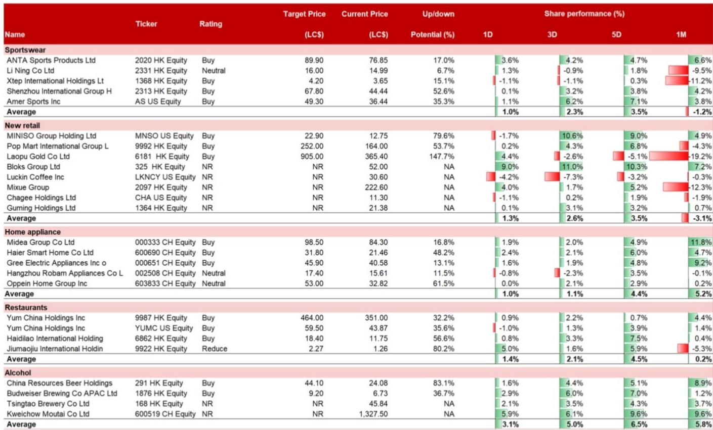
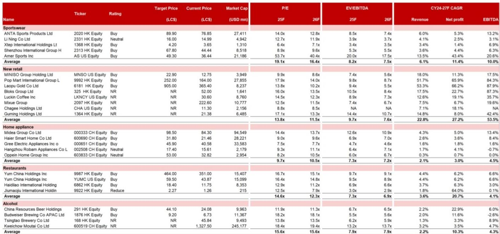
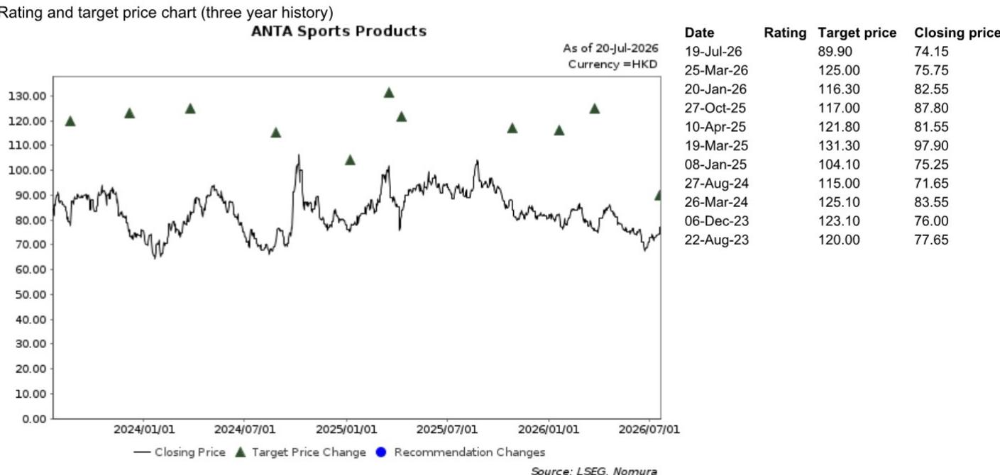

# NOM：中国消费-欧洲市场反馈

NOM中国消费团队近期在欧洲与约30家机构读者交流后，发现一个值得关注的信号：尽管中国整体消费基本面处于调整阶段，欧洲读者对中国消费领域的兴趣仍然相对较强，且集中度高于预期。这份报告的核心观察在于，读者并非广泛看好中国消费，而是有选择地聚焦于奢侈品、购物中心和运动服饰这三个结构性增长赛道。

报告指出，欧洲读者普遍认同中国宏观环境增长仍在调整对消费的影响，认为多数消费类公司2026年上半年和全年的业绩上行空间有限。他们对即将出台的消费相关政策保持关注，但也注意到“十五五”规划中关于消费扩张的表述缺乏短期支持细节。这种“关注但谨慎”的态度，使得资金更倾向于流向那些具备独立增长逻辑的细分领域。

## 1. 房地产市场早期企稳信号引发消费财富效应讨论

一个被欧洲读者频繁提及的议题是，中国房地产市场是否正在经历转折。报告提到，上海和深圳的二手房成交量出现回升，一线及强二线城市高端公寓销售也有所回暖。读者在追问：持续五年的房地产节奏变化周期对消费的谨慎财富效应，是否终于接近尾声。这一判断如果成立，将直接影响他们对可选消费板块的估值预期。目前来看，市场仍在等待更多数据确认这一趋势的可持续性。

> **KC评论：** 房地产对消费的影响路径并非线性。报告捕捉到的是读者从“关注房价调整”转向“关注成交量企稳”的预期变化，但这一转变尚未体现在消费公司的业绩指引中。后续需要跟踪的，是高端消费与大众消费在财富效应修复上的分化程度。

## 2. 运动服饰赛道：安踏的多品牌策略引发分歧

在运动服饰领域，安踏是欧洲读者讨论最集中的标的。报告显示，读者对安踏的看法呈现明显分化。认可的一方看重其扎实的渠道运营能力；质疑的一方则担心公司拥有过多品牌，不仅难以产生实质性协同效应，还可能造成品牌间的销售蚕食。此外，多数读者对安踏收购Puma持中性偏谨慎态度，主要担忧交易完成周期过长，以及安踏缺乏运营Puma在欧美市场业务的成熟经验。

这一分歧背后反映的是，欧洲读者对中国运动品牌“出海”能力的评估标准正在收紧——他们不再仅关注品牌收购本身，而是更看重收购后的整合与运营能力。

## 3. 老铺黄金：金价波动与品牌升级的双重考验

在零售板块，老铺黄金是引发最多讨论的公司。报告指出，欧洲读者的关注点集中在两个层面。短期看，金价波动对老铺黄金销售的影响是主要关注点。长期看，部分读者对中国国内需求增长仍在调整背景下，老铺黄金能否成功转型为高端品牌持怀疑态度。但也有读者看到了另一面：老铺黄金进入中国高端购物中心的独特路径，以及其在富裕消费者心智中不断扩大的存在感。这些读者同时关注老铺黄金在海外开设更多精品店以提升品牌认知度的进展。

> **KC评论：** 老铺黄金的争议本质上是一个“估值锚”问题。看空者以金价和消费beta为锚，看多者以品牌溢价和结构性增长为锚。报告没有给出明确答案，但提供了一个可复用的观察框架：跟踪其海外门店扩张速度和高端商场入驻率，是验证品牌升级逻辑的两个关键指标。

## 4. 其他消费子板块：普遍谨慎中的结构性偏好

报告显示，欧洲读者对零售、餐饮和啤酒等其他消费子板块普遍持谨慎看法。对家电板块的主要关注则来自以旧换新政策效果可能递减。NOM在报告中维持对安踏和老铺黄金的偏好，认为这两家公司具备结构性发展战略、可见的利润率趋势以及有吸引力的估值——尤其是在近期板块整体调整之后。

这份报告的价值不在于给出具体建议，而在于揭示了欧洲机构读者在中国消费领域的“筛选框架”：他们正在用更严格的标准区分“周期性反弹”和“结构性增长”，并愿意为后者支付溢价。对于关注中国消费市场的读者而言，理解这一框架的演变，可能比跟踪任何单一数据点更有意义。

For informational purposes only. Portions may be generated,translated,summarized,or edited with AI assistance based on source materials and may contain omissions or errors. Please verify independently. This is not investment,legal,tax,accounting,or other professional advice.

For informational purposes only. Portions may be generated,translated,summarized,or edited with AI assistance based on source materials and may contain omissions or errors. Please verify independently. This is not investment,legal,tax,accounting,or other professional advice.

