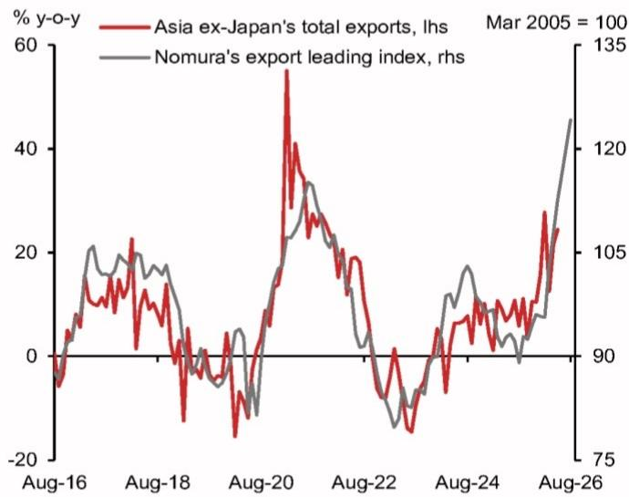

# 亚洲出口领先指标观察

NELI持续上升，显示亚洲出口动能延续。

## 研究团队

亚洲宏观研究

Rob Subbaraman - NSL
rob.subbaraman@NOM.com
+65 6433 6548

Si Ying Toh, CFA - NSL
siying.toh@NOM.com
+65 6433 6666

图1：NOM亚洲出口领先指标  

- NOM亚洲（除日本）出口综合领先指标（NELI）由九项分项构成，领先周期约三个月。该指标在过去曾有效预示主要拐点，且受基数效应影响较小，可作为观察亚洲出口增长动能的参考。

- NELI延续上升趋势，8月升至124.2。这表明亚洲出口增长动能进入第三季度后仍保持稳定。支撑因素包括科技相关指标的持续活跃，以及中国进口需求的增长。

- 科技领域的结构性趋势仍是亚洲出口增长的主要驱动力，且有迹象显示其影响范围正在扩大。不过，随着相关地缘因素的变化，全球供应链压力可能重新浮现，亚洲出口面临的不确定性或逐步显现。

## 附录A-1

本报告由NOM新加坡有限公司（NSL）编制。

NOM集团实体详情请参见免责声明。

## 分析师声明

我们，Robert Nemmara Subbaraman和Si Ying Toh，特此声明：（1）本研究报告中所表达的观点准确反映了我们对相关标的证券或发行人的个人看法；（2）我们的薪酬中没有任何部分直接或间接与本研究报告中表达的具体建议或观点相关；（3）我们的薪酬中没有任何部分与NOM Securities International, Inc.、NOM International plc或任何其他NOM集团公司进行的特定投资银行业务挂钩。

## 重要披露

## 研究报告在线获取及利益冲突披露

NOM集团研究报告可通过www.NOMnow.com/research、Bloomberg、Capital IQ、Factset、LSEG获取。

重要披露信息可访问http://go.NOMnow.com/research/m/Disclosures或向NOM Securities International, Inc.索取。如访问网站遇到问题，请发送邮件至grpsupport@NOM.com寻求帮助。

负责编制本报告的分析师的薪酬基于多种因素，包括公司的总收入，其中一部分来自投资银行业务。除非另有说明，本报告首页列出的非美国分析师未在FINRA规则下注册/具备研究分析师资格，可能不是NSI的关联人员，且可能不受FINRA Rule 2241关于与所覆盖公司沟通、公开露面以及研究分析师账户持有证券交易等限制的约束。

NOM Global Financial Products Inc. (NGFP)、NOM Derivative Products Inc. (NDP)和NOM International plc. (NIplc)已在美国商品期货交易委员会和美国期货协会注册为掉期交易商。NGFP、NDPI和NIplc主要从事掉期及其他衍生品交易，这些产品可能构成本报告的主题。

## 免责声明

本出版物包含由第1页列明的NOM集团实体编制的内容，并可能包含一个或多个NOM集团实体的贡献，其员工及其各自隶属关系在第1页或本出版物其他地方注明。本文中使用的术语"NOM集团"指NOM Holdings, Inc.及其关联公司和子公司，包括：(a) NOM Securities Co., Ltd. ('NSC') 日本东京，(b) NOM Financial Products Europe GmbH ('NFPE') 德国，(c) NOM International plc ('NIplc') 英国，(d) NOM Securities International, Inc. ('NSI') 美国纽约，(e) NOM International (Hong Kong) Ltd. ('NIHK') 香港，(f) NOM Financial Investment (Korea) Co., Ltd. ('NFIK') 韩国（在韩国金融投资协会注册的NOM分析师信息可在KOFIA内联网http://dis.kofia.or.kr查询），(g) NOM Singapore Ltd. ('NSL') 新加坡（注册号197201440E，受新加坡金融管理局监管），(h) NOM Australia Ltd. ('NAL') 澳大利亚（ABN 48 003 032 513），受澳大利亚证券和投资委员会监管，持有澳大利亚金融服务牌照号246412，(i) NOM Securities Malaysia Sdn. Bhd. ('NSM') 马来西亚，(j) NIHK台北分行 ('NITB') 台湾，(k) NOM Financial Advisory and Securities (India) Private Limited ('NFASL') 印度孟买（注册地址：Ceejay House, Level 11, Plot F, Shivsagar Estate, Dr. Annie Besant Road, Worli, Mumbai- 400 018, India；电话：91 22 4037 4037，传真：91 22 4037 4111；CIN No: U74140MH2007PTC169116，证券经纪业务SEBI注册号：INZ000255633；商人银行业务SEBI注册号：INM000011419；研究业务SEBI注册号：INH000001014 - 合规官：Ms. Pratiksha Tondwalkar，91 22 40374904，投诉邮箱：investorgrievancesra@NOM.com 网页：链接

关于印度上市公司或由印度NFASL研究分析师撰写的报告：(i) 证券市场投资存在市场风险。投资前请仔细阅读所有相关文件。(ii) SEBI的注册和NISM的认证并不保证中介机构的表现或向读者提供任何回报保证。(iii) NFASL提供研究服务的条款和条件在NFASL网页上披露。

(l) NOM Fiduciary Research & Consulting Co., Ltd. ('NFRC') 日本东京。(m) NOM Orient International Securities Co., Ltd ("NOI") 是NOM集团、东方国际（集团）有限公司和上海黄浦投资控股（集团）有限公司共同控股的合资企业。根据中华人民共和国法律（就本文件而言，不包括香港、澳门和台湾），NOI在中国境内获准提供证券研究和研究交流，并独立于NOM集团其他成员运营；特别是，NOI在中国证券中的权益不会向任何其他NOM集团实体披露或与其持仓合并，其他NOM集团实体在中国证券中的权益也不会向NOI披露或与其持仓合并。研究报告首页上NOI旁边的个人姓名表示该个人受雇于NOI，根据研究合作协议为NIHK提供研究协助。研究报告首页上员工姓名旁边的'NSFSPL'表示该个人受雇于NOM Structured Finance Services Private Limited，根据公司间协议为某些NOM实体提供协助。研究报告首页上个人姓名旁边的'Verdhana'表示该个人受雇于PT Verdhana Sekuritas Indonesia ('Verdhana')，根据研究合作协议为NIHK提供研究协助，Verdhana及其个人均未在印度尼西亚境外获得许可。

本材料：(I) 仅供您个人参考，我们不基于此材料寻求任何行动；(II) 不应被解释为在任何司法管辖区出售或招揽购买任何证券的要约，如果此类要约或招揽在该司法管辖区属于非法行为；(III) 除与NOM集团相关的披露外，基于我们认为可靠的来源信息，但未经NOM集团独立核实。

除与NOM集团相关的披露外，NOM集团不保证、陈述或承诺（明示或暗示）本文件的公平性、准确性、完整性、正确性、可靠性或适用于任何特定目的或适销性，并且在法律/法规允许的最大范围内，不承担因使用本文件及相关数据而产生的任何行为（或决定不作为）的责任（无论是过失责任还是其他责任，以及全部或部分责任）。在法律/法规允许的最大范围内，NOM集团的所有保证和其他承诺均在此排除，NOM集团对因使用、误用或分发本材料或其中包含的信息或以其他方式与之相关的任何损失不承担任何责任（无论是过失责任还是其他责任，以及全部或部分责任）。

所表达的意见或估计是截至本材料原始发布日期的最新意见，所包含的信息（包括其中的意见和估计）如有变更，恕不另行通知。然而，NOM集团明确声明不承担任何更新或修订本文件的义务。本文中的任何评论或陈述均为作者本人的观点，可能与NOM集团内部其他方的观点不同。客户应考虑本报告中的任何建议或推荐是否适合其特定情况，并在适当情况下寻求专业建议，包括税务建议。NOM集团不提供税务建议。

在适用法律/法规允许的范围内，NOM集团和/或其高级职员、董事、员工和关联方可能以委托人、代理人或其他身份进行交易，或持有本文提及的发行人或证券的多头或空头头寸，或买卖其证券、商品或工具，或基于其的期权或其他衍生工具。NOM集团公司也可能担任发行人金融工具的市场做市商或流动性提供者（根据英国适用法规的定义）。如果市场做市商活动是根据美国或其他司法管辖区的特定法律法规的定义进行的，则将在具体的发行人披露中单独说明。

本文件可能包含从第三方获得的信息，包括但不限于信用评级机构的评级，如标准普尔。NOM集团特此明确否认对从第三方获得的任何信息的原创性、公平性、准确性、完整性、正确性、及时性或可用性，以及因使用或误用此类信息或以其他方式与之相关的任何直接、间接、附带、示范性、补偿性、惩罚性、特殊或后果性损害、成本、费用、法律费用或损失（包括收入或利润损失和机会成本）承担任何陈述、保证或承诺。禁止以任何形式复制和分发第三方内容，除非事先获得相关第三方的书面许可。第三方内容提供商不（明示或暗示）保证任何信息（包括评级）的公平性、准确性、完整性、正确性、及时性或可用性，并且不对因使用或误用此类内容而产生的任何错误或遗漏（无论过失与否）负责。第三方内容提供商不提供任何明示或暗示的保证，包括但不限于任何适销性或特定目的适用性的保证。第三方内容提供商不对因使用或误用其内容（包括评级）而产生的任何直接、间接、附带、示范性、补偿性、惩罚性、特殊或后果性损害、成本、费用、法律费用或损失（包括收入或利润损失和机会成本）承担责任。信用评级是意见陈述，不是事实陈述，也不是购买、持有或出售证券的建议。它们不涉及证券的适合性或证券用于投资目的的适合性，不应作为研究交流依赖。本文件中任何MSCI来源的信息均为MSCI Inc.的专有财产。未经MSCI事先书面许可，不得为任何目的（包括创建任何金融产品和任何指数）复制、转载、重新分发、重新发布或使用本信息（全部或部分）。此信息按"原样"提供。用户承担使用此信息的全部风险。MSCI、其关联方以及任何参与计算或编译信息的第三方特此明确否认对本材料或其中包含的信息或以其他方式与之相关的任何原创性、公平性、准确性、完整性、正确性、适销性或特定目的适用性的所有陈述、保证或承诺。在不限制前述规定的情况下，MSCI、其任何关联方或任何参与计算或编译信息的第三方均不对任何类型的任何损害承担责任。MSCI和MSCI指数是MSCI及其关联方的服务标志。

Russell/NOM日本股票指数的知识产权和任何其他权利属于NOM Fiduciary Research & Consulting Co., Ltd. ("NFRC")和FTSE Russell ("Russell")。NFRC和Russell不保证指数的公平性、准确性、完整性、正确性、可靠性、有用性、适销性、可销售性或适合性，并且不对任何指数用户和/或其关联方使用指数进行的业务活动或服务负责。

读者应将本文件视为其做出投资决策的单一因素之一，因此，本报告不应被视为识别或暗示与任何投资决策相关的所有直接或间接风险。NOM集团制作多种不同类型的研究产品，包括但不限于基础分析和定量分析；一种研究产品中包含的建议可能与其他类型研究产品中的建议不同，无论是由于不同的时间范围、方法论还是其他原因。NOM集团以多种不同方式发布研究产品，包括在NOM集团门户网站上发布和/或直接分发给客户。不同的客户群体可能会根据其个人需求从研究部门获得不同的产品和服务。

本文中呈现的数字可能涉及过往表现或基于过往表现的模拟，这些并非未来或可能表现的可靠指标。如果信息包含对未来表现和业务前景的预期、预测或指示，此类预测可能不是未来或可能表现的可靠指标。此外，模拟基于模型和简化假设，可能过度简化且不能反映未来的回报分布。本文件中为说明目的而创建和发布的任何数字、策略或指数，不旨在作为欧洲基准法规定义的"基准"使用。某些证券受汇率波动影响，可能对投资的价值、价格或收入产生不利影响。

关于固定收益研究：建议分为两类：战术性建议，通常持续最多三个月；或战略性建议，通常持续6-12个月。然而，交易建议可能会根据情况变化随时进行审查。还提供了交易的"止损"水平；如果触及，将自动关闭交易建议。建议中显示的价格和回报表现是在提交发布时获取的，基于当时指示性的彭博、LSEG或NOM价格和回报表现。所示价格和回报表现不一定是可以执行交易建议的价格。

本文所述的证券可能未根据1933年美国证券法（"1933年法案"）注册，在这种情况下，除非已根据1933年法案注册，或符合1933年法案注册要求的豁免条件，否则不得在美国或向美国人发售或出售。除非管辖法律另有规定，任何交易均应通过您所在司法管辖区的NOM实体执行。

本文件已获批准在英国作为投资研究由NIplc分发。NIplc由审慎监管局授权，并受金融行为监管局和审慎监管局监管。NIplc是伦敦证券交易所的成员。本文件不构成英国适用法规意义上的个人推荐，也不考虑个别读者的特定投资目标、财务状况或需求。本文件仅针对英国适用法规意义上的"合格交易对手"或"专业客户"，因此不得重新分发给"零售客户"。

本文件已获批准在欧洲经济区作为投资研究由NOM Financial Products Europe GmbH ("NFPE")分发。NFPE是一家根据德国法律注册成立的有限责任公司，在法兰克福/美因法院商业登记处注册，注册号为HRB 110223。NFPE由德国联邦金融监管局授权和监管。

本文件已由NIHK批准，NIHK受香港证券及期货事务监察委员会监管，并在香港由NIHK分发。本文件仅针对香港适用法规意义上的"专业读者"，因此不得重新分发给非"专业读者"的人士。

本文件已获批准在澳大利亚由NAL分发，NAL在澳大利亚由ASIC授权和监管。

本文件也已获批准在马来西亚由NSM分发。

在新加坡，本文件由NSL分发，NSL是《财务顾问法》（第110章）定义的豁免财务顾问，并受新加坡金融管理局监管。NSL可根据《财务顾问条例》第32C条的规定分发其外国关联公司制作的此文件。本文件针对《证券及期货法》（第289章）定义的认可读者、专家读者或机构读者。如果本文件的接收者不是认可读者、专家读者或机构读者，NSL仅在法律要求的范围内对此类接收者承担本文件内容的法律责任。新加坡的本文件接收者应就本文件引起或与之相关的事宜联系NSL。本文件旨在广泛分发。它不考虑任何特定个人的具体投资目标、财务状况或特殊需求。接收者在承诺购买任何证券之前，应考虑其具体的投资目标、财务状况或特殊需求，包括在单独委托下，根据接收者认为合适的方式，就投资的适合性寻求独立财务顾问的建议。除非1933年法案S条例的规定禁止，本材料在美国由NSI（一家美国注册的经纪交易商）分发，NSI根据1934年美国证券交易法Rule 15a-6的规定对其内容承担责任。编制本文件的实体允许NOM集团内独立运营的关联公司向其客户提供此类文件的副本。

本文件尚未获批准分发给沙特阿拉伯王国（"沙特阿拉伯"）的"授权人士"、"豁免人士"或"机构"（由资本市场管理局定义）或阿拉伯联合酋长国（"阿联酋"）的"市场交易对手"或"专业客户"（由迪拜金融服务局定义）或卡塔尔国（"卡塔尔"）的"市场交易对手"或"商业客户"（由卡塔尔金融中心监管局定义）以外的人士，由NOM沙特阿拉伯、NIplc或NOM集团的任何其他成员（视情况而定）分发。本文件及其任何副本不得由未经授权的人士带入或传输或分发，直接或间接地，进入沙特阿拉伯、阿联酋或卡塔尔，或分发给沙特阿拉伯境内的"授权人士"、"豁免人士"或"机构"、阿联酋的"市场交易对手"或"专业客户"、卡塔尔的"市场交易对手"或"商业客户"以外的任何人。未能遵守这些限制可能构成违反阿联酋、沙特阿拉伯或卡塔尔法律的行为。

关于涉及台湾上市公司或由台湾研究分析师撰写的报告：

本文件仅供参考。您应独立评估投资风险，并对您的投资决策全权负责。未经NOM集团书面授权，不得复制或引用本报告的任何部分。根据台湾《证券商推介客户买卖有价证券作业准则》和/或其他适用法律法规，您不得向他人（包括但不限于关联方、关联公司和任何其他第三方）提供本报告，或从事任何可能涉及利益冲突的与本报告相关的活动。关于NOM International (Hong Kong) Ltd.台北分行不可执行的证券/工具的信息仅供信息参考，不应被解释为对此类证券/工具的交易建议或招揽。

本材料不得在印度尼西亚境内分发，或传递给印度尼西亚共和国境内的人士，或印度尼西亚公民（无论其住所或所在地）或印度尼西亚的实体或居民，如果这构成印度尼西亚共和国法律下的公开发售。本文提及的证券不得在印度尼西亚发售或出售给印度尼西亚公民（无论其住所或所在地）或印度尼西亚的实体或居民，如果这构成印度尼西亚共和国法律下的公开发售。

研究报告首页上NOI旁边的个人姓名表示本文件是NOI在中国发布的研究报告的翻译版本。在所有其他情况下，本文件由未在中国获得提供证券研究许可的NOM集团或其子公司或关联公司（统称"离岸发行人"）编制。本研究报告未获批准在中国境内分发。A股相关分析（如有）并非为位于或注册于中国的人士制作。接收者不应依赖本研究报告中包含的任何信息做出投资决策，离岸发行人不对此承担任何责任。未经NOM集团成员事先书面同意，不得以任何形式或任何方式（I）复制、影印、复制或复印本材料的任何部分；或（II）重新分发、重新发布或重新分发本材料。如果本文件通过电子传输方式分发，例如电子邮件，则此类传输不能保证安全或无错误，因为信息可能被拦截、损坏、丢失、销毁、延迟到达或不完整，或包含病毒。因此，发送方不对本文件内容中可能因电子传输而产生的任何错误或遗漏承担责任。如需验证，请索取纸质版本。

## NOM Securities Co., Ltd.

在关东财务局注册的金融工具公司（注册号第142号）

会员协会：日本证券业协会；日本投资管理协会；日本金融期货协会；第二类金融工具公司协会；以及日本证券型代币发行协会。

NOM集团通过其合规政策和程序（包括但不限于利益冲突、中国墙和保密政策）以及维护中国墙和员工培训来管理与研究制作相关的冲突。

关于本文件中包含的任何研究交流的制作所使用的方法或模型的更多信息，可联系首页列出的NOM研究分析师索取。披露信息可应要求提供，披露信息可在NOM披露网页获取：

http://go.NOMnow.com/research/m/Disclosures

版权所有 © 2026 NOM新加坡有限公司，新加坡。保留所有权利。
