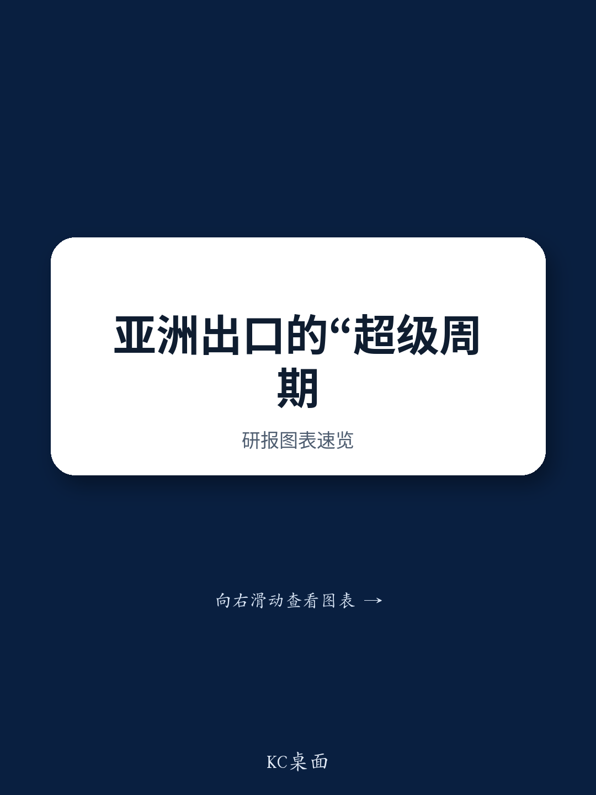

# NOM：跨境贸易数据与主题变化观察

NOM亚洲出口领先指标（NELI）在8月升至124.2，延续了自年初以来的上升趋势。这个由九项分指标构成的综合指数，历史上对亚洲出口的拐点有较好的预测能力，且不受基数效应干扰。报告认为，亚洲出口增长动能进入三季度后没有节奏变化迹象，背后是科技相关指标的走强与中国进口需求的回升。

NELI的走高，指向一个更值得关注的判断：亚洲出口可能正处于一轮由技术周期驱动的结构性扩张阶段，而非单纯的库存回补或基数修复。NOM在报告中使用了“超级周期”一词来描述这一现象。

## 1. 科技相关指标仍是NELI上升的主要支撑

NELI的九项成分中，与半导体、电子元器件相关的分指标贡献了最大涨幅。报告指出，AI相关的技术研究需求仍在扩散，从最初的算力芯片向存储、封装、设备等环节延伸。这一扩散过程，使得亚洲多个地区的出口结构同时受益，而非仅集中在少数几个国家或地区。

中国进口需求的回升，则为这一轮出口扩张提供了额外的需求侧支撑。报告提到，中国对原材料、中间品和资本品的进口正在改善，这有助于稳定区域内贸易循环。

## 2. 供应链不确定性可能重新浮现，构成节奏变化因素

报告同时提示，全球供应链不确定性可能重新上升。美国与伊朗之间的冲突再度升级，霍尔木兹海峡的通行受阻，以及胡塞武装对红海航线的威胁，都可能干扰货物运输。这些地缘因素如果持续发酵，将推高运输成本和交货时间，对亚洲出口形成谨慎冲击。

> **KC评论：** 供应链不确定性是这份报告中最容易被忽略的变量。NELI本身是领先指标，但它的成分中不包含地缘政治或航运中断的变量。如果红海或霍尔木兹海峡的通行问题出现变化，出口数据可能在NELI见顶后仍保持高位一段时间，形成滞后信号。读者在参考NELI时，需要同时追踪全球集装箱运价指数和船舶通行数据，作为交叉验证。

## 3. 观察框架：如何判断出口动能是否见顶

报告没有直接给出NELI的见顶阈值，但提供了一个可复用的观察框架。NELI的领先时间约为三个月，因此8月的数据指向的是11月前后的出口表现。如果未来两个月NELI出现回落，或科技分指标的增长斜率节奏变化，才意味着动能可能接近顶部。

此外，报告强调NELI对基数效应的免疫能力。这意味着即使官方出口数据因低基数而出现高同比读数，NELI仍能反映真实的增长动量变化。对于关注出口趋势的决策者而言，NELI比单一月份的同比数据更具参考价值。

For informational purposes only. Portions may be generated,translated,summarized,or edited with AI assistance based on source materials and may contain omissions or errors. Please verify independently. This is not investment,legal,tax,accounting,or other professional advice.

For informational purposes only. Portions may be generated,translated,summarized,or edited with AI assistance based on source materials and may contain omissions or errors. Please verify independently. This is not investment,legal,tax,accounting,or other professional advice.

