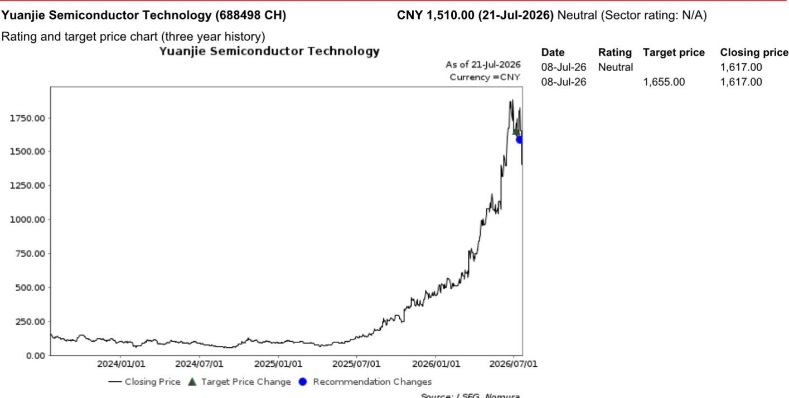

# NOM：源杰半导体上半年业绩预告确认光芯片需求周期

源杰半导体在7月21日收盘后发布了一份超出市场预期的上半年业绩预告。公司预计2026年上半年实现营业收入9至9.5亿元，同比增长约339%至364%；净利润6至6.5亿元，同比增长约1197%至1305%。这份预告发布后，公司随即召开了分析师沟通会。

这份业绩预告之所以值得关注，不仅因为增速本身，更因为它出现在公司报价过去一周下跌约16%的背景下。市场此前对光芯片行业估值偏高、产品升级节奏变化以及产能扩张可能带来的价格不确定性存在担忧。NOM在这份快速报告中认为，业绩预告实际上确认了光芯片需求周期的可持续性，而非短期脉冲。

## 1. 二季度利润率扩张来自电信与数通市场的产品结构升级

根据业绩预告推算，源杰半导体第二季度单季营收约为5.45至5.95亿元，同比增长352%至393%；净利润约为4.21至4.71亿元，同比增长1217%至1373%。环比看，第二季度营收和净利润均较第一季度有明显加速。

公司在沟通会上将利润率的大幅扩张归因于电信和数通两个市场的结构性产品升级。在数通激光器芯片领域，70毫瓦和100毫瓦的连续波激光器成为主要驱动力。NOM分析师认为，这意味着公司正在获得更高比例的1.6T光模块订单。在电信市场，产品升级同样在推进。

> **KC评论：** 市场此前担心光芯片行业产能扩张过快会导致价格竞争，但源杰二季度的利润率数据说明，产品升级带来的单价提升效应可能超过了产能扩张带来的价格不确定性。这个判断的关键在于，公司目前的有效产能扩张周期超过两年，短期内供给端不会出现过剩。

## 2. 超高功率连续波激光器与100G EML成为下一阶段产品储备

公司在沟通会上披露了两个重要的产品进展。一是正在开发300毫瓦和400毫瓦的超高功率连续波激光器，管理层认为公司有望成为首批受益于NPO和CPO需求的企业之一。二是100G EML芯片的产能正在扩张，管理层预计从2026年下半年起出货量将快速提升。

这两个产品方向对应的是光模块从1.6T向更高速率演进的路径。超高功率激光器是CPO架构中的关键器件，而100G EML则是800G和1.6T光模块的核心芯片。虽然EML目前收入贡献仍较小，但产能扩张和出货节奏的明确化，为市场提供了一个可跟踪的观察节点。

## 3. 市场对产能过剩和价格竞争的担忧可能被高估

在分析师沟通会上，管理层回应了市场最关心的竞争格局问题。核心论据是：有效产能扩张需要两年以上时间，核心激光器产品由于供给不足，定价预计将保持稳定。

这一判断与市场此前担心的“更多竞争者进入导致价格快速节奏变化”形成对比。NOM报告认为，市场对价格竞争的担忧可能过度。从行业供给端看，光芯片的产能建设涉及设备采购、工艺调试和客户认证等多个环节，实际可用的有效产能扩张速度慢于市场直觉。

## 4. 一个可复用的观察框架：产品升级节奏与产能扩张周期的匹配度

对于跟踪光芯片行业的读者，源杰半导体这份业绩预告提供了一个分析框架：当一家公司的利润率在产能扩张期仍能持续提升时，说明产品升级的速度快于产能释放的速度，这是行业需求结构健康的信号。反之，如果利润率在产能扩张期开始承压，则意味着供给开始超过需求。

具体到源杰，可以关注三个指标：连续波激光器从70毫瓦向100毫瓦及以上功率的升级进度、100G EML的出货量爬坡速度、以及公司在新一代CPO架构中的客户导入情况。这三个指标的演变，将决定公司能否在行业需求周期中持续获得定价权。

For informational purposes only. Portions may be generated,translated,summarized,or edited with AI assistance based on source materials and may contain omissions or errors. Please verify independently. This is not investment,legal,tax,accounting,or other professional advice.

For informational purposes only. Portions may be generated,translated,summarized,or edited with AI assistance based on source materials and may contain omissions or errors. Please verify independently. This is not investment,legal,tax,accounting,or other professional advice.

