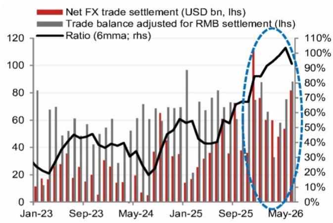
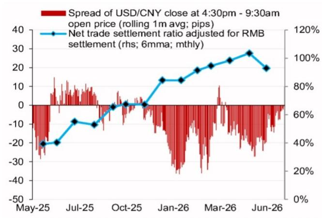

# 宏观观察 - 东盟/亚洲（除日本）

## 关于美元/离岸人民币的观察：贸易流入与相关技术进展带来的潜在资金流入

支持人民币的相关因素包括：稳健的贸易结算、对美元下行的非对称敏感性、潜在的外部资金流入以及稳定的双边关系。

**观察**：我们对美元/离岸人民币的观察保持一定关注，目标区间参考6.55（约3.0%的波动空间），时间框架至10月底。

我们在7月16日上调了对美元/离岸人民币观察的关注程度，原因是美国6月CPI和PPI数据低于预期后，我们倾向于认为美元在短期内可能走弱。尽管仍有一些因素限制美元的下行空间（例如，地缘局势变化、资金流入美国资产等），但本地的发展应继续支持我们对人民币升值的看法。

## 人民币表现相对强劲的驱动因素

1. **企业外汇结算持续活跃**：6月贸易顺差较大之后，境内企业外汇回笼活动持续。我们认为，未来几个月中国企业的外汇卖出活动可能仍将保持活跃，尤其是在出口增长依然较高、支撑较大贸易顺差的背景下。

最新数据显示，6月企业净外汇贸易结算顺差为818亿美元（5月：536亿美元；二季度均值：610亿美元），经人民币结算调整后，相当于贸易顺差的92.9%（图1）。这也是自2025年12月（即1113亿美元）以来最大的月度净外汇贸易结算顺差。

出口商汇款比率（占出口值的百分比）在6月升至52.5%（5月：46.2%；二季度均值：49.6%），而进口商的外汇需求比率在6月也升至47.0%（5月：44.4%；二季度均值：46.6%）。

这种强劲的净外汇贸易结算需求表明，中国企业越来越愿意将持有的美元进行回笼。在6月美联储会议后美元买盘环境下，当美元/人民币即期汇率突破6.80水平时，中国企业可能已将外汇收入兑换为人民币。我们注意到，美元/人民币即期汇率在亚洲时段往往趋于下行，这可能与在岸外汇贸易结算需求有关（图2）。

2. **美元/人民币中间价呈现相对清晰的下行趋势**。相关迹象包括：

   - 我们观察到，当美元买盘动能较强时，中间价仅小幅上行。例如，2月27日（地缘事件前）至3月30日期间，美元指数上涨3.0%，而美元/人民币中间价几乎没有变化（从6.9228到6.9223）。同样，6月16日至24日期间，美元指数上涨2.1%，而美元/人民币中间价仅小幅上升13个基点。

   - 相关方面似乎在限制每日中间价的上行和下行幅度，中间价下行的平均幅度往往大于上行的平均幅度。自2026年6月以来，中间价下行时日均下降33个基点（共19个交易日），而中间价上行时日均上升21个基点（共17个交易日）。

   - 正向中间价误差（即实际值减去模型预测值）也从6月1日至17日的平均+437个基点收窄至6月18日以来的平均+196个基点。上一次观察到较小的正向中间价误差是在2026年3月（当时美元因美联储和地缘事件而走强），但那是暂时的。当美元强势从3月底至6月初消退时，美元/人民币的下行动能出现，相关方面不得不管理人民币升值的节奏（即正向中间价误差扩大）。我们预计未来几个月正向中间价误差将保持较大，原因包括中国外部部门前景良好、企业对人民币的积极情绪（即外汇汇款）以及美元中期可能走弱。

3. **与每日中间价类似，美元/离岸人民币对美元指数下行的敏感度高于上行**。我们此前曾指出，美元/离岸人民币对美元指数下行的敏感度高于上行。这一模式在近期的交易时段中仍然可观察到。具体而言，6月16日至24日，美元/离岸人民币上行0.84%，而美元指数经历了相对较大的2.1%上行（敏感度为38%）。相比之下，6月24日至7月21日，美元/离岸人民币下行0.68%，而美元指数仅下跌0.64%（敏感度为106%）。

4. **人工智能大语言模型技术差距的缩小以及近期对科技板块的广泛支持**，是可能吸引外部股权资金流入的因素。2026年7月16日，一家领先的AI实验室发布了一款大语言模型，其表现优于许多最先进的美国大语言模型。尽管该发布最初引发了科技板块的调整，但随后相关报道显示，主要国家支持基金、五家最大的保险公司以及国家支持的资产管理公司均表示对科技板块的支持。

   a. 可以说，该模型的发布被与2025年1月的一次重要发布相提并论。在那次发布之后，我们追踪的中国相关股权ETF的外部资金流入在2025年2月和3月分别激增至44亿美元和25亿美元（此前3个月均值：-29亿美元；2026年7月至今：-21亿美元）。

   b. 虽然仍处于早期阶段，但近期中国前沿AI大语言模型的崛起、即将到来的科技公司上市以及国家层面的支持，可能会在未来几个月吸引外部资金流入中国相关股权。

5. **双边关系保持稳定**。7月16日，有相关言论引发了对双边关系稳定性的关注。然而，7月20日，美方相关人士表示仍期待后续访问，且中方正在派遣团队进行准备。美方贸易代表也评论称，后续会晤的“首要目标”是维持稳定的双边关系。这些评论应有助于缓解市场的一些担忧。

6. **人民币国际化努力持续提升人民币资产对外部读者的吸引力**。在6月17日的论坛上，相关方面宣布了一项面向外国央行和官方机构的新流动性便利工具。这借鉴了美联储的类似工具，代表着人民币作为贸易、金融和储备交易货币的接受度进一步提升。

7. **人民币的升值也应得到其相对低估状态的支持**。根据我们的四种估值模型的平均值，人民币仍被低估约9.7%，其生产率调整后的实际有效汇率被低估约20.2%。

**图1：企业净外汇贸易结算情况**

来源：彭博、CEIC、NOM。

**图2：外汇结算对美元/人民币即期汇率的影响**

来源：彭博、NOM。

**图3：关于美元/离岸人民币的观察**

注：关注程度：1 – 观察；2 – 密切关注；3 – 已建立部分头寸；4 – 已建立大部分头寸；5 – 已建立全部头寸。来源：彭博、NOM。

**图4：观察思路**

| 观察方向 | 参考目标 | 时间框架 | 关注程度 (0-5) | 起始日期 |
|---|---|---|---|---|
| 接收5y5y HK IRS | 3.55% | 8月底 | 3 | 26年7月17日 |
| 做多欧元/韩元 | 1,760 | 10月底 | 3 | 26年7月17日 |
| 做多新加坡元/印尼盾 | - | - | 2 | 26年1月9日 |
| 做空美元/离岸人民币 | 6.55 | 10月底 | 3 | 26年7月16日 |
| 做空加元/日元 | - | - | 2 | 26年6月24日 |
| 做多离岸人民币 vs 6种货币篮子 | - | - | 2 | 26年6月24日 |
| 接收9月-5年韩国 vs 台湾 | 150bp | 8月底 | 3 | 26年6月26日 |
| 9月-5s10s泰铢 flatten | 30bp | 8月底 | 3 | 26年7月14日 |
| 12月-1s4s韩国NDIRS steepener | 25bp | 8月底 | 3 | 26年7月9日 |
| 做空英镑/新西兰元 | 2.25 | 9月底 | 4 | 26年6月26日 |
| 做多欧元/印度卢比 | 113.0 | 9月底 | 3 | 26年7月3日 |
| 做空美元/泰铢 | 32.0 | 9月底 | 3 | 26年7月3日 |
| 支付AU3m1y vs US3m1y | 35bp变动 | 9月底 | 3 | 26年7月3日 |
| 支付9月-3年中国NDIRS | 1.60% | 8月底 | 3 | 26年4月14日 |
| 做空澳元/新西兰元 | - | - | 2 | 26年5月27日 |
| 做多欧元/英镑 | - | - | 2 | 26年1月9日 |
| 做空美元/新台币 | - | - | 2 | 26年5月25日 |
| 做多欧元/菲律宾比索 | - | - | 2 | 26年5月25日 |
| 做多欧元/瑞典克朗 | - | - | 2 | 26年4月17日 |
| 做多9m美元/港币 | 7.8 | 26年10月27日 | 3 | 26年1月23日 |
| 做多12m美元/港币 | 7.8 | 27年5月12日 | 3 | 26年5月8日 |

注：关注程度：1 – 观察；2 – 密切关注；3 – 已建立部分头寸；4 – 已建立大部分头寸；5 – 已建立全部头寸。来源：NOM。

请参阅2026年7月9日的策略组合更新以获取完整组合信息。

## 附录A-1

本报告由NOM新加坡有限公司（NSL）编制。

关于NOM集团实体的免责声明，请参见相关部分。

## 分析师认证

我们，Craig Chan、Wee Choon Teo、Vicky Chen和Manthan Shingala，特此证明（1）本研究报告中所表达的观点准确反映了我们个人对相关标的证券或发行人的看法；（2）我们的薪酬中没有任何部分直接或间接与本研究报告中的具体建议或观点相关；（3）我们的薪酬中没有任何部分与NOM证券国际公司、NOM国际公司或任何其他NOM集团公司进行的任何特定投行业务挂钩。

## 重要披露

## 研究报告在线获取及利益冲突披露

NOM集团研究报告可在www.NOMnow.com/research、彭博、Capital IQ、Factset、LSEG上获取。

重要披露信息可访问http://go.NOMnow.com/research/m/Disclosures或向NOM证券国际公司索取。如网站访问遇到问题，请发送邮件至grpsupport@NOM.com寻求帮助。

负责编制本报告的分析师的薪酬基于多种因素，包括公司的总收入，其中一部分来自投行业务。除非另有说明，本报告首页列出的非美国分析师未在FINRA规则下注册/合格为研究分析师，可能不是NSI的关联人员，且可能不受FINRA规则2241关于与所覆盖公司沟通、公开露面以及研究分析师账户持有证券交易的限制。

NOM全球金融产品公司（NGFP）、NOM衍生品产品公司（NDP）和NOM国际公司（NIplc）已在美国商品期货交易委员会和美国期货业协会注册为掉期交易商。NGFP、NDPI和NIplc通常从事掉期及其他衍生品交易，其中部分可能为本报告的主题。

## 美国要求的额外披露

**自营交易**：NOM证券国际公司及其关联公司通常会作为自营交易商交易本研究报告所涉及的固定收益证券（或相关衍生品）。**分析师与其他NOM证券国际公司人员的互动**：NOM证券国际公司及其关联公司的固定收益研究分析师定期与销售和交易部门人员互动，以获取其各自覆盖领域的流动性和定价信息。

## 估值方法 - 固定收益

NOM的固定收益策略师通过提供交易建议来表达对证券价格和金融市场的看法。这些建议可以是相对价值建议、方向性交易建议、资产配置建议，或三者的结合。交易建议中嵌入的分析包括但不限于：

- 关于证券价格是否偏离其基础宏观或微观经济基本面的基本面分析。
- 价格变动的定量分析。
- 技术因素，如监管变化、市场风险偏好的变化、意外的评级行动、一级市场活动和供需考虑。

交易建议的时间框架是可变的。战术性想法的时间框架较短，通常少于三个月。战略性交易想法的时间框架较长，通常超过三个月。

就欧盟市场滥用监管法规而言，NOM全球固定收益研究发布的评级分布如下：

52%被分配为买入（或同等）评级；其中50%的发行人曾由NOM集团提供实质性服务*。
0%被分配为中性（或同等）评级。
48%被分配为卖出（或同等）评级；其中50%的发行人曾由NOM集团提供实质性服务。
截至2026年6月30日。

*根据欧盟市场滥用监管法规的定义
**NOM集团的定义见本报告末尾的免责声明部分

## 免责声明

本出版物包含由第1页确定的NOM集团实体编制的内容，并可能包含一个或多个NOM集团实体的贡献，其员工及其各自隶属关系在第1页或本出版物其他地方注明。本文中使用的术语“NOM集团”指NOM控股公司及其关联公司和子公司，包括：(a) NOM证券有限公司（NSC）东京，日本；(b) NOM金融产品欧洲有限公司（NFPE），德国；(c) NOM国际公司（NIplc），英国；(d) NOM证券国际公司（NSI），纽约，美国；(e) NOM国际（香港）有限公司（NIHK），香港；(f) NOM金融投资（韩国）有限公司（NFIK），韩国；(g) NOM新加坡有限公司（NSL），新加坡；(h) NOM澳大利亚有限公司（NAL），澳大利亚；(i) NOM证券马来西亚有限公司（NSM），马来西亚；(j) NIHK台北分公司（NITB），台湾；(k) NOM金融咨询与证券（印度）私人有限公司（NFASL），印度孟买；(l) NOM信托研究咨询有限公司（NFRC），东京，日本；(m) NOM东方国际证券有限公司（NOI），是一家由NOM集团、东方国际（集团）有限公司和上海黄浦投资控股（集团）有限公司共同控股的合资企业。

本材料：(I) 仅供您个人参考，我们不基于此材料招揽任何行动；(II) 不应被解释为在任何司法管辖区出售或招揽购买任何证券的要约；(III) 除与NOM集团相关的披露外，基于我们认为可靠的来源信息，但未经NOM集团独立核实。

除与NOM集团相关的披露外，NOM集团不对本文件的公平性、准确性、完整性、正确性、可靠性或适用于任何特定目的或适销性作出任何明示或暗示的保证、陈述或承诺，并且在法律/法规允许的最大范围内，不对因使用本文件及相关数据而产生的任何行为（或决定不采取行动）承担责任（无论是因疏忽或其他原因，以及全部或部分）。在法律/法规允许的最大范围内，NOM集团的所有保证和其他保证特此排除，NOM集团不对因使用、误用或分发本材料或其中包含的信息或以其他方式产生的任何损失承担责任（无论是因疏忽或其他原因，以及全部或部分）。

本材料中表达的意见或估计是截至原始发布日期的最新意见，并且其中包含的信息（包括意见和估计）可能会随时更改，恕不另行通知。然而，NOM集团明确否认任何更新或修订本文件的义务。本文中的任何评论或陈述均为作者本人的观点，可能与NOM集团内部其他方的观点不同。客户应考虑本报告中的任何建议或推荐是否适合其特定情况，并在适当时寻求专业建议，包括税务建议。NOM集团不提供税务建议。

NOM集团及其高级职员、董事、员工和关联方，在适用法律/法规允许的范围内，可能以自营、代理或其他方式交易，或持有本文提及的发行人或证券的多头或空头头寸，或买卖其证券、商品或工具，或基于其的期权或其他衍生工具。NOM集团公司也可能担任发行人金融工具的市场做市商或流动性提供者。

本文件可能包含从第三方获得的信息，包括但不限于信用评级机构的评级。NOM集团特此明确否认对从第三方获得的任何信息的所有陈述、保证或承诺，并且不对因使用或误用任何从第三方获得的信息而产生的任何直接、间接、附带、示范性、补偿性、惩罚性、特殊或后果性损害承担责任。

读者应将本文件视为其做出投资决策的单一因素，因此，本报告不应被视为识别或暗示与任何投资决策相关的所有风险（直接或间接）。NOM集团制作多种不同类型的研究产品，包括基本面分析和定量分析等；一种研究产品中包含的建议可能因时间框架、方法论或其他原因而与其他类型研究产品中的建议不同。

本文中呈现的数字可能涉及过去的表现或基于过去表现的模拟，这些不是未来或可能表现的可靠指标。如果信息包含对未来表现和业务前景的预期、预测或指示，此类预测可能不是未来或可能表现的可靠指标。此外，模拟基于模型和简化假设，可能过度简化且不能反映未来的回报分布。

关于固定收益研究：建议分为两类：战术性，通常持续最多三个月；或战略性，通常持续6-12个月。然而，交易建议可能随时根据情况变化进行审查。交易也提供“止损”水平；如果触及，将自动关闭交易建议。建议中显示的价格和回报表现是在提交发布时获取的，基于当时彭博、LSEG或NOM的指示性价格和回报表现。

本文所述的证券可能未根据美国1933年证券法注册，在这种情况下，除非已根据1933年证券法注册，或符合注册要求的豁免条件，否则不得在美国或向美国人发行或出售。除非适用法律允许，否则任何交易应通过您所在司法管辖区的NOM实体执行。

本文件已获批准在英国作为投资研究由NIplc分发。NIplc由审慎监管局授权，并由金融行为监管局和审慎监管局监管。NIplc是伦敦证券交易所的成员。本文件不构成英国适用法规意义上的个人推荐，也不考虑个别读者的特定投资目标、财务状况或需求。本文件仅适用于英国适用法规意义上的“合格对手方”或“专业客户”，因此不得分发给“零售客户”。

本文件已获批准在欧洲经济区作为投资研究由NOM金融产品欧洲有限公司（NFPE）分发。NFPE是一家根据德国法律注册成立的有限责任公司，在法兰克福/美因法院商业登记处注册，注册号为HRB 110223。NFPE由德国联邦金融监管局（BaFin）授权和监管。

本文件已由NIHK批准，NIHK受香港证券及期货事务监察委员会监管，并在香港由NIHK分发。本文件仅适用于香港适用法规意义上的“专业读者”，因此不得分发给非“专业读者”的人士。

本文件已获批准在澳大利亚由NAL分发，NAL由澳大利亚证券和投资委员会（ASIC）授权和监管。

本文件也已获批准在马来西亚由NSM分发。

在新加坡，本文件由NSL分发，NSL是《财务顾问法》（第110章）定义的豁免财务顾问，并由新加坡金融管理局监管。NSL可根据《财务顾问条例》第32C条安排分发其外国关联公司编制的本文件。本文件适用于《证券及期货法》（第289章）定义的认可、专家或机构读者。如果本文件的接收者不是认可、专家或机构读者，NSL仅在法律要求的范围内对此类接收者承担本文件内容的法律责任。新加坡的接收者应就本文件引起或与之相关的事项联系NSL。本文件旨在广泛分发。它不考虑任何特定个人的具体投资目标、财务状况或特殊需求。接收者应在承诺购买任何证券之前考虑其具体的投资目标、财务状况或特殊需求，包括在单独约定下寻求独立财务顾问关于投资适宜性的建议。

除非1933年证券法S条例的规定禁止，本材料在美国由NSI分发，NSI是一家在美国注册的经纪交易商，根据1934年美国证券交易法Rule 15a-6的规定接受对其内容的责任。编制本文件的实体允许NOM集团内独立运营的关联公司向其客户提供此类文件的副本。

本文件尚未获批准分发给沙特阿拉伯王国“授权人员”、“豁免人员”或“机构”（由资本市场管理局定义）以外的人员，或阿拉伯联合酋长国的“市场对手方”或“专业客户”，或卡塔尔国的“市场对手方”或“商业客户”。本文件及其任何副本不得由未经授权的人员带入、传输或分发到沙特阿拉伯、阿联酋或卡塔尔，或分发给沙特阿拉伯的“授权人员”、“豁免人员”或“机构”以外的人员，或阿联酋的“市场对手方”或“专业客户”，或卡塔尔的“市场对手方”或“商业客户”。未能遵守这些限制可能构成违反阿联酋、沙特阿拉伯或卡塔尔法律的行为。

对于涉及台湾上市公司或由台湾研究分析师编制的报告：本文件仅供参考。您应独立评估投资风险，并自行承担投资决策的责任。未经NOM集团书面授权，任何媒体或任何其他人不得复制或引用本报告的任何部分。根据台湾《证券商受托买卖有价证券管理规则》或其他适用法律法规，您不得向他人（包括但不限于关联方、关联公司和任何其他第三方）提供本报告，或从事与本报告相关的任何可能涉及利益冲突的活动。关于NOM国际（香港）有限公司台北分公司不可执行的证券/工具的信息仅供参考，不应被解释为对此类证券/工具的建议或招揽。

本材料不得在印度尼西亚境内分发，或传递给印度尼西亚共和国境内的个人，或传递给印度尼西亚公民（无论其居住地或所在地）或印度尼西亚的实体或居民，其方式构成印度尼西亚共和国法律下的公开发行。本文件中提及的证券不得在印度尼西亚或向印度尼西亚公民（无论其居住地或所在地）或印度尼西亚的实体或居民发行或出售，其方式构成印度尼西亚共和国法律下的公开发行。

研究报告首页上NOI旁边的个人姓名表示本文件是NOI在中国发布的研究报告的翻译。在所有其他情况下，本文件由未在中国获得证券研究许可的NOM集团或其子公司或关联公司（统称“离岸发行人”）编制。本研究报告未获批准或旨在在中国境内分发。任何A股相关分析（如有）并非为位于或注册于中国的任何人制作。接收者不应依赖本研究报告中包含的任何信息做出投资决策，离岸发行人不对此承担任何责任。

未经NOM集团成员的书面同意，不得以任何形式复制、影印、复制或重复本材料的任何部分，或重新分发、重新发布或重新分发本材料。如果本文件通过电子传输（如电子邮件）分发，则无法保证此类传输是安全或无错误的，因为信息可能被拦截、损坏、丢失、销毁、延迟到达或不完整，或包含病毒。因此，发送方不对因电子传输可能产生的本文件内容中的任何错误或遗漏承担责任（无论是因疏忽或其他原因，以及全部或部分）。如需验证，请索取硬拷贝版本。

NOM集团通过其合规政策和程序（包括但不限于利益冲突、中国墙和保密政策）以及维护中国墙和员工培训来管理与研究报告制作相关的利益冲突。

有关本文件中包含的任何研究交流所使用的分析方法或模型的更多信息，可联系本报告首页列出的NOM研究分析师获取。披露信息可根据要求提供，并可在NOM披露网页上获取。

版权所有 © 2026 NOM新加坡有限公司，新加坡。保留所有权利。
