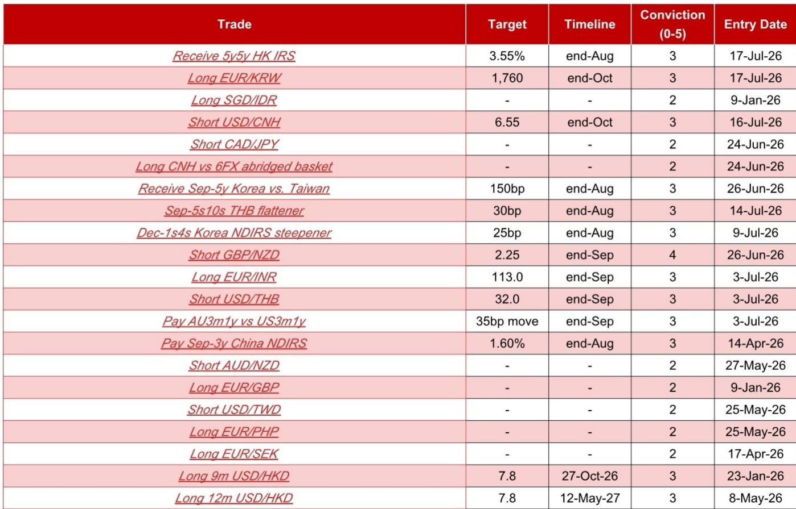
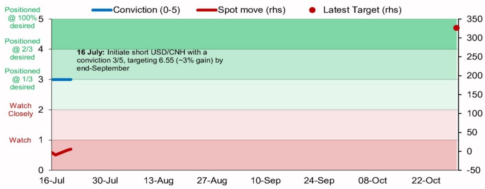

# NOM：货币市场与相关指标观察

NOM外汇策略团队在7月发布的报告中，将做空美元/离岸人民币（USD/CNH）的提到信心水平从2/5上调至3/5，时间窗口设定在10月底。这一判断的背后，并非单一因素驱动，而是多个独立但相互强化的结构性变化正在同时发生。

报告的核心逻辑建立在四个支柱之上：企业外汇结算行为的变化、人民币中间价设定机制的调整、中国AI技术突破可能带来的资本流入，以及中美关系的阶段性稳定。这些因素共同指向一个方向——人民币正在获得过去几年中少见的系统性支撑。

## 1. 企业外汇结算数据创下近七个月新高

6月中国企业的净外汇贸易结算盈余达到818亿美元，较5月的536亿美元大幅增长，也是2025年12月以来的最高单月值。更值得关注的是，这一数字相当于调整后贸易顺差的92.9%，表明企业正在大规模将外汇收入兑换为人民币。

出口企业的汇款比率从5月的46.2%升至6月的52.5%，进口企业的购汇需求比率也从44.4%升至47.0%。两组数据同时上升，说明这不是单一方向的交易行为，而是整个贸易链条上的企业都在调整其外汇头寸。

> **KC评论：** 报告特别提到，在亚洲交易时段，美元/在岸人民币（USD/CNY）往往呈现仍在调整趋势，这与企业结汇需求的时间分布高度吻合。这一日内模式的变化，可能比月度数据更能反映企业行为的持续性。

## 2. 中间价设定机制出现不对称调整

报告观察到，人民币中间价的调整幅度在美元走强和走弱时呈现明显的不对称性。例如，在2月27日至3月30日期间，美元指数上涨3.0%，但美元/人民币中间价几乎未变（从6.9228微降至6.9223）。而在6月16日至24日，美元指数上涨2.1%，中间价仅上升13个基点。

自2026年6月以来，中间价下调时的日均幅度为33个基点（共19个交易日），而上调时的日均幅度仅为21个基点（共17个交易日）。这种不对称性表明，当局在管理汇率预期时，更倾向于抑制贬值不确定性而非升值不确定性。

中间价与实际模型预测之间的正偏差也在收窄。6月18日以来，平均正偏差为196个基点，远低于6月1日至17日期间的437个基点。报告认为，这一趋势在未来几个月可能持续，原因包括中国外部部门前景强劲、企业对人民币的信心改善，以及美元中期走弱的可能性。

## 3. Kimi K3发布与AI技术差距缩小可能触发资本流入

7月16日，月之暗面（Moonshot AI）发布了Kimi K3大语言模型，其性能表现领先于多个美国先进模型。虽然这一消息最初引发了全球科技股的抛售，但随后中国国有产品、五大保险公司和国有资产管理公司集体表态支持市场，特别是科技板块。

报告将这一事件与2025年1月DeepSeek-R1发布后的市场反应进行对比。DeepSeek-R1发布后，跟踪中国公司的ETF在2月和3月分别录得44亿美元和25亿美元的净流入，而此前三个月的月均净流出为29亿美元。虽然当前7月的数据显示净流出21亿美元，但报告认为，随着中国前沿AI模型的持续突破、即将到来的科技IPO（如智谱AI的GLM-5.2和长鑫存储的IPO），以及国家层面的支持，未来几个月可能吸引外资流入中国市场。

## 4. 中美关系阶段性稳定与人民币国际化新工具

尽管7月16日特朗普曾就2020年大选问题指责中国，但随后美国国务卿鲁比奥确认中国国家主席9月访美的计划仍在推进，美国贸易代表格里尔也表示，9月24日左右的特朗普-习近平峰会“首要任务”是维持稳定的中美关系。这些表态在一定程度上缓解了市场对双边关系出现变化的担忧。

在制度层面，中国人民银行在6月17日的陆家嘴论坛上宣布推出“境外机构人民币回购便利工具”（FIMA RMB Repo），该工具模仿美联储的FIMA回购便利，为外国央行和官方机构提供人民币流动性支持。报告认为，这是人民币作为贸易、资金和储备货币被更广泛接受的重要一步。

基于四种汇率估值模型的平均值，人民币目前仍被低估9.7%，经生产率调整后的实际有效汇率被低估20.2%。这一估值缺口本身也为人民币升值提供了空间。

For informational purposes only. Portions may be generated,translated,summarized,or edited with AI assistance based on source materials and may contain omissions or errors. Please verify independently. This is not investment,legal,tax,accounting,or other professional advice.

For informational purposes only. Portions may be generated,translated,summarized,or edited with AI assistance based on source materials and may contain omissions or errors. Please verify independently. This is not investment,legal,tax,accounting,or other professional advice.

