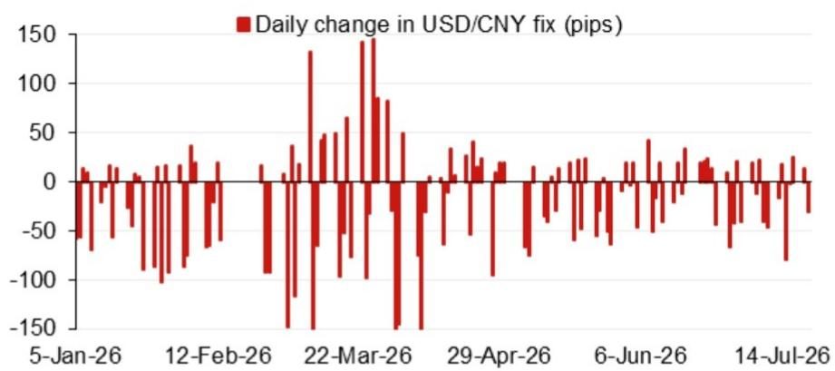
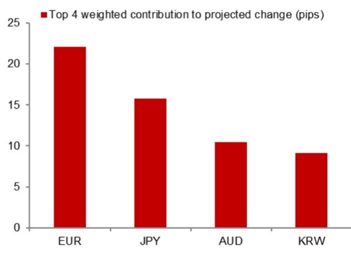

# NOM：7月某日中间价模型预测6.7760

NOM亚洲外汇策略团队在最新一期USD/CNY中间价预测报告中，给出了一个值得关注的数字：在不含逆周期因子的模型下，7月某日中间价预测值为6.7760，较前一日实际中间价低157个基点。这一偏差的方向和幅度，透露出当前中间价定价机制中市场因素与政策引导之间的张力。

报告由Craig Chan、Wee Choon Teo、Vicky Chen和Manthan Shingala共同署名，属于NOM常规的亚洲外汇日度跟踪产品。其核心不是给出方向性交易建议，而是通过一个可复现的量化框架，帮助读者理解每日中间价的形成逻辑和偏离程度。

## 1. 模型预测与实际中间价存在系统性偏差

报告的核心工具是一个基于隔夜市场变动的量化模型。该模型将前一日收盘价、一篮子货币隔夜走势、以及美元指数变动等因子加权，推算出次日中间价的“无干预”基准。7月某日的模型输出为6.7760，而前一交易日实际中间价为6.7917，两者相差157个基点。这意味着，如果完全按照市场定价，中间价应当明显走强。

但报告同时给出了另一个数字：加入逆周期因子调整后的模型预测为6.7844，与实际中间价的差距缩小至73个基点。这个差值可以理解为政策层对中间价节奏的主动管理幅度。

> **KC评论：** 157个基点的偏离在日度预测中不算小。读者可以关注这个偏离是否会持续扩大或收窄，它往往是市场情绪与政策意图之间张力的量化体现。

## 2. 隔夜贡献拆解指向美元和一篮子货币的双重驱动

报告附有一张隔夜贡献拆解图，列出了对模型预测变动贡献最大的四个因子。虽然具体数值未在文本中列出，但这一拆解框架本身提供了观察中间价变动的分析路径：每个交易日的中间价变动，都可以被分解为美元指数变动、欧元/日元等主要货币对变动、以及前一日收盘价偏离等独立来源。

这种拆解的价值在于，它让读者能够区分“中间价变动是因为美元在动”还是“因为人民币自身在动”。如果美元指数走弱但中间价并未相应走强，那么逆周期因子可能正在发挥作用。

## 3. 模型误差的历史分布提供了校准参考

报告还展示了过去一段时间模型预测与实际中间价之间的误差序列。这一数据可以帮助读者判断当前偏离是否处于历史正常范围。如果误差突然放大且持续，可能意味着定价机制发生了结构性变化，或者市场出现了模型未能捕捉的新因素。

对于关注人民币汇率的中期观察者而言，这一误差序列比单日预测值更有参考意义。它回答了一个更根本的问题：模型在什么情况下会失效，以及失效的模式是否有规律可循。

## 4. 未来事件日历提供了政策观察窗口

报告末尾列出了一个未来数月的事件日历，包括7月底的会议、8月中旬的央行货币政策报告、9月下旬的央行货币政策委员会会议，以及10月初的国庆长假。这些事件节点构成了中间价定价可能发生变化的政策窗口。

其中，9月下旬的央行货币政策委员会会议尤其值得关注。如果在此之前中间价持续偏离模型预测，会议前后的政策信号可能为后续定价框架的调整提供线索。

NOM这份报告的价值不在于给出一个具体的中间价预测数字，而在于提供了一个可复用的分析框架：如何通过模型预测与实际值的比较，识别政策干预的痕迹，并据此调整对汇率走势的判断。对于需要跟踪人民币定价逻辑的机构读者，这个框架比单日预测更有长期参考意义。

For informational purposes only. Portions may be generated,translated,summarized,or edited with AI assistance based on source materials and may contain omissions or errors. Please verify independently. This is not investment,legal,tax,accounting,or other professional advice.

For informational purposes only. Portions may be generated,translated,summarized,or edited with AI assistance based on source materials and may contain omissions or errors. Please verify independently. This is not investment,legal,tax,accounting,or other professional advice.

