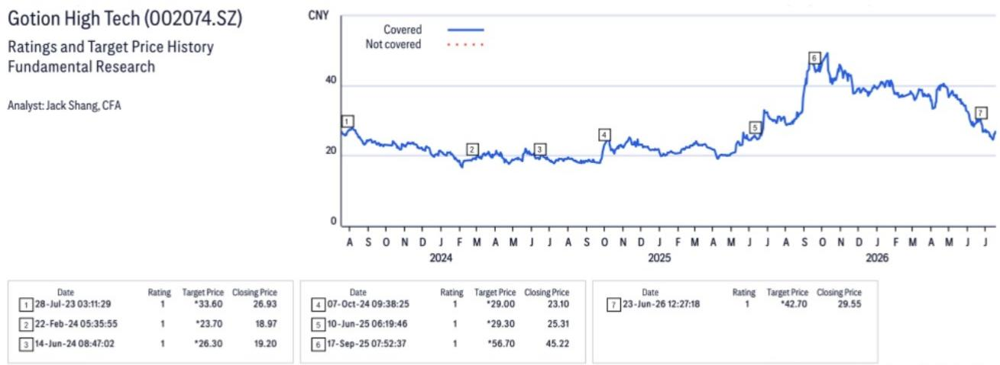

# 国轩高科

# 中国储能与电池产业链调研要点

## 调研观点

我们于7月15日举办了2026年中国储能与电池产业链调研活动，并与国轩高科读者关系总监刘升华先生及读者关系部副总裁刘钦峰先生进行了交流。2026年上半年电池出货量约65GWh，其中储能电池产能利用率达到满产，动力电池产能利用率约70%。全年电池出货量指引维持在150GWh，其中包括约45GWh储能电池。主要调研要点如下。

**电池出货** – 2026年上半年电池出货量约65GWh，其中储能电池产能利用率达到满产，动力电池产能利用率约70%。全年电池出货量指引维持在150GWh，其中包括约45GWh储能电池。公司预计2026年下半年电池产量环比将有所提升，主要由于出口增值税退税政策年底截止。

**电池产能** – 截至2025年底，有效电池产能约150GWh，其中包括约30GWh储能电池产能。公司已规划新增40GWh储能电池产能，预计于2026年内投产，主要产能贡献将在2027年。管理层预计2026年底有效产能将达到260GWh，其中包括年内新增的40GWh储能电池产能和70GWh动力电池产能。

**海外产能** – 摩洛哥电池项目规划产能20GWh，预计于2026年投产。斯洛伐克电池项目规划产能20GWh及美国电池项目规划产能15GWh，投产时间将晚于摩洛哥项目，具体取决于市场需求。

**资本开支** – 国内电池产能的单位资本开支约为每GWh 1亿元人民币，海外产能的资本开支将更高。

**成本传导** – 2026年上半年，受原材料价格上涨影响，毛利率面临一定压力。截至2026年上半年末，公司已成功将上涨的成本传导至大部分客户，管理层预计2026年下半年利润率将有所改善。

<table><tr><td>价格（2026年7月20日15:00）</td><td>人民币27.000元</td></tr><tr><td>目标价</td><td>人民币42.700元</td></tr><tr><td>预期股价回报</td><td>58.1%</td></tr><tr><td>预期股息率</td><td>0.4%</td></tr><tr><td>预期总回报</td><td>58.5%</td></tr><tr><td>市值</td><td>人民币48,998百万元美元7,238百万元</td></tr></table>

Jack Shang, CFA $^{AC}$ +852-2501-2441
jack.shang@citi.com

Anna Wang
+852-2501-2739
anna.d.wang@citi.com

Jimmy Feng
jimmy.feng@citi.com

Cynthia Wu
cynthia.d.wu@citi.com

详见附录A-1分析师认证、重要披露及研究分析师关联信息

## 国轩高科

## 估值

我们基于EV/EBITDA估值方法，给予国轩高科每股42.70元的目标价，该方法可消除资本结构不确定性带来的影响。采用15.1倍2026年预期EV/EBITDA，较2012年以来历史均值低0.5个标准差（考虑到EBITDA增速相较于历史高增长水平有所放缓），我们得出公允价值为每股42.70元。我们的目标价对应39.0倍2026年预期市盈率和23.4倍2027年预期市盈率。

## 风险因素

可能导致国轩高科股价持续低于我们目标价的下行风险包括：1）产能扩张进度慢于预期；2）产品利润率低于预期；3）新能源汽车需求弱于预期。

以上评级/目标价变动反映美国东部时间

如有视觉障碍并希望就本文件中的图表细节与Citi代表沟通，请致电美国1-888-500-5008（TTY：711），美国境外请拨打+1-210-677-3788

## 附录A-1

## 分析师认证

主要负责本研究报告编制和内容的研究分析师，要么在作者栏中以"AC"标识，要么以粗体列在与该分析师相关的内容旁。如果作者栏中指定了多位AC分析师，每位分析师仅就其负责的整个研究报告部分进行认证，但以下情况除外：(a) 归属于另一位以粗体标识的AC认证分析师的内容，以及(b) 仅针对特定发行人的观点，该观点归属于下方该发行人价格图表或评级历史表中标识的另一位AC认证分析师。每位分析师就其负责的报告部分认证：(1) 其中表达的观点准确反映了其个人对每个提及的发行人和证券的看法，并且是以独立方式编制的，包括对Citi全球市场公司及其关联方；以及(2) 研究分析师的薪酬的任何部分从未、现在或将来直接或间接与该分析师在本报告中表达的具体建议或观点相关。

## 重要披露

\*表示变更

  
CW - 催化剂观察，STV - 短期观点  
以上评级/目标价变动反映美国东部时间

Citi全球市场公司或其关联方在过去12个月内因非投资银行服务从国轩高科获得报酬。

Citi全球市场公司或其关联方目前或过去12个月内拥有以下客户，且提供的服务为非投资银行、非证券相关：国轩高科。

分析师薪酬由Citi管理层和Citi高级管理层确定，并基于旨在惠及Citi全球市场公司及其关联方（以下简称"公司"）读者客户的活动和服务。薪酬不与特定交易或建议挂钩。与所有公司员工一样，分析师的薪酬受公司整体盈利能力影响，包括投资银行、销售和交易以及自营交易收入。股权研究分析师薪酬的一个因素是安排机构客户与所覆盖公司管理团队之间的企业访问活动。通常，当分析师对公司持积极看法时，公司管理层更有可能参与。

对于本产品中推荐的非做市商金融工具，公司是该等金融工具（及其任何基础工具）的流动性提供者，并可能在与该等工具相关的交易中担任自营方。公司是定期发行与产品中可能推荐的证券挂钩的可交易金融工具的机构。公司定期交易产品中讨论的发行人证券。公司可能以与本产品不一致的方式进行证券交易，并且对于本产品所涵盖的证券，将按自营基础向客户买入或卖出。

Citi股票评级分布

<table><tr><td></td><td colspan="3">12个月评级</td><td colspan="3">催化剂观察</td></tr><tr><td>数据截至2026年7月1日</td><td>买入</td><td>持有</td><td>卖出</td><td>买入</td><td>持有</td><td>卖出</td></tr><tr><td>Citi全球基础覆盖（中性=持有）</td><td>61%</td><td>32%</td><td>7%</td><td>36%</td><td>48%</td><td>16%</td></tr><tr><td>各评级类别中为投资银行客户的百分比</td><td>38%</td><td>42%</td><td>27%</td><td>42%</td><td>37%</td><td>36%</td></tr></table>

## Citi基础研究投资评级指南：

Citi股票建议包括投资评级和可选的风险评级以标识高风险股票。风险评级同时考虑价格波动性和基础标准。股票将没有风险评级或分配高风险评级。

投资评级：Citi投资评级为买入、中性及卖出。我们的评级基于分析师对预期总回报（"ETR"）和风险的预期。ETR是未来12个月内预测股价上涨（或下跌）加上股息回报表现的总和。目标价基于12个月时间框架。投资评级定义如下：买入（1）ETR为15%或以上，或高风险股票为25%或以上；卖出（3）为负ETR。任何未分配买入或卖出的覆盖股票均为中性（2）。对于评级为中性的股票，如果分析师认为缺乏足够的估值驱动因素和/或投资催化剂来形成正面或负面的投资观点，经Citi管理层批准，可以选择不分配目标价，从而不推导ETR。Citi可能因监管和/或内部政策原因暂停其评级和目标价，并分配"评级暂停"状态。Citi也可能因其他特殊情况（例如缺乏对分析师论点至关重要的信息、公司证券交易暂停）影响公司和/或公司证券交易而暂停其评级和目标价，并分配"审核中"状态。在这两种情况下，评级和目标价将在评级历史价格图表中分别显示为"—"和"-"。在2022年4月11日之前，Citi将两种情况均分配"审核中"状态，在2020年11月11日之前仅在特殊情况下使用。在实际可行的情况下，分析师将发布重新建立评级和投资论点的说明。投资评级由覆盖启动、投资和/或风险评级变更或目标价变更时上述范围确定（受有限的管理裁量权约束）。有时，由于市场价格波动和/或其他短期波动或交易模式，预期总回报可能超出这些范围。此类临时偏差将被允许，但将接受研究管理部门的审查。您买卖证券的决定应基于您个人的投资目标，并且应在评估股票的预期表现和风险后做出。

## 催化剂观察/短期观点（"STV"）评级披露：

催化剂观察和STV上行/下行判断：Citi还可能包括催化剂观察或STV上行或下行判断，以表明分析师预期股价将在指定的30天或90天期间内相对上涨（下跌），以应对影响公司或市场的一个或多个特定近期催化剂或事件。当分析师对股价将受到影响的信心较高时，将发布催化剂观察；当信心水平中等时，将发布STV。催化剂观察或STV上行/下行判断将在指定的30/90天期间结束时自动到期。如果股价表现（按市场收盘价计算）超过判断方向的15%，催化剂观察也将自动移除（除非分析师推翻）。分析师也可以在指定期间结束前在已发布的研究说明中移除催化剂观察或STV判断。催化剂观察/STV上行或下行判断可能不同于且不影响股票的基础股权评级，后者反映较长期的总相对回报预期。就FINRA评级分布披露规则而言，催化剂观察/STV上行判断对应买入建议，催化剂观察/STV下行判断对应卖出建议。任何未分配催化剂观察上行、催化剂观察下行、STV上行或STV下行判断的股票被视为催化剂观察/STV无观点。就FINRA评级分布披露规则而言，我们在催化剂观察/STV上行/下行评级系统的评级分布表中将催化剂观察/STV无观点对应为持有。然而，我们重申我们不认为无观点是一种建议。对于所有催化剂观察/STV上行/下行判断，存在催化剂和相关股价变动可能不会如预期实现的风险。

## 研究分析师关联信息/非美国研究分析师披露

本报告作者的雇佣法律实体如下所列（其监管机构进一步列明）。编制本报告的非美国研究分析师（即除被标识为Citi全球市场公司雇员以外的所有下述研究分析师）未在FINRA注册/合格为研究分析师。此类研究分析师可能不是成员组织的关联人士（但受雇于成员组织的关联方），因此可能不受FINRA规则2241关于与主题公司沟通、公开露面以及研究分析师账户持有证券交易的限制。

Citi环球金融亚洲有限公司

Anna Wang; Jimmy Feng, CFA; Jack Shang, CFA; Cynthia Wu

## 其他披露

建议中提及的任何工具的价格均为前一交易日主要市场收盘价，除非另有说明。

本研究报告中所作任何建议的完成和首次传播时间均为产品顶部显示的美国东部日期时间。如果产品引用了其他分析师的看法，请参阅价格图表或评级历史表以了解该看法的完成和首次传播日期/时间。

关于同一金融工具或发行人的建议，如果在过去12个月内已发布，则变更和该先前建议的日期均已标明。对于基础覆盖，请参阅本披露附录中的价格图表或评级变更历史，或访问https://www.citivelocity.com/cvr/eppublic/citi\_research\_disclosures的发行人披露摘要。

Citi已实施相关政策，用于识别、考虑和管理因发布或分发投资研究而产生的潜在利益冲突。这些政策的说明可在https://www.citivelocity.com/cvr/eppublic/citi\_research\_disclosures找到。

过去12个月每个季度末，所有Citi建议中相当于"买入"、"持有"、"卖出"的比例（以及其中在过去12个月内获得Citi投资公司服务的百分比，显示在括号中）如下：2026年第一季度买入33%（63%），持有44%（52%），卖出23%（46%），相对价值0.5%（89%）；2025年第四季度买入33%（63%），持有44%（50%），卖出23%（46%），相对价值0.4%（91%）；2025年第三季度买入33%（61%），持有44%（52%），卖出23%（50%），相对价值0.4%（80%）；2025年第二季度买入33%（63%），持有44%（51%），卖出23%（49%），相对价值0.4%（86%）。为披露除股权以外的建议（其定义可在相应披露部分找到），"买入"表示正向方向性交易想法；"卖出"表示负向方向性交易想法；"相对价值"表示任何没有明确投资策略方向的交易想法。

欧洲法规要求在引用证券过往表现时提供5年价格历史。CitiVelocity的图表工具（https://www.citivelocity.com/cv2/#go/CHARTING\_3\_Equities）提供创建可定制价格图表的功能，包括五年选项。该工具可在CitiVelocity（https://www.citivelocity.com/）任何资产类别菜单下的数据与分析部分找到。如需更多信息，请联系CitiVelocity支持（https://www.citivelocity.com/cv2/go/CLIENT\_SUPPORT）。除非另有说明，所有参考价格来源为DataCentral，该数据库从LSEG数据与分析获取价格信息。过往表现并非未来结果的保证或可靠指标。预测并非未来表现的保证或可靠指标。

读者在投资前应始终仔细考虑ETF的投资目标、风险、费用和开支。适用的ETF招股说明书和关键读者信息文件（如适用）应包含该ETF的此等信息和其他信息。在投资前仔细阅读任何此类招股说明书非常重要。客户可从适用的分销商或授权参与者、ETF上市交易所和/或适用的ETF发行人网站获取ETF的招股说明书和关键读者信息文件。研究价值和任何应计收入可能下跌或上涨。任何过往表现、预测或预报均不预示未来或可能的表现。本文件包含的任何ETF信息仅供说明之用，不应被视为出售或招揽购买任何ETF单位的要约，无论是明示还是暗示。所表达的意见为作者的意见，不一定反映ETF发行人、其任何代理人或其关联方的观点。Citi全球市场印度私人有限公司和/或其关联方可能不时实际或实益拥有主题发行人债务证券的1%或以上。

请注意，根据经修订的第13959号行政命令（"该命令"），美国人士被禁止投资于美国政府确定为该命令主题的任何公司的证券。本研究不旨在以任何可能导致违反该命令的方式使用或依赖。鼓励读者依赖自己的法律顾问就遵守该命令以及美国财政部外国资产控制办公室管理和执行的其他经济制裁计划提供建议。

本通讯面向符合以色列《投资咨询、投资营销和投资组合管理法》（1995年）（"咨询法"）定义的"合格客户"的人士。在以色列境内，本通讯不面向零售客户，Citi不会向零售客户或非合格客户提供此类产品或交易。演讲者未获得以色列证券管理局（"ISA"）的投资顾问或投资营销人员许可，本通讯不构成投资或营销建议。本文所含信息可能涉及ISA未监管的事项。本通讯主题的任何证券不得向任何以色列人士发售或出售，除非根据《以色列证券法》（1968年）的证券发售豁免及其下的公开发售规则。

Citi广泛并同时通过公司专有的电子分发平台（例如Citi Velocity和各种全球财富平台）向公司的机构和零售客户分发其研究内容。为方便起见，某些（但非全部）研究内容可能通过第三方聚合商分发。客户可能通过电子邮件酌情接收已发布的研究报告，且仅在此类研究内容已广泛分发之后。某些研究仅提供给机构读者以满足监管要求。Citi分析师向客户提供的服务水平和类型可能因多种因素而异，例如客户对接收分析师通讯的频率和方式的个人偏好、客户的风险状况和投资焦点及视角（例如市场范围、行业特定、长期、短期等）、与公司的整体客户关系的规模和范围以及法律和监管限制。

根据Comissão de Valores Mobiliários Resolução 20和ASIC Regulatory Guide 264，Citi需要披露Citi关联公司或业务是否与主题公司有商业关系。考虑到Citi在100多个国家经营多项业务，Citi很可能与主题公司有商业关系。

公司推荐、要约或出售的证券：(i) 不受联邦存款保险公司保险；(ii) 不是任何受保存款机构（包括Citi）的存款或其他义务；以及(iii) 受投资风险影响，包括可能损失本金投资金额。本产品仅供信息参考，不构成购买或出售证券的要约或招揽。任何购买本产品中提及的证券的决定必须考虑该证券的现有公开信息或任何注册招股说明书。尽管信息来自并基于公司认为可靠的来源，但我们不保证其准确性，且信息可能不完整和经过压缩。但请注意，公司已采取一切合理措施确定本产品重要披露部分中披露的准确性和完整性。公司的研究部门已获得本产品中提及的主题公司的协助，包括但不限于与主题公司管理层的讨论。公司政策禁止研究分析师向主题公司发送研究草稿。但应假定本产品的作者已与主题公司进行讨论，以确保发布前的事实准确性。关于ESG（环境、社会、治理）因素的陈述和观点通常基于受影响公司的公开声明或其他公开新闻，作者可能未独立核实。ESG因素是读者在做出投资决策时可能考虑的一个因素。所有意见、预测和估计构成作者截至本产品日期的判断，这些以及本产品中包含的任何其他信息如有变更，恕不另行通知。金融工具的价格和可用性也可能随时变更，恕不另行通知。尽管公司内部其他部门向本产品中讨论的公司提供建议，但在此类角色中获得的信息不用于本产品的编制。尽管Citi未设定预定的发布频率，但如果本产品是基础股权或信用研究报告，Citi有意提供对覆盖发行人的研究覆盖，包括响应影响发行人的新闻。对于非基础研究报告，Citi可能不提供对报告中包含的观点、建议和事实的定期更新。尽管Citi保持对发行人的覆盖、提出建议或讨论发行人，Citi可能因法律或政策原因定期被限制引用某些发行人。如果已发布的交易想法组件受到限制，该交易想法将从本产品中包含的任何开放交易想法列表中移除。限制解除后，如果分析师继续支持该交易想法，它将重新列入开放交易想法列表，否则将正式关闭。Citi可能向不同类别的客户提供不同的研究产品和服务（例如，基于长期或短期投资视野），这可能导致与替代研究产品中的建议相矛盾的结论或建议，可能影响证券价格，前提是每个产品与其各自的评级系统一致。

投资非美国证券，包括美国存托凭证，可能涉及某些风险。非美国发行人的证券可能未在美国证券交易委员会注册，也不受其报告要求的约束。关于外国证券的信息可能有限。外国公司通常不受与美国统一的审计和报告标准、实践和要求的约束。某些外国公司的证券可能流动性较低，其价格可能比可比美国公司的证券更波动。此外，汇率变动可能对外国股票投资的价值及其对美国读者的相应股息支付产生不利影响。美国存托凭证读者的净股息是使用预扣税率惯例估算的，被认为是准确的，但鼓励读者咨询其税务顾问以获取准确的股息计算。从公司收到本产品的读者可能在某些州或其他司法管辖区被禁止从公司购买本产品中提及的证券。请向您的财务顾问咨询更多详情。Citi全球市场公司负责美国境内的本产品。美国读者因本产品中包含的信息而下的任何订单只能通过Citi全球市场公司下达。

负责本产品制作的Citi法律实体是第一位署名作者的雇佣实体。

本产品在澳大利亚通过Citi全球市场澳大利亚有限公司提供。（ABN 64 003 114 832和AFSL No. 240992），ASX集团的参与者，受澳大利亚证券和投资委员会监管。Citi中心，2 Park Street, Sydney, NSW 2000。Citi全球市场澳大利亚有限公司不是《1959年银行法》下的授权存款机构，也不受澳大利亚审慎监管局监管。

本产品在巴西由Citi全球市场巴西-CCTVM SA提供，受CVM-Comissão de Valores Mobiliários（"CVM"）、BACEN-巴西中央银行、APIMEC-Associação dos Analistas e Profissionais de Investimento do Mercado de Capitais和ANBIMA-Associação Brasileira das Entidades dos Mercados Financeiro e de Capitais监管。Av. Paulista, 1111 - 14º andar(parte) - CEP: 01311920 - São Paulo - SP。

本产品在智利通过Banchile Corredores de Bolsa S.A.提供，该公司是Citi公司的间接子公司，受Comisión Para El Mercado Financiero监管。Enrique Foster Sur, 20, piso 6, Las Condes, Santiago, Chile。

哥伦比亚共和国读者披露：本通讯或信息不构成第2555号法令（2010年）第2.40.1.1.2条或修改、替代或补充该条款的法规意义上的专业研究交流。编制和分发本文所述的研究报告和一般通讯不需要成为哥伦比亚金融监管局监管的实体。

本产品在德国由Citi全球市场欧洲股份公司（"CGME"）提供，该公司受欧洲中央银行和德国联邦金融监管局（Bundesanstalt für Finanzdienstleistungsaufsicht BaFin）监管。Börsenplatz 9, 60313 Frankfurt am Main, Germany。

除非另有说明，如果编制本报告的分析师位于香港且报告涉及"证券"（定义见香港法例第571章《证券及期货条例》），则该报告由Citi环球金融亚洲有限公司在香港发布。Citi环球金融亚洲有限公司受香港证券及期货事务监察委员会监管。如果报告由非香港分析师编制，请注意该分析师（及其雇佣或认可的法律实体）未在香港获得许可/注册，且他们不声称如此。有关分析师雇佣实体的详细信息，请参阅"研究分析师关联信息/非美国研究分析师披露"部分。

本产品在印度由Citi全球市场印度私人有限公司（CGM）提供，该公司作为研究分析师受印度证券交易委员会（SEBI）监管（SEBI注册号INH000000438）。CGM还积极参与印度的商人银行业务（SEBI注册号INM000010718）和股票经纪业务（SEBI注册号INZ000263033），并已就此向SEBI注册。SEBI授予的注册、孟买证券交易所（BSE）的上市以及国家证券市场研究所（NISM）的认证绝不保证中介机构的业绩或向读者提供任何回报保证。CGM的注册办公室位于1202, 12th Floor, First International Financial Centre (FIFC), G Block, Bandra Kurla Complex, Bandra East, Mumbai – 400098，注册电话：+91 22 61759999。Citi维持健全的政策、程序、控制和培训，以确保持续遵守所有适用的规则和法规。本文包含的所有建议均由合格的研究分析师做出。CGM的公司识别号为U99999MH2000PTC126657，其合规官[Vishal Bohra]的联系方式为：电话：+91-022-61759994，传真：+91-022-61759851，电子邮件：cgmcompliance@citi.com。关于研究分析师的读者章程、合规审计报告和投诉信息可在https://www.citivelocity.com/cvr/eppublic/citi\_research\_disclosures找到。申诉官[Niraj Mody]的联系方式为：电话：+91-22-42775002，电子邮件：EMEA.CR.Complaints@citi.com。证券市场投资受市场风险影响。在投资前仔细阅读所有相关文件。SEBI规定的客户条款和条件可在找到。

本产品在印度尼西亚通过PTCiti证券印度尼西亚提供。Citibank Tower 10/F, Pacific Century Place, SCBD lot 10, Jl. Jend Sudirman Kav 52-53, Jakarta 12190, Indonesia。本产品及其任何副本不得在印度尼西亚或向任何印度尼西亚公民（无论其居住地）或印度尼西亚居民分发，除非符合适用的资本市场法律法规。本产品不是印度尼西亚的证券要约。本产品中提及的证券尚未根据相关资本市场法律法规在资本市场和金融服务局（OJK）注册，不得在印度尼西亚共和国境内或向印度尼西亚公民公开发售或在构成印度尼西亚资本市场法律法规意义上的要约的情况下发售或出售。

本产品在日本由Citi全球市场日本有限公司（"CGMJ"）提供，该公司受金融厅、证券交易监督委员会、日本证券业协会、东京证券交易所和大阪证券交易所监管。Otemachi Park Building, 1-1-1 Otemachi, Chiyoda-ku, Tokyo 100-8132 Japan。如果在CGMJ研究报告中发现错误，修订版将发布在公司的Citi Velocity网站上。如果您对Citi Velocity有疑问，请致电(81 3) 6270-3019寻求帮助。

本产品在沙特阿拉伯王国根据沙特法律通过Citi沙特阿拉伯提供，该公司受资本市场管理局（CMA）监管，CMA许可证号(17184-31)。2239 Al Urubah Rd – Al Olaya Dist. Unit No. 18, Riyadh 12214 – 9597, Kingdom Of Saudi Arabia。

本产品在韩国由Citi全球市场韩国证券有限公司（CGMK）提供，该公司受金融委员会、金融监督院和韩国金融投资协会（KOFIA）监管。CGMK的地址为Citibank Center, 50 Saemunan-ro, Jongno-gu, Seoul 03184, Korea。KOFIA在其网站上提供研究分析师的注册信息。如果您希望查找CGMK研究分析师的KOFIA注册信息，请访问以下网站：http://dis.kofia.or.kr/websquare/index.jsp?w2xPath=/wq/fundMgr/DISFundMgrAnalystList.xml&divisionId=MDISO3002002000000&serviceId=SDISO3002002000。本产品在韩国由Citi韩国有限公司提供，该公司受金融委员会和金融监督院监管。地址为Citibank Center, 50 Saemunan-ro, Jongno-gu, Seoul 03184, Korea。本研究报告仅旨在提供给韩国《金融投资服务和资本市场法》及其施行令中定义的"专业读者"。

本产品在马来西亚由Citi全球市场马来西亚私人有限公司（注册号199801004692 (460819-D)）（"CGMM"）向其客户提供，CGMM就其内容对CGMM客户负责。CGMM受马来西亚证券委员会监管。如有任何关于本产品的问题，请联系马来西亚吉隆坡50450 Jalan Ampang 165号Menara Citibank 43层的CGMM。

本产品在墨西哥由Citi墨西哥证券交易所股份有限公司（Citi México Casa de Bolsa, S.A. de C.V.），Grupo Financiero Citi México提供，该公司是Citi公司的全资子公司，受国家银行和证券委员会监管。Prolongación Reforma 1196, 24 floor, Colonia Santa Fe, Alcaldía Cuajimalpa de Morelos, C.P. 05348, Ciudad de México。

本产品在波兰由Bank Handlowy w Warszawie S.A.的独立部门Biuro Maklerskie Banku Handlowego（DMBH）提供，Bank Handlowy w Warszawie S.A.是Citi公司的子公司，受波兰金融监管局监管。Biuro Maklerskie Banku Handlowego (DMBH), ul.Senatorska 16, 00-923 Warszawa。

本产品在新加坡通过Citi全球市场新加坡私人有限公司（"CGMSPL"）提供，该公司持有资本市场服务和豁免财务顾问牌照，受新加坡金融管理局监管。如有任何关于本文件分析的问题，请联系新加坡018960 Asia Square Tower 1 21楼8 Marina View的CGMSPL。本产品面向《2001年证券和期货法》定义的认可读者、专家读者和机构读者。对于Citi私人银行，本产品在新加坡由Citi私人银行通过Citi新加坡分行提供。Citi新加坡分行是新加坡的持牌银行，受新加坡金融管理局监管。如果您对本文件有任何疑问或问题，请联系Citi新加坡分行的私人银行家。本产品面向《2001年证券和期货法》定义的认可读者、专家读者和机构读者。对于Citi新加坡有限公司（"CSL"），本产品在新加坡由CSL向选定的Citi贵宾/Citi贵宾私人客户分发。CSL不提供关于本产品实质内容或编制的独立研究或分析。如果您对本文件有任何疑问或问题，请联系CSL的Citi贵宾/Citi贵宾私人客户关系经理。本产品面向《证券和期货法》（第289章）定义的认可读者。

Citi全球市场（私人）有限公司在南非共和国注册成立（公司注册号2000/025866/07），其注册办公室位于145 West Street, Sandton, 2196, Saxonwold。Citi全球市场（私人）有限公司受约翰内斯堡证券交易所、南非储备银行和金融服务委员会监管。本文所述的投资和服务不适用于南非的私人客户。

本产品在中华民国（台湾）通过Citi全球市场台湾证券股份有限公司（"CGMTS"）提供，地址为台北市110松智路1号14楼、15楼及16楼，受中华民国（台湾）金融监督管理委员会证券期货局监管。未经CGMTS书面授权，中华民国（台湾）的新闻媒体或任何第三方不得复制或引用本产品的任何部分。根据中华民国（台湾）适用的法律法规，本产品的接收者不得利用本产品参与任何可能涉及利益冲突的事项。如果本产品涵盖不允许在中华民国（台湾）要约或交易的证券，则本产品及其包含的任何信息均不得被视为在中华民国（台湾）宣传该证券或推荐该证券。本产品仅供信息参考，不构成购买或出售证券或金融产品的要约或招揽。任何购买本产品中提及的证券或金融产品的决定必须考虑该证券或金融产品的现有公开信息或任何注册招股说明书。

本产品在泰国通过Citi证券（泰国）有限公司提供，该公司受泰国证券交易委员会监管。399 Interchange 21 Building, 18th Floor, Sukhumvit Road, Klongtoey Nua, Wattana, Bangkok 10110, Thailand。

土耳其共和国读者披露：本产品在土耳其通过Citi股份公司提供，该公司受资本市场委员会监管。Tekfen Tower, Eski Buyukdere Caddesi # 209 Kat 2B, 23294 Levent, Istanbul, Turkey。根据土耳其资本市场法（第6362号法律），此处所述的投资信息、评论和建议不属于投资咨询服务的范围。此处所述的评论和建议依赖于提供这些评论和建议的个人的个人意见。这些意见可能不适合您的财务状况、风险和回报偏好。因此，仅依赖此处所述信息做出投资决定可能不会产生符合您期望的结果。此外，Citi是Citi全球市场公司（"公司"）的一个部门，该公司确实并寻求与本研究报告所涵盖的证券的公司和/或交易进行业务往来。因此，读者应注意公司可能存在可能影响本报告客观性的利益冲突，但读者也应注意公司已建立组织和行政安排以管理此类性质的潜在利益冲突。

在阿联酋，这些材料（"材料"）由Citi全球市场有限公司DIFC分行（"CGML"）传达，该公司在迪拜国际金融中心（"DIFC"）注册，并受迪拜金融服务管理局（"DFSA"，许可证号CL0221）许可和监管，仅面向DFSA法规中定义的专业客户和市场对手方，不应依赖或分发给零售客户。材料涉及的金融产品和/或服务仅向专业客户和市场对手方提供。Citi全球市场有限公司DIFC分行的注册地址为Level 3, Gate District Building 02, Dubai International Financial Centre，联系电话+971 4 509 97 90。

本产品在英国由Citi全球市场有限公司提供，该公司受审慎监管局（"PRA"）授权，并受金融行为监管局（"FCA"）和PRA监管。本材料可能涉及英国境外人士的投资或服务，或PRA未授权且FCA和PRA未监管的其他事项，如需了解本材料中可能存在的此类情况的更多详细信息，可应要求提供。Citi中心，Canada Square, Canary Wharf, London, E14 5LB。

本产品在美国和加拿大由Citi全球市场公司提供，该公司是FINRA成员并在美国证券交易委员会注册。388 Greenwich Street, New York, NY 10013。

除非另有说明，在欧盟成员国，本产品由Citi全球市场欧洲股份公司（"CGME"）提供，该公司受欧洲中央银行和德国联邦金融监管局（Bundesanstalt für Finanzdienstleistungsaufsicht-BaFin）监管。

本产品不得被解释为在任何不允许提供此类服务的司法管辖区提供投资服务。

根据本产品的性质和内容，其中描述的投资受价格和/或价值波动影响，读者可能收回少于最初投资的金额。某些高波动性投资可能遭受突然和大幅的价值下跌，可能等于或超过投资金额。本产品中引用的CMO（抵押贷款支持债券）的回报表现和平均期限将根据抵押贷款持有人提前偿还CMO基础抵押贷款的实际利率和当前利率的变化而波动。任何政府机构对CMO的支持仅适用于CMO的面值，而不适用于任何溢价支付。本产品中包含的某些投资可能对私人客户产生税务影响，税收水平和基础可能发生变化。如有疑问，读者应寻求税务顾问的建议。本产品不旨在识别特定交易的具体市场或其他风险的性质。本产品中的建议是一般性的，不应被解释为个人建议，因为其编制未考虑任何特定读者的目标、财务状况或需求。因此，读者在根据建议采取行动之前，应考虑建议的适当性，并考虑其目标、财务状况和需求。在获取任何金融产品之前，客户有责任获取该产品的相关发售文件，并在决定是否购买该产品之前考虑该文件。

**卡洞察。** 如果本报告引用卡洞察数据，卡洞察包括从Citi专有信用卡交易子集中选择的数据。此类数据经过严格的安全协议处理，以保持所有客户信息的机密和安全；数据经过高度聚合和匿名化处理，以便在报告作者接收或向外部方分发之前，所有相对少见的客户可识别信息均已从数据中移除。此数据应结合其他经济指标和公开可用信息进行考虑。此外，所选数据仅代表Citi专有信用卡交易的一个子集，由于选择方法或其他限制，不应被视为指示性或预测性Citi或其信用卡业务的过去或未来财务表现。

Citi产品可能从dataCentral获取数据。dataCentral是Citi专有数据库，包括公司的估计、公司报告的数据以及来自LSEG数据与分析的数据。除非另有说明，所有参考价格来源为DataCentral。过往表现并非未来结果的保证或可靠指标。预测并非未来表现的保证或可靠指标。研究报告的打印和可打印版本可能不包括所有信息（例如某些财务摘要信息和可比公司数据），这些信息链接到公司专有电子分发平台上的在线版本。

如果本报告中包含MSCI来源信息，该信息是MS Capital International Inc.（MSCI）的专有财产。未经MSCI事先书面许可，不得复制、重新分发或用于创建任何金融产品，包括任何指数。此信息按"现状"提供。用户承担使用此信息的全部风险。MSCI、其关联方以及任何参与或相关计算或编制此信息的第三方特此明确否认关于此信息的原创性、准确性、完整性、适销性或特定用途适用性的所有保证。在不限制前述规定的情况下，MSCI、其任何关联方或任何参与或相关计算或编制此信息的第三方在任何情况下均不对任何类型的损害承担责任。MSCI、MS Capital International和MSCI指数是MSCI及其关联方的服务标志。如果数据归属于Morningstar，则该数据© 2026 Morningstar, Inc.保留所有权利。该信息：(1) 是Morningstar和/或其内容提供商的专有财产；(2) 不得复制或分发；以及(3) 不保证准确、完整或及时。Morningstar及其内容提供商不对因使用此信息而产生的任何损害或损失负责。

公司对第三方的行为不承担任何责任。本产品可能提供网站的地址或包含超链接。除本产品引用公司网站材料的范围外，公司未审查链接的网站。同样，除本产品引用公司网站材料的范围外，公司不对其中包含的数据和信息承担任何责任，也不作任何陈述或保证。此类地址或超链接（包括公司网站材料的地址或超链接）仅为方便和信息提供，链接网站的内容不以任何方式构成本文件的一部分。通过本产品或公司网站访问此类网站或遵循此类链接的风险由您自行承担，公司不对任何此类引用网站产生或与之相关的任何责任负责。

© 2026Citi全球市场公司。Citi是Citi全球市场公司的一个部门。Citi和Citi及弧形设计是Citi公司及其关联方的商标和服务标志，并在全球使用和注册。保留所有权利。本报告中的研究数据不旨在用于(a)确定一个或多个金融产品或工具的价格或到期应付金额（或估值）和/或(b)衡量或比较金融产品、金融工具组合或集体投资计划的业绩，或定义其资产配置，任何此类
