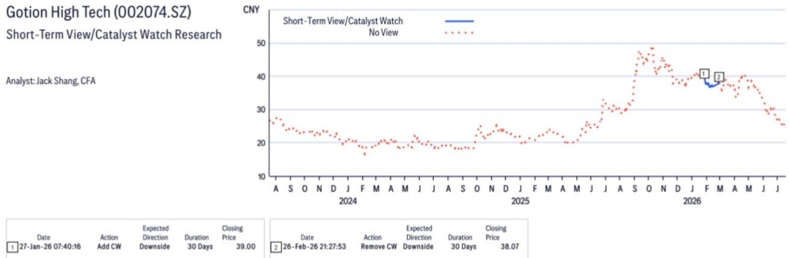
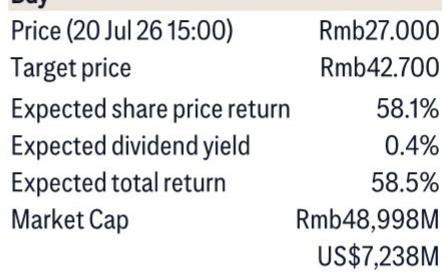

# Gotion's Capacity Utilization Split Reveals a Strategic Pivot: The ESS Business Is Now the Profit Engine, Not the EV Battery Unit

Gotion High Tech shipped approximately 65 GWh of batteries in the first half of 2026. That headline number is less important than the utilization rates behind it: the company ran its energy storage system (ESS) battery lines at full capacity, while its electric vehicle (EV) battery lines operated at only 70%. This divergence is not a temporary production quirk. It signals a structural shift in where Gotion generates its margin, utilizes its capital, and faces its most acute operational risk. For observers tracking the battery ecosystem, the story is no longer about EV battery volume growth. It is about whether Gotion can sustain its ESS advantage before competitors enter the same segment.

The full-year shipment guidance of 150 GWh, including roughly 45 GWh of ESS batteries, implies that second-half output must be significantly stronger than the first. Management explicitly attributes this expected acceleration to the looming year-end cut-off of export VAT rebates, a policy-driven pull-forward that compresses delivery timelines. This creates a high-stakes second half: any supply chain disruption or production bottleneck will not merely delay revenue but could permanently forfeit the tax advantage. The tension between full ESS utilization today and the need to ramp even further against a policy deadline defines the company's near-term execution challenge.

The following analysis unpacks four strategic dimensions of Gotion's current position: the capacity utilization asymmetry, the overseas expansion timeline, the margin recovery mechanism, and the capital efficiency trade-off. Each section builds toward a decision framework for assessing Gotion's risk-reward profile through 2027.

## Full ESS Capacity Utilization Is a Leading Indicator of Margin Recovery, but It Also Exposes Gotion to a Capacity Constraint That Competitors Will Exploit

The contrast between 100% ESS utilization and 70% EV utilization is the single most important data point in the report. It tells a clear story: ESS demand is currently outstripping Gotion's available production capacity, while EV demand is not absorbing what Gotion has built. This is not a demand problem for the company overall—it is a mix problem. Gotion is effectively being forced to choose between two growth trajectories, and the market is making that choice for it.

The strategic implication is twofold. First, Gotion's gross profit margin in the first half was under pressure from rising raw material costs, but management states that it has successfully passed through those cost increases to most ESS clients by the end of the period. That pass-through is easier in a seller's market where utilization is at full capacity. In contrast, passing through cost increases in the EV segment, where utilization sits at 70%, is far more difficult because buyers have alternative suppliers with spare capacity. This dynamic means that ESS margins are likely to improve in the second half, while EV margins remain compressed.

Second, the full utilization of ESS capacity creates a binding constraint. Gotion has planned 40 GWh of additional ESS capacity that will come online during 2026, with volume contributions primarily in 2027. Until that capacity is operational, the company cannot capture additional ESS revenue regardless of demand. This opens a window for competitors—particularly those with existing ESS production lines that are not yet at full utilization—to win contracts that Gotion must decline or delay. The risk is not that Gotion loses market share permanently, but that it loses the pricing power it currently enjoys.

## The Overseas Capacity Build-Out Is a Three-Speed Strategy, and Only the Morocco Project Offers Near-Term De-Risking

Gotion's overseas expansion plan comprises three projects: a 20 GWh facility in Morocco expected to begin operations in 2026, a 20 GWh facility in Slovakia, and a 15 GWh facility in the United States. Management explicitly states that the Slovakia and US projects will be delayed relative to Morocco, with timing dependent on demand. This is not a unified global expansion. It is a sequential, conditional deployment that prioritizes the project with the most favorable regulatory and logistical path.

The Morocco project matters because it is the only overseas capacity that can contribute to Gotion's 2026-2027 revenue. Slovakia and the US are contingent on demand signals that may not materialize on the same timeline. For observers, this means that Gotion's international revenue diversification is effectively a single-project story for the next 12 to 18 months. If Morocco ramps on schedule, it provides a hedge against domestic policy risk and opens access to European original equipment manufacturers. If it delays, the entire overseas thesis collapses into a 2028 story.

The capital expenditure differential adds another layer. Unit capex for domestic capacity is approximately RMB 100 million per GWh. Overseas capex is higher, though the report does not specify the multiple. This means that the overseas build-out consumes more capital per unit of output, compressing return on invested capital during the construction phase. Gotion is effectively making a bet that the higher revenue per GWh from overseas sales—driven by less price competition and potential tariff advantages—will offset the higher upfront cost. That bet is unproven until Morocco reaches stable production.

## Cost Pass-Through Success in ESS Is the Margin Recovery Trigger, but It Depends on Sustained Capacity Constraints

The report states that by the end of the first half of 2026, Gotion had successfully passed through rising raw material costs to most clients, and management expects profit margin improvement in the second half. This is a critical inflection point. The first-half margin pressure was driven by raw material price hikes, not by operational inefficiency or demand weakness. If the pass-through holds, second-half margins should recover toward normalized levels.

However, the pass-through mechanism is fragile. It works only as long as Gotion's ESS capacity remains fully utilized, because that utilization gives the company negotiating leverage. If ESS demand softens or if new capacity from competitors comes online, buyers will have alternatives, and Gotion will lose its pricing power. The 40 GWh of new ESS capacity planned for 2026 does not help here—it will not contribute volume until 2027, which means the pass-through window is essentially the next two to three quarters.

The risk is that raw material prices continue to rise while Gotion's ESS capacity remains fixed. In that scenario, the company can pass through costs only on the portion of output that is already contracted. Any new contracts signed during a period of rising input costs would need to reflect those higher costs, potentially making Gotion less competitive on price. The margin recovery is real, but it is time-limited and conditional on market conditions that Gotion does not control.

## Capital Efficiency Is the Overlooked Variable That Determines Whether Gotion's Growth Creates or Destroys Shareholder Value

Gotion's effective battery capacity at the end of 2025 was approximately 150 GWh. Management expects this to reach 260 GWh by the end of 2026, including 40 GWh of ESS capacity addition and 70 GWh of EV capacity addition. That is a 73% increase in capacity in a single year. The unit capex of RMB 100 million per GWh for domestic capacity implies that the 2026 capacity additions alone require roughly RMB 11 billion in capital expenditure.

This raises a fundamental question: can Gotion generate sufficient returns on this capital to justify the investment? The 70% EV utilization rate suggests that the company already has more EV capacity than it can currently utilize. Adding another 70 GWh of EV capacity before utilization improves risks further diluting returns. The ESS addition is more justifiable given the full utilization, but even there, the capacity will not contribute volume until 2027, creating a lag between capital outlay and revenue generation.

The decision framework for observers is straightforward. Gotion's value creation hinges on three variables: the speed of ESS utilization improvement, the degree of EV utilization recovery, and the overseas capacity ramp timeline. If ESS utilization remains at or near 100% through 2027 as the 40 GWh addition comes online, the margin recovery will sustain and the capital deployed will generate attractive returns. If EV utilization climbs from 70% toward 85% or higher, the EV capacity addition becomes value-accretive rather than dilutive. If Morocco ramps on schedule, the overseas capex premium is justified.

Conversely, if ESS utilization drops below 90% due to competitor entry, if EV utilization stays below 75% due to weaker-than-expected NEV demand, or if Morocco faces regulatory or construction delays, then the 2026 capacity build-out will destroy shareholder value by locking capital into assets that generate below historical averages, reflecting an expectation of slowing EBITDA growth. That valuation already embeds some caution. But the downside risks—slower capacity ramp, lower margins, weaker NEV demand—are material and asymmetrically negative.

For a serious business audience, the takeaway is that Gotion is executing a high-stakes capacity pivot from EV to ESS while simultaneously building its first overseas foothold. The next four quarters will reveal whether that pivot is a strategic masterstroke or a capital trap. The evidence so far points to ESS as the profit engine, but the engine is running at full throttle with no spare capacity, and the fuel—raw material cost pass-through—is only available for a limited time.

*For informational purposes only. Portions may be generated, translated, summarized, or edited with AI assistance based on source materials and may contain omissions or errors. Please verify independently. This is not professional advice.*

For informational purposes only. Portions may be generated, translated, summarized, or edited with AI assistance based on source materials and may contain omissions or errors. Please verify independently. This is not professional advice.

