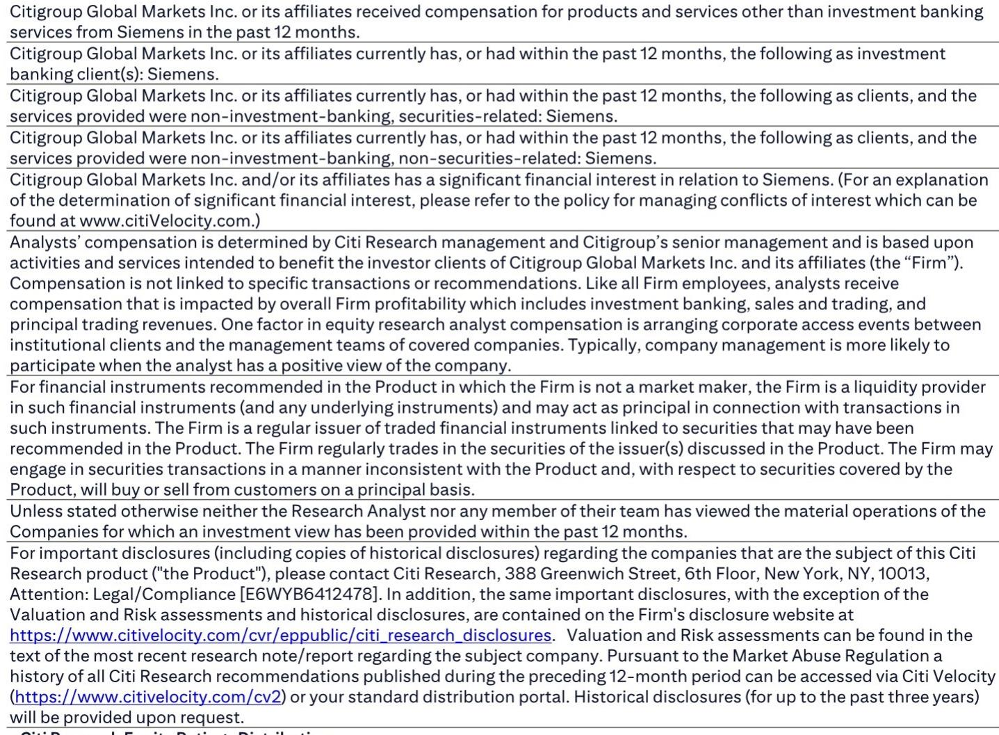
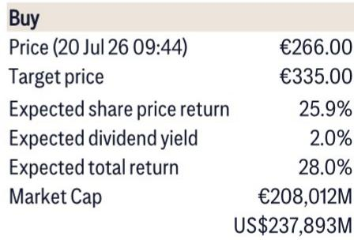
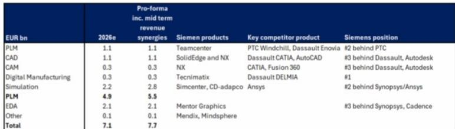

# Citi：软件行业数据与主题变化观察

上周五，EDA软件供应商报价集体下跌。导火索是一则报道：Kimi K3 AI模型使用开源工具完成了一颗半导体芯片的设计，绕过了传统EDA软件。Citi在最新研报中对此作出判断——这一突破发生在成熟制程芯片上，而非当前先进设计，因此短期内不会对行业格局形成冲击。但真正值得关注的，是这一事件如何检验市场对西门子EDA业务的价值认知。

Citi估算，西门子EDA业务年收入约21亿欧元，占其数字化工业部门销售额的11%，占集团（不含Healthineers）销售额的4%。在全球EDA市场，西门子以约15%的份额位列第三，排在Synopsys和Cadence之后。这一规模并不小，但市场对其估值一直存在不同看法。

## 1. EDA软件被视作最难被颠覆的软件品类

Citi认为，EDA软件长期以来被视为软件领域中最不易受颠覆的环节。原因在于它深度嵌入客户流程——从设计、验证到仿真，每一步都依赖复杂的工艺设计套件。随着芯片复杂度持续提升，EDA与客户工作流的绑定只会越来越紧。AI代理最终更可能成为EDA工具的使用者，而非替代者。

> **KC评论：** Citi的逻辑是，EDA的护城河不在于技术壁垒本身，而在于它已经变成了芯片设计流程中的“基础设施”。AI模型绕过EDA做一次演示是一回事，但要替代整个流程中成千上万个经过验证的接口和标准，是另一回事。

## 2. 西门子估值折价意味着EDA价值未被充分反映

Citi在报告中指出，西门子相对于同行的估值折价近期有所扩大。按分类加总估值法计算，西门子当前报价并未完全反映其EDA业务的价值。换句话说，即使市场对EDA行业前景产生短期关注，西门子报价中已经包含了这部分折价，节奏变化不确定性相对有限。

基于分类加总估值法：子公司持股按市价计算，其他部门按2027年预期EV/EBITA的同行均值估值，资金服务业务估值31亿欧元，其他少数权益按12倍市盈率计算。

## 3. 市场对AI替代的关注需要区分短期冲击与长期趋势

Kimi K3的案例确实展示了AI在芯片设计领域的潜力，但Citi强调，这更多是一个技术演示，而非商业化的替代方案。成熟制程芯片的设计复杂度远低于先进制程，开源工具链在成熟制程上的可用性也更高。真正的问题是：当AI需要处理7纳米以下、涉及数百亿晶体管的芯片时，它是否还能绕过EDA工具？Citi的答案是否定的。

这一判断对读者意味着，短期情绪波动可能创造估值修复的机会，而非行业基本面的转折点。西门子EDA业务的估值折价，反而为那些愿意区分噪音与信号的参与者提供了观察窗口。

For informational purposes only. Portions may be generated,translated,summarized,or edited with AI assistance based on source materials and may contain omissions or errors. Please verify independently. This is not investment,legal,tax,accounting,or other professional advice.

