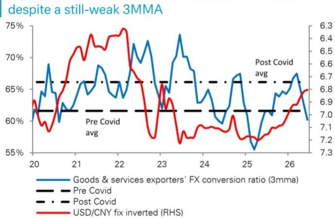

## 宏观观察：亚洲市场动态

日期：2026年7月20日

## 关于人民币流动性的观察

6月份，客户通过银行进行的美元净卖出有所加快，达到2月以来的最高水平，为574亿美元，使得三个月移动平均线达到470亿美元。这一卖出趋势主要受到出口商稳健的外汇兑换推动，这一趋势与我国不断扩大的贸易顺差相一致，并得到我们专有EPIC数据的印证，该数据持续显示企业存在活跃的人民币兑换需求。

Perry Kojodjojo

策略师

+852-2203-6153

陈侃

宏观策略师

+852-2203-6159

最新数据显示，出口商兑换比率显著回升至64.5%，而5月为58.2%，不过由于4月数据较弱，三个月移动平均线表现仍然一般。

我们预计，下半年出口商的兑换活动将保持稳定。较低的美元/人民币中间价表明，政策制定者对人民币升值表现出更大的容忍度，这增加了出口商持有美元收入的成本。即使兑换比率在当前水平企稳，我国贸易顺差的持续扩大也将增加可用于兑换的出口收入规模。

当然，对外资金流动的恢复可能会缓和人民币的升值压力，这一动态在外汇管理局的净外汇收支数据中有所体现（该数据涵盖了包括出口商兑换活动在内的整体跨境流动）。6月份，尽管外国读者继续购买国债（约10亿美元），但组合类资金流动从180亿美元的净流入转为360亿美元的净流出。不过，整体资金流动状况仍然具有支撑性。

图1：随着出口商外汇兑换活动增加，美元净卖出回升

来源：DB, CEIC

图2：尽管三个月移动平均线仍显一般，但出口商外汇兑换已有所回升

来源：DB, CEIC

## 附录1

## 分析师认证

本报告中表达的观点准确反映了以下署名首席分析师的个人观点。此外，署名首席分析师未曾且将来也不会因提供本报告中的具体建议或观点而获得任何报酬。陈侃, Perry Kojodjojo。

## 重要披露

除非另有说明，价格均为上一交易日收盘价，数据来源于路透、彭博等当地交易所及其他供应商。其他信息来源于DB、相关公司及其他来源。有关DB相关披露的更多信息，请访问我们网站上的全球披露查询页面：

https://research.db.com/Research/Disclosures/FICCDisclosures。除本报告外，重要的风险与利益冲突披露也可在 https://research.db.com/Research/Disclosures/Disclaimer 找到。建议读者在投资前仔细阅读此信息。

## 附加信息

本报告中的信息和观点由DB AG或其附属公司（统称“DB”）编制。尽管此处信息被认为可靠且来自被认为可靠的公开来源，但DB不对其准确性或完整性作任何陈述。本报告中指向第三方网站的超链接仅为方便读者提供。DB既不认可其内容，也不对这些网站的准确性或安全控制负责。

如果您在使用DB服务时涉及本报告讨论或DB分析师其他沟通（口头或书面）中包含或讨论的证券的购买或出售，DB可能作为其自身账户的本金或他人的代理人行事。

DB在决定作为本金交易时可能会考虑本报告。它也可能为其自身账户或与客户进行与本研究报告观点不一致的交易。DB内部的其他人员，包括策略师、销售人员和其他分析师，可能持有与本研究报告观点不一致的看法。DB发布多种研究产品，包括基本面分析、股权关联分析、定量分析和交易思路。一种沟通方式中的建议可能与另一种不同，原因包括时间范围、方法论、视角等不同。DB和/或其附属公司可能持有其撰写报告的发行人的债务或股权证券。分析师的薪酬部分取决于DB AG及其附属公司的盈利能力，包括投资银行、交易和本金交易收入。

意见、估计和预测构成本报告作者截至报告日期的当前判断。它们不一定反映DB的意见，且可能随时更改，恕不另行通知。DB为其所覆盖公司发行的证券的买卖双方提供流动性。DB分析师有时会提出短期交易思路，这些思路可能与DB现有的长期评级不一致。一些股票的交易思路在研究网站（https://research.db.com/Research/）上列为催化剂电话，可在总体覆盖列表和所覆盖公司的页面上找到。催化剂电话代表分析师高度确信某只股票将在不少于两周且不超过三个月的时间范围内跑赢或跑输市场和/或特定板块。除催化剂电话外，分析师可能偶尔与我们的客户以及DB的销售人员和交易员讨论交易策略或想法，这些策略或想法可能涉及对本报告讨论的证券市场价格产生短期或中期影响的催化剂或事件，其影响方向可能与分析师当前12个月的总回报或投资回报观点相反。DB没有义务更新、修改或修订本报告，或在意见、预测或估计发生变化或不准确时通知接收者。覆盖范围以及市场状况和一般及公司特定经济前景的变化频率使得难以按固定间隔更新研究。更新由覆盖分析师或研究部门管理层自行决定，大多数报告不定期发布。本报告仅供参考，并未考虑个别客户的特定投资目标、财务状况或需求。它不是购买或出售任何金融工具或参与任何特定交易策略的要约或要约邀请。目标价格本质上不精确，是分析师判断的产物。本报告中讨论的金融工具可能不适合所有读者，读者必须自行做出明智的投资决策。金融工具的价格和可用性可能随时更改，恕不另行通知，投资交易可能因价格波动和其他因素导致损失。如果金融工具以读者货币以外的货币计价，汇率变化可能对投资产生不利影响。过往表现不一定预示未来结果。除非另有说明，表现计算不包括交易成本。除非另有说明，价格均为上一交易日收盘价，数据来源于路透、彭博等当地交易所及其他供应商。数据也来源于DB、相关公司及其他方。人工智能工具可能用于本材料的准备，包括但不限于协助事实查找、数据分析、模式识别、内容起草和与研究材料相关的编辑更正。

DB部门独立于银行的其他业务部门。有关我们组织安排和信息壁垒的详细信息，请访问我们的网站（https://research.db.com/Research/）下的免责声明部分。

宏观经济波动通常构成与承诺支付固定或浮动利率的工具相关的风险的大部分。对于持有固定利率工具（从而收取这些现金流）的读者而言，利率上升自然会提高应用于预期现金流的贴现因子，从而导致损失。特定现金流的期限越长，贴现因子的变动越大，损失就越高。通胀、财政融资需求和外汇贬值率的意外上行是接收方最常见的负面宏观经济冲击。但交易对手风险、发行人信用状况、客户细分、监管（包括对不同类型读者资产持有限额的变化）、税收政策变化、货币可兑换性（可能限制货币兑换、利润汇回和/或头寸清算）以及与本地清算机构相关的结算问题也是重要的风险因素。固定收益工具对宏观经济冲击的敏感性可以通过将合同现金流与通胀、外汇贬值或特定利率挂钩来缓解——这在新兴市场很常见。指数固定值可能——按设计——滞后或错误衡量其旨在跟踪的潜在变量的实际变动。在掉期市场中，浮动票息率（即通常与短期利率参考指数挂钩的票息）与固定票息交换，选择正确的固定值（或指标）尤为重要。以与票息计价货币不同的货币融资会带来外汇风险。掉期期权（互换期权）除了与利率变动相关的风险外，还具有期权的典型风险。

衍生品交易涉及多种风险，包括市场风险、交易对手违约风险和流动性风险。这些产品是否适合读者使用取决于读者自身的具体情况，包括其税务状况、监管环境以及其其他资产和负债的性质；因此，读者在进入与本出版物内容类似或受其启发的任何交易之前，应寻求专业的法律和财务建议。期货交易和期权（无论是国外还是国内）的损失风险可能很大。由于期货和期权交易可获得的高杠杆率，可能产生的损失大于最初存入的资金金额——理论上可达到无限损失。期权交易涉及风险，不适合所有读者。在购买或出售期权之前，读者必须审阅“标准化期权的特征和风险”，网址为 https://www.theocc.com/company-information/documents-and-archives/options-disclosure-document。如果您无法访问该网站，请联系您的DB代表以获取此重要文件的副本。

外汇交易参与者可能面临多种因素带来的风险，包括：(i) 汇率可能波动且波动较大；(ii) 货币价值可能受到众多市场因素的影响，包括世界和国家的经济、政治和监管事件、股票和债券市场的事件以及利率变化；(iii) 货币可能面临贬值或政府实施的汇率管制，这可能会影响货币的价值。投资于其价值受基础货币影响的证券（如ADR）的读者，实际上承担了货币风险。

除非管辖法律另有规定，所有交易应通过读者所在司法管辖区的DB实体执行。除本报告外，重要的利益冲突披露也可在 https://research.db.com/Research/ 上每个公司的研究页面或“披露”选项卡下找到。建议读者在投资前仔细阅读此信息。

DB（包括DB AG、其分支机构和关联公司）不就本报告中提供的任何信息担任您的财务顾问、顾问或受托人。DB不提供投资、法律、税务或会计建议，DB不作为您的公正顾问，也不对材料中呈现的任何策略、产品或任何其他信息发表任何意见或建议。此处包含的信息仅基于接收方将独立评估任何投资决策的优劣而提供，并不构成对任何产品或服务或任何交易策略的建议或意见。

所呈现的信息具有一般性，不针对退休账户或任何特定个人或账户类型，因此明确基于其不是建议而提供给您，您不得依赖它做出决定。我们提供的信息仅针对我们认为财务上成熟、能够独立评估投资风险（无论是总体上还是针对特定交易和投资策略）并且理解DB在其产品和服务提供中拥有财务利益的人士。如果不是这种情况，或者您是IRA或其他直接收到此信息的零售读者，我们要求您立即通知我们。

2018年7月，DB修订了其短期思路的评级系统，品牌名称从SOLAR思路更改为催化剂电话（“CC”）；源自美洲地区的催化剂电话的评级类别已与全球分析师使用的类别保持一致；CC的有效期已从最长180天缩短至90天。

美国：由DB Securities Incorporated（FINRA和SIPC成员）批准和/或分发。位于美国以外的分析师受雇于非美国附属公司，未注册/未获得FINRA研究分析师资格。

欧洲经济区（不包括英国）：由DB AG批准和/或分发，DB AG是一家根据德意志联邦共和国法律注册成立的股份有限公司，其主要办事处在法兰克福。DB AG根据德国银行法获得授权，并受欧洲中央银行和德国联邦金融监管局（BaFin）的监管。

英国：由DB AG通过其伦敦分行（地址：21 Moorfields, London EC2Y 9DB）批准和/或分发。DB AG在英国由审慎监管局授权，并受审慎监管局和金融行为监管局的有限监管。有关我们授权和监管范围的详细信息可应要求提供。

香港特别行政区：由DB AG香港分行分发，但有关《香港证券及期货条例》第571章含义内的期货合约的研究内容除外。关于此类期货合约的研究报告不打算供位于、注册、组成或居住在香港的人士访问。研究报告的作者及其代表和/或关联的实体可能未获许可在香港进行受规管活动，如果未获许可，则不得声称能够这样做。上述“附加信息”部分中的规定应在当地法律法规允许的最大范围内适用，包括但不限于《证券及期货事务监察委员会持牌人或注册人操守准则》。本报告仅旨在分发给《证券及期货条例》附表1第1部分定义的“专业读者”。非专业读者不得依据或依赖本文件行事。本文件相关的任何投资或投资活动仅适用于专业读者，且仅与专业读者进行。

印度：由Deutsche Equities India Private Limited (DEIPL) 编制，公司识别码：U65990MH2002PTC137431，注册办事处：14th Floor, The Capital, C-70, G Block, Bandra Kurla Complex, Mumbai (India) 400051。电话：+91 22 7180 4444。它在印度证券交易委员会（SEBI）注册为股票经纪人，注册号：INZ000252437；商人银行家，SEBI注册号：INM000010833；研究分析师，SEBI注册号：INH000001741。DEIPL的合规/申诉官是Rashmi Poddar女士（电话：+91 22 7180 4929，电子邮件：complaints.deipl@db.com）。SEBI的注册和NISM的认证绝不保证DEIPL的表现或向读者提供任何回报保证。证券市场的投资受市场风险影响。在投资前仔细阅读所有相关文件。DEIPL可能因违反印度法规而收到SEBI的行政警告。DB和/或其关联公司可能持有标的公司的债务头寸或头寸。有关关联公司的信息，请参阅年度报告中的“持股”部分：https://www.db.com/ir/en/annual-reports.htm。有关最新的印度研究审计报告，请参阅 https://country.db.com/india/deutsche-equities-india/index?language\_id=1。

日本：由Deutsche Securities Inc.(DSI) 批准和/或分发。注册号 - 注册为金融工具交易商，由关东地方财务局局长（金商）第117号。协会成员：日本证券业协会、第二类金融工具交易商协会和日本金融期货协会。股票交易的佣金和风险 - 对于股票交易，我们按与每位客户商定的佣金率乘以交易金额收取股票佣金和消费税。股票交易可能因股价波动和其他因素导致损失。外国股票交易可能因外汇波动导致额外损失。对于某些类别的研究交流、产品和服务，我们可能收取佣金和费用。推荐的投资策略、产品和服务存在本金损失以及因市场和/或经济趋势变化和/或市场价值波动导致的其他损失的风险。在决定购买金融产品和/或服务之前，客户应仔细阅读相关的披露文件、招股说明书和其他文件。本报告中提到的“穆迪”、“标准普尔”和“惠誉”除非实体名称中特别指定日本或“日本”，否则不是日本注册的信用评级机构。非DSI分析师撰写的关于日本上市公司的报告由DB集团的分析师撰写，覆盖公司由DSI指定。本报告中所述的一些外国证券未根据日本《金融工具和交易法》进行披露。DB股票分析师设定的目标价格基于12个月的预测期。

韩国：由Deutsche Securities Korea Co. 分发。

南非：DB AG约翰内斯堡在德意志联邦共和国注册成立（南非分行注册号：1998/003298/10）。

新加坡：本报告由DB AG新加坡分行（地址：One Raffles Quay #18-00 South Tower Singapore 048583，电话：65 6423 8001）发布，可就本报告引起的或与之相关的任何事宜联系该分行。如果DB在新加坡向非认可读者、专家读者或机构读者（定义见适用的新加坡法律法规）发布或传播本报告，DB对此人承担本报告内容的法律责任。

台湾：有关在台湾交易的证券/投资的信息仅供参考。读者应独立评估投资风险，并对其投资决策全权负责。未经书面同意，DB不得向台湾公共媒体分发，也不得被台湾公共媒体引用或使用。有关不在台湾交易的证券/工具的信息仅供参考，不得解释为交易此类证券/工具的建议。

卡塔尔：卡塔尔金融中心（注册号00032）的DB AG受卡塔尔金融中心监管局监管。DB AG - QFC分行仅可从事其现有QFCRA许可证范围内的金融服务活动。其在QFC的主要营业地点：Qatar Financial Centre, Tower, West Bay, Level 5, PO Box 14928, Doha, Qatar。此信息由DB AG分发。相关金融产品或服务仅适用于卡塔尔金融中心监管局定义的商业客户。

俄罗斯：此处提交的信息、解释和意见不属于任何需要俄罗斯联邦许可证的评估或鉴定活动的背景，也不构成此类活动。

沙特阿拉伯王国：Deutsche Securities Saudi Arabia (DSSA) 是一家封闭式股份公司，由沙特阿拉伯王国资本市场管理局授权，许可证号（第37-07073号），可从事以下业务活动：交易、安排、咨询和托管活动。DSSA注册办事处：Faisaliah Tower, 17th Floor, King Fahad Road - Al Olaya District Riyadh, Kingdom of Saudi Arabia P.O. Box 301806。

阿拉伯联合酋长国：迪拜国际金融中心（注册号00045）的DB AG受迪拜金融服务局监管。DB AG - DIFC分行仅可从事其现有DFSA许可证范围内的金融服务活动。其在DIFC的主要营业地点：Dubai International Financial Centre, The Gate Village, Building 5, PO Box 504902, Dubai, U.A.E.。此信息由DB AG分发。相关金融产品或服务仅适用于迪拜金融服务局定义的专业客户。

澳大利亚和新西兰：本研究仅针对《澳大利亚公司法》和《新西兰金融顾问法》含义内的“批发客户”。请参阅澳大利亚特定的研究披露及相关信息，网址为 https://www.dbresearch.com/PROD/RPS\_EN-PROD/PROD0000000000521304.xhtml 。如果研究涉及任何特定金融产品，研究接收方应在决定是否购买该产品前考虑任何产品披露声明、招股说明书或其他适用的披露文件。在编制本报告时，首席分析师或协助编制本报告的个人可能已与作为本研究对象的公司联系，以确认/澄清数据、事实、声明，获得在报告中使用公司来源材料的许可，和/或进行实地考察。未经研究管理部门事先批准，分析师不得接受当前或潜在银行客户支付的分析师参加实地考察、会议、社交活动等所产生的差旅、住宿或其他费用。同样，未经研究管理部门和反腐败（“ABC”）团队事先批准，分析师不得从其覆盖的发行人处接受个人使用的福利或其他有价物品。

有关本报告讨论的证券、其他金融产品或发行人的附加信息可应要求提供。未经DB事先书面同意，不得复制、分发或发布本报告。

回测、假设或模拟的表现结果具有固有的局限性。与基于实际客户投资组合交易的实际表现记录不同，模拟结果是通过追溯应用一个本身带有事后偏见设计的回测模型来实现的。考虑到历史事件，表现的回测也与实际账户表现不同，因为实际投资策略可能随时因任何原因进行调整，包括对重大、经济或市场因素的反应。回测表现包括假设结果，这些结果不反映股息和其他收益的再投资，也不反映咨询费、经纪或其他佣金的扣除，以及客户本应支付或实际支付的任何其他费用。未声明任何交易策略或账户将或可能实现与所示相似的利益或损失。替代建模技术或假设可能产生显著不同的结果，并且可能更合适。过去的假设回测结果既不是未来回报的指标，也不是保证。实际结果将与分析结果存在差异，可能差异显著。

本文所述的计算个人E、S、G和综合ESG评分的方法是DB AG研究部门开发的一种新颖方法，使用系统方法计算，无需人工干预。不同的数据提供商、市场板块和地区以不同方式处理ESG分析并纳入研究结果。因此，本文提及的ESG评分可能与市场上其他ESG数据提供商开发和实施的等效评级不同，也可能与DB集团内其他部门开发和实施的等效评级不同。此类ESG评分也不同于DB AG发布的研究报告中历史上使用的其他评级和排名。此外，此类ESG评分不代表DB AG的正式或官方观点。

应注意，将ESG因素纳入任何投资策略的决定可能会抑制参与某些原本符合您投资目标和其他主要投资策略的研究线索的能力。主要由可持续投资组成的投资组合的回报可能低于或高于不考虑ESG因素、排除或其他可持续性问题的投资组合，并且此类投资组合可用的研究线索可能不同。公司可能不一定在所有ESG或可持续投资问题上达到高标准表现；也无法保证任何公司将在企业责任、可持续性和/或影响力表现方面达到预期。

版权所有 © 2026 DB AG

David Folkerts-Landau
集团首席经济学家兼全球研究主管

<table><tr><td>Pam Finelli
首席运营官兼固定收益研究主管</td><td>Steve Pollard
全球公司研究与销售主管</td><td>Jim Reid
全球宏观与主题研究主管</td><td>Tim Rokossa
欧洲公司研究主管</td></tr><tr><td>Matthew Barnard
美洲公司研究主管</td><td>Debbie Jones
全球可持续发展与数据创新研究主管</td><td>Robin Winkler
德国宏观研究主管</td><td>Sameer Goel
全球新兴市场与亚太研究主管</td></tr><tr><td>Francis Yared
全球利率研究主管</td><td>George Saravelos
全球外汇研究主管</td><td>Peter Hooper
研究副主席</td><td>Nilendra de-Mel
亚太及中东产品开发主管</td></tr></table>

国际生产地点

<table><tr><td>DB AG</td><td>DB AG</td><td>DB AG</td><td>Deutsche Securities Inc.</td></tr><tr><td>DB Place</td><td>Equity Research</td><td>Filiale Hongkong</td><td>1-3-1 Azabudai</td></tr><tr><td>Level 16</td><td>Mainzer Landstrasse 11-17</td><td>International Commerce Centre</td><td>Azabudai Hills Mori JP Tower</td></tr><tr><td>Corner of Hunter &amp; Phillip Streets</td><td>60329 Frankfurt am Main Germany</td><td>1 Austin Road West, Kowloon,</td><td>Minato-ku, Tokyo 106-0041</td></tr><tr><td>Sydney, NSW 2000 Australia</td><td>Tel: (49) 69 910 00</td><td>Hong Kong</td><td>Japan</td></tr><tr><td>Tel: (61) 2 8258 1234</td><td></td><td>Tel: (852) 2203 8888</td><td>Tel: (81) 3 6730 1000</td></tr></table>

<table><tr><td>DB AG21 MoorfieldsLondon EC2Y 9DBUnited KingdomTel: (44) 20 7545 8000</td><td>DB Securities Inc.The DB Center1 Columbus CircleNew York, NY 10019Tel: (1) 212 250 2500</td><td>DB AGFiliale SingapurOne Raffles Quay, South TowerSingapore 048583Tel: (65) 6423 8001</td></tr></table>
