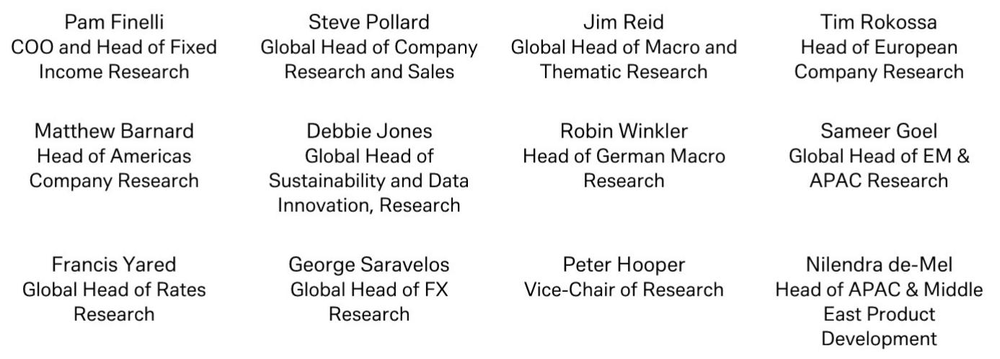
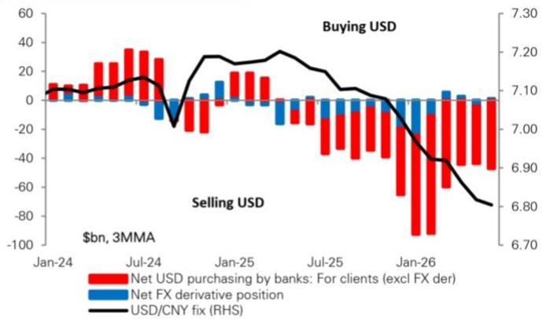

# 中国出口商结汇行为持续活跃：人民币升值趋势尚未见顶

本月中国外汇市场最值得关注的信号并非政策声明或央行定价，而是出口商行为模式在过去数月间悄然发生的变化。6月，中国银行客户净卖出美元规模达到574亿美元，创下2月以来新高，推动三个月移动均值升至470亿美元。这并非一次性波动，而是持续趋势的最新数据点：中国出口商正以加速步伐将美元收入兑换为人民币，而驱动这一行为的结构性因素——中国不断扩大的贸易顺差——未见逆转迹象。对于围绕人民币进行布局的观察者而言，认为人民币升值压力已达峰值的传统观点为时过早。这一资金流动故事仍有后劲，且正由外汇市场较强大的力量驱动：实体经济行为。

这一转变的时机之所以重要，是因为它恰逢政策环境的微妙但重要变化。近期美元/人民币定价走低，表明政策制定者对人民币升值的容忍度有所提高。这并非戏剧性的政策转向，而是对出口商机会成本计算的渐进调整。当央行允许定价走低时，持有未对冲美元收入的机会成本随之上升。延迟结汇的出口商面临明日汇率不如今日有利的风险。行为反应立即可测：最新数据显示，出口商结汇比例从5月的58.2%大幅反弹至64.5%。

这并非关于投机性资本流动或热钱的故事，而是实体经济通过最平凡的渠道——企业决定何时结汇出口收入——展现自身力量。这一区别对于理解为何即使中国国际收支其他组成部分发生变化，这一趋势仍可能持续至关重要。

## 出口商结汇比例大幅反弹，结构性驱动因素——中国贸易顺差扩大——将支撑这一趋势

关键数据值得仔细审视。结汇比例单月从58.2%跃升至64.5%。三个月移动均值因4月异常低值而仍显疲弱，但方向性趋势清晰无误。出口商正回归今年第一季度典型的美元卖出行为，且此时可供结汇的出口收入规模持续增长。

其算术逻辑简单而有力。中国贸易顺差正在扩大，这意味着可供结汇的出口收入池较一年前更大。即使结汇比例稳定在当前水平——而非继续上升——美元卖出的相对规模也将因分母增长而增加。这是一种独立于情绪或投机的机械关系。更大的贸易顺差，结合稳定的结汇比例，将产生更多的人民币买入压力。

这一动态得到追踪企业人民币结汇需求的专有数据印证。EPIC数据系列继续显示活跃的结汇活动，与银行系统的资金流动数据相互佐证。这些独立数据源的一致性增强了判断：这并非短暂现象。出口商并非对单一数据点或短期战术机会做出反应，而是在适应持有美元与人民币相对吸引力发生的结构性变化。

## 美元/人民币定价走低改变了出口商的机会成本计算，形成自我强化的升值动态

市场参与者常低估定价机制中蕴含的政策信号，他们关注定价水平而非其轨迹。定价走低不仅改变即期汇率，更改变驱动企业行为的预期。当出口商看到定价趋势下行，他们理解央行准备容忍——甚至促进——人民币渐进升值。这一预期一旦形成，便成为自我实现。

逻辑很简单。持有1000万美元收入的出口商面临选择：今天结汇或等待。如果定价稳定或上升，等待成本很低。如果定价趋势下行，等待的机会成本与日俱增。出口商无需预测汇率的确切路径，只需看到延迟成本已增加。结汇比例从58.2%跃升至64.5%表明，大量出口商已得出这一结论。

这形成了难以打破的反馈循环：更多结汇推高人民币，强化进一步升值的预期，进而鼓励更多结汇。政策信号与行为反应方向一致。只要定价继续走低，激励结构将保持向结汇倾斜。

## 组合资金流动转负，但整体国际收支仍对人民币构成支撑

细心的读者可能会指出，故事比出口商行为更复杂。国家外汇管理局的净外汇收支数据——涵盖包括出口商结汇活动在内的所有跨境流动——显示，6月组合资金流动从180亿美元净流入转为360亿美元净流出。这一大幅波动反映了对外资本流动的复苏，理论上可能抵消出口商结汇带来的升值压力。

但关键点在于整体国际收支仍保持支撑。即使外国读者继续购买中国国债——6月约10亿美元——组合资金外流加速，表明外流由国内读者海外多元化驱动，而非外国信心丧失。这一区别很重要，因为国内资金外流通常比外国组合资金流动更稳定，更不易突然逆转。

更重要的是，出口商结汇活动的规模足以吸收大量外流压力。单月574亿美元的净美元卖出规模，使出口商渠道产生的资金流远超组合资金外流。净结果是国际收支保持顺差，即使金融账户走弱，人民币仍面临来自实体经济渠道的向上压力。

这正是全球投行报告会描述为“整体国际收支保持支撑”的模式。资金流动构成正在变化——更多实体经济流入，更少金融账户流入——但净压力方向未变。

## 观察者的决策框架：如何围绕出口商结汇周期进行布局

对于试图将这一分析转化为布局决策的观察者而言，关键在于识别出口商结汇周期的转折点。该周期分为三个阶段，每个阶段需要不同的策略方法。

第一阶段是加速期，即当前所处阶段。结汇比例上升，贸易顺差扩大，政策信号支持。此阶段最优布局是持有美元兑人民币的空头头寸，最好通过期权方式以限制政策突然逆转时的下行风险。报告自身的布局——通过期权做空美元/离岸人民币——正反映了这一逻辑。在升值渐进但剧烈波动尾部风险真实存在的情景下，期权提供了凸性。

第二阶段是稳定期。在某个时点，结汇比例将趋于平稳。出口商已转换大部分累积收入，进一步结汇的边际激励将减弱。此阶段升值压力将缓和，但不会逆转。适当布局从方向性空头转向相对价值交易——例如，做多人民币兑一篮子亚洲货币而非仅兑美元。

第三阶段是逆转期。如果贸易顺差收缩、政策信号转变或冲击导致出口商囤积美元，则可能出现此情况。此阶段资金流动故事破裂，人民币面临贬值压力。需关注的信号并非结汇比例水平，而是其相对于贸易顺差的轨迹。如果结汇比例在贸易顺差仍在扩大时下降，这是出口商结构性不愿结汇的警示信号——可能源于地缘政治风险或对货币机制信心丧失。

目前，第三阶段的条件均未显现。结汇比例上升，贸易顺差扩大，政策信号支持。举证责任在于那些认为升值故事已见顶的人。

人民币资金流动故事尚未结束。它正由国际金融中最基本的力量驱动——企业管理出口收入的实体经济决策。这些决策如今与政策信号和结构性趋势方向一致，形成持续的升值压力。6月的组合资金外流是干扰项，而非改变格局的因素。真正的行动在出口商结汇渠道，而该渠道的资金流动比数月来更为强劲。

*仅供参考。部分内容可能基于源材料通过AI辅助生成、翻译、总结或编辑，可能存在遗漏或错误。请独立核实。本文不构成专业建议。*

仅供参考。部分内容可能基于源材料通过AI辅助生成、翻译、总结或编辑，可能存在遗漏或错误。请独立核实。本文不构成专业建议。

