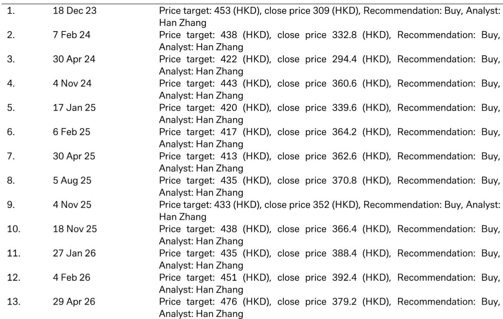
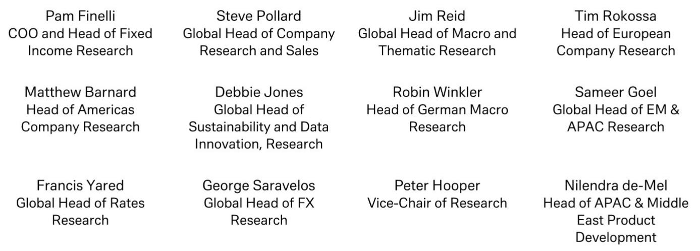
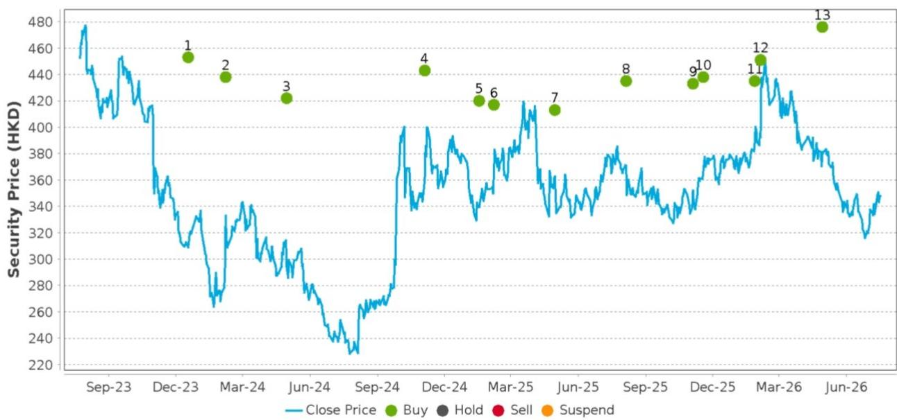

# DB：资金结构与相关数据观察

百胜中国将于7月30日发布二季度业绩。DB在最新报告中预计，公司二季度总收入与经营利润将分别实现中个位数和高个位数同比增长，净利润约在2.3至2.4亿美元区间。这份报告的核心看点并非业绩数字本身，而是两个将在业绩会上被重点讨论的议题：12亿美元必胜客中国品牌收购的债务融资安排，以及6月下旬以来南方洪涝与北方强降水对旺季销售的实际影响。

报告维持对百胜中国的正面看法。当前报价约347.8港元，对应2026年预期市盈率约15.5倍，低于其三年历史均值超过一个标准差。该机构注意到，在AI研究热潮中，境内外读者对中国消费股表现出对低估值、高股东回报标的的偏好，百胜中国约10%的股东回报率使其在近期有所反弹。

## 1. 餐厅利润率小幅承压，但经营利润率有望持平

DB预计二季度餐厅利润率同比微降0.3个百分点，主要不确定性来自人力成本。外卖占比在2026年上半年仍可能继续上升，这直接推高了劳动力支出。但报告同时指出，公司通过持续谈判降低新店和现有门店的租金成本，在租金及其他成本项上持续节省，这部分对冲了人力端的不确定性。

经营利润率层面，报告认为有望同比持平。核心逻辑是百胜中国对运营效率的持续改进，而非单纯依赖收入增长。这意味着公司在成本结构上的主动管理能力，正在成为利润稳定的关键变量。

> **KC评论：** 餐厅利润率微降但经营利润率持平，说明百胜中国在门店层面的成本仍在调整并未传导至公司整体盈利层面。租金谈判和运营效率改进是这一传导链条上的关键缓冲，值得在业绩发布后验证其持续性。

## 2. 同店销售小幅增长，新店扩张节奏明确

报告预计二季度公司同店销售同比增长约1%，同时新开门店约400至500家。这一开店节奏与公司此前指引基本一致，也符合市场对百胜中国在中国市场持续渗透的预期。

同店销售增长幅度有限，反映出当前消费环境下的整体客单价和客流不确定性。但结合新店扩张，总收入仍可实现中个位数增长。这种“以量补价”的模式，在餐饮行业当前阶段并不罕见，关键看新店能否在合理时间内达到盈亏平衡。

## 3. 原材料成本波动下的产品策略调整

报告披露了一个值得关注的细节：百胜中国正在通过产品SKU的多样化来对冲原材料成本不确定性。牛肉价格同比上涨明显，一季度涨幅14%，二季度约6%；而猪肉价格在2026年上半年下降约20%，虾和龙虾价格也有显著回落。

应对策略已经落地。肯德基推出了多款龙虾和虾类产品，V-BURGER则在6月推出了猪肉汉堡。这种根据原材料价格波动灵活调整菜单的能力，在大型连锁餐饮中并不常见，但对利润率的稳定有实际意义。

## 4. 子品牌扩张与股东回报框架

报告更新了两个子品牌的进展：V-BURGER门店数已超过200家，覆盖28个城市；KPRO截至5月底已扩张至300多家门店，其2026年底目标为600家。这些数据表明，百胜中国在主品牌之外，正在构建第二增长曲线。

财务层面，报告预计2026年自由现金流约14.15亿美元，较2025年的8.4亿美元有显著提升。公司持续回购和派息，2026年预期股息率约2.6%，股东回报率约10%。在当前中国消费板块中，这一回报水平具有一定吸引力。

> **KC评论：** 债务融资安排是本次业绩会最值得关注的议题之一。12亿美元收购必胜客中国品牌后，公司如何平衡现金储备与负债结构，将直接影响其后续回购能力和资本配置灵活性。报告提到公司目前无有息负债，净现金状态良好，但收购后的财务安排尚未完全披露。

For informational purposes only. Portions may be generated,translated,summarized,or edited with AI assistance based on source materials and may contain omissions or errors. Please verify independently. This is not investment,legal,tax,accounting,or other professional advice.

For informational purposes only. Portions may be generated,translated,summarized,or edited with AI assistance based on source materials and may contain omissions or errors. Please verify independently. This is not investment,legal,tax,accounting,or other professional advice.

