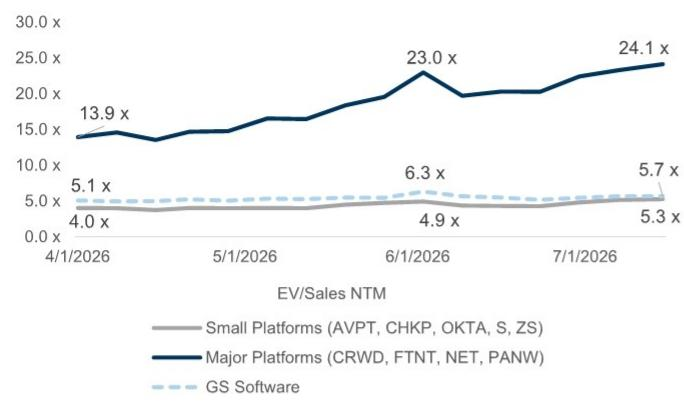
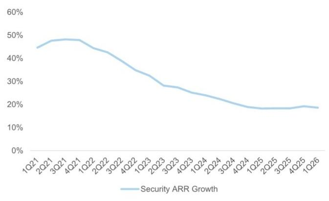
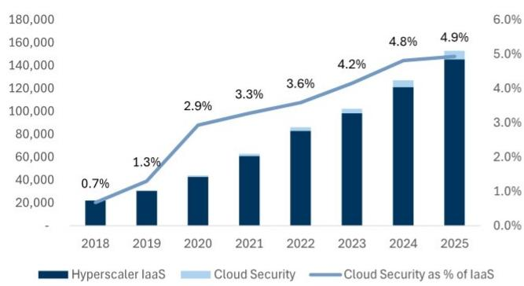
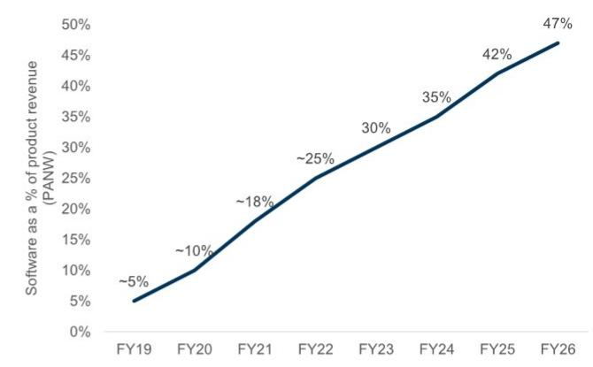
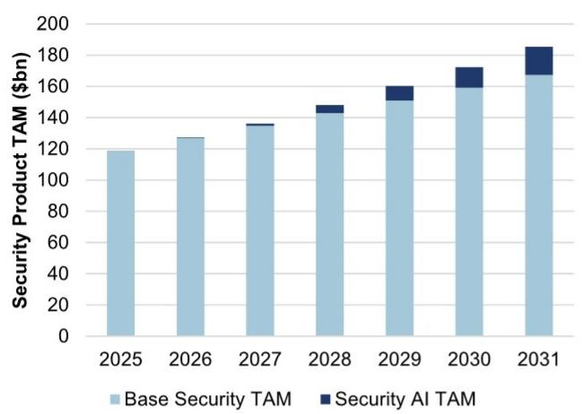
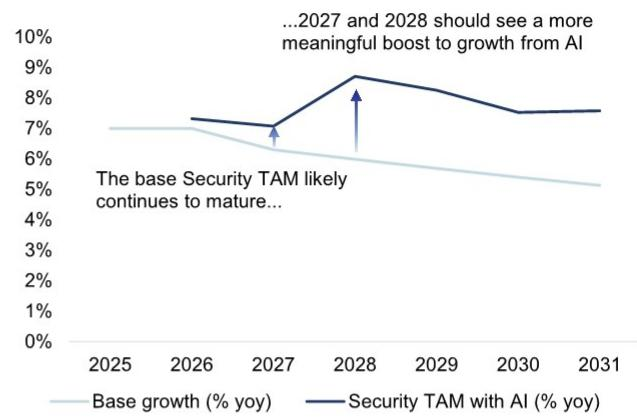

# 技术观察：软件安全领域

## 重新审视护城河 VI：AI投入与安全AI投入的时间差，以及何时关注转折点

过去四个月，安全类别已从被视为受AI影响的领域，转变为明确的受益方。市场共识是：更多的AI投入意味着更多的安全投入，这部分新增的安全预算很可能主要流向当前的市场领导者。我们认同这一观点；然而，量化分析和时间节点的判断，对于把握后续的市场变化至关重要。

1.  **至今，我们尚未看到安全产品预算出现显著变化。** 这为财报季带来了挑战，因为相关公司的报价已提前反映了中期转折的预期。我们的行业交流显示，企业级的智能体应用仍不成熟，且通常在隔离的“沙盒”环境中运行。虽然许多安全团队拥有“空白支票”式的战略授权，但目前这些新增资金主要投向更细分产品的概念验证、以及补丁和卫生管理，这些并未被我们所覆盖的产品公司大规模直接变现。

2.  **问题随之而来：上市安全公司何时会在基本面层面看到更显著的转折？** 作为起点，我们回顾了云服务周期：安全支出占云服务支出的比例从低于1%提升至2-5%（我们视其为稳态），这个过程用了5年。如果我们把2025年视为企业推理应用场景的起始年（Y0），并结合我们的行业交流，我们预计AI安全预算的转折点最早可能在2027年第四季度或2028年上半年出现，这意味着存在2-3年的滞后。我们的市场规模测算支持到2028年，行业增长率将获得2-3个百分点的提升。简而言之，AI应用周期比以往的技术应用周期更快。需要关注的关键驱动因素是，企业将推理和智能体工作负载从试验阶段转向不受沙盒限制的生产应用场景，这也是我们进入第三季度行业交流的重点。

3.  **新增安全预算可能不成比例地流向当前的市场领导者：** 在更广泛的软件领域，最大的风险在于新的AI价值流向新进入者（如AI原生公司、前沿模型公司），而非现有企业。在安全领域，这一风险较低，原因有二：a) 安全路线图由机器学习创新驱动，而非生成式AI创新；这一根本差异使得新进入者难以复制深度人工强化学习反馈循环和标注数据集的优势；b) 安全领导者正积极从资金充裕的私营公司中收购新技术资产（我们估计过去18个月超过23亿美元）。

4.  **值得关注的产品周期：** 我们预计最明显的产品周期将出现在：a) 面向智能体运行时应用场景（即监控智能体）的下一代AI检测与响应，以及相关的安全运营中心基础设施升级，CRWD和PANW在此领域有较大敞口；b) 身份安全领域，我们认为OKTA凭借其云原生后端和与Auth0共同推出的新产品周期（在开发者中拥有较高关注度）处于最佳位置；c) 特定细分产品周期，如提示工程和数据保护。

5.  **PANW和CRWD的乐观情景表明，两者都能通过增长来匹配其估值；而OKTA则最有可能从较低的相对增长率和估值水平实现转折。** 我们注意到，安全类公司的报价相对于其增长轨迹和历史水平而言处于高位，目前我们对PANW和CRWD修订后的目标价仅有温和的上行空间。然而，我们也为PANW和CRWD呈现了乐观情景，显示其2028年自由现金流可能比我们的估计高出多达30%。在此说明性情景下，PANW和CRWD的隐含企业价值/自由现金流/增长倍数将低于当前增长率超过20%的软件公司群体。

图1：过去六个月的关键转折点推动安全板块走高，而同期更广泛的软件板块估值有所下降

来源：FactSet，GS全球研究数据汇编

图2：过去四个月，平台领导者推动安全板块估值出现台阶式上升

来源：FactSet，GS全球研究数据汇编

图3：安全基本面尚未出现转折；关注下半年领先指标（如订单）的改善

来源：公司数据，GS全球研究

## 云安全周期

图4：在IaaS（基础设施即服务）大规模应用后的四年多时间里，安全云收入微乎其微

安全云收入占超大规模云服务商IaaS收入的比例

来源：Gartner，公司数据，GS全球研究
图5：估计Palo Alto虚拟防火墙组合在2018财年后出现转折，到2023财年约占产品收入的30%，到2026财年达到45%以上
Palo Alto虚拟防火墙占产品总收入的比例

来源：公司数据，GS全球研究

我们将云安全周期的起点定为2015年：当时亚马逊首次披露AWS（亚马逊云服务）指标，2014年收入为46亿美元，运营利润率为17%，这与市场认为云服务是低利润或负利润业务的共识形成对比。在2016年和2017年，我们的行业交流表明，云安全生态系统是一个未知且有些混乱的领域：首席信息安全官们对于如何保护云工作负载存在相当多的困惑，有许多新的点产品需要考虑，超大规模云服务商开始将安全功能嵌入其PaaS（平台即服务）产品中，以此作为差异化手段。在云服务早期，我们认为许多首席信息安全官只是将流量路由回其现有的防火墙DMZ（非军事区）以应用安全策略，对云特定安全产品的需求微乎其微。早期的云工作负载也往往是面向客户的，通常比内部工作负载需要更少的安全措施（例如，来自Netflix的内容流媒体和电子商务网站不需要复杂的网络和端点工具）。

2016年、2017年和2018年出现了一些里程碑事件，表明云安全市场正在成熟。几个市场动态开始汇聚：首席信息安全官们对云中需要哪些安全构建模块有了更好的理解；点产品在质量上开始成熟，足以证明在超大规模云服务商安全之外进行增量投入是合理的；客户开始考虑在云中部署更受监管和更敏感的工作负载；多云架构变得更加普遍。与此同时：

■ Gartner于2016年首次发布云安全市场指南

Gartner于2017年底首次发布云访问安全代理魔力象限。CASB（云访问安全代理）在企业用户和SaaS（软件即服务）托管应用（如Salesforce）之间提供了一层安全保护。

2018年是安全云并购的大年，Palo Alto以约2亿美元收购Evident.io，以1.73亿美元收购RedLock，Check Point以1.75亿美元收购Dome9。2019年，Palo Alto以4.1亿美元收购Twistlock，以4700万美元收购PureSec，以1.5亿美元收购Aporeto。在云安全成为一个主要的独立收入类别之前，还有大约13亿美元的并购活动。

我们将2020年视为安全支出出现转折的第一年；根据Gartner关于云安全类别收入占IaaS收入（定义为AWS / Azure / GCP IaaS收入总和）比例的披露，我们估计该比例从1.3%上升到2.9%。新冠疫情可能是一个催化剂，因为员工在2020年3月/4月的短时间内几乎完全转为远程访问。我们参考了Gartner披露的云安全态势管理和云工作负载保护平台数据。

Wiz从2021年初的100万美元ARR（年度经常性收入）增长到2022年中期的约1亿美元ARR，再到2024年初的约2.5亿美元ARR；

■ PANW披露其Prisma Cloud在2021年ARR超过2亿美元，2023年超过5亿美元，2024年超过7亿美元

■ CRWD披露其Falcon Cloud Security在2024财年ARR超过4亿美元，2025财年超过6亿美元。

我们得出两个关键观察：从IaaS云周期开始到云安全收入实现显著转折，用了5年时间；安全预算占IaaS预算的2-5%是一个合理的基准。

## AI安全周期

图6：基于云安全附加率和IaaS推理收入的粗略预测，我们估计2031年AI安全市场规模约为200亿美元
安全市场规模 - 基础 vs. AI

来源：GS全球研究，Gartner
图7：AI可能在未来约12-24个月内推动安全市场规模增长率提升约3个百分点
AI对安全市场规模增长率的估计提升

来源：GS全球研究

我们将AI企业周期的起点定为2025年。我们的行业交流表明，这一年发生了：a) 企业中AI训练和AI推理工作负载之间更显著的转变；b) 更多智能体应用的试验。根据我们的交流，AI训练工作负载大多是内部面向的，除了少数新的主权数据中心外，所需的增量安全支出极少。相比之下，推理工作负载需要嵌入企业系统才能发挥作用，因此当它们从概念验证和沙盒阶段进入全面生产时，需要强大的安全保护。

## 迄今为止，安全公司的AI相关披露多为早期且方向性的：

- Palo Alto：Prisma AIRS是Palo Alto的AI业务板块，包括跨AI应用和模型的运行时威胁防御、模型漏洞扫描、安全态势管理和红队工具。AIRS拥有300多个客户，ARR接近1亿美元。在我们第二季度的交流中，Palo Alto指出，在某些客户场景中，Prisma AIRS已达到客户总AI支出的8-10%，这表明附加率可能高于我们基准的2-5%假设。

CrowdStrike：CrowdStrike的AIDR（AI检测与响应）ARR在4月季度（2027财年第一季度）环比增长超过250%，管道超过5000万美元。AIDR代表了该公司跨模型、数据和智能体安全的AI安全套件，近期收购的Pangea和SGNL将覆盖范围扩展到AI应用和智能体身份安全。

Zscaler：AI Protect在过去一年产生了超过1亿美元的订单。该板块包括Zscaler的AI安全产品，涵盖AI应用保护、模型/数据安全和AI-SPM（安全态势管理），包括LLM（大语言模型）、工作流和MCP（模型上下文协议）服务器的发现。Zscaler在6月的Zenith大会上推出了其AI代理；该产品保护跨MCP和智能体到智能体工作流的通信，并对每个智能体可以访问的内容进行策略控制。

Fortinet：Fortinet尚未披露独立的AI安全数据，通常更倾向于自主研发而非并购。在其3月季度，Fortinet指出，数据中心对防火墙和内部隔离防火墙的AI需求有所改善，部分由中东地区的主权项目驱动。

Check Point：Check Point尚未披露独立的AI安全数据；管理层表示AI安全收入尚不显著，但漏斗已大幅增长。Check Point的AI安全推进围绕Lakera构建，后者为AI应用和智能体提供运行时保护，包括防御提示注入、数据泄露和模型操纵。Check Point还通过员工AI使用控制、AI工厂/NVIDIA基础设施安全和Infinity AI Copilot，将AI安全构建到其更广泛的平台中。

Okta：新产品在第一季度约占订单的25%，同比显著增长，当包含在交易中时，ACV（年度合同价值）提升约40%。AI产品包括面向AI智能体的Auth0和面向AI智能体的Okta，它们在AI智能体的整个生命周期内进行安全保护和治理，包括访问第三方MCP服务器以及发现和控制智能体扩散。这些特定产品相对于总收入而言仍然较小，但早期客户吸引力和管道强劲，AI智能体交易规模高于平均水平。

- SailPoint：SailPoint预计到2027财年末，AI ARR将超过1亿美元。SailPoint将AI ARR定义为智能体架构、智能体套件和智能体附加模块，核心产品专注于治理AI智能体、非人类身份以及这些智能体对应用和数据的访问。非人类身份上季度推动了40%的身份安全增长，20%的新增ARR来自包括AI在内的新兴产品，表明智能体身份正成为一个更明显的增长驱动力。

SentinelOne：在我们6月的会议中，SentinelOne承认，近期关于AI模型的新闻头条正在推动更多关于AI安全的讨论，但它尚未看到稳态支出模式发生重大变化。Prompt Security正经历最明显的AI拉动效应，其次是智能体SOC（安全运营中心）和云运行时。最值得注意的是，Prompt在短短几周内，其在管道中的占比从约0%上升到约20%，ARR在过去两个季度（第四季度和第一季度）几乎翻了一番。S也在围绕其面向智能体SOC的数据业务进行更多讨论，因为客户越来越希望采用灵活的方法。

就实际的AI安全采用而言，我们现在更清楚地理解为何尚未看到对上市安全公司产生显著的AI推动力。我们在第二季度与许多安全从业者进行了交流，他们告诉我们，智能体应用在很大程度上仍在沙盒或临时搭建和拆除的隔离环境中运行。我们还认为，更广泛的智能体AI采用数据与安全供应商有限吸引力之间的部分脱节，是因为一些活动发生在非托管和/或个人设备上，企业安全供应商目前在这些设备上的可见度较低。

## 过渡到我们的AI安全预测：

■ 利用公司披露的信息，并对公有和私有供应商之间的份额进行一些粗略假设，我们估计2025年AI安全收入约为1-2亿美元。然后，我们基于微软、亚马逊、CoreWeave和甲骨文的估计/披露，自下而上构建AI IaaS收入，并假设这些披露合计约占2025年AI市场规模的三分之二（最大的未披露部分来自谷歌）。我们估计，2025年推理和训练工作负载的比例大致为50/50，今年将增长到75%，并在未来两年稳定在85%的比例。

然后，我们将安全AI收入预测为IaaS AI推理收入的附加率。我们从2025年约1亿美元的安全AI收入估计开始，对应的AI IaaS推理市场规模为170亿美元，隐含附加率为0.6%。然后，我们以云安全转折为参考，将2019年和2020年（云周期的第4年和第5年）映射到2027年和2028年（AI周期的第2年和第3年）。

我们得出2031年AI安全市场规模约为200亿美元，这意味着行业增长率将获得2个百分点的提升。我们认为这一初步预测是保守的，因为AI安全可能比云安全创造更多价值；在7%的附加率下，我们的预测将弹性较高至400亿美元，行业增长率提升4个百分点。Palo Alto曾评论称，其Prisma AIRS产品可能占客户AI支出的8-10%。

## 为何新增AI安全预算不成比例地流向当前平台

在软件领域，最大的风险是新的AI价值流向新进入者（AI原生公司、前沿模型公司），而非现有企业。在安全领域，这一风险要低得多，原因有二：1) 安全路线图由机器学习创新驱动，而非生成式AI创新；这一根本差异使得复制深度人工强化学习反馈循环和标注数据集的优势变得困难；2) 安全领导者积极从资金充裕的私营公司中收购新技术资产。

1. 安全路线图由机器学习创新驱动，而非生成式AI创新。我们认为，驱动安全路线图的AI类型与驱动前沿实验室路线图的AI类型之间存在结构性差异，这创造了两个可能不会交叉的不同赛道。安全公司讨论机器学习作为其研发路线图的基石已有10多年。这些机器学习路线图专门使用带有强化学习反馈循环的专有标注数据集进行训练，输出是确定性的。这些数据集是通过网络层或端点层的控制点进行专有数据收集而构建和维护的，据我们所知，这些数据无法通过合成数据复制。在某些情况下，专有数据收集是通过使用非常深入的技术手段的人力资产进行的。在我们4月7日与CrowdStrike反情报高级副总裁Adam Meyers的会议中，Meyers先生指出，CrowdStrike内部的AI创新跑道与前沿实验室的AI创新跑道是独立的。这一动态进一步强化了我们的观点：一个利用其专业数据上的AI并将其应用于独特客户数据的安全供应商，应该能够为客户提供更好、成本更低的成果，无论通用大语言模型的性能随时间如何变化。

相比之下，前沿实验室的路线图由生成式AI驱动。使用生成式AI仍有改善安全成果的机会，但我们认为应用场景不同。迄今为止最成功的生成式AI应用场景之一是编码——随着更多代码被生成，焦点转向如何使这些代码更安全。重要的是，在编写/构建应用的第一步就改善安全性，可能会显著减少应用投入生产后被利用漏洞的可能性。我们预计，随着时间的推移，大语言模型提供商将专注于两个方向：i) 在其产品内提供基础安全级别，以限制采用过程中的任何摩擦（类似于微软的E5安全能力和AWS内置的云安全控制），ii) 可以通过非常强大的异常检测引擎解决的安全应用场景，尽管缺乏特定的安全领域经验。虽然大语言模型可能不会构建全面的端点、网络或SOC产品；但用于代码安全的相同异常检测能力理论上可以扩展到相邻领域，如用户行为分析、网络流量分析或SOC调查。短期内，我们预计代码安全和渗透测试类别将面临压力。中期内，我们预计安全供应商与大语言模型的合作也将影响安全运营中心内的类别（如SOAR（安全编排、自动化和响应）和NDR（网络检测与响应））。

2. 安全领导者通过并购将颠覆风险转化为颠覆机遇 安全领域的主要挑战之一是，技术正在与试图破坏产品构建参数的活跃对手对抗。这导致研发过程更具革命性而非进化性——公司不能简单地制造更快更好的下一代产品并期望成功，因为威胁向量变化太快。在我们看来，复合竞争护城河的更成功方式之一是通过并购，特别是收购那些处于增长早期的下一代安全公司。这使得收购方能够更容易地集成技术栈和团队，并通过其规模化的市场推广，利用现有安装基础销售新产品，从而受益于收入协同效应。

这种并购策略正在实时执行，且速度比云安全周期更快（图8）。在云安全并购浪潮之前，IaaS已经规模化了好几年。如果我们将2015年作为更重要的IaaS规模化的起点，那么收购浪潮是在四到五年后到来的。Wiz，这个最大的独立云安全赢家，直到2020年才成立。Palo Alto直接进行了云比较，但起点不同。在2018/2019年，该公司通过并购来构建云安全并将产品组合从本地部署转移。在AI领域，Palo Alto已经拥有许多相关的控制点，涵盖网络、端点、云、浏览器和身份。问题在于将这些控制扩展到AI智能体和基础设施，这应该比最初的云转型更自然。风险在于，平台在架构转变之前进行重大押注，而该转变随后可能有利于另一种方法；平台可以通过利用其现有的高层关系来推动有利于其各自方法的战略决策，从而应对这一风险。

图8：AI安全并购在AI周期中发生的时间早于云周期中的并购

| 收购方 | 目标公司 | 价格 | 宣布日期 | 描述 |
|---|---|---|---|---|
| Palo Alto Networks (PANW) | Protect AI | 约5亿美元 | 2025年4月28日 | 保护跨开发和生产环境的AI模型、应用和智能体 |
| | Koi Security | 约4亿美元 | 2026年2月17日 | 提供智能体端点安全，保护组织免受非托管AI工具、浏览器扩展和开发者软件的风险 |
| | Portkey | 约1.4亿美元 | 2026年4月30日 | AI网关，帮助开发者构建、管理、连接和保护生成式AI应用和自主智能体 |
| CrowdStrike (CRWD) | Pangea | 约2.6亿美元 | 2025年9月16日 | 保护AI应用免受提示注入、数据泄露和不安全AI交互的影响 |
| | SGNL | 约7.4亿美元 | 2026年1月8日 | 持续身份和动态授权平台，用实时访问执行替代静态权限，适用于人类、机器和AI智能体 |
| SentinelOne (S) | Prompt Security | 约2.5亿美元 | 2025年8月5日 | 通过提示监控、数据丢失防护和治理来保护企业GenAI使用 |
| Check Point (CHKP) | Lakera | 约3亿美元 | 2025年9月16日 | 保护AI应用免受提示攻击、越狱和恶意输入 |

来源：FactSet，GS全球研究数据汇编

## 乐观情景

## CrowdStrike

我们考虑一个情景，其中CrowdStrike的核心业务温和超出市场预期（与之前年度实际值相对于原始指引一致），然后基于我们对AI安全市场规模的估计，加入对AI市场份额的假设。我们假设CrowdStrike在AI市场中的份额是其在整个安全市场中份额的3倍，考虑到其自身的创新速度和并购的成功。

图9：在我们的乐观情景中，2029财年（截至2029年1月）的自由现金流估计可能被上调多达30%

| 财年截至1月 | FY26A | FY27E | FY28E | FY29E |
|---|---|---|---|---|
| **基准情况 (GSe)** | | | | |
| 收入 | 4,812 | 5,960 | 7,352 | 8,937 |
| 同比增长 | 21.7% | 23.9% | 23.4% | 21.6% |
| 自由现金流 | 1,241 | 1,865 | 2,463 | 3,056 |
| 利润率 | 25.8% | 31.3% | 33.5% | 34.2% |
| 企业价值/收入 | 42.0x | 33.9x | 27.5x | 22.6x |
| 企业价值/自由现金流 | 162.7x | 108.3x | 82.0x | 66.1x |
| **乐观情景** | | | | |
| 核心收入（不含AI） | 4,812 | 6,079 | 7,559 | 9,284 |
| 同比增长 | 21.7% | 26.3% | 24.3% | 22.8% |
| 隐含AI安全市场 | 100 | 529 | 1,421 | 5,218 |
| 估计CRWD份额 | | 16% | 16% | 16% |
| 隐含CRWD AI收入 | | 84 | 225 | 828 |
| 总收入 | 4,812 | 6,163 | 7,784 | 10,112 |
| 同比增长 | 21.7% | 28.1% | 26.3% | 29.9% |
| 市场收入预期 | 4,812 | 5,945 | 7,242 | 8,833 |
| 上行幅度 | | 3.7% | 7.5% | 14.5% |
| 自由现金流 | 1,241 | 1,972 | 2,724 | 3,843 |
| 同比增长 | | 58.9% | 38.1% | 41.0% |
| 利润率 | 25.8% | 32.0% | 35.0% | 38.0% |
| 市场自由现金流预期 | 1,230 | 1,793 | 2,351 | 2,979 |
| 上行幅度 | | 10.0% | 15.9% | 29.0% |
| **隐含倍数** | | | | |
| 企业价值/收入 | | 32.8x | 26.0x | 20.0x |
| 企业价值/自由现金流 | | 102.4x | 74.1x | 52.6x |
| 企业价值/自由现金流/增长 | | 3.20x | 2.12x | 1.38x |
| **高增长（>20%）软件公司平均** | | | | |
| 企业价值/收入 | | 7.7x | 6.2x | 5.6x |
| 企业价值/自由现金流 | | 35.0x | 36.0x | 32.0x |
| 企业价值/自由现金流/增长 | | 1.75x | 1.80x | 1.60x |

来源：公司数据，GS全球研究

## Palo Alto Networks

我们考虑一个情景，其中CrowdStrike的核心业务温和超出市场预期（与之前年度实际值相对于原始指引一致），然后基于我们对AI安全市场规模的估计，加入对AI市场份额的假设。我们假设Palo Alto在AI市场中的份额是其在整个安全市场中份额的2倍，考虑到其自身的创新速度和并购的成功，部分被其当前相对于CrowdStrike更大的规模所抵消。综合来看，我们的乐观情景假设Palo Alto和CrowdStrike共同占据新增AI安全市场约三分之一。

图10：在我们的乐观情景中，PANW 2028年自由现金流估计也可能被上调多达30%

| 按近似日历年对齐 | CY25A | CY26E | CY27E | CY28E |
|---|---|---|---|---|
| **基准情况** | | | | |
| 收入 | 9,893 | 12,898 | 14,610 | 16,463 |
| 同比增长 | 23.9% | 30.4% | 13.3% | 12.7% |
| 自由现金流 | 3,566 | 4,529 | 6,091 | 6,973 |
| 利润率 | 36.0% | 37.5% | 39.4% | 41.7% |
| 企业价值/收入 | 27.8x | 21.3x | 18.8x | 16.7x |
| 企业价值/自由现金流 | 77.1x | 60.7x | 45.1x | 39.4x |
| **乐观情景** | | | | |
| 核心收入（不含AI） | 9,893 | 13,156 | 15,194 | 17,451 |
| 同比增长 | 23.9% | 33.0% | 15.5% | 14.9% |
| 隐含AI安全市场 | | 529 | 1,421 | 5,218 |
| 估计PANW份额 | | 20% | 20% | 20% |
| 隐含PANW AI收入 | | 108 | 289 | 1,062 |
| 总收入 | 9,893 | 13,264 | 15,483 | 18,513 |
| 同比增长 | 23.9% | 34.1% | 16.7% | 19.6% |
| 市场收入预期 | 9,893 | 12,922 | 14,719 | 15,660 |
| 上行幅度 | | 2.6% | 5.2% | 18.2% |
| 自由现金流 | 3,566 | 5,040 | 6,271 | 7,960 |
| 同比增长 | | 41.3% | 24.4% | 26.9% |
| 利润率 | 36.0% | 38.0% | 40.5% | 43.0% |
| 市场自由现金流预期 | 3,643 | 4,725 | 5,900 | 6,216 |
| 上行幅度 | | 6.7% | 6.3% | 28.1% |
| **隐含倍数** | | | | |
| 企业价值/收入 | | 20.7x | 17.8x | 14.9x |
| 企业价值/自由现金流 | | 54.6x | 43.9x | 34.5x |
| 企业价值/自由现金流/增长 | | 1.32x | 1.80x | 1.28x |
| **高增长（>20%）软件公司平均** | | | | |
| 企业价值/收入 | | 7.7x | 6.2x | 5.6x |
| 企业价值/自由现金流 | | 35.0x | 36.0x | 32.0x |
| 企业价值/自由现金流/增长 | | 1.75x | 1.80x | 1.60x |

来源：公司数据，GS全球研究

## 估值与风险

CrowdStrike (CRWD)：我们将12个月目标价上调至208美元（此前为182美元，已根据近期4比1的拆股调整），基于75倍企业价值/自由现金流，对应我们5-8个季度的估计（此前为65倍），倍数上调基于我们对2027财年乐观潜力的更新分析。主要风险：快速演变的AI技术格局、持续拓展新市场的能力、端点安全领域在EDR（端点检测与响应）类别成熟后的竞争。

Palo Alto Networks (PANW)：我们将12个月目标价上调至371美元（此前为330美元），基于45倍我们第5-8季度自由现金流估计（此前为40倍），倍数上调基于我们对2027年乐观潜力的更新分析。主要风险：云安全领域的竞争、SASE（安全访问服务边缘）领域的竞争、下一代技术的集成风险。

## 附录

## 分析师认证

我们，Gabriela Borges, CFA, Max Gamperl 和 Praachi Arora，特此证明，本报告中表达的所有观点准确反映了我们个人对相关公司或其证券的看法。我们还证明，我们的薪酬中没有任何部分直接或间接地与报告中表达的具体建议或观点相关。

除非另有说明，本报告封面所列的个人是GS全球研究部门的分析师。

撰稿作者：Gabriela Borges, CFA GS & Co. LLC, Max Gamperl GS & Co. LLC, Praachi Arora GS India SPL。

除非另有说明，本报告撰稿作者披露中列出的个人是GS全球研究部门的分析师。

## GS因子概况

GS因子概况通过将股票的关键属性与市场（即我们的评级股票池）及其行业同行进行比较，提供投资背景。所描绘的四个关键属性是：增长、财务回报、倍数（例如估值）和综合（增长、财务回报和倍数的复合）。增长、财务回报和倍数是通过对每只股票的特定指标使用标准化排名来计算的。然后将指标的标准化排名平均并转换为相关属性的百分位数。每个指标的具体计算可能因财年、行业和地区而异，但标准方法如下：

增长基于股票的前瞻性销售增长、EBITDA（息税折旧摊销前利润）增长和EPS（每股收益）增长（对于金融股，仅EPS和销售增长），较高的百分位数表示增长较高的公司。财务回报基于股票的前瞻性ROE（净资产回报表现）、ROCE（已动用资本回报率）和CROCI（现金回报率）（对于金融股，仅ROE），较高的百分位数表示财务回报较高的公司。倍数基于股票的前瞻性P/E（市盈率）、P/B（市净率）、价格/股息、EV/EBITDA（企业价值/息税折旧摊销前利润）、EV/FCF（企业价值/自由现金流）和EV/DACF（企业价值/债务调整后现金流）（对于金融股，仅P/E、P/B和价格/股息），较高的百分位数表示股票交易倍数较高。综合百分位数计算为增长百分位数、财务回报百分位数和（100% - 倍数百分位数）的平均值。

财务回报和倍数使用GS分析师对未来至少三个季度后的财年末的预测。增长使用未来至少七个季度后的财年输入，与未来至少三个季度后的财年进行比较（所有指标均基于每股）。

有关我们如何计算GS因子概况的更详细说明，请联系您的GS代表。

## 并购排名

在我们的全球覆盖范围内，我们使用并购框架审视股票，考虑定性因素和定量因素（可能因行业和地区而异），以纳入某些公司可能被收购的可能性。然后，我们分配一个并购排名，作为对我们评级覆盖下的公司从1到3进行评分的一种方式，其中1表示公司成为收购目标的高概率（30%-50%），2表示中等概率（15%-30%），3表示低概率（0%-15%）。对于排名为1或2的公司，根据我们的标准部门指引，我们将并购组成部分纳入我们的目标价。并购排名3被视为不重要，因此不计入我们的目标价，并且可能在研究中讨论或不讨论。

## Quantum

Quantum是GS的专有数据库，提供详细的财务报表历史、预测和比率。它可用于对单个公司进行深入分析，或比较不同行业和市场的公司。

## 披露

## 评级和定价信息

CrowdStrike (买入, 198.49美元) 和 Palo Alto Networks (买入, 348.66美元)

CrowdStrike和Palo Alto Networks的评级是相对于其覆盖范围内的其他公司而言的：Adobe Inc., Akamai Technologies Inc., AvePoint, Braze Inc., Check Point, Cloudflare, Commerce.com Inc., CoreWeave Inc., CrowdStrike, Datadog Inc., DigitalOcean Holdings, EverCommerce Inc., Figma Inc., Fortinet, HubSpot Inc., Intuit Inc., Klaviyo, Microsoft Corp., Navan Inc., Octave Intelligence, Okta, Oracle Corp., Palantir Technologies, Palo Alto Networks, SailPoint Inc., Salesforce Inc., SentinelOne, ServiceNow Inc., Shopify Inc., Snowflake Inc., Twilio Inc., Tyler Technologies Inc., Veeva Systems Inc., Workday Inc., Zeta Global, Zscaler

## 公司特定监管披露

以下披露涉及GS集团（及其附属机构，“GS”）与GS全球研究覆盖的公司之间的关系。

GS在过去12个月内因投资银行服务获得报酬：CrowdStrike (198.49美元) 和 Palo Alto Networks (348.66美元)

GS预计在未来3个月内将寻求或打算寻求投资银行服务的报酬：CrowdStrike (198.49美元) 和 Palo Alto Networks (348.66美元)

GS在过去12个月内因非投资银行服务获得报酬：Palo Alto Networks (348.66美元)

GS在过去12个月内与以下公司存在投资银行服务客户关系：CrowdStrike (198.49美元) 和 Palo Alto Networks (348.66美元)

GS在过去12个月内与以下公司存在非投资银行证券相关服务客户关系：CrowdStrike (198.49美元) 和 Palo Alto Networks (348.66美元)

GS在过去12个月内与以下公司存在非证券服务客户关系：Palo Alto Networks (348.66美元)

GS做市于以下证券或其衍生品：CrowdStrike (198.49美元) 和 Palo Alto Networks (348.66美元)

## 评级/投资银行关系分布 GS全球研究股票覆盖范围

| | 评级分布 | | | 投资银行关系 | | |
|---|---|---|---|---|---|---|
| | 买入 | 持有 | 卖出 | 买入 | 持有 | 卖出 |
| 全球 | 50% | 34% | 16% | 65% | 59% | 43% |

截至2026年7月1日，GS全球研究对3,104只股票有投资评级。GS将股票指定为各种区域投资清单上的买入和卖出；未如此指定的股票被视为中性。为满足FINRA规则要求的上述披露，此类指定等同于买入、持有和卖出。请参阅下面的“评级、覆盖范围和相关定义”。投资银行关系图表反映了GS在过去十二个月内为其提供投资银行服务的每个评级类别中标的公司的百分比。

## 目标价和评级历史图表

（图表省略）

所示目标价应结合所有先前发布的GS报告（可能包含或不包含目标价）以及公司、其行业和金融市场的发展情况来考虑。

## 目标价历史表格

CrowdStrike (CRWD)

## Palo Alto Networks (PANW)

| 报告日期 | 目标价（美元） | 收盘价（美元） | 报告日期 | 目标价（美元） | 收盘价（美元） |
|---|---|---|---|---|---|
| 2026年6月4日 | 726.00 | 179.77 | 2026年6月3日 | 330.00 | 280.43 |
| 2026年3月4日 | 500.00 | 101.92 | 2026年2月18日 | 224.00 | 152.35 |
| 2025年12月3日 | 564.00 | 131.04 | 2025年11月20日 | 240.00 | 185.07 |
| 2025年9月19日 | 535.00 | 125.64 | 2025年8月19日 | 236.00 | 181.56 |
| 2025年8月28日 | 492.00 | 110.50 | 2025年5月21日 | 231.00 | 181.26 |
| 2025年6月9日 | 530.00 | 116.10 | 2025年2月14日 | 215.00 | 200.03 |
| 2025年3月5日 | 389.00 | 91.36 | 2024年11月21日 | 421.00 | 198.85 |
| 2024年12月23日 | 415
