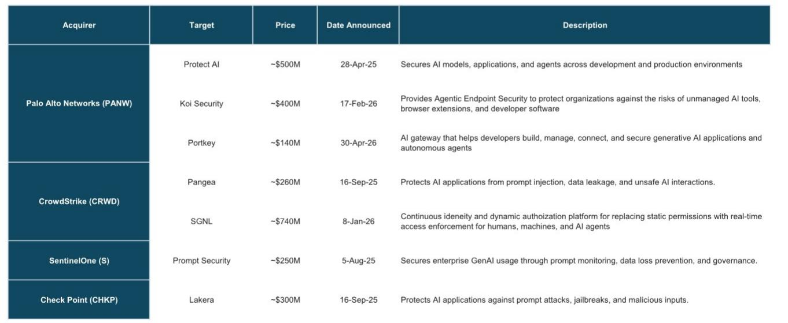
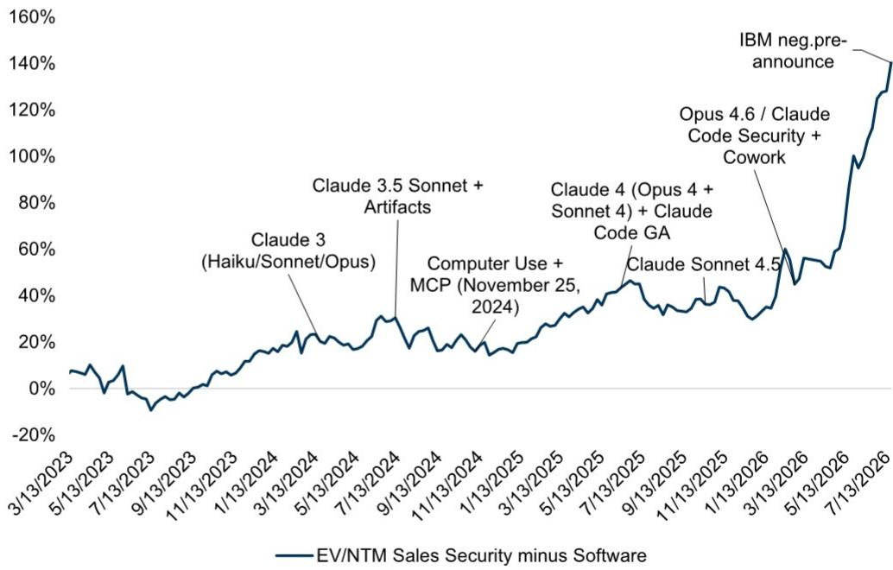
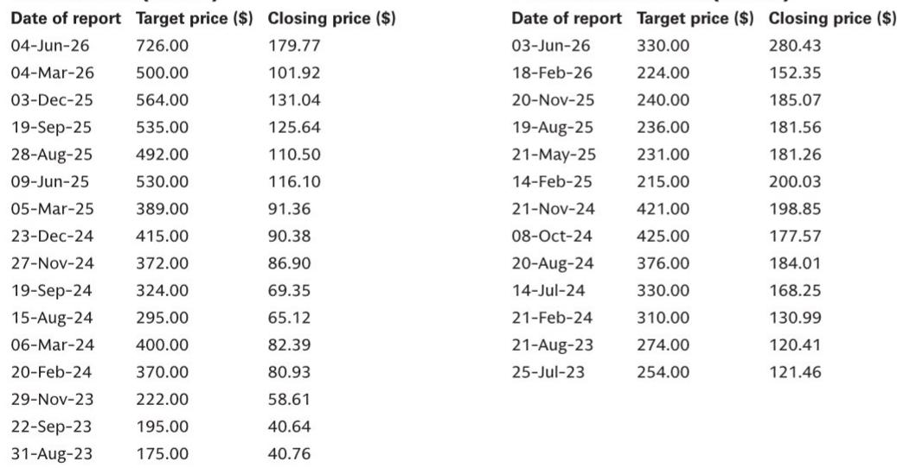

# 企业AI采用后2-3年，安全支出将迎来拐点——关注正确领先指标的观察者将获得先机

过去四个月，市场共识已发生明显转变：更多AI投入意味着更多安全投入，增量预算将流向当前的平台领导者。这一判断方向正确，但为短期业绩预期埋下了隐患。安全类公司的报价已提前反映了中期拐点，而基本面尚未兑现。企业级智能体应用仍不成熟，通常运行在隔离的沙盒环境中，安全厂商在此类场景下可见度有限，变现能力更弱。当前投入的增量资金流向的是细分产品概念验证和基础管理——而非上市公司观察者所依赖的平台级产品线。

关键问题不在于AI安全周期是否会到来，而在于何时到来。云安全周期提供了一个清晰的参照：从IaaS起步到安全支出从云支出的不到1%提升至2-5%的稳态水平，历时五年。以2025年作为企业推理应用场景的元年，同样的模式表明，AI安全预算的拐点最早可能在2026年第四季度或2027年上半年出现。这2-3年的时间差是当前该领域的主要矛盾。理解时间机制以及拐点前领先指标的观察者，将比简单外推叙事的人更具优势。

## 云安全周期证明：有意义的安全拐点滞后基础设施采用数年

云安全周期大约始于2015年，当时亚马逊首次披露AWS数据，验证了云作为高利润业务的可行性。随后数年，安全生态系统混乱且充满不确定性。首席信息安全官对如何保护云工作负载感到困惑。大量点状产品制造了噪音而非清晰度。超大规模云服务商开始将安全嵌入其平台即服务产品中，引发了对独立安全产品能否获得市场认可的疑问。许多CISO只是将云流量路由回现有的防火墙隔离区，对通常面向客户且固有敏感性较低的工作负载应用传统策略。

几个里程碑标志着市场的成熟。Gartner于2016年发布了首份《云安全市场指南》，并于2017年底发布了首份《云访问安全代理魔力象限》。第一波云安全并购浪潮于2018年到来，Palo Alto收购了Evident.io和RedLock，Check Point收购了Dome9。到2020年，拐点的条件已汇聚：CISO理解了云中所需的安全构建模块，点状产品已足够成熟以证明超大规模云服务商原生安全之外的支出合理性，客户开始将受监管和敏感的工作负载迁移到云端，多云架构变得普遍。COVID成为催化剂，在数周内迫使几乎完全的远程访问。

结果是，2019年至2020年间，安全支出从IaaS收入的约1.3%提升至2.9%。从IaaS周期开始到安全拐点的五年时间差，是值得关注的模式。基础设施建设耗时四年，安全才成为一个有意义的类别，即便如此，早期阶段仍以混乱、实验和点状产品采用为主，而非平台级部署。

## AI安全周期比云更快，但滞后机制相同

企业AI周期始于2025年，标志是从训练到推理工作负载的显著转变，以及第一波智能体应用试验。训练工作负载主要面向内部，所需增量安全支出极少。推理工作负载则不同：它们必须嵌入企业系统才能发挥作用，这意味着在从概念验证沙盒进入全面生产环境时，需要稳健的安全保障。这一转变尚未大规模发生。

2025年第二季度的行业交流证实，智能体应用仍主要运行在沙盒中——临时搭建和拆除的隔离环境。广泛的智能体AI采用数据与安全厂商有限的市场渗透之间存在脱节，部分原因在于一些活动发生在非托管或个人设备上，企业安全厂商在此类场景下可见度有限。安全团队拥有战略授权和近乎无上限的预算，但目前这些资源正用于细分产品评估和基础管理，而非推动上市公司报告收入的平台产品。

时间计算很直接。如果2025年是企业推理的元年，而云周期用了五年才出现拐点，那么AI安全拐点应出现在AI周期的第二至第三年——即2027年和2028年。这比云周期更快，与AI采用速度高于以往技术周期的观察一致。但距离现在仍有2-3年。需要关注的关键领先指标是推理和智能体工作负载从试验和沙盒向不受环境限制的生产用例的迁移。这一转变是进入2025年第三季度行业交流的焦点。

## 安全AI可寻址市场到2028年可带来2-3个百分点的增长提振，上行空间达4个百分点

根据公司披露以及对公有和私有厂商份额的合理假设，2025年AI安全收入估计约为1-2亿美元。这一数字相对于约170亿美元的AI IaaS推理可寻址市场，意味着约0.6%的附加率。云安全周期先例将2019年和2020年（该周期的第四和第五年）映射到2027年和2028年（AI周期的第二和第三年）。在此映射下，AI安全可寻址市场到2031年将达到约200亿美元，意味着行业增长率提升2个百分点。

这一预测是保守的。如果AI安全最终带来的价值超过云安全——考虑到智能体工作负载的复杂性和风险，这是合理的——7%的附加率将使可寻址市场弹性较高至400亿美元，并产生4个百分点的增长提振。Palo Alto已表示，其Prisma AIRS产品在某些场景下可占客户AI支出的8-10%，表明更高的附加率是可以实现的。结果范围很广，但方向明确：AI安全将成为重要的增长驱动力，但前提是生产工作负载取代沙盒实验。

## 现有安全平台在捕捉AI安全支出方面具有独特优势，因其护城河是结构性的，而非周期性的

更广泛软件领域最大的风险在于，新的AI价值流向新进入者——AI原生公司和前沿模型公司——而非现有企业。在安全领域，这一风险因两个结构性原因而显著降低。首先，安全路线图由机器学习创新驱动，而非生成式AI创新。安全公司讨论ML作为其研发基石已超过十年。它们的模型基于通过人类强化反馈循环构建的专有标注数据集进行训练，输出具有确定性。这些数据集从网络或端点层的控制点收集，无法通过合成数据复制。在某些情况下，专有数据收集涉及使用深度技术的人类资产。将AI应用于其专门数据，再应用于独特客户数据的安全厂商，无论通用大语言模型随时间表现如何，都能提供更好、成本更低的成果。

其次，安全领导者正积极从资金充裕的私营公司领域收购新技术资产。仅在过去18个月，估计并购支出就超过23亿美元。这一收购策略使现有企业能够吸收在AI应用安全、智能体身份和运行时保护等领域开发了专业能力的初创公司的创新。专有数据护城河与积极并购的结合，创造了新进入者难以克服的进入壁垒。

## 观察者决策框架：跟踪生产工作负载，而非叙事 momentum

报价与基本面之间的差距既带来风险也创造机会。应对这一差距的框架基于三个领先指标。首先，关注企业披露和行业交流中关于推理工作负载在生产环境与沙盒环境中运行比例的信息。安全支出的拐点将与企业停止试验智能体并开始依赖其执行关键业务功能的那一刻重合。其次，跟踪最可能产生可衡量收入的产品周期：面向智能体运行时用例的下一代AI检测与响应、安全运营中心基础设施升级、AI智能体身份安全，以及提示工程和数据保护等细分领域。第三，关注上市公司安全特定AI收入披露的加速情况。当前披露为早期且方向性，但附加率加速和交易规模上升的模式将表明拐点临近。

对于最大平台而言，乐观情景表明，如果时间逻辑成立，当前估值是合理的。对于两个最大的安全平台，示例情景显示，2028年自由现金流可能比当前估计高出30%，这意味着估值倍数低于更广泛的高增长软件群体。对于一个以身份为重点的平台，从较低相对增长率和估值中实现拐点的潜力更为显著。但这些结果取决于生产工作负载迁移的时间，而非叙事的方向。

安全AI周期是真实的、结构性的，并将使当今的平台领导者受益。但它尚未到来。相关报价已提前反映了拐点。基本面尚未兑现。能够捕捉最大价值的观察者，是将这2-3年的时间差视为需要精确跟踪的时间线，而非可以忽视的问题。

*仅供参考。部分内容可能基于源材料通过AI辅助生成、翻译、总结或编辑，可能存在遗漏或错误。请独立核实。本文不构成专业建议。*

仅供参考。部分内容可能基于源材料通过AI辅助生成、翻译、总结或编辑，可能存在遗漏或错误。请独立核实。本文不构成专业建议。

