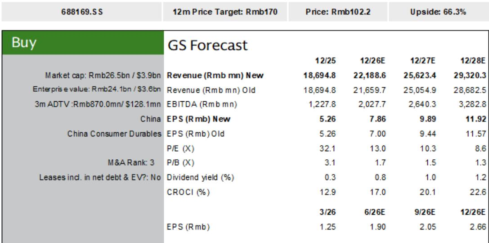
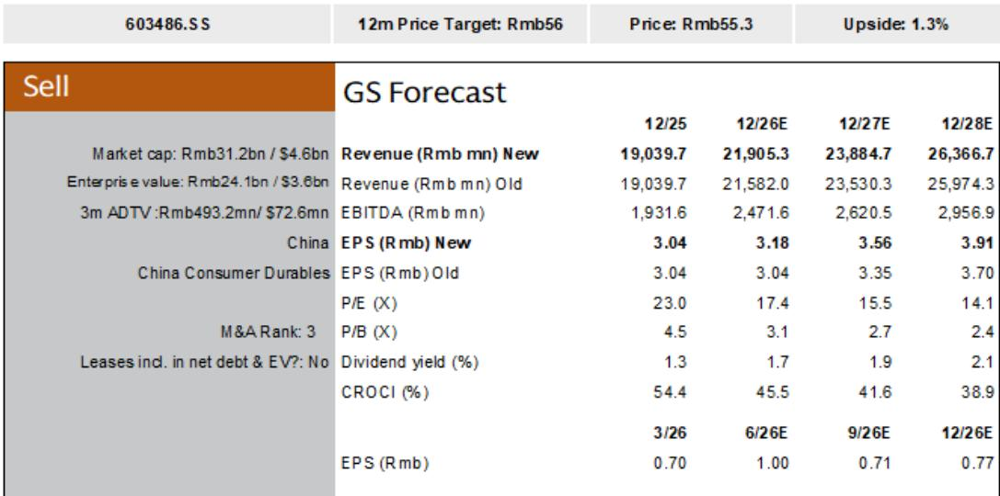
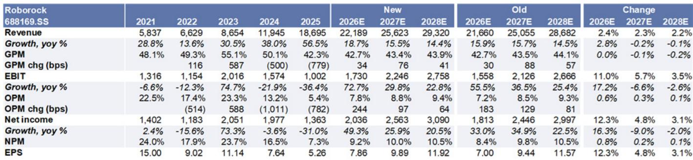

# 中国扫地机器人领军企业表现稳健：内需稳固，海外增长加速，利润率担忧过度

今年以来，市场对中国两家扫地机器人龙头企业的情绪明显转弱。石头科技和科沃斯的报价年内下跌约30%，表现弱于耐用消费品板块（下跌17%）和沪深300指数（下跌1%）。市场已消化三重担忧：去年以旧换新刺激政策带来的高基数压力、能源价格上涨引发的海外需求放缓、以及追觅科技激进竞争导致的利润率下滑。每一项担忧都有其逻辑，每一项都引发了明显的估值调整。然而，基于第二季度的数据，这些担忧似乎都被过度放大了。

2026年第二季度的数据呈现了不同的图景。国内行业增长在618购物节期间环比改善，表现优于多数其他家电品类。海外需求方面，应用下载量和亚马逊美国销售额均保持强劲，同比增长约40%。利润率非但没有崩溃，反而显示出企稳迹象，领先企业已放弃亏损补贴策略。此前压制这些公司报价的逻辑正在瓦解。对于观察者而言，问题在于哪家公司最能把握下一阶段的增长。

## 国内市场并非走弱，而是走向成熟，渗透率提升正在抵消高基数

最持久的看空论调是，2025年的以旧换新刺激政策提前透支了需求，为2026年制造了难以逾越的比较基数。这一论点并未得到验证。清洁电器行业的零售额增长在第二季度环比改善，618促销期间的表现优于多数其他家电品类。这并非统计上的偶然。它反映了一个被看空者低估的结构性驱动因素：扫地机器人在中国家庭的渗透率仍在持续提升。

主要电商平台的数据证实了这一趋势。在京东和淘宝天猫合计平台上，石头科技在扫地机器人领域的市场份额在第二季度同比跃升10个百分点至35%，在洗地机领域的份额则飙升13个百分点至29%。科沃斯旗下的添可品牌在扫地机器人领域保持约30%的份额，但在洗地机领域下降了3个百分点。总体情况清晰：品类总支出在增长，领先企业正在巩固其地位。2025年的高基数正在被消化，并未引发需求断崖。

这一战略意义在于，国内扫地机器人市场已进入新阶段。早期采用者的激增已经结束，但大众市场的普及周期仍在进行中。能够在此环境下维持份额增长的公司，展现的是真正的竞争优势，而不仅仅是搭乘品类顺风。618数据显示，石头科技在产品差异化和渠道策略上执行良好，在国内市场份额上正与科沃斯和追觅科技拉开差距。

## 海外需求并未放缓，而是在加速，中国企业正在抢占原有厂商份额

第二个看空论点——欧洲能源价格上涨将抑制消费者对可选耐用品的需求——并未在数据中得到体现。第二季度，领先扫地机器人品牌的海外应用下载量同比增长超过40%。亚马逊美国销售数据则揭示了更显著的趋势：第二季度扫地机器人品类销售额同比增长39%，且在6月出现明显加速，部分原因是Prime Day提前至6月23-26日（2025年为7月8-11日）。

最重要的动态并非品类增长率，而是市场份额的转移。在亚马逊美国，石头科技在扫地机器人领域的销售额份额在第二季度达到31%，同比上升9个百分点。科沃斯达到15%，上升9个百分点。与此同时，iRobot的份额仅上升5个百分点至16%，而Eufy的份额下降12个百分点至8%。中国领先企业不仅与市场同步增长，还在积极取代原有厂商。石头科技在亚马逊美国的销售额在第二季度同比增长99%，而科沃斯更是实现了240%的惊人增长。

这并非周期性上升。它反映了全球扫地机器人竞争力的结构性转变。中国制造商在产品特性、软件和供应链效率方面已达到持平或领先水平。海外扩张是由产品领先驱动，而非价格倾销。亚马逊美国行业平均售价正在上升而非下降，这与竞相降价的叙事相悖。中国领先企业的平均售价趋势虽有分化，但整体方向对品类有利。

## 利润率压力真实存在但可控，竞争格局已转向有利于自律者

第三个看空担忧——追觅科技的激进扩张将引发价格战——已部分被追觅科技自身所化解。该公司已表示将缩减此前的扩张策略。这是一个关键的转折点。当最具攻击性的竞争者后退时，定价环境趋于稳定。石头科技和科沃斯的管理层均已确认，他们在2026年已停止自掏腰包补贴消费者，并旨在维持稳定的扫地机器人定价。

第二季度的利润率情况喜忧参半，但并非令人担忧。净利润增长预计将落后于营收增长，反映了成本上涨和外汇逆风。然而，多重抵消因素正在发挥作用：对费用回报率的更高关注、公司层面的具体行动（如缩减亏损业务）、投资组合公司的投资收益以及美国关税退税。对于石头科技而言，缩减洗烘一体机业务的投资预计将支持利润率回升。

数据支持一种细致的观点。在国内市场，扫地机器人平均售价相对坚挺，而洗地机则显示出更大压力，尤其是在线上渠道。在亚马逊美国，行业平均售价正在上升，尽管各中国企业的趋势有所分化。全面价格战的风险似乎正在消退而非升级。市场此前已消化了最坏的利润率情景，而这一情景越来越不可能成为现实。

## 观察者的决策框架：在改善但非无风险的市场中，石头科技与科沃斯之比较

对于评估中国扫地机器人领先企业布局的机构观察者而言，决策框架必须权衡三个变量：营收增长轨迹、利润率回升路径、以及需求放缓情景下的下行保护。

在营收增长方面，石头科技预计在第二季度实现27%的同比增长，而科沃斯为15%。石头科技的优势来自两个方面：更快的国内份额增长（10-13个百分点，而科沃斯持平或下降）以及在海外市场（尤其是欧洲和亚太）更积极地拓展洗地机业务。科沃斯也在海外增长，由其添可品牌和割草机器人驱动，但其国内业务面临更高的基数和更激烈的竞争。

在利润率方面，两家公司都面临成本和外汇逆风，但石头科技有更明确的改善催化剂。其缩减洗烘一体机业务投资的决定，减少了对盈利能力的显著拖累。科沃斯的利润率回升更依赖于海外收入结构和投资收益，这些因素的可预测性较低。石头科技2026年每股收益预计同比增长49%，而科沃斯预计仅增长5%。

在下行保护方面，关键情景是行业层面的需求放缓，无论是由能源价格、地缘政治紧张还是宏观环境变化引起。在此情景下，石头科技处于更有利的位置，原因有二。首先，它显著增强了在美国主要线下零售商（包括Costco）的布局，这提供了科沃斯所缺乏的渠道多元化。其次，其在海外市场的洗地机业务扩张提供了第二个收入引擎，与核心扫地机器人需求的相关性较低。科沃斯更易受国内扫地机器人竞争的影响，且需要捍卫更高的基数。

基本面的评级分化反映了这种不对称性。石头科技在估值基础上，其风险状况与科沃斯不同。

## 二阶启示：扫地机器人市场对中国耐用消费品全球竞争力的启示

扫地机器人的故事对这两家公司之外具有更广泛的意义。它为中国耐用消费品公司如何驾驭复杂的全球环境提供了一个案例研究。关于中国企业只能靠价格竞争的叙事，在扫地机器人领域正被证伪——领先企业正在高端市场抢占份额并提升平均售价。关于中国国内需求结构性疲软的叙事，正受到渗透率仍在上升的品类的挑战，即便刺激效应已经消退。

尚未量化的关键风险是地缘政治。报告明确指出，目标估值倍数已被下调，以反映来自竞争和地缘政治紧张局势的更高增长不确定性。这是任何盈利模型都无法完全捕捉的变数。然而，第二季度的运营数据表明，公司自身正在有效管理这些风险——多元化渠道、扩展产品线、维持定价纪律。

对于观察者而言，结论是明确的。第二季度数据验证了石头科技的积极前景，并部分验证了对科沃斯的谨慎看法。市场约30%的回调创造了一个入场时机，它反映了最坏的假设，而数据正在反驳这些假设。公司正在执行。品类正在增长。竞争动态正在稳定。看空者已表达了观点。现在，数据正在说话。

*仅供参考。部分内容可能基于源材料通过AI辅助生成、翻译、总结或编辑，可能存在遗漏或错误。请独立核实。本文不构成任何专业建议。*

仅供参考。部分内容可能基于源材料通过AI辅助生成、翻译、总结或编辑，可能存在遗漏或错误。请独立核实。本文不构成任何专业建议。

