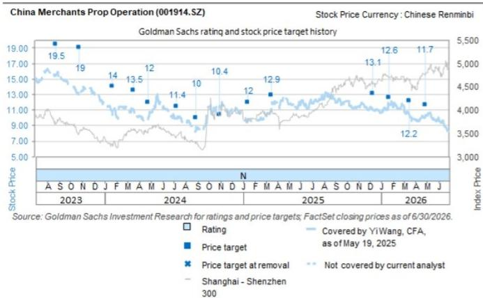

# CHINA MERCHANTS PROP OPERATION (001914.SZ)

# 股东回报前景不明及资产减值风险持续；下调至卖出

鉴于增长和股东回报改善的可见度较低，同时投资性房地产减值风险持续存在，我们将招商积余的评级从中性下调至卖出：

- 与覆盖范围内的其他物业管理公司相比，股东回报似乎并非其关注重点，目前没有迹象表明公司计划将股息支付率提高到当前约30%的水平以上，这使得招商积余的股息率（3%）在未来三年内处于我们覆盖范围内公司的最低水平（平均6-7%）。

- 在宏观环境面临挑战的背景下，投资性房地产减值风险加剧，可能影响公司盈利能力的稳定。招商积余是我们覆盖范围内“资产最重”的物业管理公司，其资产负债表上持有55亿元人民币的投资性房地产，相当于2026年第一季度总资产的27%。这些资产包括酒店、商场、办公楼、公寓和可租赁公共建筑，总建筑面积超过60万平方米，其出租率（2025财年同比下降2个百分点）和租金收入（同比下降4%，而招商积余2025财年整体收入增长12%）均出现下滑。我们预计，由于消费者信心不足和宏观环境逆风，租金重定价和出租率将面临不利影响，可能导致未来公允价值损失扩大（2025财年为1900万元人民币）。

- 利润率可能承压：我们预计招商积余的物业管理服务毛利率将持续低于同行平均水平约5个百分点，且短期内难以追赶，原因在于：1）迄今为止在现金收款方面的投入有限；2）非住宅空间对政府和国企客户的议价能力有限。因此，我们将2026-2028财年的毛利率预测平均下调0.3个百分点至约9.7%（2025财年为10.4%），并将2026-2028财年的盈利预测平均下调5%至6%的复合年增长率。我们的净利润预测目前平均比Wind一致预期低7%。

我们将12个月目标价从11.7元人民币下调至9.4元人民币，基于13倍（此前为15倍）2028财年自由现金流折现至2026财年，折现率为9.7%，并在公司长期倍数上增加了10%的折扣，以反映前述投资性房地产资产减值风险（相比之下，我们对中海物业和万物云因关联开发商风险分别应用了10%的信用折扣，对覆盖范围内其他公司未应用折扣）。相应地，我们的目标价意味着4%的上涨空间，而物业管理公司覆盖平均为24%。评级从中性下调至卖出。招商积余2026-2028财年市盈率分别为10倍/10倍/9倍，对应6%的每股收益复合年增长率加3%的股息率，而我们的物业管理覆盖公司平均为11倍/9倍/9倍，对应10%的每股收益复合年增长率加7%的股息率。如果我们看到以下情况，我们可能会对该公司的看法更加积极：1）管理层更加关注股东回报（更慷慨的股息政策或利用股份回购等渠道）；2）在投资组合优化和有效成本节约的推动下，利润率下行趋势得到缓解；3）更广泛的宏观环境和消费者信心复苏缓解了投资性房地产减值风险，或在重资产处置方面有强劲的执行力。

主要风险：1）由于集团层面协同效应或更广泛的物业行业复苏，第三方项目拓展超预期，尤其是在非住宅领域，导致规模增长超预期。2）在广泛消费复苏的推动下，专业化增值服务（如家政服务、新能源汽车充电站、房地产经纪等）发展快于预期，导致收入超预期。3）通过更有效的成本控制举措、高效的技术赋能和数字化、项目密度/规模效应的提升、更广泛的经济/劳动力市场复苏和消费者信心回升等，利润率表现比预期更具韧性。

<table><tr><td>001914.SZ</td><td>12个月目标价：9.4元</td><td colspan="2">股价：9.05元</td><td colspan="2">上涨空间：3.9%</td></tr>
<tr><td rowspan="2">卖出</td><td colspan="5">GS预测</td></tr>
<tr><td></td><td>12/25</td><td>12/26E</td><td>12/27E</td><td>12/28E</td></tr>
<tr><td>市值：95亿元 / 14亿美元</td><td>收入（百万元）新</td><td>19,273.2</td><td>20,503.7</td><td>21,786.0</td><td>22,909.4</td></tr>
<tr><td>企业价值：40亿元 / 5.93亿美元</td><td>收入（百万元）旧</td><td>19,273.2</td><td>20,503.7</td><td>21,786.0</td><td>22,909.4</td></tr>
<tr><td>3个月日均交易量：7480万元 / 1100万美元</td><td>EBITDA（百万元）</td><td>1,245.0</td><td>1,353.9</td><td>1,369.4</td><td>1,407.7</td></tr>
<tr><td>中国</td><td>每股收益（元）新</td><td>0.62</td><td>0.89</td><td>0.93</td><td>0.96</td></tr>
<tr><td rowspan="2">中国物业服务</td><td>每股收益（元）旧</td><td>0.62</td><td>0.91</td><td>0.98</td><td>1.03</td></tr>
<tr><td>市盈率（倍）</td><td>18.5</td><td>10.1</td><td>9.7</td><td>9.4</td></tr>
<tr><td>并购排名：3</td><td>市净率（倍）</td><td>1.1</td><td>0.8</td><td>0.8</td><td>0.7</td></tr>
<tr><td rowspan="4">租赁包含在净债务及企业价值中？：否</td><td>股息率（%）</td><td>2.3</td><td>3.0</td><td>3.1</td><td>3.2</td></tr>
<tr><td>CROCI（%）</td><td>28.7</td><td>27.0</td><td>29.0</td><td>26.8</td></tr>
<tr><td></td><td>3/26</td><td>6/26E</td><td>9/26E</td><td>12/26E</td></tr>
<tr><td>每股收益（元）</td><td>0.30</td><td>0.34</td><td>0.29</td><td>(0.04)</td></tr>
</table>

来源：公司数据、GS预测、FactSet。股价截至2028年7月20日收盘。

## 投资论点

招商积余是一家多元化的物业管理公司，在国企母公司招商蛇口的支持下，同时把握住宅和非住宅领域的机遇。我们给予该公司报告评级，原因是增长和股东回报改善的可见度较低，同时投资性房地产减值风险持续存在。与同行相比，股东回报似乎并非招商积余的关注重点，持续保守的股息支付率使其股息率在未来三年内处于我们覆盖范围内公司的最低水平。我们还看到了投资性房地产减值风险，招商积余是同行中“资产最重”的物业管理公司，其持有的投资性房地产相当于总资产的近30%，但在商业运营方面的记录参差不齐，这可能在宏观环境面临挑战的背景下导致盈利下行。我们还认为，招商积余在物业管理服务利润率和专业化服务发展方面还需要一些时间来追赶同行。该公司目前的估值与同行平均水平相似，但每股收益复合年增长率较低，股息率仅为同行平均水平的一半。

## 目标价、风险及方法论

我们的12个月目标价为9.4元人民币，基于13倍2028财年自由现金流折现至2026财年，折现率为9.7%。

主要风险：1）在集团层面协同效应或物业行业复苏的推动下，第三方项目拓展超预期，导致规模增长超预期。2）专业化增值服务发展快于预期。3）由于有效的成本控制举措，利润率表现优于预期。

## 披露附录

## Reg AC

我们，Yi Wang, CFA、Shi Xu和Kaiyan Jing，特此证明本报告中表达的所有观点准确反映了我们个人对相关公司及其证券的看法。我们还证明，我们的薪酬中没有任何部分直接或间接地与本次报告中表达的具体建议或观点相关。

贡献作者：Yi Wang, CFA GS（中国）证券有限公司，Shi Xu GS（中国）证券有限公司，Kaiyan Jing GS（中国）证券有限公司。

除非另有说明，本报告贡献作者披露中列出的个人是GS全球投资研究部门的分析师。

## GS因子概况

GS因子概况通过将股票的关键属性与市场（即我们评级的股票范围）及其行业同行进行比较，为股票提供投资背景。所描绘的四个关键属性是：增长、财务回报、倍数（例如估值）和综合（增长、财务回报和倍数的组合）。增长、财务回报和倍数是使用每只股票特定指标的标准化排名计算得出的。然后将指标的标准化排名进行平均，并转换为相关属性的百分位数。每个指标的具体计算可能因财年、行业和地区而异，但标准方法如下：

增长基于股票的前瞻性销售增长、EBITDA增长和每股收益增长（对于金融股，仅基于每股收益和销售增长），百分位数越高表示公司增长越高。财务回报基于股票的前瞻性ROE、ROCE和CROCI（对于金融股，仅基于ROE），百分位数越高表示公司财务回报越高。倍数基于股票的前瞻性市盈率、市净率、价格/股息（P/D）、EV/EBITDA、EV/FCF和EV/债务调整后现金流（DACF）（对于金融股，仅基于市盈率、市净率和P/D），百分位数越高表示股票交易倍数越高。综合百分位数计算为增长百分位数、财务回报百分位数和（100% - 倍数百分位数）的平均值。

财务回报和倍数使用GS分析师对未来至少三个季度后的财年末的预测。增长使用对未来至少七个季度后的财年与未来至少三个季度后的财年相比的输入数据（所有指标均基于每股）。

有关我们如何计算GS因子概况的更详细说明，请联系您的GS代表。

## 并购排名

在我们的全球覆盖范围内，我们使用并购框架检查股票，考虑定性因素和定量因素（可能因行业和地区而异），以纳入某些公司可能被收购的可能性。然后，我们将并购排名分配为对我们评级覆盖范围内的公司进行1到3分的评分，其中1表示公司成为收购目标的可能性高（30%-50%），2表示可能性中等（15%-30%），3表示可能性低（0%-15%）。对于排名为1或2的公司，根据我们的标准部门指南，我们将并购组成部分纳入我们的目标价。并购排名为3被认为不重要，因此不计入我们的目标价，并且可能在研究中讨论或不讨论。

## Quantum

Quantum是GS的专有数据库，提供详细的财务报表历史、预测和比率。它可用于对单个公司进行深入分析，或比较不同行业和市场的公司。

## 披露

中国招商局积余产业运营服务股份有限公司的评级相对于其覆盖范围内的其他公司：北京金隅集团、中国招商局积余产业运营服务股份有限公司、中国海外物业控股有限公司、华润万象生活有限公司、碧桂园服务控股有限公司、绿城服务集团有限公司、万物云空间科技服务股份有限公司、东方雨虹、保利物业服务股份有限公司、三棵树涂料股份有限公司、伟星新材

## 公司特定监管披露

以下披露涉及GS集团（及其附属机构，“GS”）与GS全球投资研究所涵盖的公司之间的关系。

中国招商局积余产业运营服务股份有限公司（9.05元）无公司特定披露。

## 评级/投资银行关系分布

GS投资研究全球股票覆盖范围

<table><tr><td rowspan="2"></td><td colspan="3">评级分布</td><td colspan="3">投资银行关系</td></tr>
<tr><td>买入</td><td>持有</td><td>卖出</td><td>买入</td><td>持有</td><td>卖出</td></tr>
<tr><td>全球</td><td>50%</td><td>34%</td><td>16%</td><td>65%</td><td>59%</td><td>43%</td></tr>
</table>

截至2026年7月1日，GS全球投资研究对3,104只股票进行了投资评级。GS将股票指定为买入和卖出，列入各个地区的投资清单；未如此指定的股票被视为中性。就FINRA规则要求的上述披露而言，此类指定等同于买入、持有和卖出。请参阅下面的“评级、覆盖范围和相关定义”。投资银行关系图表反映了每个评级类别中GS在过去十二个月内提供投资银行服务的公司所占的百分比。

## 目标价和评级历史图表

  
所示目标价应结合所有先前发布的GS报告（可能包含或不包含目标价）以及公司、其行业和金融市场的发展情况来考虑。

## 目标价历史表格 中国招商局积余产业运营服务股份有限公司 (001914.SZ)

报告日期 目标价（元） 收盘价（元）

<table><tr><td>2026年4月28日</td><td>11.70</td><td>10.12</td></tr>
<tr><td>2026年3月16日</td><td>12.20</td><td>10.38</td></tr>
<tr><td>2026年1月23日</td><td>12.60</td><td>11.75</td></tr>
<tr><td>2025年12月11日</td><td>13.10</td><td>11.06</td></tr>
<tr><td>2025年3月17日</td><td>12.90</td><td>11.92</td></tr>
<tr><td>2025年1月13日</td><td>12.00</td><td>9.79</td></tr>
<tr><td>2024年10月31日</td><td>10.40</td><td>11.56</td></tr>
<tr><td>2024年8月30日</td><td>10.00</td><td>8.79</td></tr>
<tr><td>2024年7月10日</td><td>11.40</td><td>9.42</td></tr>
<tr><td>2024年4月26日</td><td>12.00</td><td>10.12</td></tr>
<tr><td>2024年3月18日</td><td>13.50</td><td>10.95</td></tr>
<tr><td>2024年1月22日</td><td>14.00</td><td>10.23</td></tr>
<tr><td>2023年10月27日</td><td>19.00</td><td>13.53</td></tr>
<tr><td>2023年8月25日</td><td>19.50</td><td>15.63</td></tr>
</table>

表格中所示目标价未针对公司行为进行调整。

## 监管披露

## 美国法律法规要求的披露

请参阅上述公司特定监管披露，了解本报告提及的公司所需的任何以下披露：待定交易中的经理或联合经理；1%或其他所有权；特定服务的报酬；客户关系类型；先前期间的已管理/联合管理公开发行；董事职位；对于股票，做市和/或专家角色。GS可能作为本金交易本报告中讨论的发行人的债务证券（或相关衍生品）。

以下是额外的必要披露：所有权和重大利益冲突：GS政策禁止其分析师、向分析师汇报的专业人员及其家庭成员持有分析师覆盖范围内任何公司的证券。分析师薪酬：分析师的薪酬部分基于GS的盈利能力，其中包括投资银行收入。分析师作为高管或董事：GS政策通常禁止其分析师、向分析师汇报的人员或其家庭成员担任分析师覆盖范围内任何公司的高管、董事或顾问。非美国分析师：非美国分析师可能不是GS & Co. LLC的关联人员，因此可能不受FINRA规则2241或FINRA规则2242关于与主题公司沟通、公开露面以及交易分析师所覆盖证券的限制。

## 美国以外司法管辖区法律法规要求的额外披露

以下披露是相关司法管辖区要求的，除非已根据美国法律在上述范围内作出。澳大利亚：GS Australia Pty Ltd及其附属机构不是澳大利亚的授权存款机构（该术语在1959年银行法（联邦）中定义），不提供银行服务，也不在澳大利亚开展银行业务。除非GS另有约定，本研究及其任何访问权限仅适用于澳大利亚公司法意义上的“批发客户”。在制作研究报告时，GS Australia全球投资研究部门的成员可能会参加由研究报告主题公司和实体主办或组织的现场访问和其他会议。在某些情况下，如果GS Australia认为在特定情况下适当且合理，此类现场访问或会议的费用可能部分或全部由相关发行人承担。如果本文档内容包含任何金融产品建议，则仅为一般性建议，由GS在未考虑客户的目标、财务状况或需求的情况下编制。客户在根据任何此类建议采取行动之前，应考虑该建议是否适合其自身的目标、财务状况和需求。GS Australia和New Zealand的某些利益披露以及GS的澳大利亚卖方研究独立性政策声明的副本可在以下网址获取：https://www.goldmansachs.com/disclosures/australia-new-zealand/index.html。巴西：有关CVM第20号决议的披露信息可在https://www.gs.com/worldwide/brazil/area/gir/index.html获取。在适用的情况下，根据CVM第20号决议第20条的定义，本研究报告内容的主要负责巴西注册分析师是本报告开头指定的第一作者，除非文本末尾另有说明。加拿大：此信息仅供您参考，在任何情况下均不应被解释为GS & Co. LLC为在加拿大购买证券而向加拿大读者发出的广告、要约或招揽。GS & Co. LLC未根据适用的加拿大证券法在任何加拿大司法管辖区注册为交易商，通常不被允许交易加拿大证券，并且可能被禁止在加拿大的某些司法管辖区出售某些证券和产品。如果您希望在加拿大交易任何加拿大证券或其他产品，请联系GS Canada Inc.（GS集团公司的附属机构）或其他注册的加拿大交易商。香港：可根据要求从GS (Asia) L.L.C.获取本研究中提及的所覆盖公司证券的进一步信息。印度：可从GS (India) Securities Private Limited获取本研究中提及的主题公司或公司的进一步信息，研究分析师 - SEBI注册号INH000001493，地址：10th Floor, Ascent-Worli, Sudam Kalu Ahire Marg, Worli, Mumbai-400 025, India，公司识别号U74140MH2006FTC160634，电话+91 22 6616 9000，传真+91 22 6616 9001。GS可能实益拥有本研究报告提及的主题公司或公司1%或以上的证券（该术语在1956年印度证券合同（监管）法第2(h)条中定义）。SEBI的注册和NISM的认证绝不保证中介机构的业绩或向读者提供任何回报保证。GS (India) Securities Private Limited的合规官和读者投诉联系详情、年度合规审计报告副本以及其他相关信息和披露可在此链接获取：https://www.goldmansachs.com/worldwide/india/research-analyst。日本：见下文。韩国：除非GS另有约定，本研究及其任何访问权限仅适用于金融服务和资本市场法意义上的“专业读者”。可从GS (Asia) L.L.C., Seoul Branch获取本研究中提及的主题公司或公司的进一步信息。新西兰：GS New Zealand Limited及其附属机构不是新西兰的“注册银行”或“存款接受者”（如1989年新西兰储备银行法所定义）。除非GS另有约定，本研究及其任何访问权限适用于“批发客户”（如2008年金融顾问法所定义）。GS Australia和New Zealand的某些利益披露副本可在以下网址获取：https://www.goldmansachs.com/disclosures/australia-new-zealand/index.html。俄罗斯：在俄罗斯联邦分发的研究报告不是俄罗斯立法所定义的广告，而是信息和分析，其主要目的不是产品推广，并且不提供俄罗斯评估活动立法意义上的评估。研究报告不构成俄罗斯法律法规所定义的个性化研究交流，不针对特定客户，并且是在未分析客户的财务状况、投资概况或风险状况的情况下编制的。GS不对客户或任何其他人基于本研究报告可能做出的任何投资决策承担任何责任。新加坡：GS (Singapore) Pte.（公司编号：198602165W），受新加坡金融管理局监管，对本研究承担法律责任，如有任何与本研究报告相关的事宜，请联系该公司。台湾：此材料仅供参考，未经许可不得转载。读者应仔细考虑其自身的投资风险。投资结果由个人读者负责。英国：在英国可能被归类为零售客户（如金融行为监管局规则所定义）的人士，应结合先前GS关于本报告所提及公司的报告阅读本研究，并应参考GS International已发送给他们的风险警告。这些风险警告的副本以及本报告中使用的某些金融术语的词汇表，可向GS International索取。

欧盟和英国：关于欧盟委员会授权条例（EU）（2016/958）第6(2)条（包括该授权条例在英国脱离欧盟和欧洲经济区后作为英国国内法律和法规实施的情况）的披露信息，涉及研究交流或建议投资策略的其他信息客观呈现的技术安排，以及特定利益或利益冲突的披露，可在https://www.gs.com/disclosures/europeanpolicy.html获取，其中说明了与投资研究相关的利益冲突管理欧洲政策。

日本：GS Japan Co., Ltd.是一家金融工具交易商，在关东财务局注册，注册号为金商第69号，是日本证券交易商协会、日本金融期货协会、第二类金融工具交易商协会和日本投资管理协会的成员。股票买卖需支付与客户预先确定的佣金加上消费税。有关日本证券交易所、日本证券交易商协会或日本证券金融公司要求的任何适用披露，请参阅公司特定披露。

## 评级、覆盖范围和相关定义

买入（B）、中性（N）、卖出（S）分析师建议将股票作为买入或卖出列入各个地区的投资清单。被指定为投资清单上的买入或卖出取决于股票相对于其覆盖范围的总回报潜力。任何未被指定为投资清单上的买入或卖出且具有有效评级（即未暂停评级、未评级、早期生物技术、暂停覆盖或未覆盖的股票）的股票被视为中性。每个地区管理区域信念清单，这些清单选自各自地区投资清单上的报告评级股票，代表侧重于总回报潜力大小和/或在其各自覆盖区域内实现回报的可能性的研究交流。此类信念清单中股票的添加或移除由各自地区的投资审查委员会或其他指定委员会管理，并不代表分析师对这些股票的投资评级发生变化。

总回报潜力代表当前股价与目标价之间的上涨或下跌差异，包括所有已支付或预期股息，在目标价相关的时间范围内预期实现。所有覆盖的股票都需要目标价。总回报潜力、目标价和相关时间范围在每份添加或重申投资清单成员资格的报告中有说明。

覆盖范围：每个覆盖范围内的所有股票清单可通过主要分析师、股票和覆盖范围在https://www.gs.com/research/hedge.html获取。

未评级（NR）。当GS在涉及该公司的合并或战略交易中担任顾问角色时，当由于GS参与交易而存在法律、监管或政策限制时，以及在某些其他情况下，根据GS政策，投资评级、目标价和盈利预测（如适用）将被移除。早期生物技术（ES）。当该公司既没有通过II期临床试验的药物、治疗或医疗设备，也没有获得分销后II期药物、治疗或医疗设备的许可时，根据GS政策，不分配投资评级和目标价。评级暂停（RS）。GS已暂停该股票的投资评级和目标价，因为没有足够的基本面基础来确定投资评级或目标价。先前的投资评级和目标价（如有）不再对该股票有效，不应依赖。覆盖暂停（CS）。GS已暂停对该公司的覆盖。未覆盖（NC）。GS未覆盖该公司。

## 全球产品；分销实体

GS全球投资研究为GS的客户在全球范围内制作和分发研究产品。位于全球GS办事处的分析师对行业和公司以及宏观经济、货币、商品和投资组合策略进行研究。本研究在澳大利亚由GS Australia Pty Ltd（ABN 21 006 797 897）分发；在巴西由GS do Brasil Corretora de Títulos e Valores Mobiliários S.A.分发；公共沟通渠道GS Brazil：0800 727 5764和/或 contatogoldmanbrasil@gs.com。工作日（节假日除外）上午9点至下午6点开放。GS Brasil公共沟通渠道：0800 727 5764和/或 contatogoldmanbrasil@gs.com。工作时间：周一至周五（节假日除外），上午9点至下午6点；在加拿大由GS & Co. LLC分发；在香港由GS (Asia) L.L.C.分发；在印度由GS (India) Securities Private Ltd.分发；在日本由GS Japan Co., Ltd.分发；在韩国由GS (Asia) L.L.C., Seoul Branch分发；在新西兰由GS New Zealand Limited分发；在俄罗斯由OOO GS分发；在新加坡由GS (Singapore) Pte.（公司编号：198602165W）分发；在美国由GS & Co. LLC分发。GS International已批准本研究在英国的分发。

GS International（“GSI”），由审慎监管局（“PRA”）授权，受金融行为监管局（“FCA”）和PRA监管，已批准本研究在英国的分发。

欧洲经济区：GS Bank Europe SE（“GSBE”）是一家在德国注册的信贷机构，在单一监管机制下，受欧洲中央银行直接审慎监管，并在其他方面受德国联邦金融监管局（Bundesanstalt für Finanzdienstleistungsaufsicht, BaFin）和德意志联邦银行监管，并在欧洲经济区内分发研究。

## 一般披露

本研究仅供我们的客户使用。除与GS相关的披露外，本研究基于我们认为可靠的当前公开信息，但我们不保证其准确或完整，也不应依赖于此。本文所含信息、意见、估计和预测截至本文日期，如有更改，恕不另行通知。我们寻求适当地更新我们的研究，但各种法规可能阻止我们这样做。除某些定期发布的行业报告外，大多数报告根据分析师的判断不定期发布。

GS开展全球全方位、综合性的投资银行、投资管理和经纪业务。我们与全球投资研究所覆盖的相当大比例的公司存在投资银行和其他业务关系。GS & Co. LLC，美国经纪交易商，是SIPC的成员（https://www.sipc.org）。

我们的销售人员、交易员和其他专业人员可能会向我们的客户和主要交易部门提供口头或书面的市场评论或交易策略，这些评论或策略反映了与本研究中表达的意见相反的意见。我们的资产管理领域、主要交易部门和投资业务可能做出与本研究中提出的建议或观点不一致的投资决策。

本报告中指定的分析师可能不时与我们的客户（包括GS的销售人员和交易员）讨论，或在本报告中讨论交易策略，这些策略涉及可能对本报告中讨论的股票市场价格产生近期影响的催化剂或事件，这种影响可能在方向上与分析师对这些股票的已发布目标价预期相反。任何此类交易策略都不同于且不影响分析师对这些股票的基本股票评级，该评级反映了股票相对于其覆盖范围的总回报潜力，如本文所述。

我们及我们的附属机构、高级职员、董事和员工将不时持有本研究中提及的证券或衍生品（如有）的多头或空头头寸，作为本金进行交易，并买卖这些证券或衍生品，除非法规或GS政策禁止。

在GS安排的会议上，第三方演讲者（包括来自GS其他部门的个人）所持观点不一定反映全球投资研究的观点，也不是GS的官方观点。

本文引用的任何第三方，包括任何销售人员、交易员和其他专业人员或其家庭成员，可能持有与本文指定分析师表达的观点不一致的所提及产品的头寸。

本研究不构成在任何司法管辖区出售或招揽购买任何证券的要约，如果此类要约或招揽在该司法管辖区属于非法行为。它不构成个人建议，也未考虑个别客户的具体投资目标、财务状况或需求。客户应考虑本研究中的任何建议或推荐是否适合其特定情况，并在适当的情况下寻求专业建议，包括税务建议。本研究中提及的投资的价格和价值以及从中获得的收入可能会波动。过往表现并非未来表现的指引，未来回报不保证，且可能发生原始资本损失。汇率波动可能对某些投资的价值或价格或从中获得的收入产生不利影响。

某些交易，包括涉及期货、期权和其他衍生品的交易，会带来重大风险，并不适合所有读者。读者应查看当前的期权和期货披露文件，这些文件可从GS销售代表处或以下网址获取：https://www.theocc.com/about/publications/character-risks.jsp 和 https://www.goldmansachs.com/disclosures/cftc_fcm_disclosures。在涉及多次买卖期权（如价差）的期权策略中，交易成本可能很高。将根据要求提供支持文件。

全球投资研究提供的不同服务水平：GS全球投资研究向您提供的服务水平和类型可能与向GS内部和其他外部客户提供的服务有所不同，具体取决于多种因素，包括您个人对接收沟通频率和方式的偏好、您的风险状况和投资重点及视角（例如，市场范围、特定行业、长期、短期）、您与GS整体客户关系的规模和范围，以及法律和监管限制。例如，某些客户可能要求在发布特定证券的研究时收到通知，某些客户可能要求将分析师基本面分析所依据的特定数据通过数据馈送或其他方式以电子方式交付给他们。分析师基本面研究观点的任何变化（例如，股票评级、目标价或盈利预测的重大变化）将在通过电子方式广泛发布到我们的内部客户网站或通过其他必要方式向所有有权接收此类报告的客户传达之前，不会向任何客户传达。

所有研究报告同时通过电子方式发布到我们的内部客户网站，向所有客户分发并提供。并非所有研究内容都会重新分发给我们的客户或提供给第三方聚合商，GS也不对第三方聚合商重新分发我们的研究负责。对于与一种或多种证券、市场或资产类别（包括相关服务）相关的研究、模型或其他数据，请联系您的GS代表或访问https://research.gs.com。

披露信息也可在https://www.gs.com/research/hedge.html获取，或联系Research Compliance, 200 West Street, New York, NY 10282。

## © 2026 GS.

您仅被允许为自己使用而存储、显示、分析、修改、重新格式化并打印通过此服务提供的信息。未经GS明确书面同意，您不得转售或逆向工程此信息以计算或开发任何用于披露和/或营销的指数，或创建任何其他衍生作品或商业产品、数据或产品。未经GS明确书面同意，您不得以任何格式向任何第三方发布、传输或以其他方式复制此信息的全部或部分。前述限制包括但不限于使用、提取、下载或检索此信息的全部或部分，以训练或微调机器学习或人工智能系统，或向任何此类系统提供或复制此信息的全部或部分作为提示或输入。
