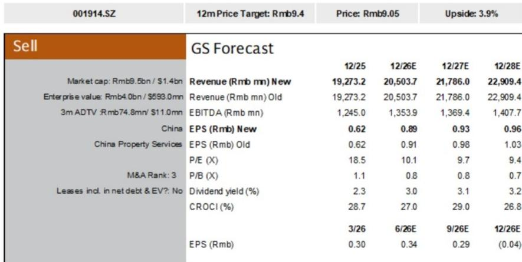

# 研究主题与行业变化观察

招商积余（001914.SZ）正面临一个结构性矛盾：作为物业公司，其资产负债表上却承载了相当于总资产近30%的研究性房地产，而这些资产在宏观环境变化下正持续产生减值不确定性。GS在最新报告中将其评级从中性下调至观点偏谨慎，核心判断并非短期业绩波动，而是股东回报优先级偏低与资产减值不确定性叠加后，公司在中长期维度上缺乏足够的回报吸引力。

在覆盖的物管公司中，招商积余的股息率处于最低水平。报告显示，其当前约30%的派息率没有提升计划，未来三年预期股息率仅约3%，而覆盖同行的平均水平为6%-7%。这意味着，即便估值倍数与同业相近，读者实际获得的现金回报却只有同业的一半左右。

## 1. 研究性房地产占比最高，减值不确定性持续累积

招商积余是覆盖物管公司中“资产最重”的一家。截至2026年第一季度，其资产负债表上持有55亿元研究性房地产，占总资产的27%。这些资产涵盖酒店、商场、写字楼、公寓及可租赁公共建筑，总建筑面积超过60万平方米。

但运营数据已出现明显走弱。报告指出，2025财年这些资产的出租率同比下降2个百分点，租金收入同比下降4%，而同期公司整体营收增长12%。两者之间的背离说明，非住宅类资产的运营效率正在影响整体表现。GS预计，在消费信心仍在调整和宏观环境存在不确定性的背景下，未来租金重定价将面临一定挑战，空置不确定性可能进一步加大，公允价值损失或从2025财年的1900万元显著扩大。

> **KC评论：** 物管公司通常被视为轻资产模式，但招商积余的资产结构更接近商业地产运营商。读者需要关注的是，这些研究性房地产的公允价值变动是否会持续影响利润表，而非仅仅关注物业管理主业的表现。

## 2. 物业管理毛利率长期低于同业，追赶难度较大

招商积余的物业管理服务毛利率预计将持续低于同业平均水平约5个百分点，且短期内难以缩小差距。GS给出了两个具体原因：一是公司在现金收缴方面的投入有限；二是非住宅业务面对政府和国企客户时议价能力受限。

基于这一判断，报告将2026至2028年的毛利率预测平均下调0.3个百分点，至约9.7%，低于2025财年的10.4%。同期盈利预测平均下调5%-6%，较Wind一致预期低约7%。这意味着市场对公司盈利能力的预期可能仍偏乐观。

## 3. 估值与回报组合缺乏吸引力

从估值角度看，招商积余当前交易在2026至2028年预期市盈率10倍、10倍和9倍的水平，对应每股收益年复合增长率约6%加上3%的股息率。而覆盖同行的平均估值为11倍、9倍和9倍，但对应的是10%的盈利增长和7%的股息率。

对应约4%的上行空间，远低于覆盖同行平均24%的上行空间。这一调整基于两个变化：估值倍数从15倍降至13倍，并额外增加了10%的长期估值折扣，以反映研究性房地产减值不确定性。

报告同时列出了可能改变判断的三个条件：管理层更重视股东回报（如提高派息或回购）、毛利率趋势在组合优化和成本控制下企稳、宏观环境和消费信心恢复缓解减值不确定性。这些条件目前均未出现明确信号。

For informational purposes only. Portions may be generated,translated,summarized,or edited with AI assistance based on source materials and may contain omissions or errors. Please verify independently. This is not investment,legal,tax,accounting,or other professional advice.

