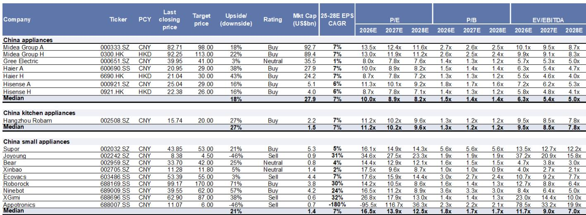
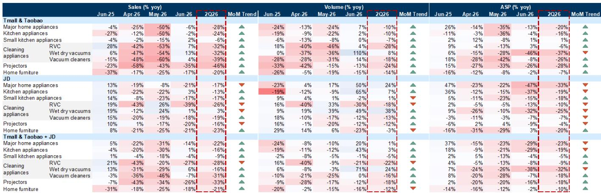
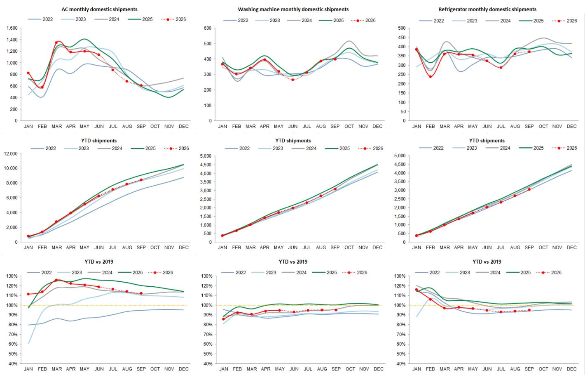

# 中国家电市场的分化趋势：内需逐步企稳，海外份额扩张成为主线

根据国家统计局数据，2026年6月中国家用电器和电子产品零售额同比下降9%。虽然仍为负值，但相比5月16%的降幅已有明显改善。这一环比收窄是首个信号，表明在经历了2025年补贴周期带来的需求前置和高基数效应后，国内市场可能正逐步接近阶段性底部。

然而，6月更值得关注的变化出现在出口端。整体家电出口增速从5月的高个位数增长提升至两位数同比增长。这并非全球需求的广泛周期性复苏，而是中国制造商通过产品创新、有竞争力的定价以及在欧洲等市场的战略布局，持续获取市场份额的故事。例如，美的凭借其PortaSplit产品，2026年上半年在法国、西班牙、德国和英国的空调销售额同比增长超过70%。

对于观察者而言，这一趋势清晰但容易被误读。国内市场的复苏将是渐进且温和的，受制于整体需求环境以及成本传导的难度。而海外机会则是结构性的。中国家电企业已不再是单纯的低成本出口商，它们正在建立品牌、开发定义品类的新产品，并在发达市场中持续获取份额——即便这些市场本身并未增长。能够从这一分化中受益的企业，未必是行业内规模最大的那些。

---

## 6月国内空调出货量降幅低于预期，折扣驱动需求与基数效应共同支撑

6月家电追踪数据中最受关注的指标是空调国内出厂量。整体同比下降7%，表面看偏弱，但需结合背景来看。5月降幅为15%，而行业自身生产计划曾预期6月下降23%。实际结果明显好于制造商自身的预期。

改善的原因是什么？2025年6月的基数较低，提供了技术性缓解。同时也有真实需求支撑的证据。6月618购物节期间空调折扣力度加大，似乎在宏观环境偏弱的情况下刺激了消费者购买。这一模式与近几个季度观察到的中国家电消费趋势一致：需求并未崩溃，但变得高度价格敏感且依赖促销。

从生产计划的前瞻信号来看，也透露出谨慎的积极信息。IOL生产计划显示，2026年第三季度国内空调出货量预计同比下降中个位数。这意味着降幅较第二季度将进一步收窄。换言之，趋势是逐步正常化，而非V型反弹。

---

## 海外市场成为增长引擎，中国品牌凭借产品创新而非单纯价格取胜

6月出口数据表现强劲。整体家电出口增速同比增长达到两位数，超出IOL及市场预期。空调出口品类是部分例外，出货量同比下降7%，但即便如此也好于生产计划预期。洗衣机与冰箱出口表现尤为稳健，5月（可获得产品级数据的最新月份）分别同比增长12%和23%。

这些数据背后的叙事并非简单的全球需求复苏。美国和欧洲的消费者信心出现环比改善，美国成屋签约销售数据也有所回升，这对家电需求是积极的领先指标。但整体需求图景仍显复杂。真正的驱动力是中国制造商的市场份额增长。欧洲热浪是一个催化剂，但它加速了早已存在的趋势：中国空调品牌凭借差异化的产品和有吸引力的价格，在发达市场获得认可。

美的的PortaSplit便是一个典型案例。它并非大宗商品化产品，而是一款专为欧洲市场设计的便携式空调。在欧洲，中央空调并不普及，而热浪却日益频繁。该产品满足了现有品牌未能充分服务的特定需求。这并非单纯靠价格竞争，而是识别市场空白并以精心设计的解决方案填补。

这种出口势头的可持续性得到了生产计划的支持，该计划预测第三季度将保持类似的增速。但更重要的结构性意义在于，中国家电企业正在构建能力，使其即便在全球需求周期转变时，也能维持并扩大其市场份额。

---

## 成本压力真实存在但可控，定价动态有利于具备品牌力的公司

两个周期性因素值得关注。过去一个月，航运费率进一步上升，这反映在每周的中国出口集装箱运价指数中。大宗商品成本虽略有回落，但仍高于历史常态。这些因素共同给整个行业带来利润率压力。

关键问题在于哪些公司能将成本上涨转嫁给消费者。6月零售数据给出了混合的答案。在线渠道中，主要家电的平均售价面临同比压力，尤其是空调和洗衣机等白色家电。部分小家电品类，如电压力锅，在线上和线下渠道均实现了平均售价的正增长，但这属于例外而非普遍现象。

这意味着在当前需求环境下，定价权有限。试图提价的公司可能面临市场份额流失给吸收成本上涨的竞争对手的风险。这种动态有利于拥有强大品牌资产、多元化产品组合以及规模优势来管理投入成本波动的制造商。同时也有利于拥有可观海外业务的公司，因为海外需求更强，定价动态可能更有利。

---

## 一个分析框架：三个问题区分领先者与落后者

6月数据不支持对中国消费品行业采取一概而论的多头或空头观点。该行业异质性很强。正确的方法是根据三个在当前环境下决定相对表现的标准来评估具体公司。

第一，公司收入中有多少来自海外市场，且该比例是否在增长？国内市场正在企稳，但复苏将是缓慢且不均衡的。海外市场是增长所在，且增长由可能持续的市场份额获取驱动。拥有较高且不断增长的出口敞口，特别是通过产品创新在发达市场获取份额的公司，具有结构性优势。

第二，公司是否拥有定价权，还是只能被动接受价格？在投入成本上升和国内需求疲软的时期，维持或提升平均售价的能力是关键区分因素。被迫吸收成本上涨的公司将面临利润率压缩。能够传导成本，或通过改善产品组合来提升平均售价的公司，将保护盈利能力。

第三，公司在其核心国内品类中是获得还是失去市场份额？6月数据显示出明显分化。在空调市场，美的、小米和海尔环比获得份额，而格力则失去份额。在清洁电器领域，石头科技保持市场领先地位，科沃斯获得份额。在疲软市场中获得份额是竞争力的有力信号，而失去份额则是一个警示信号。

应用这一框架，有三家公司值得关注。美的（A股和H股均获报告观点评级）结合了有限的国内下行风险（受股东回报支撑）与来自海外市场和新兴业务的显著上行潜力。九号公司凭借全面的产品线提供增长潜力，包括国内电动两轮车市场的份额增长、割草机器人的结构性增长以及海外电动两轮车潜力，且估值接近历史低位。石头科技定位于更快的收入增长，驱动力来自持续的全球市场份额扩张、向洗地机等新品类拓展，以及在国内业务策略调整后利润率有望恢复，同时竞争也在逐步缓和。

---

## 企稳过程正在进行，但真正的机会是结构性的，而非周期性的

6月数据确认了国内家电市场正处于企稳过程的早期阶段。基数效应正在减弱。环比改善已可见。第三季度应比第二季度表现更好。但这是正常化，而非重新加速。2025年刺激计划带来的需求前置造成了一个需要时间填补的缺口，宏观环境也不支持耐用消费品支出的强劲反弹。

出口故事则不同。中国家电企业正处于从低成本制造商向拥有创新产品和日益增长的品牌认知度的全球竞争者转变的结构性进程中。欧洲热浪加速了这一趋势，但该趋势早已存在，并将持续下去，无论天气如何。在海外获胜的公司不仅仅是在销售更多产品，它们正在建立能够产生长期经常性收入和利润的业务。

对于观察者而言，6月数据的关键启示是，该行业并非朝着单一方向移动，而是在分化。国内周期正在企稳，但海外增长故事才是长期回报的关键。能够驾驭这两种动态——在管理国内低谷的同时抓住海外份额增长机会——的公司，将变得更加强大。

*仅供参考。部分内容可能基于源材料通过AI辅助生成、翻译、总结或编辑，可能存在遗漏或错误。请独立核实。本文不构成任何专业建议。*

仅供参考。部分内容可能基于源材料通过AI辅助生成、翻译、总结或编辑，可能存在遗漏或错误。请独立核实。本文不构成任何专业建议。

