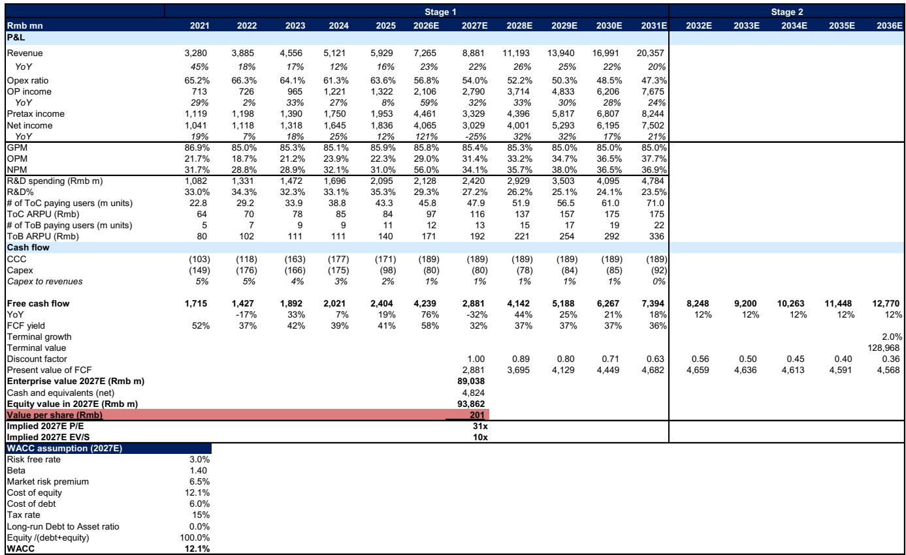
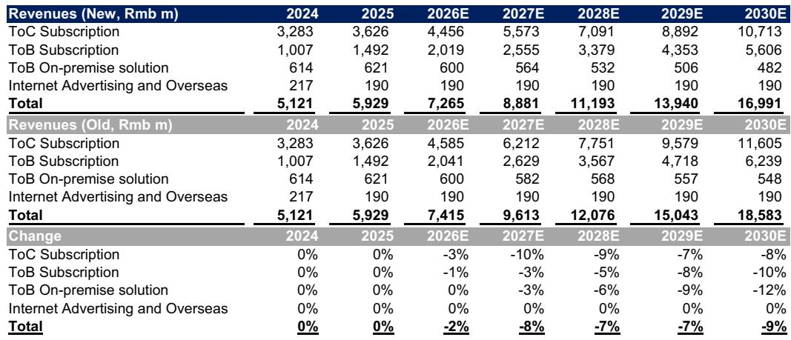
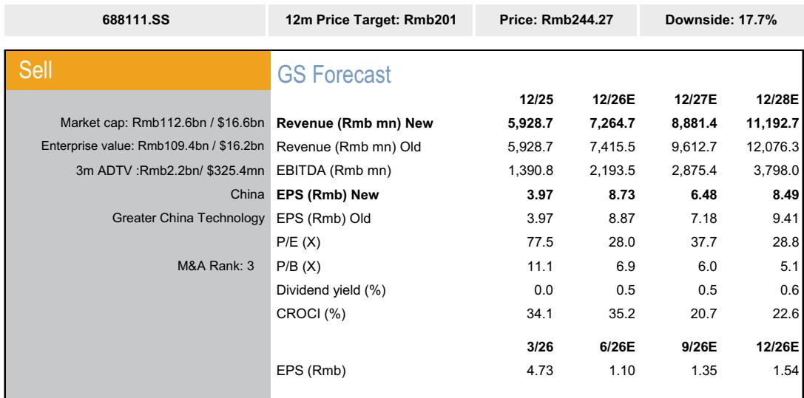

# GS：中国软件WAIC2026与金山办公评级调整

2026年7月上海WAIC期间，GS团队观察到一系列AI新品发布，覆盖基础模型、AI智能体与边缘设备。与此同时，该机构对金山办公做出评级调整，将其从中性下调至观点偏谨慎，核心原因是估值偏高与AI付费转化节奏慢于预期。

这份报告的主判断是：AI产品迭代正在加速，但企业级软件公司能否将技术能力转化为可持续的收入增长，仍面临付费意愿和ROI验证的双重考验。金山办公的案例提供了一个观察窗口。

## 1. WAIC 2026新品密集发布，AI智能体与边缘设备成为焦点

GS在WAIC现场看到多个方向的产品进展。金山办公推出WPS Comate作为面向企业客户的AI智能体，能够完成复杂办公任务；Infinigence AI发布InfiniClawBox，用于合同与文档分析。多模态领域出现Deemos Hyper3D Rodin用于3D内容生成，以及FrameX-AI视频平台用于生成交互式视频内容。

边缘设备方面，基于增强的端侧AI模型，努比亚豆包AI手机和荣耀机器人手机（基于通义千问模型）展示了AI智能体在设备端的应用前景。GS认为，智能体类AI新产品的推出将推动查询量和token消耗增长，但长期采用率仍取决于AI智能体能否为终端用户带来可量化的回报表现。

> **KC评论：** 报告没有直接比较各家产品的技术参数，而是将观察重点放在“AI智能体ROI”这个判断标准上。这意味着，对于读者而言，评估AI软件公司时，付费转化率和用户留存数据可能比产品功能列表更具参考价值。

## 2. 金山办公评级调整：AI付费转化需要更长时间

GS将金山办公评级从中性下调至观点偏谨慎，较当前价格244.27元隐含约17.7%的节奏变化空间。调整的核心原因是，WPS AI的付费转化率和用户采用率可能需要更长时间才能提升。

报告指出两个具体制约因素：一是来自同行的AI原生产品定价具有竞争力；二是目前缺乏足够多的AI使用场景，能够为终端用户带来正向ROI。在企业端，WPS 365订阅业务保持强劲增长，集成了企业知识库和AI功能，但企业订阅在现阶段规模仍然较小。

基于这些判断，GS将2026-2028年盈利预测下调2%至10%，主要反映ToC和ToB订阅收入预期降低。尽管有这些调整，该机构仍预计金山办公2026-2028年净利润复合年增长率约为29%。

## 3. 估值框架调整：隐含市盈率从45倍降至31倍

GS采用DCF估值模型，将2032-2036年第二阶段自由现金流增长率从25%下调至12%，终端增长率维持2%。隐含市盈率降至31倍，低于此前45倍，也低于公司历史均值减一个标准差（44倍）。

报告认为，当前估值已经偏高。GS的盈利预测与市场共识存在差异：2026年净利润预测比彭博一致预期高24%，主要因为公司一季度非经常性收益超预期；但2027年净利润预测仅高出5%，反映该机构对ToC用户AI付费转化仍持谨慎态度。

## 4. 观察框架：AI软件公司估值的关键变量

从金山办公的案例可以提炼出一个可复用的分析框架。评估AI软件公司时，需要关注三个核心变量：AI付费用户渗透率、ARPU提升路径、以及企业端客户采用速度。

GS在报告中列出了三个可能使判断变得更为积极的因素：ToC会员体系转换速度快于预期、WPS 365企业客户渗透快于预期、以及AI货币化速度快于预期。这些因素恰好对应上述三个变量，也构成了未来跟踪这家公司时需要重点观察的信号。

报告没有给出具体的时间表，但隐含的判断是：在AI应用从技术展示走向商业闭环的过程中，估值溢价能否维持，取决于付费转化数据能否跟上产品迭代节奏。

For informational purposes only. Portions may be generated, translated, summarized, or edited with AI assistance based on source materials and may contain omissions or errors. Please verify independently. This is not investment, legal, tax, accounting, or other professional advice.

