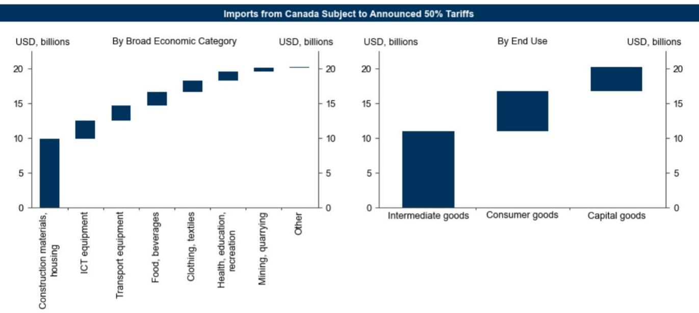

# Canada Economics Comment: New US Tariff Announcements and Macroeconomic Implications

BOTTOM LINE: The White House recently announced new tariffs on a range of Canadian goods, which are due to take effect after a 30-day window. If implemented, estimates suggest these tariffs could have a modest effect on GDP growth, while the inflation impact appears limited under baseline assumptions. While it remains unclear whether these tariffs will ultimately be implemented, particularly given ongoing trade negotiations, the evolving trade environment may influence the central bank's policy approach. Current expectations suggest the policy rate could remain at current levels through the coming period.

## MAIN POINTS:

1. The White House announced new tariffs on a range of Canadian goods, which are due to take effect after a 30-day window. The announced tariffs would raise the effective tariff rate on Canadian imports.

2. Applying estimated impulses from previous tariff adjustments to the announced measures, and adjusting for limited retaliation assumptions, implies a modest drag on real GDP growth over the next 12 months. Estimates incorporate effects from weaker export growth and reduced investment due to heightened uncertainty, partly offset by shifts in consumer preferences toward domestically-produced alternatives. Assuming limited retaliation, inflation effects appear contained. However, if retaliation were to occur, previous analysis suggests tariff increases could pass through to consumer prices within a few months.

3. It remains unclear whether the tariffs will be implemented at the end of the 30-day window, especially given ongoing trade negotiations. Officials have described the tariffs as a "targeted measure" in response to trade barriers, while noting that negotiations would continue. The Canadian government has indicated readiness to intensify negotiations, without signaling plans for retaliation, marking a departure from previous responses.

4. The main implication for the Canadian outlook is that the escalation and added uncertainty are likely to weigh on investment and growth—whether or not the tariffs are implemented—thereby influencing the policy outlook. Current forecasts that the central bank will maintain the policy rate at current levels partly reflect views that trade risks would limit willingness to adjust rates. The central bank has signaled that if significant new trade restrictions are imposed, further policy adjustments may be considered. While the latest news does not necessarily indicate immediate policy changes, it may affect the likelihood of normalization toward the neutral rate range.

Exhibit 1: The White House Announced Tariffs on Canadian Imports  
  
Source: USITC, The White House, GS Global Investment Research
