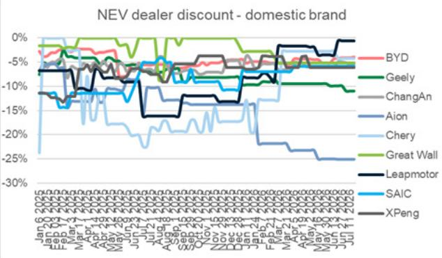
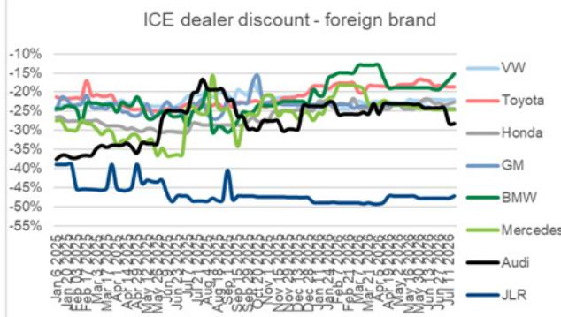
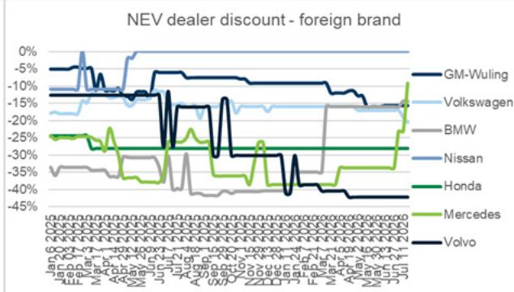

# GS：中国新能源车周度图册2026年第29周

2026年7月第三周，中国新能源车市场出现了一个值得注意的信号。GS在最新一期周度图册中指出，主要新能源车企合计订单环比增长31%，同比增长5%。这一增长并非来自全行业普涨，而是由两款新车型的集中交付驱动。

小鹏Mona L03在7月13日至19日当周录得5.92万辆不可退订单，其中70%来自纯电版本。理想L6改款于7月16日上市，带动理想汽车订单环比增长131%。小米汽车订单环比增长32%，但相对量仍处于中等水平。三家车企合计贡献了当周绝大部分增量。

从更宏观的视角看，7月1日至12日，国内乘用车零售量同比下降15%，较上半年20%的降幅有所收窄。新能源车零售渗透率达到63.1%，批发渗透率69.1%，均高于6月水平。这意味着燃油车市场份额仍在调整，但新能源车自身的同比增速也在节奏变化。

> **KC评论：** 小鹏Mona L03的订单结构值得关注。5.92万辆不可退订单中纯电版本占七成，说明该车型在10-15万元价格带对纯电需求的撬动能力超出预期。但GS报告并未披露这些订单的交付周期和退订率，后续交付效率仍是观察重点。

## 1. 经销商折扣同步收窄，价格竞争烈度短期降温

截至7月18日，新能源车经销商平均折扣率为6.94%，低于一周前的7.29%和2025年同期的8.13%。燃油车平均折扣率从20.11%降至19.55%。比亚迪王朝与海洋系列折扣率从4.10%降至3.95%。

折扣收窄通常被解读为终端需求改善的信号。但结合乘用车零售量仍同比下降15%的数据，更合理的解释是：车企在新车型上市期间主动调整了老车型的促销力度，而非需求全面回暖。折扣率的变化更多反映了产品周期的节奏切换。

## 2. 上游电池材料价格连续三周持平

电池级碳酸锂价格维持在每吨15.3万元，连续三周无变化。方形磷酸铁锂电芯和方形三元电芯价格同样保持稳定。GS数据显示，碳酸锂价格在2026年二季度环比仅上涨1%，远低于2025年三、四季度的112%和74%涨幅。

上游价格企稳对中游电池企业和整车厂都是有利因素。成本端不再快速上涨，意味着车企在定价策略上有更多腾挪空间。但这也暗示，锂盐供需已从2025年的结构性短缺转向相对平衡，未来价格上行空间有限。

## 3. 新车型集中上市窗口即将开启

GS列出了未来三周的关键事件：7月23日领克将发布07 GT，7月28日极氪推出五座版9X，7月30日小米举办SkyNomad技术活动，8月8日阿维塔发布07 L。这些车型覆盖了从紧凑型SUV到大型SUV、从纯电到增程的多个细分市场。

新车型的密集投放将直接决定8月订单走势。GS报告没有给出预测，但历史数据表明，新车型上市后2-4周是订单爬坡的关键观察期。小鹏Mona L03的订单能否持续转化为交付，理想L6改款能否维持环比增长，将是未来几周市场关注的焦点。

这份周度图册的核心价值不在于给出结论，而在于提供了一个可追踪的观察框架：订单量、折扣率、渗透率、上游价格四个维度交叉验证，比单一数据更能反映市场真实温度。对于关注新能源车产业链的读者，每周跟踪这些指标的变化，比依赖月度销量汇总更能捕捉到转折信号。

For informational purposes only. Portions may be generated,translated,summarized,or edited with AI assistance based on source materials and may contain omissions or errors. Please verify independently. This is not investment,legal,tax,accounting,or other professional advice.

