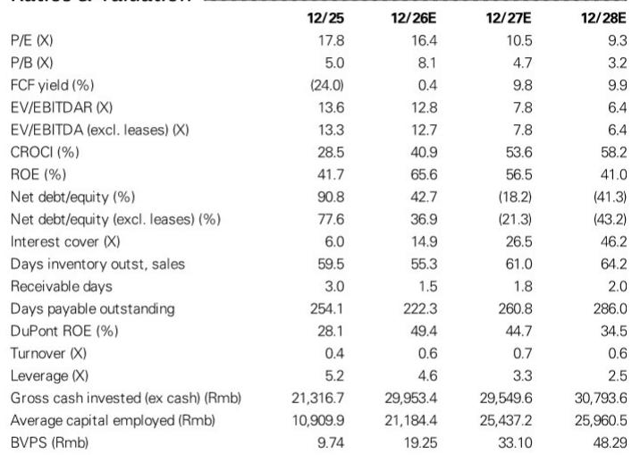
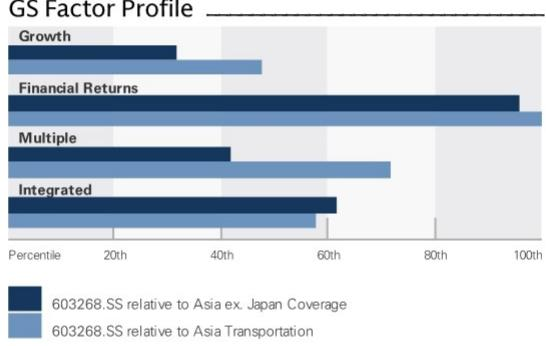
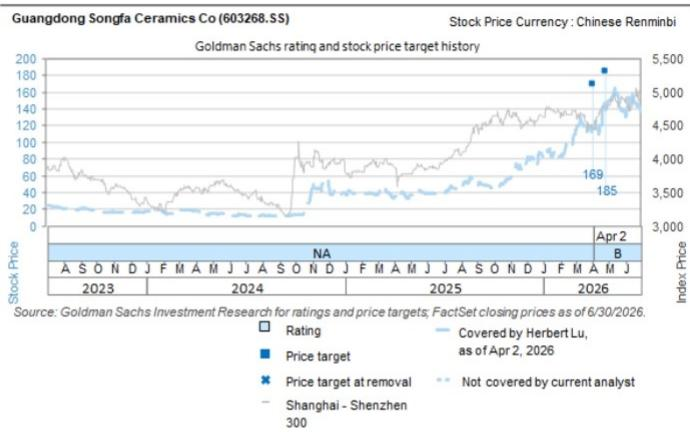

# 松发股份定增定价每股146元——折价约2%

7月21日收盘后，松发股份（恒力重工）发布了定向增发的最终发行价：每股146元，较基准价149元折价约2%。本次发行4,790万股，募集资金70亿元。从与读者的沟通反馈看，这一小幅折价反映出参与方对公司中长期前景仍持乐观态度——考虑到定增股份有6个月锁定期，折价幅度有限本身是一个信号。

本次定增的基准价来自定价基准日（7月8日）前20个交易日均价，最终发行价较7月21日收盘价156元折价约6%。估算显示，考虑融资成本节省后，本次定增对每股收益的稀释约为3.0%。而公司最初于2026年1月15日提出70亿元定增方案时，按当日收盘价87.5元计算，稀释幅度约为5.9%。报告认为，市场已基本消化了这部分稀释影响。

## 1. 三期产能已于2026年6月投产，新增产能超过前两期总和

本次定增募资直接用于三期产能扩建。报告显示，三期已于2026年6月投入运营，预计可新增100万补偿总吨（CGT）产能，较前两期合计产能增幅超过30%。报告估算，在满产状态下，现有三期产能可在2027-2028年产生140至160亿元盈利。

> **KC评论：** 三期产能的投产时间点值得注意——2026年6月已开始运营，而定增定价在7月完成。这意味着读者在认购时已经能看到部分产能爬坡的实际情况，而非完全基于预期。

## 2. 恒力重工有望在2027年成为全球第二大造船商

报告认为，恒力重工正成为全球造船产能增量的主要贡献者。报告预计其2025-2027年产能复合年增长率达29%，而全球同行同期增速约3%。到2026年底，恒力重工的全球产能份额预计升至7%。其订单覆盖年数将降至2.7倍，低于全球平均的3.6倍和中国平均的4.0倍，成为全球主要船厂中订单覆盖最低的企业之一。

这一判断的核心逻辑是：新船订单需求仍然强劲，尤其是油轮领域。报告认为油轮超级周期叠加船队老龄化，将继续带来新订单，推动订单簿增长约50%至390亿美元。

## 3. 四期产能若落地，现有产能规模可能弹性较高

报告还提到了四期产能的可能性。报告估算，如果恒力重工最终完成四期扩建，新增产能可能相当于现有三期总产能的100%。报告认为，新船订单的强劲需求足以消化这部分新增产能。但四期目前尚未正式确认，报告也未给出具体时间表。

## 4. 财务数据反映产能爬坡期的收入与盈利增长路径

从财务预测看，松发股份的收入从2025年的215亿元增长至2026年的536亿元（增幅149%），2027年进一步增至721亿元（增幅35%），2028年增至746亿元（增幅3%）。EBITDA利润率从2025年的19.1%逐步提升至2028年的27.4%。每股收益从2025年的2.73元升至2026年的9.51元，2027年预计为14.80元，2028年为16.67元。

自由现金流在2025年为负（-114亿元），主要受资本开支影响；2026年转正至6亿元，2027-2028年预计维持在148-149亿元。净负债/权益比率从2025年的90.8%降至2026年的42.7%，2027年预计转为净现金状态。

这些数字背后反映的是：产能扩张期的高资本开支正在过去，现金流结构正在改善。但报告也列出了多项不确定性，包括船舶交付延迟、钢价高于预期、新订单低于预期、人民币升值超预期，以及其他船厂产能扩张快于预期。

For informational purposes only. Portions may be generated,translated,summarized,or edited with AI assistance based on source materials and may contain omissions or errors. Please verify independently. This is not investment,legal,tax,accounting,or other professional advice.

For informational purposes only. Portions may be generated,translated,summarized,or edited with AI assistance based on source materials and may contain omissions or errors. Please verify independently. This is not investment,legal,tax,accounting,or other professional advice.

