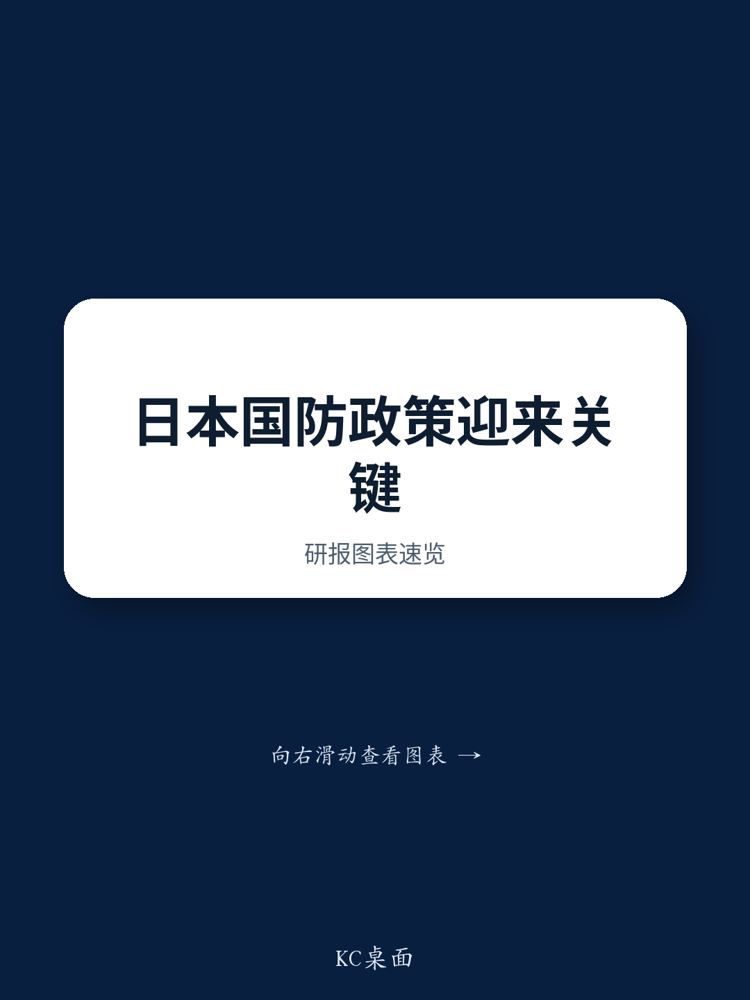

# Japan’s 2026 Budget Framework Signals a Structural Shift in Defense Policy — But the Real Catalyst Arrives This Winter

On July 21, the Japanese government approved the Basic Policy on Economic and Fiscal Management and Reform 2026, known as Honebuto 2026, via a formal Cabinet decision. For those tracking the aerospace and defense sector, the document is significant not for what it quantifies — it contains no specific defense spending targets — but for what it sets in motion. The policy explicitly accelerates deliberations on Japan’s three foundational security strategy documents, which are scheduled for revision by the end of 2026. That revision process, not the budget outline itself, will determine the scale, structure, and funding mechanisms of Japan’s next five-year defense buildup plan.

The timing matters. Japan’s FY2027 budget, the first under the new Defense Buildup Program, will be formulated directly from these revised strategy documents. That means the period between now and year-end is the single most important catalyst window for the sector. Companies in Japan’s defense supply chain, particularly those involved in unmanned systems, stand-off munitions, space-based assets, and production capacity expansion, face a concentrated period of policy clarification that will define their revenue visibility for the next half-decade.

What Honebuto 2026 reveals is a government that has internalized the need for structural, multi-year investment frameworks rather than annual appropriations. The policy outlines 17 strategic investment areas, including AI and semiconductors, the defense industry and aerospace, and shipbuilding. It calls for multi-year investment support measures and regulatory reforms that break free from the constraints of single-year budgeting. For defense contractors, this is not merely a procedural change. It signals that the government intends to treat defense industrial capacity as a long-term strategic asset, not a cyclical spending line.

## The Absence of Defense Spending Targets in Honebuto 2026 Is Intentional, and It Shifts Attention to the Year-End Strategy Revision

A casual reading of the policy outline might disappoint those looking for hard numbers. There is no explicit defense spending figure, no percentage-of-GDP target, no five-year aggregate commitment. But that absence is not a sign of hesitation. It reflects the deliberate sequencing of Japan’s policy process. Honebuto sets the economic and fiscal framework. The three security strategy documents — the National Security Strategy, the National Defense Strategy, and the Defense Buildup Program — will contain the specific spending parameters. Those documents are due for revision by the end of 2026.

The logic is clear: the government wants to align its defense commitments with the broader fiscal and growth strategy before locking in multi-year spending. The FY2027 budget, which will be the first under the new Defense Buildup Program, will be built directly on these revised strategies. That creates a tight feedback loop. Observers should expect the year-end strategy revision to provide the quantitative anchor that Honebuto deliberately omits. The sector’s valuation trajectory between now and December will be driven by the market’s evolving expectations for that anchor, not by backward-looking budget data.

## The Policy Framework Explicitly Targets New Forms of Warfare, Creating a Procurement Pipeline for Unmanned Systems, Stand-Off Capabilities, and AI-Enabled Defense

Honebuto 2026 does not merely reaffirm existing defense priorities. It introduces specific language around adapting to new forms of warfare, including the accelerated introduction of unmanned assets, stand-off defense capabilities, and enhanced utilization of data and AI. This is not aspirational rhetoric. It is a procurement signal. The government is telling the defense industrial base that the next five-year plan will prioritize capabilities that extend reach, reduce personnel risk, and integrate data-driven decision-making.

For companies in the unmanned systems and defense AI space, this creates a multi-year demand signal. Japan’s geographic constraints and demographic pressures make unmanned and stand-off capabilities strategically necessary, not merely technologically interesting. The policy’s emphasis on data and AI utilization also suggests that software-defined defense capabilities will receive greater procurement attention than in previous cycles. Observers should evaluate defense contractors not just on their traditional platform programs, but on their ability to deliver networked, autonomous, and AI-augmented systems.

## Government-Owned, Contractor-Operated Arrangements and Expanded Export Frameworks Signal a Structural Change in How Japan Manages Defense Industrial Capacity

One of the most consequential elements in the policy outline is the explicit consideration of Government-Owned, Contractor-Operated (GOCO) arrangements for critical equipment that is difficult to procure stably. This is a direct response to supply chain vulnerabilities exposed by the war in Ukraine and by Japan’s own production constraints. The GOCO model allows the government to own the physical assets — factories, tooling, specialized equipment — while private contractors operate them. That shifts the risk profile for defense companies. It reduces the capital expenditure burden on contractors while guaranteeing government demand for the output.

The policy also touches on a framework in which the government takes a leading role in equipment transfers, or exports. For decades, Japan’s defense export posture was constrained by domestic legal and political barriers. The policy language suggests a more proactive government role in facilitating exports, which would allow Japanese defense companies to achieve greater production scale and lower unit costs. Combined with the GOCO framework, this points toward a defense industrial model that resembles the approach taken by larger defense exporters: government-backed capacity, multi-year production runs, and export-led cost efficiencies.

## The Ministry of Defense’s SBIR Program and the Satellite Constellation Initiative Represent Targeted Mechanisms to Accelerate Innovation and Space-Based Defense Capabilities

Two specific programs mentioned in the policy deserve attention. The first is the Ministry of Defense version of the Small Business Innovation Research (SBIR) program. This is a direct attempt to channel defense funding into smaller, more agile technology companies, particularly in areas like AI, cybersecurity, and advanced materials. For observers, this creates a new vector for defense exposure beyond the traditional prime contractors. Companies that can navigate the SBIR process and transition from prototype to production stand to benefit from a more structured innovation pipeline.

The second is the construction of a satellite constellation to strengthen space security. Japan’s space policy has traditionally focused on civilian applications and international cooperation. The explicit linkage of a satellite constellation to defense objectives represents a significant strategic shift. Space-based assets enable persistent surveillance, secure communications, and resilient command-and-control — all of which are critical for the new forms of warfare the policy prioritizes. Companies with capabilities in small satellite manufacturing, launch services, and space-based data analytics will find a growing domestic customer in the Ministry of Defense.

## A Decision Framework: Three Questions to Assess Defense Sector Exposure Through the Year-End Catalyst Window

The policy framework provides a useful lens for structuring observations in the Japanese aerospace and defense sector. Observers should ask three questions about any company in the space.

First, does the company’s core capability align with the policy’s explicit priorities — unmanned systems, stand-off munitions, AI and data integration, or space-based assets? Companies that are primarily suppliers to legacy platforms face a different demand trajectory than those positioned for new forms of warfare.

Second, does the company have the production capacity and balance sheet to benefit from multi-year, government-backed procurement models like GOCO? The policy signals that the government is willing to absorb capital risk for critical production lines. Companies that can operate those lines efficiently will capture margin advantages over those that must self-fund capacity expansion.

Third, is the company positioned to participate in the export framework the government is building? Domestic-only defense contractors face a narrower addressable market. Companies that can certify their systems for export and align with government-led transfer initiatives will benefit from production scale that domestic demand alone cannot support.

The year-end strategy revision will answer many of the quantitative questions the current framework leaves open. But the qualitative direction is already clear. Japan is building a defense industrial base that is more capable, more resilient, and more export-oriented than at any point in the post-war period. The companies that align with that structural shift will benefit; those that do not may face challenges.

---

*For informational purposes only. Portions may be generated, translated, summarized, or edited with AI assistance based on source materials and may contain omissions or errors. Please verify independently. This is not professional advice.*

For informational purposes only. Portions may be generated, translated, summarized, or edited with AI assistance based on source materials and may contain omissions or errors. Please verify independently. This is not professional advice.

