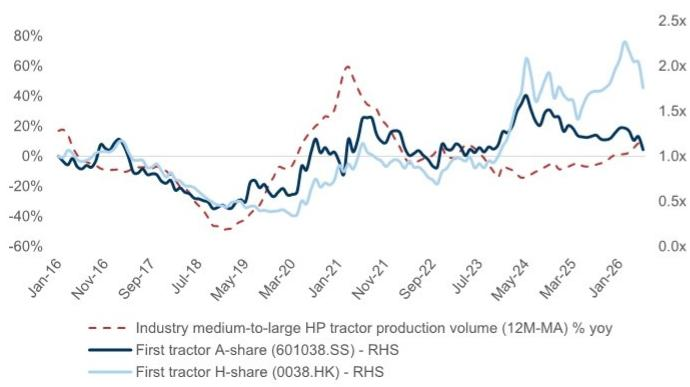
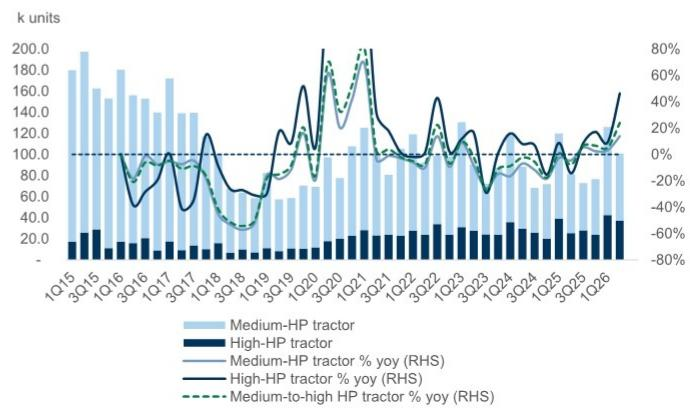
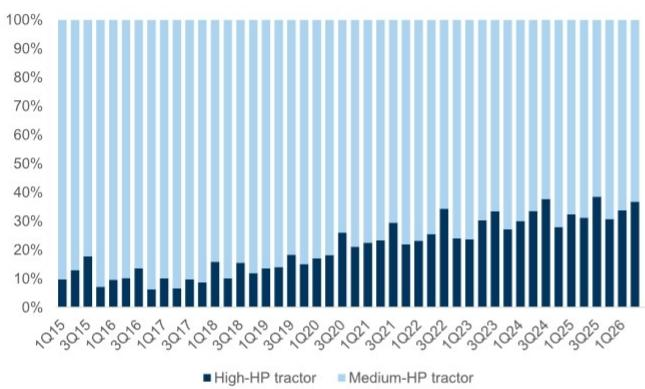
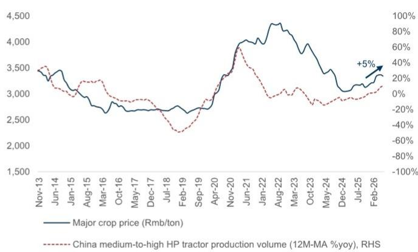
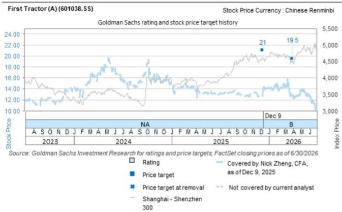
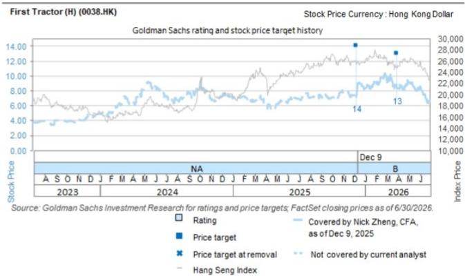

# 关于第一拖拉机（0038.HK）的观察：大马力产品趋势延续至2026年第二季度

第一拖拉机预计将于8月25日公布2026年第二季度业绩。最新行业数据显示，中国农业拖拉机市场呈现持续恢复态势，中高马力段产量同比增长22%，高马力段产量同比增长41%，这得益于出口的韧性、国内需求的改善以及高马力产品占比创下历史新高。我们认为第一拖拉机将从需求回升和产品结构升级中受益，预计2026年第二季度营收同比增长25%，核心息税前利润同比增长40%。由于2025年第二季度存在一次性收益的高基数，净利润增速可能相对温和，约为同比增长6%。

Nick Zheng, CFA
+852-2978-1405 | nick.zheng@gs.com
GS (Asia) L.L.C.

Selina Yan
+852-2978-0178 | shuling.yan@gs.com
GS (Asia) L.L.C.

## 2026年第二季度行业趋势：

在2026年第一季度出现拐点后，行业生产在第二季度进一步加速。自4月以来，中高马力段拖拉机产量保持20%以上的同比增长，而高马力段拖拉机自5月以来维持稳健的两位数同比增长。因此，2026年第二季度中高马力段拖拉机产量同比增长22%，主要受高马力段拖拉机强劲反弹41%的推动，使得第二季度产量达到历史新高。

■ 受高马力段扩张的支撑，2026年第二季度中高马力段中高马力产品的占比达到37%的历史高位，几乎是历史第二季度平均水平20%的两倍。按地区划分：

尽管存在地缘政治因素，出口在2026年第二季度保持强劲势头，中高马力段拖拉机出口量同比增长40%，高马力段拖拉机出口量激增56%。按地区划分，除非洲外，所有关键市场均录得两位数的同比增长，非洲市场中马力段拖拉机出口面临去年高基数的影响。

□ 隐含国内需求（以产量减去出口衡量）在2026年第二季度实现16%的稳健同比增长，其中高马力段增长显著，同比增长38%。一个关键驱动因素是农作物价格有利，主要农作物平均价格年初至今上涨5%，较去年低点高出10%。

## 第一拖拉机2026年第二季度前瞻

■ 预计2026年第二季度营收和核心息税前利润将强劲增长：我们认为第一拖拉机是行业需求回升和产品结构改善的主要受益者。我们预计2026年第二季度营收同比增长25%，毛利率扩大至16.8%（同比+0.5个百分点/环比+0.3个百分点）。因此，我们预测核心息税前利润同比增长40%。考虑到2025年第二季度录得较大的一次性收益，我们预计2026年第二季度净利润同比增长6%。

估值：我们维持2026年至2028年的全年盈利预测，该预测仍比市场共识高出8%至18%。我们将估值基准从之前的2026年底滚动至2027年中，从而得出新的12个月目标价：A股为21.3元人民币，H股为13.9港元，此前分别为19.5元人民币和13.0港元。

图表1：第一拖拉机股价历史上与拖拉机行业产量相关

第一拖拉机H股/A股价格表现（指数化）与月度拖拉机行业产量（12个月移动平均同比变化百分比）

图表3：2026年第二季度中高马力段中高马力产品占比达到37%的历史高位，几乎是历史第二季度平均水平的两倍
中国季度中高马力段拖拉机产量结构趋势（2015年第一季度至2026年第二季度）

来源：Wind，国家统计局，GS全球研究

图表2：2026年第二季度中国中高马力段拖拉机产量同比增长22%，高马力段拖拉机录得41%的强劲反弹
中国季度中高马力段拖拉机产量（千台）及同比百分比（右轴）

来源：国家统计局

来源：国家统计局

图表4：主要农作物平均价格年初至今上涨5%，较去年低点上涨10%
中国中高马力段拖拉机月度产量12个月移动平均同比变化百分比（右轴）与主要农作物平均价格

来源：国家统计局

图表5：盈利预测调整摘要

<table><tr><td rowspan="2"></td><td rowspan="2">目标价（人民币/股）</td><td colspan="3">营收</td><td colspan="3">净利润</td><td colspan="3">每股收益</td></tr><tr><td>2026E</td><td>2027E</td><td>2028E</td><td>2026E</td><td>2027E</td><td>2028E</td><td>2026E</td><td>2027E</td><td>2028E</td></tr><tr><td>第一拖拉机（601038.SS/0038.HK）</td><td></td><td colspan="3">人民币百万元</td><td colspan="3">人民币百万元</td><td colspan="3">人民币</td></tr><tr><td>Gse（新）</td><td>人民币21.30/港元13.90</td><td>12,591</td><td>14,857</td><td>17,134</td><td>947</td><td>1,163</td><td>1,471</td><td>0.84</td><td>1.04</td><td>1.31</td></tr><tr><td>Gse（旧）</td><td>人民币19.50/港元13.00</td><td>12,591</td><td>14,857</td><td>17,134</td><td>947</td><td>1,163</td><td>1,471</td><td>0.84</td><td>1.04</td><td>1.31</td></tr><tr><td>差异百分比</td><td>9%/7%</td><td>0%</td><td>0%</td><td>0%</td><td>0%</td><td>0%</td><td>0%</td><td>0%</td><td>0%</td><td>0%</td></tr><tr><td>Wind共识</td><td></td><td>11,662</td><td>12,614</td><td>14,222</td><td>904</td><td>1,057</td><td>1,203</td><td>0.80</td><td>0.94</td><td>1.07</td></tr><tr><td>差异百分比</td><td></td><td>8%</td><td>18%</td><td>20%</td><td>5%</td><td>10%</td><td>22%</td><td>5%</td><td>10%</td><td>22%</td></tr></table>

来源：公司数据，Wind，GS全球研究

## 目标价风险与方法论 - 第一拖拉机

估值：我们通过对近期和长期估值取平均值，得出第一拖拉机H股12个月目标价为每股13.9港元。我们应用10.5倍的目标市盈率（与长期周期中值一致）于2026E/2027E平均每股收益，得出近期估值；同时应用12倍的目标市盈率于2030E每股收益（参考其全球同行的长期周期中值），并使用9.5%的股权成本折现至2027年中，得出长期估值。我们A股12个月目标价为每股21.3元人民币，包含67%的A/H股溢价，与过去6个月第一拖拉机A/H股平均溢价一致。

主要下行风险：1）农作物价格低于预期；2）政府对农业设备补贴政策的不利变化；3）市场竞争加剧；4）产品结构升级相关的执行风险；5）关键零部件本地化慢于预期；6）海外市场拓展进展慢于预期。

## 投资主题 - 第一拖拉机

按2024年销售收入计算，第一拖拉机是中国最大的农业拖拉机制造商。我们认为，在中国向农业现代化转型以实现粮食安全的背景下，第一拖拉机具备良好条件，能够抓住中国拖拉机大型化（向高马力段拖拉机）和升级（向智能拖拉机）趋势带来的结构性增长机会。出口方面，新兴市场的总可寻址市场机会约为国内市场的3倍（2024年约100亿美元），随着第一拖拉机建立全球竞争力，长期来看可能增加另一增长动力。我们认为，这些结构性转变应推动第一拖拉机的利润率和回报率逐步向全球同行靠拢，并值得重新评估其市场定价，我们认为其当前定价偏低。

<table><tr><td>0038.HK</td><td>12个月目标价：港元13.90</td><td>价格：港元8.62</td><td>潜在空间：61.3%</td></tr><tr><td>601038.SS</td><td>12个月目标价：人民币21.30</td><td>价格：人民币13.79</td><td>潜在空间：54.5%</td></tr></table>

<table><tr><td></td><td colspan="5">GS预测</td></tr><tr><td></td><td></td><td>12/25</td><td>12/26E</td><td>12/27E</td><td>12/28E</td></tr><tr><td>市值：港元97亿/12亿美元</td><td>营收（人民币百万元）</td><td>10,822.6</td><td>12,591.4</td><td>14,857.2</td><td>17,133.8</td></tr><tr><td rowspan="2">企业价值：港元76亿/9.701亿美元</td><td>EBITDA（人民币百万元）</td><td>815.3</td><td>997.4</td><td>1,285.6</td><td>1,646.4</td></tr><tr><td>每股收益（人民币）</td><td>0.72</td><td>0.84</td><td>1.04</td><td>1.31</td></tr><tr><td>3个月日均交易量：港元3360万/430万美元</td><td>市盈率（倍）</td><td>9.1</td><td>8.8</td><td>7.2</td><td>5.7</td></tr><tr><td rowspan="3">中国电池、机械与先进材料并购排名：3</td><td>市净率（倍）</td><td>0.9</td><td>0.9</td><td>0.9</td><td>0.8</td></tr><tr><td>股息率（%）</td><td>4.1</td><td>4.2</td><td>5.1</td><td>6.5</td></tr><tr><td>净债务/EBITDA（不含租赁，倍）</td><td>(1.8)</td><td>(2.4)</td><td>(2.8)</td><td>(3.0)</td></tr><tr><td rowspan="2">租赁包含在净债务及企业价值中？：是</td><td>CROCI（%）</td><td>11.6</td><td>13.1</td><td>15.5</td><td>19.0</td></tr><tr><td>自由现金流回报表现（%）</td><td>9.1</td><td>15.6</td><td>20.2</td><td>22.6</td></tr><tr><td></td><td></td><td>3/26</td><td>6/26E</td><td>9/26E</td><td>12/26E</td></tr><tr><td></td><td>每股收益（人民币）</td><td>0.50</td><td>0.22</td><td>0.25</td><td>(0.13)</td></tr></table>

来源：公司数据，GS预测，FactSet。价格截至2026年7月21日收盘。

## 附录

## Reg AC

我，Nick Zheng, CFA，特此证明本报告中表达的所有观点准确反映了我对相关公司及其证券的个人观点。我还证明，我的薪酬中没有任何部分直接或间接与本报告中表达的具体建议或观点相关。

除非另有说明，本报告封面所列的个人是GS全球研究部门的分析师。

撰稿作者：Nick Zheng, CFA GS (Asia) L.L.C.，Selina Yan GS (Asia) L.L.C.。

除非另有说明，本报告撰稿作者披露中列出的个人是GS全球研究部门的分析师。

## GS因子概况

GS因子概况通过将股票的关键属性与市场（即我们评级的股票范围）及其行业同行进行比较，为股票提供背景信息。所描绘的四个关键属性是：增长、财务回报、倍数（例如估值）和综合（增长、财务回报和倍数的组合）。增长、财务回报和倍数是通过对每只股票的特定指标使用标准化排名来计算的。然后将指标的标准化排名进行平均，并转换为相关属性的百分位数。每个指标的具体计算可能因财年、行业和地区而异，但标准方法如下：

增长基于股票的前瞻性销售增长、EBITDA增长和每股收益增长（对于金融股，仅每股收益和销售增长），较高的百分位数表示增长较高的公司。财务回报基于股票的前瞻性ROE、ROCE和CROCI（对于金融股，仅ROE），较高的百分位数表示财务回报较高的公司。倍数基于股票的前瞻性市盈率、市净率、价格/股息（P/D）、EV/EBITDA、EV/自由现金流和EV/债务调整后现金流（DACF）（对于金融股，仅市盈率、市净率和P/D），较高的百分位数表示以较高倍数交易的股票。综合百分位数计算为增长百分位数、财务回报百分位数和（100% - 倍数百分位数）的平均值。

财务回报和倍数使用GS分析师对未来至少三个季度后的财年末的预测。增长使用未来至少七个季度后的财年与未来至少三个季度后的财年相比的输入（所有指标均基于每股）。

有关我们如何计算GS因子概况的更详细说明，请联系您的GS代表。

## 并购排名

在我们的全球覆盖范围内，我们使用并购框架检查股票，考虑定性因素和定量因素（可能因行业和地区而异），以纳入某些公司可能被收购的可能性。然后，我们将并购排名分配为对我们评级覆盖范围内的公司从1到3进行评分，其中1表示公司成为收购目标的高概率（30%-50%），2表示中等概率（15%-30%），3表示低概率（0%-15%）。对于排名为1或2的公司，根据我们的标准部门指南，我们将并购组成部分纳入我们的目标价。并购排名3被视为不重要，因此不计入我们的目标价，并且可能在研究中讨论或不讨论。

## Quantum

Quantum是GS的专有数据库，提供详细的财务报表历史、预测和比率的访问。它可用于对单个公司进行深入分析，或在不同行业和市场的公司之间进行比较。

## 披露

第一拖拉机（A股）和第一拖拉机（H股）的评级相对于其覆盖范围内的其他公司：博迁新材、中航锂电、宁德时代（A股）、宁德时代（H股）、中国巨石、亿纬锂能、孚能科技、第一拖拉机（A股）、第一拖拉机（H股）、国轩高科、江苏恒立液压、龙工控股、银河微电、新和成、瑞浦兰钧、瑞联新材、瑞丰新材、三一重工、中材科技、中国重汽、蓝晓科技、万华化学、潍柴动力（A股）、潍柴动力（H股）、正泰电器、浙江鼎力。

## 公司特定监管披露

以下披露涉及GS集团（及其附属机构，“GS”）与GS全球研究覆盖的公司之间的关系，并在本研究中提及。

第一拖拉机（A股）（人民币13.79）和第一拖拉机（H股）（港元8.62）无公司特定披露。

## 评级/投资银行关系分布

GS研究全球股票覆盖范围

<table><tr><td rowspan="2"></td><td colspan="3">评级分布</td><td colspan="3">投资银行关系</td></tr><tr><td>买入</td><td>持有</td><td>卖出</td><td>买入</td><td>持有</td><td>卖出</td></tr><tr><td>全球</td><td>50%</td><td>34%</td><td>16%</td><td>65%</td><td>59%</td><td>43%</td></tr></table>

截至2026年7月1日，GS全球研究对3,104只股票有评级。GS将股票分配为买入和卖出，列入各个地区的投资清单；未如此分配的股票被视为中性。为满足FINRA规则要求的上述披露，此类分配等同于买入、持有和卖出。请参阅下面的“评级、覆盖范围及相关定义”。投资银行关系图表反映了每个评级类别中GS在过去十二个月内提供过投资银行服务的公司所占的百分比。

## 目标价和评级历史图表

所示目标价应结合所有先前发布的GS报告（可能包含或不包含目标价）以及公司、其行业和金融市场的发展情况来考虑。

所示目标价应结合所有先前发布的GS报告（可能包含或不包含目标价）以及公司、其行业和金融市场的发展情况来考虑。

## 目标价历史表格

## 第一拖拉机（H股）（0038.HK）

报告日期 目标价（港元） 收盘价（港元）

2026年3月30日 13.00 8.41

2025年12月9日 14.00 7.20

## 第一拖拉机（A股）（601038.SS）

报告日期 目标价（人民币） 收盘价（人民币）

2026年3月30日 19.50 12.75

2025年12月9日 21.00 12.69

表格中所示目标价未针对公司行为进行调整。

## 监管披露

## 美国法律法规要求的披露

请参阅上述公司特定监管披露，了解本报告中提及的公司所需的任何以下披露：待处理交易中的经理或联合经理；1%或其他所有权；特定服务的报酬；客户关系类型；先前期间管理/联合管理的公开发行；董事职位；对于股票，做市和/或专家角色。GS可能作为本报告中讨论的发行人的债务证券（或相关衍生品）的本金进行交易或可能进行交易。

以下是额外要求的披露：所有权和重大利益冲突：GS政策禁止其分析师、向分析师报告的专业人员及其家庭成员持有分析师覆盖范围内任何公司的证券。分析师薪酬：分析师的薪酬部分基于GS的盈利能力，其中包括投资银行收入。分析师作为高管或董事：GS政策通常禁止其分析师、向分析师报告的人员或其家庭成员担任分析师覆盖范围内任何公司的高管、董事或顾问。非美国分析师：非美国分析师可能不是GS & Co. LLC的关联人员，因此可能不受FINRA规则2241或FINRA规则2242关于与主题公司沟通、公开露面以及交易分析师所覆盖证券的限制。

## 美国以外司法管辖区法律法规要求的额外披露

以下披露是特定司法管辖区要求的，除非已根据美国法律法规在上文中作出。澳大利亚：GS Australia Pty Ltd及其附属公司不是澳大利亚的授权存款机构（如《1959年银行法》（联邦）所定义），在澳大利亚不提供银行服务，也不从事银行业务。除非GS另有约定，本研究及其任何访问仅面向《澳大利亚公司法》含义内的“批发客户”。在编写研究报告时，GS Australia全球研究部门的成员可能会参加由研究报告所涉及的公司和其他实体主办或组织的实地考察和其他会议。在某些情况下，如果GS Australia认为在实地考察或会议的具体情况下适当且合理，此类实地考察或会议的部分或全部费用可能由相关发行人承担。如果本文档内容包含任何金融产品建议，则仅为一般性建议，由GS在未考虑客户的目标、财务状况或需求的情况下编制。客户在根据任何此类建议采取行动之前，应考虑该建议是否适合其自身的目标、财务状况和需求。某些GS Australia和New Zealand的利益披露以及GS的澳大利亚卖方研究独立性政策声明的副本可在以下网址获取：https://www.goldmansachs.com/disclosures/australia-new-zealand/index.html。巴西：有关CVM第20号决议的披露信息可在以下网址获取：https://www.gs.com/worldwide/brazil/area/gir/index.html。在适用的情况下，根据CVM第20号决议第20条的定义，本研究报告内容的主要负责巴西注册分析师为本报告开头指定的第一作者，除非文本末尾另有说明。加拿大：此信息仅供您参考，在任何情况下均不应被解释为GS & Co. LLC为在加拿大购买任何加拿大证券而进行的广告、要约或招揽。GS & Co. LLC未在加拿大任何司法管辖区注册为交易商，通常不被允许交易加拿大证券，并且可能被禁止在加拿大某些司法管辖区销售某些证券和产品。如果您希望在加拿大交易任何加拿大证券或其他产品，请联系GS Canada Inc.（GS集团附属公司）或其他注册的加拿大交易商。香港：可向GS (Asia) L.L.C.索取本研究中提及的所覆盖公司证券的进一步信息。印度：可从GS (India) Securities Private Limited获取本研究中提及的主题公司或公司的进一步信息，研究分析师 - SEBI注册号INH000001493，地址：10th Floor, Ascent-Worli, Sudam Kalu Ahire Marg, Worli, Mumbai-400 025, India，企业识别号U74140MH2006FTC160634，电话+91 22 6616 9000，传真+91 22 6616 9001。GS可能实益拥有本研究报告所涉及的主题公司或公司1%或以上的证券（如1956年《印度证券合同（监管）法》第2(h)条所定义）。SEBI的注册和NISM的认证不以任何方式保证中介机构的业绩或向读者提供任何回报保证。GS (India) Securities Private Limited的合规官和读者投诉联系详情、年度合规审计报告副本以及其他相关信息和披露可在以下链接找到：https://www.goldmansachs.com/worldwide/india/research-analyst。日本：见下文。韩国：除非GS另有约定，本研究及其任何访问仅面向《金融服务和资本市场法》含义内的“专业读者”。可从GS (Asia) L.L.C.首尔分行获取本研究中提及的主题公司或公司的进一步信息。新西兰：GS New Zealand Limited及其附属公司不是新西兰的“注册银行”或“存款接受者”（如1989年《新西兰储备银行法》所定义）。除非GS另有约定，本研究及其任何访问面向《2008年金融顾问法》含义内的“批发客户”。某些GS Australia和New Zealand的利益披露副本可在以下网址获取：https://www.goldmansachs.com/disclosures/australia-new-zealand/index.html。俄罗斯：在俄罗斯联邦分发的研究报告不是俄罗斯立法所定义的广告，而是信息和分析，其主要目的不是产品推广，并且不提供俄罗斯评估活动立法含义内的评估。研究报告不构成俄罗斯法律法规所定义的个性化研究交流，不针对特定客户，并且是在未分析客户的财务状况、投资概况或风险概况的情况下编写的。GS不对客户或任何其他人基于本研究报告可能做出的任何投资决策承担任何责任。新加坡：GS (Singapore) Pte.（公司编号：198602165W），受新加坡金融管理局监管，接受对本研究的法律责任，如有任何因本研究引起或与之相关的事项，应联系该公司。台湾：此材料仅供参考，未经许可不得转载。读者应仔细考虑其自身的投资风险。投资结果由个人读者负责。英国：在英国被归类为零售客户（如金融行为监管局规则所定义）的人士，应结合先前关于本研究所涉公司的GS报告阅读本研究，并应参考GS International已发送给他们的风险警告。这些风险警告的副本以及本报告中使用的某些金融术语的词汇表，可向GS International索取。

欧盟和英国：关于欧盟委员会授权条例（EU）（2016/958）第6(2)条（该条例补充欧洲议会和理事会条例（EU）第596/2014号，包括该授权条例在英国脱离欧盟和欧洲经济区后转化为英国国内法律和法规的情况）中关于研究交流客观呈现的技术安排以及特定利益或利益冲突迹象披露的技术标准的披露信息，可在以下网址获取：https://www.gs.com/disclosures/europeanpolicy.html，其中说明了与投资研究相关的利益冲突管理的欧洲政策。

日本：GS Japan Co., Ltd.是一家金融工具交易商，在关东财务局注册，注册号为金商第69号，并且是日本证券交易商协会、日本金融期货协会、第二类金融工具交易商协会和日本投资管理协会的成员。股票买卖需支付与客户预先确定的佣金加上消费税。有关日本证券交易所、日本证券交易商协会或日本证券金融公司要求的任何适用披露，请参阅公司特定披露。

## 评级、覆盖范围及相关定义

买入（B）、中性（N）、卖出（S）分析师建议将股票作为买入或卖出列入各个地区的投资清单。股票被分配为买入或卖出投资清单取决于其相对于其覆盖范围的总回报潜力。任何未被分配为买入或卖出且具有有效评级（即未暂停评级、未评级、早期生物技术、暂停覆盖或未覆盖的股票）的股票被视为中性。每个地区管理区域信念清单，这些清单选自各自地区投资清单中评级为买入的股票，代表基于总回报潜力大小和/或在其各自覆盖范围内实现回报的可能性的研究交流。此类信念清单中股票的添加或移除由各自地区的投资审查委员会或其他指定委员会管理，并不代表分析师对此类股票评级的变化。

总回报潜力代表当前股价与目标价之间的上行或下行差异，包括在目标价相关时间范围内预期支付或预期的所有股息。所有覆盖的股票都需要目标价。总回报潜力、目标价和相关时间范围在每份添加或重申投资清单成员资格的报告中有说明。

覆盖范围：每个覆盖范围的所有股票列表可按主要分析师、股票和覆盖范围在以下网址获取：https://www.gs.com/research/hedge.html。

未评级（NR）。当GS在涉及该公司的合并或战略交易中担任顾问角色时，当存在法律、监管或政策限制（由于GS参与交易）时，以及在某些其他情况下，根据GS政策，评级、目标价和盈利预测（如相关）将被移除。早期生物技术（ES）。根据GS政策，当该公司既没有通过II期临床试验的药物、治疗或医疗设备，也没有获得分销后II期药物、治疗或医疗设备的许可时，不分配评级和目标价。评级暂停（RS）。GS已暂停对该股票的评级和目标价，因为没有足够的基本面基础来确定评级或目标价。先前的评级和目标价（如有）不再对该股票有效，不应依赖。覆盖暂停（CS）。GS已暂停对该公司的覆盖。未覆盖（NC）。GS未覆盖该公司。

## 全球产品；分销实体

GS全球研究为GS的客户在全球范围内制作和分发研究产品。位于GS全球各办事处的分析师对行业和公司以及宏观经济、货币、大宗商品和投资组合策略进行研究。本研究由以下机构在澳大利亚分发：GS Australia Pty Ltd（ABN 21 006 797 897）；在巴西：GS do Brasil Corretora de Títulos e Valores Mobiliários S.A.；GS巴西公共沟通渠道：0800 727 5764 和/或 contatogoldmanbrasil@gs.com。工作日（节假日除外），上午9点至下午6点。Canal de Comunicação com o Público GS Brasil: 0800 727 5764 e/ou contatogoldmanbrasil@gs.com. Horário de funcionamento: segunda-feira à sexta-feira (exceto feriados), das 9h às 18h；在加拿大：GS & Co. LLC；在香港：GS (Asia) L.L.C.；在印度：GS (India) Securities Private Ltd.；在日本：GS Japan Co., Ltd.；在韩国：GS (Asia) L.L.C.首尔分行；在新西兰：GS New Zealand Limited；在俄罗斯：OOO GS；在新加坡：GS (Singapore) Pte.（公司编号：198602165W）；在美国：GS & Co. LLC。GS International已批准本研究在英国的分发。

GS International（“GSI”），由审慎监管局（“PRA”）授权，并受金融行为监管局（“FCA”）和PRA监管，已批准本研究在英国的分发。

欧洲经济区：GS Bank Europe SE（“GSBE”）是一家在德国注册的信贷机构，在单一监管机制内，受欧洲中央银行直接审慎监管，并在其他方面受德国联邦金融监管局（Bundesanstalt für Finanzdienstleistungsaufsicht, BaFin）和德意志联邦银行监管，并在欧洲经济区内分发研究。

## 一般披露

本研究仅供我们的客户使用。除与GS相关的披露外，本研究基于我们认为可靠的当前公开信息，但我们不保证其准确或完整，且不应依赖于此。本文所含信息、意见、估计和预测截至本文日期，如有更改，恕不另行通知。我们力求在适当的时候更新我们的研究，但各种法规可能阻止我们这样做。除某些定期发布的行业报告外，大多数报告根据分析师的判断在不定期的时间发布。

GS开展全球全方位、综合性的投资银行、投资管理和经纪业务。我们与全球研究覆盖的相当大比例的公司存在投资银行和其他业务关系。GS & Co. LLC，美国经纪交易商，是SIPC的成员（https://www.sipc.org）。

我们的销售人员、交易员和其他专业人员可能向我们的客户和主要交易部门提供口头或书面的市场评论或交易策略，这些评论或策略可能反映与本研究中表达的观点相反的意见。我们的资产管理领域、主要交易部门和投资业务可能做出与本研究中建议或观点不一致的投资决策。

本报告中指定的分析师可能不时与我们的客户（包括GS销售人员和交易员）讨论，或在本报告中讨论，涉及可能对本报告所讨论的股票市场价格产生短期影响的催化剂或事件的交易策略，这种影响可能与分析师对此类股票的已发布目标价预期方向相反。任何此类交易策略均不同于且不影响分析师对此类股票的基本面评级，该评级反映了股票相对于其覆盖范围的总回报潜力，如本文所述。

我们及我们的附属机构、高级职员、董事和员工将不时持有本研究中提及的证券或衍生品（如有）的多头或空头头寸，担任本金，并买卖这些证券或衍生品，除非法规或GS政策另有禁止。

在GS组织的会议上归因于第三方演讲者（包括来自GS其他部门的个人）的观点，不一定反映全球研究的观点，也不是GS的官方观点。

本文引用的任何第三方，包括任何销售人员、交易员和其他专业人员或其家庭成员，可能持有与分析师在本报告中表达的观点不一致的上述产品的头寸。

本研究不构成在任何司法管辖区出售或招揽购买任何证券的要约，如果此类要约或招揽在该司法管辖区是非法的。它不构成个人建议，也未考虑特定客户的投资目标、财务状况或需求。客户应考虑本研究中的任何建议或推荐是否适合其特定情况，并在适当的情况下寻求专业建议，包括税务建议。本研究中提及的投资的价值和价格以及从中获得的收入可能会波动。过去的表现并不预示未来的结果，未来回报不保证，且可能发生原始资本损失。汇率波动可能对某些投资的价值或价格或从中获得的收入产生不利影响。

某些交易，包括涉及期货、期权和其他衍生品的交易，会带来重大风险，并不适合所有读者。读者应查阅当前的期权和期货披露文件，这些文件可从GS销售代表处或以下网址获取：https://www.theocc.com/about/publications/character-risks.jsp 和 https://www.goldmansachs.com/disclosures/cftc_fcm_disclosures。在需要多次买卖期权（如价差）的期权策略中，交易成本可能很高。将根据要求提供支持文件。

全球研究提供的不同服务水平：GS全球研究向您提供的服务水平和类型可能与向GS内部和其他外部客户提供的服务水平和类型不同，具体取决于多种因素，包括您个人对接收沟通的频率和方式的偏好、您的风险状况和投资重点及视角（例如，市场范围、特定行业、长期、短期）、您与GS整体客户关系的规模和范围，以及法律和监管限制。例如，某些客户可能希望在特定证券的研究发布时收到通知，某些客户可能希望将分析师基本面分析中可用的特定数据通过数据馈送或其他方式以电子方式交付给他们。分析师基本面研究观点的任何变化（例如，对股票的评级、目标价或盈利预测的重大变化）将在通过电子方式广泛发布到我们的内部客户网站或其他必要方式向所有有权接收此类报告的客户传达之前，不会向任何客户传达。

所有研究报告通过电子方式发布到我们的内部客户网站，同时向所有客户提供。并非所有研究内容都会重新分发给我们的客户或提供给第三方聚合商，GS也不对第三方聚合商重新分发我们的研究负责。对于与一只或多只证券、市场或资产类别（包括相关服务）相关的研究、模型或其他数据，请联系您的GS代表或访问 https://research.gs.com。

披露信息也可在 https://www.gs.com/research/hedge.html 获取，或联系研究合规部，地址：200 West Street, New York, NY 10282。

## © 2026 GS.

您仅可为自己使用而存储、显示、分析、修改、重新格式化并打印通过本服务向您提供的信息。未经GS明确书面同意，您不得转售或逆向工程此信息以计算或开发任何用于披露和/或营销的指数，或创建任何其他衍生作品或商业产品、数据或产品。未经GS明确书面同意，您不得以任何格式向任何第三方发布、传输或以其他方式复制此信息的全部或部分。前述限制包括但不限于，使用、提取、下载或检索此信息的全部或部分，以训练或微调机器学习或人工智能系统，或作为任何此类系统的提示或输入提供或复制此信息的全部或部分。
