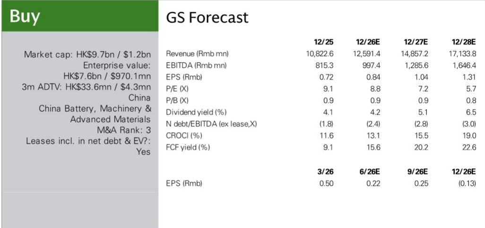

# 第一拖拉机：结构性盈利拐点正在形成，而非单纯周期反弹

中国农业拖拉机市场正经历一个超越简单需求复苏的转折点。2026年第二季度，中高端拖拉机产量同比增长22%，其中大马力拖拉机产量同比增长41%。这些并非渐进式改善。大马力拖拉机在中高端产品中的占比达到历史新高37%，几乎是历史第二季度平均水平20%的两倍。这一转变是结构性的，由农业现代化政策、有利的农作物经济性以及出口扩张共同驱动。对于按2024年销售收入计算的中国最大农业拖拉机制造商第一拖拉机而言，其影响是深远的。

公司计划于8月25日公布第二季度业绩，数据显示其将实现25%的营收同比增长和40%的核心息税前利润增长。由于去年同期存在一次性收益导致基数较高，净利润增长将较为温和，约为6%。但核心经营轨迹才是关键。某全球研究机构对2026年至2028年的盈利预测已比市场共识高出8%至18%，该机构对2026年和2027年的预测分别高出55%和61%。

这一研究观点并非基于单一季度。它关注的是与全球同行多年利润率趋同的过程，由产品组合升级、国内政策支持以及约为国内市场三倍规模的出口可触达市场共同驱动。2026年第二季度提供了迄今为止最清晰的证据，表明这一趋同正在加速。

## 大马力占比已跨越阈值，改变了第一拖拉机的盈利方程式

第二季度数据中最重要的数字并非22%的整体产量增长，而是大马力拖拉机在中高端产品中37%的占比。历史上，这一比例在第二季度平均为20%。在一年内实现占比弹性较高，标志着农民购买行为和政策激励的结构性转变，而非暂时的需求前置。

大马力拖拉机相比中马力机型具有更高的平均售价和更宽的毛利率。对于一直在大马力机型产品开发和关键部件本地化方面进行投入的第一拖拉机而言，占比提升直接改善了单位收入和单机盈利能力。公司毛利率预计将在第二季度扩大至16.8%，同比提升0.5个百分点，环比提升0.3个百分点。这看似温和，但在以25%速度增长的营收基础上会产生复合效应。

其机制直接而有力。随着大马力占比上升，每台拖拉机销售的平均收入增速将超过单纯销量增长所暗示的水平。固定成本被分摊到更高价值的产品基础上。公司在一个小型竞争对手难以满足现代大马力设备技术和服务要求的市场中获得了定价能力。这并非同一产品的周期性需求上升，而是产品组合的永久性升级。

## 出口已成为第二引擎，将可触达市场扩展至中国国内周期之外

第二季度中高端拖拉机出口同比增长40%，大马力出口激增56%。增长基础广泛：除非洲外，每个关键区域均实现两位数增长，而非洲的下降是由于去年同期基数较高，并非潜在需求恶化。

这一点很重要，因为它降低了一拖对国内农业周期的依赖。中国国内农业拖拉机市场规模约为每年30亿美元。新兴市场的出口机会估计为100亿美元。即使在这个更大市场中获得适度的份额增长，也会增加一个与中国农作物价格或补贴政策相关性较低的成长维度。

出口数据也验证了支撑该研究观点的一个战略假设：第一拖拉机可以在大马力拖拉机领域建立全球竞争力，而这一领域历来由西方和日本制造商主导。大马力出口56%的增长表明，公司不仅是在向价格敏感市场销售旧技术，也在海外更高价值领域取得胜利。长期来看，这种出口扩张应有助于支持公司价值的重新评估，因为市场开始将第一拖拉机视为全球农业设备参与者，而非纯粹的国内周期制造商。

## 国内需求由农作物价格驱动，而非仅靠补贴政策，使复苏更具持久性

隐含的国内需求（按产量减去出口计算）在第二季度实现了16%的同比增长，其中大马力部分以38%的增长领先。关键驱动因素是有利的农作物定价。主要农作物平均价格年初至今上涨5%，比去年低谷高出10%。

这是一个重要的区别。政府对农业设备的补贴政策可能随财政优先事项或政治周期而变化。但农作物价格反映了全球和国内粮食市场的基本供需动态。当农民每季收获收入增加时，他们会投资于更高生产率的设备。这一投资决策是经济性的，而非政治性的。

农作物价格与拖拉机产量之间的关系已得到充分证实。历史数据显示，拖拉机行业产量与主要农作物价格的12个月移动平均值密切相关。当前农作物价格水平高于去年平均水平和近期低谷，提供了一个有利的背景，只要全球粮食供应限制持续存在，这一背景就可能持续。这使得当前的需求复苏比纯粹由补贴驱动的周期更具结构性基础。

## 研究框架：决定第一拖拉机价值重估能否持续的三个条件

评估第一拖拉机需要超越简单的观点判断，转而评估一组将决定盈利和估值轨迹的条件。以下框架将第二季度的证据转化为前瞻性标准。

条件一：大马力占比能否维持在30%或以上？第二季度37%的占比可能受益于政策变化前的部分前置需求或季节性因素。但20%的历史平均水平反映的是较旧的产品周期。如果未来几个季度占比稳定在30%至35%区间，盈利提升将是结构性的。如果回落至25%附近，利润率扩张的故事将减弱。应关注国家统计局发布的季度占比数据作为领先指标。

条件二：出口增长能否保持广泛基础？第二季度40%至56%的出口增长覆盖多个区域。风险在于增长集中在少数可能面临政治或经济逆风的市场。应监测按区域划分的出口数据。如果增长变得依赖单一大型市场，出口论点的风险溢价将增加。如果保持多元化，论点将得到加强。

条件三：农作物价格能否保持在去年低谷之上？从低谷回升10%提供了缓冲，但农作物价格波动较大，受天气、贸易政策和全球库存水平影响。应每月跟踪主要农作物平均价格。持续下跌至去年平均水平以下将降低农民升级大马力设备的动力，并给一拖的国内需求带来压力。

这三个条件相互独立，各自针对研究观点的不同驱动因素：产品组合、地域多元化和终端市场需求。它们共同涵盖了决定一拖盈利增长是符合高于共识8%至18%的预测还是低于预期的关键变量。监测这些条件可以相应调整仓位和风险管理，而非依赖单一季度结果。

## 未来三年盈利轨迹指向当前报价低于内在价值

第一拖拉机的财务预测显示，营收从2025年的108亿元人民币增长至2028年的171亿元人民币，年复合增长率约为16%。净利润预计从2026年预估的9.47亿元人民币上升至2028年的14.7亿元人民币。隐含的每股盈利轨迹从2026年的0.84元人民币升至2028年的1.31元人民币。

按当前H股价格8.62港元计算，该报价约为2026年预估盈利的8.8倍和2028年预估盈利的5.7倍。对于一家预计同期已动用资本回报率从13.1%升至19.0%、自由现金流回报表现从15.6%升至22.6%的公司而言，这些倍数从基本面角度难以解释。市场似乎正在定价一次急剧的周期逆转，或产品组合升级和出口扩张的失败。

风险真实存在，不应忽视。农作物价格低于预期、政府补贴政策的不利变化、竞争加剧、产品组合升级的执行风险、关键部件本地化速度放缓以及海外扩张放缓，都可能影响这一论点。但第二季度数据直接反驳了最悲观的情景。产量在加速而非减速。产品组合在改善而非停滞。出口在增长而非下滑。

对估值折价最可能的解释是，市场尚未完全消化这一转变的结构性本质。大马力占比突破37%是近期历史上没有先例的数据点。出口在一个季度内增长40%至56%并非季节性波动。农作物价格比去年低谷高出10%提供了政策本身无法创造的需求基础。

第一拖拉机并非仅仅受益于一个有利的季度。它正在执行一项多年转型，这将改变其盈利能力和竞争地位。8月25日公布的第二季度业绩，将提供迄今为止最具体的证据，证明这一转型是真实的。

*仅供参考。部分内容可能基于源材料通过AI辅助生成、翻译、总结或编辑，可能存在遗漏或错误。请独立核实。这不构成专业建议。*

仅供参考。部分内容可能基于源材料通过AI辅助生成、翻译、总结或编辑，可能存在遗漏或错误。请独立核实。这不构成专业建议。

