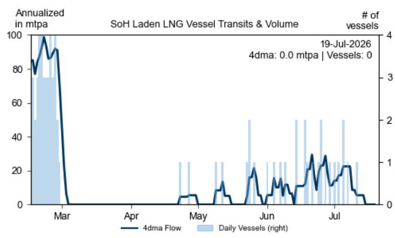
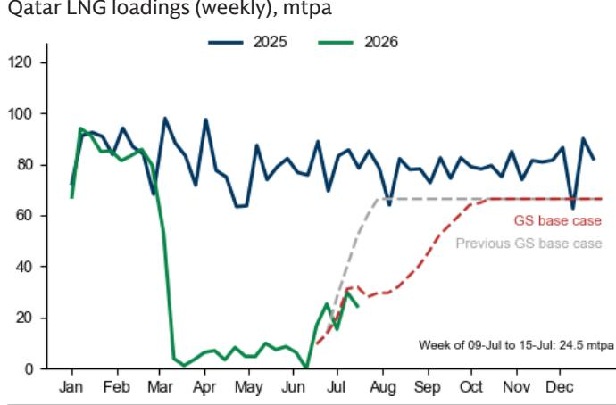
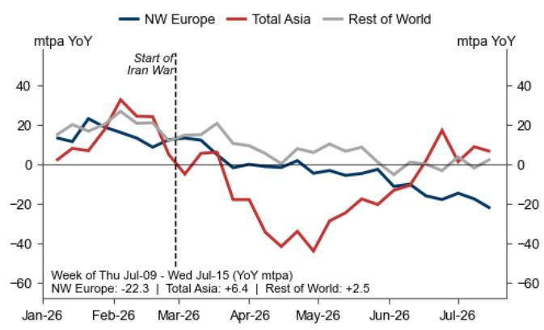
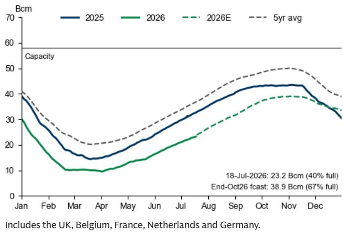
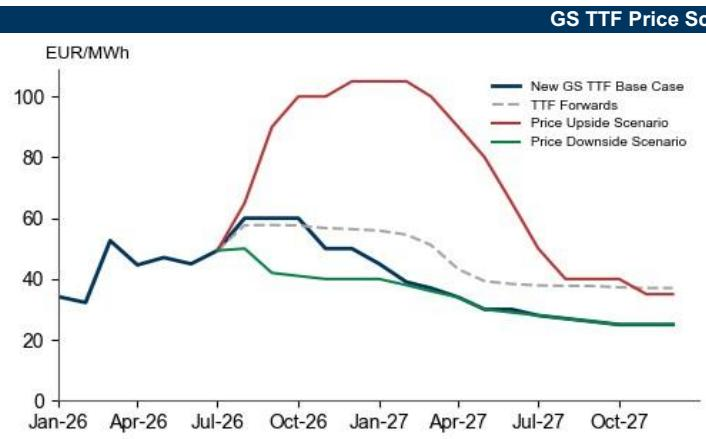

# 宏观环境观察

## 霍尔木兹海峡出口恢复放缓，我们上调近期TTF预测

由于中东地区不确定性持续存在，我们现假设波斯湾液化天然气出口的恢复时间将进一步推迟（2026年10月，此前预期为2026年7月）。这导致欧洲天然气供需趋紧，尤其是欧洲在冬季面临寒冷天气冲击的脆弱性增加，使得TTF可能需升至65欧元/兆瓦时——这是我们观察到的能更明显抑制亚洲液化天然气需求的门槛水平。因此，我们认为TTF将在未来几个月接近并维持这一较高水平，我们将2026年第三季度/第四季度TTF预测从41/40欧元上调至60/53欧元/兆瓦时，接近当前远期价格58/57欧元/兆瓦时。

我们近期TTF预测的上行风险仍然存在，我们继续建议天然气用户对冬季欧洲天然气和液化天然气价格波动做好风险管理。具体而言，在中东能源出口到2027年才逐步恢复的情景下，我们估计2026年12月TTF可能需要升至100欧元/兆瓦时以上，较我们50欧元/兆瓦时的基准情景高出110%，以抑制亚洲液化天然气需求。相比之下，我们估计霍尔木兹海峡流量恢复速度快于预期，将使TTF回落至煤转气转换门槛40欧元/兆瓦时，较我们当前2026年12月TTF基准价格低20%。

- 长期来看，我们维持对2028/29年TTF的观察观点为19/16欧元/兆瓦时（远期价格为29/25）——但需要强调的是，霍尔木兹海峡完全开放通航是我们这一观点的重要前提假设。在更远的预测区间，我们认为这一价格观点的风险偏向下行。近期美国新液化天然气出口项目的最终投资决定，预示着液化天然气供应过剩的规模和持续时间将超过我们已在供需平衡中纳入的预期。此外，伊朗冲突后煤炭和可再生能源发电可能增加，或将在未来几年降低亚洲对天然气的需求，低于我们的基准情景。

萨曼莎·达特
+1(212)357-9428 |
samantha.dart@gs.com
GS & Co. LLC

劳拉·西尔
+1(212)902-3435 | laura.x.cyr@gs.com
GS & Co. LLC

## 霍尔木兹海峡出口恢复放缓，我们上调近期TTF预测

随着中东地区局势近期升级，我们现在假设波斯湾液化天然气出口恢复时间（2026年10月）晚于此前预期（2026年7月）（图表1和图表2）。我们估计，夏季剩余时间全球液化天然气供应净减少1600万吨/年（4%），将使西北欧2026年10月底（冬季开始）天然气储存量接近67%（此前预期为74%），2027年3月底（冬季结束）为28%，假设整个季节气温为十年平均水平（图表3和图表4）。值得注意的是，这些估计已考虑到由于液化天然气价格上涨，我们将夏季剩余时间亚洲平均需求预期小幅下调400万吨/年至2.62亿吨/年。

图表1：经霍尔木兹海峡的可见液化天然气出口已停止...

来源：Kpler，GS全球研究

图表2：...导致我们假设卡塔尔液化天然气出口恢复放缓

来源：Kpler，GS全球研究

图表3：亚洲液化天然气需求同比回升，至少在夏季高峰期如此...
全球液化天然气净进口量（四周移动平均）

来源：Kpler，GS全球研究

图表4：...西北欧将保持紧张，夏末储存量可能为至少14年来最低
西北欧地下天然气储存

来源：彭博，GS全球研究

需要说明的是，冬季结束时储存量为28%并非问题所在。问题在于，如果28%的储存量是在假设平均冬季天气条件下的估计，而实际冬季明显比平均气温更冷。具体而言，我们估计冬季气温比平均气温低两个标准差，通常会使天然气需求增加，导致冬季末储存量减少24个百分点。

由于我们估计欧洲冬季天然气供需趋紧，几乎没有容错空间，我们预计在今年夏季剩余时间，TTF将非常接近65欧元/兆瓦时的门槛（或更高，如果出现更大的供应冲击），我们认为这一水平将更明显地抑制亚洲工业对天然气的需求。从11月冬季开始后，除非出现比平均气温更冷的天气冲击，我们预计TTF的风险溢价将逐步回落。综合来看，我们将2026年第三季度/第四季度/2027年TTF预测从41/40/30欧元上调至60/53/31欧元/兆瓦时。

## 我们近期TTF预测的上行风险仍然存在...

在中东能源出口到2027年才逐步恢复的情景下，我们估计2026年12月TTF可能需要升至100欧元/兆瓦时（35美元/百万英热单位）以上，较我们50欧元/兆瓦时的基准情景高出110%，以抑制亚洲液化天然气需求并管理欧洲天然气储存水平避免耗尽¹。重要的是，这一价格上行假设的是十年平均天气。在比平均气温更冷的冬季，TTF可能大幅飙升，以进一步抑制需求并限制天气导致的天然气储存额外消耗。

相比之下，我们估计霍尔木兹海峡流量恢复速度快于预期，将使TTF回落至气转煤转换门槛40欧元/兆瓦时，较我们当前2026年12月TTF基准价格低20%。比平均气温更暖的冬季可能消除气转煤转换的需求，从而移除40欧元/兆瓦时的TTF下限，可能使我们在2027年平均预期的30欧元/兆瓦时价格提前出现。

因此，我们继续建议天然气用户对冬季欧洲天然气和液化天然气价格波动做好风险管理（图表5）。

图表5：我们近期TTF预测的风险仍偏向上行

远期价格截至7月17日。

<table><tr><td></td><td>GS TTF基准情景 - 2026年10月流量恢复</td><td>价格上行情景 - 2027年10月才逐步恢复流量</td><td>价格下行情景 - 7月中旬恢复流量，NFE更快启动</td></tr><tr><td>2026年第三季度</td><td>60</td><td>78</td><td>46</td></tr><tr><td>2026年第四季度</td><td>53</td><td>102</td><td>40</td></tr><tr><td>2026年</td><td>56</td><td>92</td><td>43</td></tr><tr><td>2027年</td><td>31</td><td>65</td><td>30</td></tr></table>

来源：ICE，GS全球研究

...而我们长期TTF观点的风险偏向下行
长期来看，我们维持对2028/29年TTF的观察观点为19/16欧元/兆瓦时（远期价格为29/25）——但需要强调的是，霍尔木兹海峡完全开放通航是我们这一观点的重要前提假设。

此外，我们认为这一观点的风险偏向下行。近期美国新液化天然气出口项目的最终投资决定，预示着液化天然气供应过剩的规模和持续时间将超过我们已在供需平衡中纳入的预期。此外，伊朗冲突后煤炭和可再生能源发电可能增加，或将在未来几年降低亚洲对天然气的需求，低于我们的基准情景。

附录
图表6：我们上调近期TTF和JKM预测
TTF和JKM的GS预测与远期价格对比

<table><tr><td></td><td>GS TTF预测（欧元/兆瓦时）</td><td>此前预测</td><td>TTF远期（欧元/兆瓦时）</td><td>GS TTF预测（美元/百万英热单位）</td><td>此前预测</td><td>GS JKM预测（美元/百万英热单位）</td><td>此前预测</td><td>JKM远期（美元/百万英热单位）</td></tr><tr><td>2026年第三季度</td><td>60</td><td>41</td><td>58</td><td>20.15</td><td>13.95</td><td>21.65</td><td>15.45</td><td>20.90</td></tr><tr><td>2026年第四季度</td><td>53</td><td>40</td><td>57</td><td>17.90</td><td>13.75</td><td>18.90</td><td>14.75</td><td>20.20</td></tr><tr><td>2027年第一季度</td><td>40</td><td>38</td><td>54</td><td>13.55</td><td>12.95</td><td>14.40</td><td>13.80</td><td>18.50</td></tr><tr><td>2027年第二季度</td><td>31</td><td>31</td><td>40</td><td>10.55</td><td>10.55</td><td>11.30</td><td>11.30</td><td>14.00</td></tr><tr><td>2027年第三季度</td><td>27</td><td>27</td><td>38</td><td>9.05</td><td>9.20</td><td>9.80</td><td>9.95</td><td>13.45</td></tr><tr><td>2027年第四季度</td><td>25</td><td>25</td><td>37</td><td>8.40</td><td>8.50</td><td>9.15</td><td>9.25</td><td>13.30</td></tr><tr><td>2026年</td><td>56</td><td>41</td><td>57</td><td>18.80</td><td>13.85</td><td>20.00</td><td>15.05</td><td>20.50</td></tr><tr><td>2027年</td><td>31</td><td>30</td><td>42</td><td>10.40</td><td>10.30</td><td>11.15</td><td>11.10</td><td>14.80</td></tr><tr><td>2028年</td><td>19</td><td>19</td><td>29</td><td>6.40</td><td>6.50</td><td>6.80</td><td>6.90</td><td>10.55</td></tr><tr><td>2029年</td><td>16</td><td>16</td><td>25</td><td>5.45</td><td>5.50</td><td>5.65</td><td>5.70</td><td>9.20</td></tr><tr><td>2030年</td><td>20</td><td>20</td><td>23</td><td>6.65</td><td>6.75</td><td>6.90</td><td>7.00</td><td>8.65</td></tr><tr><td>2031年</td><td>21</td><td>21</td><td>23</td><td>7.05</td><td>7.15</td><td>7.35</td><td>7.45</td><td>8.85</td></tr><tr><td>2032年</td><td>21</td><td>21</td><td>23</td><td>7.05</td><td>7.15</td><td>7.50</td><td>7.60</td><td>9.05</td></tr><tr><td>2033年</td><td>32</td><td>32</td><td>24</td><td>10.75</td><td>10.90</td><td>11.35</td><td>11.50</td><td>9.30</td></tr><tr><td>2034年</td><td>42</td><td>42</td><td>24</td><td>14.10</td><td>14.30</td><td>15.20</td><td>15.40</td><td>9.60</td></tr><tr><td>2035年</td><td>42</td><td>42</td><td>25</td><td>14.10</td><td>14.30</td><td>15.30</td><td>15.50</td><td>9.90</td></tr></table>

远期价格截至7月17日。我们的TTF预测（美元/百万英热单位）可能因汇率变动而波动，如近期欧元走弱所示。2026年第三季度平均为2026年8月至9月合约。2026年平均为2026年8月至12月合约。
来源：ICE，GS全球研究

## 披露附录

## Reg AC

我们，萨曼莎·达特和劳拉·西尔，特此证明本报告中表达的所有观点准确反映了我们的个人观点，这些观点未受公司业务或客户关系考虑的影响。

除非另有说明，本报告封面所列人员为GS全球研究部门分析师。

撰稿作者：萨曼莎·达特 GS & Co. LLC，劳拉·西尔 GS & Co. LLC。

除非另有说明，本报告撰稿作者披露中列出的个人为GS全球研究部门分析师。

## 披露信息

## 监管披露

## 美国法律法规要求的披露

请参见上述针对本报告中提及公司的具体监管披露，以了解以下任何要求的披露：待处理交易中的经理或联合经理；1%或其他所有权；特定服务的报酬；客户关系类型；前期管理/联合管理的公开发行；董事职位；对于股权证券，做市和/或专家角色。GS可能作为本金交易本报告中讨论的发行人的债务证券（或相关衍生品）。

以下为额外要求的披露：所有权和重大利益冲突：GS政策禁止其分析师、向分析师汇报的专业人员及其家庭成员持有分析师覆盖范围内任何公司的证券。分析师薪酬：分析师的薪酬部分基于GS的盈利能力，其中包括投资银行业务收入。分析师作为高管或董事：GS政策通常禁止其分析师、向分析师汇报的人员或其家庭成员担任分析师覆盖范围内任何公司的高管、董事或顾问。非美国分析师：非美国分析师可能不是GS & Co. LLC的关联人员，因此可能不受FINRA规则2241或FINRA规则2242关于与主题公司沟通、公开露面以及交易分析师覆盖证券的限制。

## 美国以外司法管辖区法律法规要求的额外披露

以下披露为指定司法管辖区所要求，除非已根据美国法律法规在上文作出。澳大利亚：GS Australia Pty Ltd及其关联公司不是澳大利亚的授权存款机构（该术语在1959年银行法（联邦）中定义），不提供银行服务，也不在澳大利亚开展银行业务。除非GS另有约定，本研究及其访问权限仅面向澳大利亚公司法意义上的"批发客户"。在制作研究报告时，GS Australia全球研究部门成员可能参加由其研究报告主题公司和实体主办或组织的现场访问和其他会议。在某些情况下，如果GS Australia认为在特定情况下与现场访问或会议相关的费用合理适当，这些费用可能部分或全部由相关发行人承担。如果本文档内容包含任何金融产品建议，则仅为一般性建议，由GS在未考虑客户目标、财务状况或需求的情况下编制。客户在根据任何此类建议采取行动前，应考虑该建议是否适合其自身目标、财务状况和需求。GS Australia和New Zealand的某些利益披露副本以及GS澳大利亚卖方研究独立性政策声明副本可在以下网址获取：https://www.goldmansachs.com/disclosures/australia-new-zealand/index.html。巴西：有关CVM第20号决议的披露信息可在https://www.gs.com/worldwide/brazil/area/gir/index.html获取。如适用，根据CVM第20号决议第20条定义，本研究报告内容的巴西注册主要分析师为本报告开头指定的第一作者，除非文末另有说明。加拿大：此信息仅供您参考，在任何情况下均不应被解释为GS & Co. LLC为在加拿大购买证券而向加拿大证券购买者提供的广告、要约或招揽。GS & Co. LLC未在加拿大任何司法管辖区注册为适用加拿大证券法下的交易商，通常不允许交易加拿大证券，并可能被禁止在加拿大某些司法管辖区销售某些证券和产品。如果您希望在加拿大交易任何加拿大证券或其他产品，请联系GS Canada Inc.（GS Group Inc.的关联公司）或其他注册的加拿大交易商。香港：可根据要求从GS (Asia) L.L.C.获取本研究中提及的覆盖公司证券的进一步信息。印度：可从GS (India) Securities Private Limited获取本研究中提及的主题公司或公司的进一步信息，研究分析师 - SEBI注册号INH000001493，地址：10th Floor, Ascent-Worli, Sudam Kalu Ahire Marg, Worli, Mumbai-400 025, India，公司识别号U74140MH2006FTC160634，电话+91 22 6616 9000，传真+91 22 6616 9001。GS可能实益拥有本研究报告提及的主题公司或公司1%或以上的证券（该术语在1956年印度证券合约（监管）法第2(h)条中定义）。SEBI的注册和NISM的认证不以任何方式保证中介机构的业绩或向读者提供任何回报保证。GS (India) Securities Private Limited的合规官和读者投诉联系方式、年度合规审计报告副本以及其他相关信息和披露可在以下链接获取：https://www.goldmansachs.com/worldwide/india/research-analyst。日本：见下文。韩国：除非GS另有约定，本研究及其访问权限仅面向金融服务和资本市场法意义上的"专业读者"。可从GS (Asia) L.L.C.首尔分行获取本研究中提及的主题公司或公司的进一步信息。新西兰：GS New Zealand Limited及其关联公司不是新西兰的"注册银行"或"存款接受者"（定义见1989年新西兰储备银行法）。除非GS另有约定，本研究及其访问权限面向"批发客户"（定义见2008年金融顾问法）。GS Australia和New Zealand的某些利益披露副本可在以下网址获取：https://www.goldmansachs.com/disclosures/australia-new-zealand/index.html。俄罗斯：在俄罗斯联邦分发的研究报告不构成俄罗斯立法定义的广告，而是信息和分析，其主要目的不是产品推广，也不提供俄罗斯评估立法意义上的评估。研究报告不构成俄罗斯法律法规定义的个人化研究交流，不针对特定客户，且未分析客户的财务状况、投资概况或风险概况。GS不对客户或任何其他人基于本研究报告可能做出的任何投资决策承担责任。新加坡：GS (Singapore) Pte.（公司编号：198602165W），受新加坡金融管理局监管，对本研究承担法律责任，如有任何与此相关或由此产生的问题，应联系该公司。台湾：此材料仅供参考，未经许可不得转载。读者应仔细考虑自身的投资风险。投资结果由个人读者自行负责。英国：在英国被归类为零售客户（该术语在金融行为监管局规则中定义）的人士，应结合此前GS关于本报告中提及的覆盖公司的研究阅读本研究，并应参考GS International已发送给他们的风险警告。这些风险警告的副本以及本报告中使用的某些金融术语的词汇表，可向GS International索取。

欧盟和英国：有关欧盟委员会授权条例（EU）（2016/958）第6(2)条的披露信息（该条例补充欧洲议会和理事会条例（EU）第596/2014号，包括该授权条例在英国脱离欧盟和欧洲经济区后作为英国国内法律和法规实施的部分），涉及客观呈现研究交流或其他推荐或暗示投资策略的信息以及披露特定利益或利益冲突迹象的技术安排的技术标准，可在https://www.gs.com/disclosures/europeanpolicy.html获取，其中说明了管理与投资研究相关的利益冲突的欧洲政策。

日本：GS Japan Co., Ltd.是在关东财务局注册的金融工具交易商，注册号Kinsho 69，是日本证券交易商协会、日本金融期货协会、第二类金融工具公司协会和日本投资管理协会的成员。股票买卖需支付与客户预先确定的佣金加消费税。有关日本证券交易所、日本证券交易商协会或日本证券金融公司要求的任何适用披露，请参见公司特定披露。

## 全球产品；分发实体

GS全球研究为GS客户在全球范围内制作和分发研究产品。GS全球各地办事处的分析师对行业和公司以及宏观经济、货币、大宗商品和投资组合策略进行研究。本研究由GS Australia Pty Ltd（ABN 21 006 797 897）在澳大利亚分发；由GS do Brasil Corretora de Títulos e Valores Mobiliários S.A.在巴西分发；GS巴西公共沟通渠道：0800 727 5764和/或contatogoldmanbrasil@gs.com。工作日（节假日除外）上午9点至下午6点开放。GS巴西公众沟通渠道：0800 727 5764和/或contatogoldmanbrasil@gs.com。营业时间：周一至周五（节假日除外），上午9点至下午6点；由GS & Co. LLC在加拿大分发；由GS (Asia) L.L.C.在香港分发；由GS (India) Securities Private Ltd.在印度分发；由GS Japan Co., Ltd.在日本分发；由GS (Asia) L.L.C.首尔分行在韩国分发；由GS New Zealand Limited在新西兰分发；由OOO GS在俄罗斯分发；由GS (Singapore) Pte.（公司编号：198602165W）在新加坡分发；由GS & Co. LLC在美国分发。GS International已批准本研究在英国的分发。

GS International（"GSI"），由审慎监管局（"PRA"）授权，受金融行为监管局（"FCA"）和PRA监管，已批准本研究在英国的分发。

欧洲经济区：GS Bank Europe SE（"GSBE"）是一家在德国注册的信贷机构，在单一监管机制内，受欧洲央行直接审慎监管，并在其他方面受德国联邦金融监管局（BaFin）和德意志联邦银行监管，并在欧洲经济区内分发研究。

## 一般披露

本研究仅供我们的客户使用。除与GS相关的披露外，本研究基于我们认为可靠的当前公开信息，但我们不保证其准确或完整，也不应依赖于此。本文所含信息、意见、估计和预测截至本文日期，如有变更，恕不另行通知。我们力求适时更新我们的研究，但各种法规可能阻止我们这样做。除某些定期发布的行业报告外，大部分报告根据分析师的判断不定期发布。

GS开展全球全方位、综合性的投资银行、投资管理和经纪业务。我们与全球研究覆盖的相当比例的公司存在投资银行和其他业务关系。GS & Co. LLC，美国经纪交易商，是SIPC成员（https://www.sipc.org）。

我们的销售人员、交易员和其他专业人员可能向我们的客户和自营交易部门提供口头或书面的市场评论或交易策略，这些评论或策略反映的观点可能与本研究表达的观点相反。我们的资产管理领域、自营交易部门和投资业务可能做出与本研究的建议或观点不一致的投资决策。

除非法规或GS政策另有禁止，我们及我们的关联公司、高级职员、董事和员工可能不时持有本研究中提及的证券或衍生品（如有）的多头或空头头寸，作为本金进行交易，并买卖这些证券或衍生品。

在GS安排的会议上归因于第三方演讲者（包括来自GS其他部门的个人）的观点，不一定反映全球研究的观点，也不是GS的官方观点。

本文引用的任何第三方，包括任何销售人员、交易员和其他专业人员或其家庭成员，可能持有本报告中提及产品的头寸，这些头寸与本报告署名分析师表达的观点不一致。

本研究侧重于跨市场、行业和板块的投资主题。它不试图区分我们描述的任何行业或板块内个别公司的前景或表现，也不提供对个别公司的分析。

本研究中关于股权或信用证券或行业或板块内证券的任何交易建议，反映了所讨论的投资主题，并非对任何此类证券的独立建议。

本研究不构成在任何司法管辖区出售或购买任何证券的要约或招揽，如果此类要约或招揽在该司法管辖区将是非法的。它不构成个人建议，也不考虑个别客户的具体投资目标、财务状况或需求。客户应考虑本研究中的任何建议或推荐是否适合其特定情况，并在适当情况下寻求专业建议，包括税务建议。本研究中提及的投资的价格和价值以及从中获得的收入可能波动。过往表现并非未来表现的指引，未来回报不保证，可能发生原始资本损失。汇率波动可能对某些投资的价值或价格或从中获得的收入产生不利影响。

某些交易，包括涉及期货、期权和其他衍生品的交易，会产生重大风险，并不适合所有读者。读者应审查当前的期权和期货披露文件，这些文件可从GS销售代表或https://www.theocc.com/about/publications/character-risks.jsp和https://www.goldmansachs.com/disclosures/cftc_fcm_disclosures获取。在需要多次买卖期权的期权策略（如价差策略）中，交易成本可能很大。将根据要求提供支持性文件。

全球研究提供的不同服务水平：GS全球研究向您提供的服务水平和类型可能与向GS内部和其他外部客户提供的服务不同，取决于多种因素，包括您个人对沟通频率和方式的偏好、您的风险状况和投资重点及视角（例如，市场范围、特定板块、长期、短期）、您与GS整体客户关系的规模和范围，以及法律和监管限制。

例如，某些客户可能要求在特定证券的研究发布时收到通知，某些客户可能要求将分析师基础分析中可在我们内部客户网站上获取的特定数据通过数据馈送或其他方式以电子方式交付给他们。分析师基础研究观点（例如，评级、目标价格或股权证券盈利预测的重大变化）的任何变更，在通过电子方式广泛发布到我们内部客户网站或通过其他方式向所有有权接收此类报告的客户发布之前，不会向任何客户传达。

所有研究报告同时通过电子方式发布到我们内部客户网站，向所有客户提供。并非所有研究内容都重新分发给我们的客户或提供给第三方聚合商，GS也不对第三方聚合商重新分发我们的研究负责。如需获取与一个或多个证券、市场或资产类别相关的研究、模型或其他数据（包括相关服务），请联系您的GS代表或访问https://research.gs.com。

披露信息也可在https://www.gs.com/research/hedge.html或联系研究合规部获取，地址：200 West Street, New York, NY 10282。

## © 2026 GS.

您仅可为自己使用而存储、展示、分析、修改、重新格式化及打印通过本服务提供的信息。未经GS明确书面同意，您不得转售或逆向工程此信息以计算或开发任何用于披露和/或营销的指数，或创建任何其他衍生作品或商业产品、数据或服务。未经GS明确书面同意，您不得以任何格式向任何第三方发布、传输或以其他方式复制此信息的全部或部分。前述限制包括但不限于使用、提取、下载或检索此信息的全部或部分，以训练或微调机器学习或人工智能系统，或向任何此类系统提供或复制此信息的全部或部分作为提示或输入。
