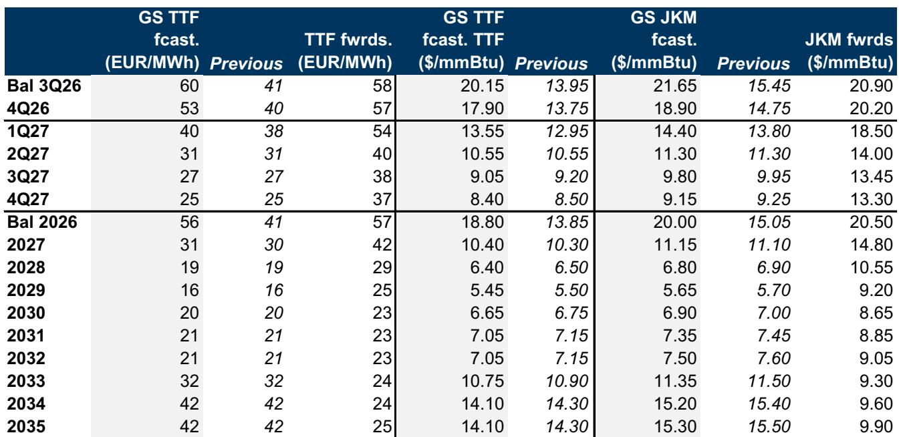
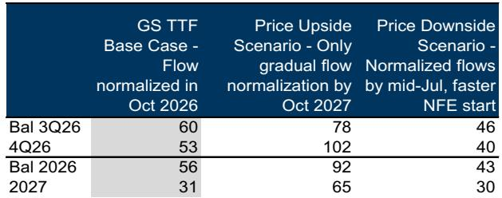

# GS：霍尔木兹出口延迟至业务与近期数据观察

中东局势持续紧张，GS大宗商品研究团队调整了对波斯湾液化天然气出口恢复节奏的判断。该机构在最新报告中假设，霍尔木兹海峡的液化天然气出口正常化时间将从2026年7月推迟至2026年10月。这一调整意味着全球夏季末的液化天然气供应净减少约1600万吨/年，相当于全球供应量的4%。报告认为，欧洲天然气平衡将因此收紧，尤其是冬季遭遇寒冷天气时，欧洲的脆弱性显著上升。

报告的核心判断是，欧洲天然气基准价格TTF可能需要在未来数月内升至65欧元/兆瓦时附近并维持高位。65欧元/兆瓦时是GS此前观察到的、能够更明显抑制亚洲液化天然气需求的价格阈值。基于这一逻辑，GS将2026年第三季度和第四季度的TTF预测分别从41欧元和40欧元上调至60欧元和53欧元/兆瓦时，接近当前远期合约58欧元和57欧元/兆瓦时的水平。

> **KC评论：** GS上调预测的核心不是供应缺口本身，而是欧洲冬季储气库的缓冲空间被压缩后，市场需要更高的价格来“挤掉”亚洲需求，从而避免库存耗尽。65欧元/兆瓦时这个数字值得关注，它是报告分析框架中亚洲需求对价格敏感度的关键分界线。

## 1. 冬季储气库缓冲空间被压缩至近14年低位

报告详细测算了供应延迟对欧洲储气库的影响。假设冬季气温为十年均值，西北欧在2026年10月底（冬季开始）的储气库填充率将从此前预期的74%降至67%，到2027年3月底（冬季结束）则降至28%。这一估算已经考虑了因液化天然气价格上涨而对亚洲需求进行的边际下调——GS将夏季剩余时间的亚洲平均需求预期下调了400万吨/年，至2.62亿吨/年。

报告特别指出，冬季结束时储气库填充率28%本身不是问题。问题在于，这一数字是基于平均气温的估算。如果冬季实际气温显著低于均值，情况将完全不同。GS估算，一个标准差为2的偏冷冬季通常会使天然气需求增加，导致冬季末储气库填充率额外下降24个百分点。这意味着，在28%的基准情景下，一个偏冷冬季就可能将储气库推向危险的低位。

## 2. 价格上行不确定性显著，节奏变化空间同样存在

GS对近期TTF预测的不确定性评估明确偏向于上行。在一种极端情景中——中东能源出口直到2027年才逐步正常化——报告估算2026年12月的TTF可能需要升至100欧元/兆瓦时以上，比基准预测的50欧元高出110%，才能有效抑制亚洲需求并避免欧洲储气库出现库存耗尽的不确定性。值得注意的是，这一上行估算同样基于十年平均气温假设；若冬季偏冷，价格可能需要进一步飙升。

相反，如果霍尔木兹海峡的流量恢复速度快于预期，TTF可能回落至40欧元/兆瓦时的煤转气转换阈值，比当前基准预测低20%。若冬季偏暖，则可能完全消除40欧元/兆瓦时的价格下限，使价格提前进入GS预计的2027年30欧元/兆瓦时区间。

## 3. 长期看空观点不变，但依赖霍尔木兹完全开放

尽管上调了近期预测，GS维持对2028年和2029年TTF的看空观点，预测值分别为19欧元和16欧元/兆瓦时，远低于当前远期合约的29欧元和25欧元。报告强调，这一长期观点的一个关键前提假设是霍尔木兹海峡完全恢复通航。

报告进一步指出，长期预测的不确定性偏向节奏变化。近期美国新的液化天然气出口项目获得最终研究决定，预示着液化天然气供应过剩的规模和时间跨度可能超过GS当前平衡表已嵌入的水平。此外，伊朗冲突后煤炭和可再生能源发电的潜在增长，可能在未来几年降低亚洲对天然气的需求，进一步压低价格。

> **KC评论：** GS的长期预测与远期合约之间存在巨大价差——2028年预测19欧元，远期29欧元；2029年预测16欧元，远期25欧元。这种分歧反映了市场对供应过剩何时真正到来的不同判断。GS认为，美国新项目的最终研究决定信号意味着过剩可能比市场预期的更大、更持久。

## 4. 一个可复用的观察框架：价格阈值与需求破坏

这份报告提供了一个清晰的天然气市场分析框架，核心是价格如何通过“需求破坏”机制来平衡市场。GS设定了两个关键价格阈值：40欧元/兆瓦时是煤转气转换的宏观环境边界，低于此价格天然气相对煤炭具有成本优势；65欧元/兆瓦时则是抑制亚洲工业需求的触发点，高于此价格亚洲买家会显著减少采购。

这两个阈值构成了一个价格走廊。当供应冲击发生时，市场需要价格突破65欧元阈值，通过抑制亚洲需求来为欧洲腾出供应。当供应恢复时，价格则可能回落至40欧元附近，甚至更低。理解这一框架，有助于观察者判断不同情景下价格的可能运行区间，而非仅仅关注供需数字本身。

报告同时指出，对于天然气用户而言，当前欧洲冬季天然气和液化天然气价格飙升的不确定性仍然存在，建议对此进行对冲操作。这一判断基于上述分析框架中上行不确定性显著大于节奏变化不确定性的评估。

For informational purposes only. Portions may be generated,translated,summarized,or edited with AI assistance based on source materials and may contain omissions or errors. Please verify independently. This is not investment,legal,tax,accounting,or other professional advice.

For informational purposes only. Portions may be generated,translated,summarized,or edited with AI assistance based on source materials and may contain omissions or errors. Please verify independently. This is not investment,legal,tax,accounting,or other professional advice.

