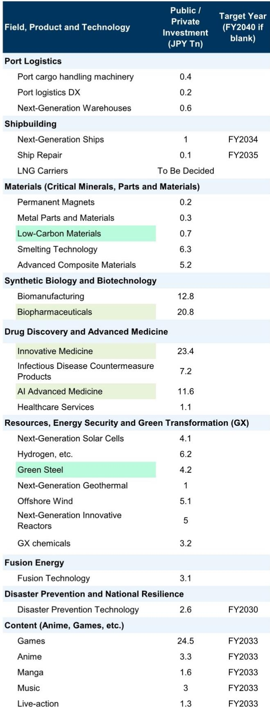
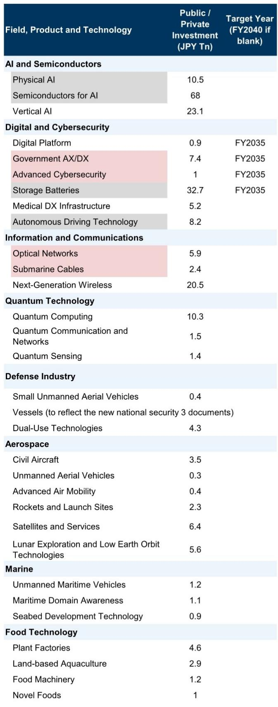
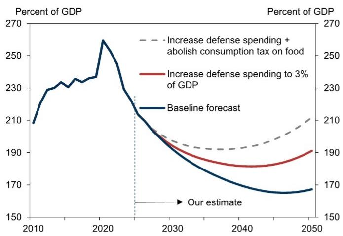

# GS：行业规则与主题变化观察

日本内阁近期批准了2026年版《宏观环境财政运营基本方针》与《日本增长战略》，这是石破茂政权首份完整的宏观环境政策框架文件。GS日本宏观环境团队在研报中指出，这份文件在财政框架上做出了两个关键转向：从单年度预算转向多年度预算，以及用“稳定降低债务对GDP比率”取代此前“实现基础财政收支盈余”的财政健全化目标。

这些变化并非技术性调整。多年度预算意味着可以为中长期项目提前锁定资金，不再受每年预算编制周期的约束。而放弃单年度基础财政收支盈余目标，转而追求通过宏观环境增长降低债务比率，实际上为扩大财政支出提供了更大的操作空间。GS分析师认为，从2027财年起，日本初始预算规模很可能长期高于以往，因为增长战略相关研究将被纳入初始预算，而非依赖补充预算。

## 1. 财政纪律松绑为增长战略创造资金空间

新框架的核心逻辑是：不再机械追求单年度财政平衡，而是通过宏观环境增长来稀释债务负担。GS将这一目标称为“便利的”财政目标——如果研究策略能推高名义增长率，即使财政赤字和债务增加，债务对GDP比率也可能下降。

GS的不确定性测试显示，在引入食品消费税减税（从8%降至1%，假设两年后实质永久化）并将国防开支从GDP的2%提高至3%的不确定性情景下，若10年期国债回报表现维持在2.7%，债务对GDP比率要到2030年代中期才会开始上升，约有10年的缓冲期。但如果10年期回报表现升至3.5%，债务比率将在约5年内转为上升趋势。

这意味着市场对财政可持续性的担忧本身可能侵蚀可持续性——如果市场认为财政纪律被忽视，不确定性溢价上升将推高长期利率，反而加速债务比率出现变化。

> **KC评论：** GS模拟的关键变量是利率路径。在低利率环境下，财政扩张有十年窗口；一旦利率上行，这个窗口会急剧收窄。市场定价中隐含的财政不确定性溢价，将成为未来日本国债回报表现的重要决定因素。

## 2. 增长战略设定370万亿日元研究目标，但依赖民间部门决策

《日本增长战略》是石破政权的标志性政策，内阁已同步批准。该战略在17个战略领域识别出62项关键产品和技术，涵盖AI、半导体、数字、药物发现、下一代能源等方向，目标是在2040财年前实现累计官民研究超过370万亿日元。

具体来看，AI用半导体被赋予68万亿日元的研究规模，垂直AI为23.1万亿日元，物理AI为10.5万亿日元。储能电池32.7万亿日元，创新药物23.4万亿日元，游戏产业24.5万亿日元。这些数字来自政府向主要企业和行业组织调查研究计划后汇总得出。

但GS明确指出，370万亿日元累计研究、2040财年250万亿日元的民间设备研究以及1100万亿日元的名义GDP，都只是“假设和估算”，并非必须达成的目标。政府将提供制度支持和部分资金，但高度依赖民间研究，最终取决于企业决策。

## 3. 潜在增长率假设激进，但设备研究目标相对可行

GS认为，增长战略中关于潜在增长率从当前约0.5%升至2030年代超过1.5%的假设“相当激进”，因为日本的全要素生产率增长迄今仅缓慢上升。名义GDP达到1100万亿日元需要年均名义增长3.5%，这建立在政府2%的通胀预期和1.5%的潜在增长率之上，实现前景不确定。

相比之下，2040财年民间设备研究达到250万亿日元的目标被认为更可行。这要求民间设备研究未来每年增长约4%。2025财年设备研究名义增速约为5%，当前研究主要由应对劳动力短缺的省力化研究和数字化驱动。由于劳动力短缺是结构性问题，GS预计企业将维持积极研究姿态。如果政府支持进一步提振企业研究，加上通胀推高研究金额，250万亿日元的目标“看起来可以实现”。

## 4. 观察框架：财政纪律与市场定价的互动

这份报告提供了一个可复用的分析框架：当政府从“单年度财政盈余目标”转向“债务比率稳定目标”时，财政政策的约束条件发生了变化，但市场定价成为新的约束变量。

具体而言，读者需要关注两个维度：一是政府实际支出路径与增长战略落地情况，即研究能否转化为名义GDP增长；二是日本国债回报表现曲线，尤其是10年期回报表现是否因财政不确定性溢价上升而突破3%关口。GS的模拟显示，这两个变量的不同组合将决定债务比率在5年还是10年后开始上升，进而影响日本长期利率定价和日元汇率走势。

对于关注日本市场的读者，这份报告的价值不在于增长战略的具体数字，而在于揭示了新财政框架的内在张力：政府试图用增长解决债务问题，但市场对财政纪律的信心一旦动摇，可能反过来破坏增长的前提条件。

For informational purposes only. Portions may be generated,translated,summarized,or edited with AI assistance based on source materials and may contain omissions or errors. Please verify independently. This is not investment,legal,tax,accounting,or other professional advice.

