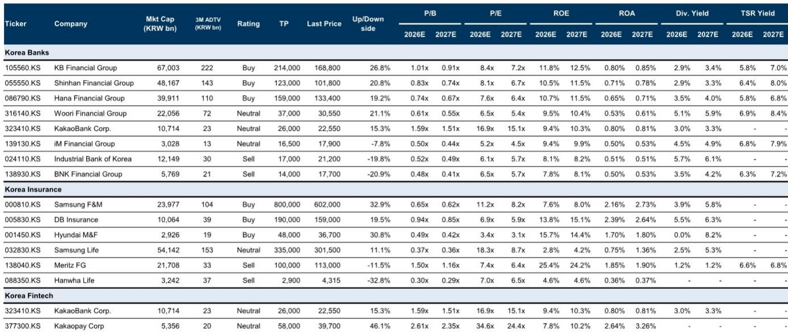

# Korean Banks Are Becoming a Structural Safe Haven, Not Just a Cyclical Trade

As global technology stocks correct sharply and investors seek non-tech defensives, Korean financials have emerged as a surprisingly compelling destination for capital seeking both safety and returns. The rotation is not merely a tactical shift. A global investment bank's recent marketing feedback from Hong Kong and Singapore reveals that institutional investors increasingly view Korean banks as a structural sweet spot: a sector where rising interest rates, a government-led Value Up agenda, and improving return on equity dynamics converge to create a durable re-rating story. The key question is no longer whether Korean banks can hold their ground in a downturn, but whether they can sustain the momentum to break through the psychological 1x price-to-book barrier that has capped their valuations for years.

The timing matters because the macro environment is shifting in their favor. With the tech correction accelerating, the flight to safety has become more than a defensive posture. Investors are now actively seeking sectors where earnings visibility is high and where policy tailwinds, rather than speculative growth narratives, underpin returns. Korean banks, long dismissed as low-growth value traps, now present a counterintuitive proposition: they are becoming a high-ROE, high-cash-return sector at a time when yield and predictability are scarce. The report's feedback from institutional meetings confirms that the conversation has moved past the Value Up narrative's initial hype and into a more granular debate about which sub-sectors and which companies can deliver the most upside.

This article distills the strategic logic behind that rotation, examines why insurers are the next frontier, and explains why fintech remains a wait-and-see proposition. It then translates the report's findings into a decision framework for allocators who must decide how to position within Korean financials today.

## Rising Interest Rates and Retail Money Flows Are Creating a Genuine ROE Upside That Consensus Underestimates

The core argument for Korean banks rests on a simple but powerful mechanism: the rate hike cycle is delivering net interest margin expansion at a time when asset quality remains resilient, and this combination is generating ROE outcomes that exceed consensus expectations. Investors in the marketing meetings broadly agreed with this thesis. The report notes that "strong macro supporting the rate hike cycle" allows banks to benefit from "bigger NIM expansion," while "resilient asset quality" prevents the typical credit cost drag that often accompanies rising rates. This is not a theoretical scenario. The valuation table in the report shows that for KB Financial Group, ROE is projected to rise from 11.8% in 2026 to 12.5% in 2027. Shinhan Financial Group is expected to see a similar trajectory, from 10.5% to 11.5%. These are not dramatic leaps, but they are steady improvements in a sector where ROE has historically been capped by low interest rates and intense competition.

What makes this structurally significant is that the ROE improvement is not solely dependent on the rate cycle. The report highlights a second driver: the "retail money move." As Korean households shift savings from low-yield deposits into higher-yielding investment products and bank-managed assets, the fee income base of major banks expands. This dual-engine growth, NIM expansion plus fee income diversification, creates a more sustainable earnings trajectory than a pure rate play. Investors who focus only on the rate cycle miss the fact that the retail money shift is a multi-year trend, not a cyclical spike. The implication is clear: consensus ROE estimates may be too conservative, especially for banks that have the scale and distribution to capture the retail migration.

## The Value Up Renewals Are the Catalyst That Could Push Major Banks to 1x P/B, but Skepticism on Brokerage Profits Remains Healthy

The report's most actionable insight is that the next wave of Value Up announcements, specifically the "renewals" that raise total shareholder return ceilings and set minimum floors at 50%, could be the catalyst that finally pushes major Korean banks to a 1x price-to-book valuation. This is not a vague hope. The report explicitly states that "continued TSR expansion will allow major KR banks to reach 1x P/B." The mechanism is straightforward: higher TSR commitments reduce the discount that investors apply to bank stocks due to perceived governance risks and capital allocation opacity. When a bank commits to returning at least 50% of its earnings to shareholders, the equity story transforms from a speculative turnaround into a predictable cash flow machine.

However, the report also reveals a critical nuance. While investors are enthusiastic about the Value Up framework for banks, they remain "skeptical about elevated brokerage profits." The concern is that "increased market volatility could dampen retail trading sentiment." This skepticism is well-founded. Korean banks' brokerage subsidiaries have benefited from the retail trading boom, but that boom is sensitive to market conditions. If the tech correction deepens, retail trading volumes could decline, squeezing brokerage earnings. Investors are therefore pricing in a discount for this earnings stream, which is wise. The implication for bank stocks is that the pure banking earnings, NIM and fee income, must do the heavy lifting for the re-rating. Brokerage profits are a bonus, not a foundation.

## Korean Insurers Are the Next Value Up Candidates, but Investors Demand Concrete Plans Before They Engage

The report identifies insurers as "the next candidates for the Value Up theme," and the logic is compelling. The underwriting cycle is improving, aided by reform initiatives such as the GA commission cap and stricter claims review. Insurers are also shifting their focus "from quantity to quality," meaning they are prioritizing profitable policy growth over market share. This should, in theory, lead to higher margins and more sustainable earnings. The valuation table supports this. DB Insurance shows a projected ROE of 13.8% in 2026 and 15.1% in 2027, among the highest in the coverage universe. Samsung Fire & Marine Insurance trades at a 0.65x P/B.

Yet the report notes that investors are "waiting for substantial refinements to Value Up plans that are perceived as primitive." This is the key tension. The government is applying external pressure through corporate governance reforms, including mandatory treasury share cancellation and a 3% rule on major shareholders' voting rights. Meanwhile, peer pressure is mounting from DB Insurance, which is expected to announce more detailed measures in mid-August 2026. But investors want to see the actual plans, not just the policy direction. The market is effectively saying: show us the capital return targets, show us the buyback schedules, and then we will re-rate you. Until then, insurers remain an interesting but unproven opportunity.

The strategic takeaway for allocators is that insurers offer a higher beta to the Value Up theme than banks, but with higher execution risk. If DB Insurance delivers a compelling plan in August 2026, it could trigger a sector-wide re-rating. However, investors should be prepared for a binary outcome: either the plans are concrete and the stocks rally, or they are vague and the stocks remain range-bound.

## Fintech Remains a Waiting Game as Regulatory Tightening and Stablecoin Uncertainty Cap Investor Enthusiasm

The report's treatment of fintech is notable for its caution. Despite "a handful of investors" inquiring about KakaoBank's margin expansion potential, "overall investor interest remained muted." The reason is regulatory. The government is "further tightening retail lending," which has forced internet-only banks to "aggressively lower their maximum overdraft limits or temporarily suspend new account issuance." This is a direct headwind to growth. KakaoBank's valuation, at 1.59x P/B for 2026, is already above the major banks, but its ROE of 9.4% is lower than most of them. The premium is hard to justify when the growth engine is being throttled by regulation.

For Kakaopay, the story is different but equally uncertain. The company has delivered "accelerated revenue growth via its brokerage subsidiary," which is positive. However, investors are "waiting for tangible stablecoin-related developments that can potentially level up its growth trajectories." This is a classic catalyst-dependent thesis. If stablecoin regulations or partnerships materialize, Kakaopay could see a significant re-rating. If not, its current valuation of 2.61x P/B with a 7.8% ROE looks stretched. The report's views on both KakaoBank and Kakaopay reflect this uncertainty. For investors, fintech is a call option on regulatory clarity, not a core holding.

## A Decision Framework for Allocating Within Korean Financials

For allocators trying to position within Korean financials, the report's findings suggest a three-tier framework based on risk tolerance and time horizon.

The first tier is the core holding: major banks with clear Value Up renewals and strong NIM expansion. KB Financial Group, Shinhan Financial Group, and Hana Financial Group all offer projected ROE above 10%, P/B ratios below 1x, and TSR yields ranging from 5.8% to 8.0%. These are the most defensible positions because their re-rating is driven by self-executing capital return plans, not external catalysts. The report's views on all three reinforce this view. For investors seeking safety with upside, this is the logical starting point.

The second tier is the tactical play: insurers with improving underwriting cycles and upcoming Value Up announcements. DB Insurance and Samsung Fire & Marine Insurance offer higher ROE potential and deeper valuation discounts, but they require a catalyst to unlock value. Investors should monitor the August 2026 DB Insurance announcement closely. If it is strong, a position in the sector could generate outsized returns. If it is weak, the sector may drift. This is a higher-conviction, higher-risk allocation.

The third tier is the optionality: fintech. Both KakaoBank and Kakaopay are rated with the companies' control. These are not positions for the core portfolio. They are small, catalyst-driven bets that should be sized accordingly.

The critical insight from the report is that the Korean financial sector is no longer a homogeneous value play. It is a differentiated opportunity set where the banks offer a structural re-rating, the insurers offer a catalyst-driven re-rating, and the fintechs offer a speculative re-rating. The smart allocation is not to the sector; it is to pick the sub-sector that matches your investment horizon and risk appetite.

*For informational purposes only. Portions may be generated, translated, summarized, or edited with AI assistance based on source materials and may contain omissions or errors. Please verify independently. This is not investment, legal, tax, accounting, or other professional advice.*

For informational purposes only. Portions may be generated, translated, summarized, or edited with AI assistance based on source materials and may contain omissions or errors. Please verify independently. This is not investment, legal, tax, accounting, or other professional advice.

