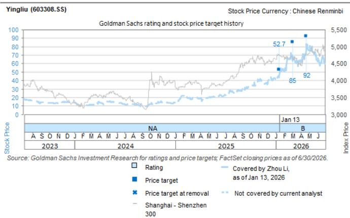

# 应流股份（603308.SS）：2Q26前瞻：6月产能小幅扩张，下半年更多产能释放，长期协议续签

我们下调2026-2030年每股盈利预测约10-11%，主要反映基于公司最新产能扩张计划调整的收入预期，以及管理层优先考虑产量增长和战略市场份额获取后更为有限的定价策略。

前瞻2Q26业绩，我们预计2Q26收入为9.16亿元人民币，同比增长27%。随着毛利率从1Q26的33.7%温和回升至34.5%，我们预计净利润为1.18亿元人民币，同比增长23%。

我们认为，市场关注的焦点已从应流股份自身的执行能力转向全球燃气轮机订单增长的可持续性。近期调整后，我们维持积极看法。该股目前交易于38.6倍未来12个月市盈率，较其历史低点30倍约有20%的下行空间，但若超大规模企业能提供更清晰的数据中心资本支出展望，其上行空间将更为显著（我们的目标倍数隐含88%的上行空间）。维持积极评级，12个月目标价调整为82.4元。

## 2Q26及2H26前瞻：下半年新增产能将逐步释放

我们预计应流股份的"双引擎"业务（燃气轮机和航空发动机）在2Q26将产生约4.2亿元的生产价值，基于4月和5月每月1.3-1.4亿元以及6月约1.5亿元的产出。假设传统业务基本保持稳定，我们预测2Q26、3Q26和4Q26的总收入分别为9.16亿元、9.81亿元和10.33亿元，同比增长27%、33%和30%，这基于以下产能扩张计划。

产能将在2H26继续扩张，三台新设备将投入生产。第一台设备于5月20日到货，预计8月完成调试。第二台已到货，预计9月开始生产，而第三台计划于7月29日到货，10月开始生产。每台设备在达到正常利用率后，每月可增加约1000万元的生产价值。假设产能爬坡基本按计划进行，3Q26E和4Q26E的季度双引擎生产价值可能分别增至约4.5-4.8亿元和4.8-5.3亿元，而1Q26和2Q26E分别为约4.0亿元和4.2亿元。

## 2Q26利润率前瞻：原材料压力缓解，但定价保持稳定

公司已通过某些长期协议中的合同调整机制，将部分原材料成本上涨传导给客户。然而，管理层不打算对关键战略客户进行激进的价格上调。鉴于长期认证、市场份额获取和深化客户关系的重要性，应流股份优先考虑产量增长和供应商定位，而非最大化短期定价。

镍、钴和钨分别约占销售成本中原材料成本的57%、14%和较低个位数百分比。这些材料价格同比分别上涨约19%、67%和322%，环比变化为+4%、0%和-1%。

随着原材料压力环比开始缓解，且部分成本上涨已传导出去，我们预计毛利率将从1Q26的33.7%回升至2Q26的34.5%。我们预测净利润为1.18亿元，同比增长23%。利润率改善应保持渐进，因为公司继续优先考虑战略客户关系和产量扩张，而非激进定价。

## 订单势头依然强劲，积压订单持续扩大

应流股份的订单势头在2Q26保持强劲。积压订单从1Q26末的约21亿元小幅增加至目前的超过22亿元，扣除本季度约4.2亿元的双引擎产品交付。这表明2Q26新订单量约为5亿元，年初至今总订单量为13.4亿元（此前全年目标30亿元的45%完成率，而新目标40亿元目前看来较为激进）。然而，管理层表示，他们通常仅在能够承诺在52周内交付时才记录为确定订单；更长期的意向和框架协议不计入报告的积压订单。

2Q26订单约为5亿元，包括来自安萨尔多（年初至今已签署4.5亿元订单）、贝克休斯的滚动订单、与上海电气的新订单、与斗山的原型订单以及来自赛峰的订单。

## 与贝克休斯的长期协议续签并签署新订单

与贝克休斯的长期协议也已续签：应流股份近期将与贝克休斯的长期协议续签至2031年。与2023年6月签署的上一份协议相比，续签的框架涵盖更广泛的产品范围和显著更高的承诺量。根据最新协议，预期月产量包括：八种LT16燃气轮机型号每月约14套；五种MS5002E产品类别每月4套；MS5001和LM9000平台各1套。

这意味着一旦协议达到目标运行率，年交付总量将超过200套。更高的产量预计将从2027年起转化为确定订单，并于2028年及以后交付。此外，7月10日，公司刚获得Frame5Max产品的认证，每台内容价值数百万人民币，市场份额50%，每月订单4套。最后，他们也开始进行LT12产品的研发。

贝克休斯协议还包括原材料调整机制。如果原材料价格波动超过10%，产品价格可以重新谈判，从而降低应流股份对重大合金价格波动的敞口。

## 与西门子能源的合作从验证走向量产

应流股份与西门子能源的合作在大型和中型燃气轮机平台上持续深化。公司预计所有相关的4000F原型机将在2026年期间进入量产。它还在为8000H平台开发组件，并推进SGT-450、SGT-700和SGT-800中型燃气轮机的项目。除了单个组件项目外，应流股份和西门子能源正在海南建立联合实验室。

## 关键讨论：燃气轮机订单增长是否已见顶？

尽管我们继续预计燃气轮机供应在2028-29年之后仍将保持紧张，这与主要涡轮机制造商当前的交付周期一致，但市场已越来越多地将焦点转向新订单增长的前景以及周期是否在2026年见顶。

我们同意订单增长在2027年不太可能保持在同样异常高的水平。然而，我们仍预计订单水平将保持强劲，这得益于2000年代初安装的涡轮机的更换周期以及数据中心的增量需求。在6月29日的收盘前电话会议上，西门子能源表示，根据当前的可视性，它预计未来几年全球燃气轮机市场将维持约110-120GW的年需求。

短期内，关键不确定性在于2026年之后超大规模企业资本支出的可视性有限。在超大规模企业提供2027年及以后更清晰的支出计划之前，我们认为读者可能继续将应流股份视为周期性股票，并以其人工智能时代之前的估值倍数进行定价，这导致了近期的调整。该股目前交易于38.6倍市盈率，低于自2018年以来约40倍的历史平均水平，较其约30倍市盈率的历史低点约有20%的下行空间。

然而，一旦超大规模企业的资本支出为数据中心电力需求的持久性提供更清晰的图景，我们相信订单可视性可能再次延伸至2028-29年及以后，从而支持更有利的重新定价。在当前水平，我们继续认为风险回报偏向上行。

图表1：应流股份交易于38.6倍市盈率，略低于自2018年以来40倍的历史平均水平

来源：公司数据，GS全球投资研究

图表2：应流股份交易于2026年预期市盈率40.5倍，略低于同行中位数45.6倍

<table><tr><td rowspan="2">公司</td><td rowspan="2">代码</td><td rowspan="2">货币</td><td rowspan="2">最新收盘价</td><td rowspan="2">12个月目标价</td><td rowspan="2">上行/（下行）</td><td rowspan="2">评级</td><td rowspan="2">市值（十亿美元）</td><td colspan="4">市盈率</td><td colspan="4">市净率</td><td colspan="4">企业价值/EBITDA</td><td colspan="4">净资产回报表现</td></tr><tr><td>2025</td><td>2026E</td><td>2027E</td><td>2028E</td><td>2025</td><td>2026E</td><td>2027E</td><td>2028E</td><td>2025</td><td>2026E</td><td>2027E</td><td>2028E</td><td>2025</td><td>2026E</td><td>2027E</td><td>2028E</td></tr><tr><td colspan="24">全球同行</td></tr><tr><td>应流股份</td><td>603308.SS</td><td>人民币</td><td>43.90</td><td>82.4</td><td>88%</td><td>买入</td><td>4.3</td><td>70.1x</td><td>40.5x</td><td>28.2x</td><td>18.6x</td><td>5.5x</td><td>4.9x</td><td>4.4x</td><td>3.7x</td><td>43.5x</td><td>32.1x</td><td>24.4x</td><td>16.1x</td><td>8%</td><td>13%</td><td>16%</td><td>21%</td></tr><tr><td>Howmet</td><td>HWM</td><td>美元</td><td>271.98</td><td>303</td><td>11%</td><td>买入</td><td>109.1</td><td>72.1x</td><td>53.9x</td><td>45.3x</td><td>39.7x</td><td>20.5x</td><td>17.0x</td><td>15.0x</td><td>13.3x</td><td>29.8x</td><td>35.1x</td><td>31.0x</td><td>27.4x</td><td>30%</td><td>36%</td><td>35%</td><td>36%</td></tr><tr><td>三菱重工</td><td>7011.T</td><td>日元</td><td>3681.00</td><td>6,000</td><td>63%</td><td>买入</td><td>76.2</td><td>50.4x</td><td>37.2x</td><td>32.0x</td><td>24.3x</td><td>5.3x</td><td>4.0x</td><td>3.7x</td><td>3.4x</td><td>12.3x</td><td>22.2x</td><td>16.6x</td><td>13.0x</td><td>10%</td><td>12%</td><td>11%</td><td>14%</td></tr><tr><td>西门子能源</td><td>ENR1n.DE</td><td>欧元</td><td>152.64</td><td>212</td><td>39%</td><td>买入*</td><td>151.2</td><td>98.6x</td><td>34.9x</td><td>26.0x</td><td>19.3x</td><td>12.4x</td><td>12.3x</td><td>11.9x</td><td>10.6x</td><td>14.8x</td><td>18.5x</td><td>13.9x</td><td>10.5x</td><td>13%</td><td>35%</td><td>46%</td><td>58%</td></tr><tr><td>GE Vernova</td><td>GEV</td><td>美元</td><td>1079.18</td><td>1,289</td><td>19%</td><td>买入</td><td>295.7</td><td>60.6x</td><td>73.7x</td><td>41.9x</td><td>31.7x</td><td>24.1x</td><td>21.1x</td><td>19.5x</td><td>19.5x</td><td>39.4x</td><td>43.6x</td><td>27.1x</td><td>20.2x</td><td>43%</td><td>31%</td><td>47%</td><td>61%</td></tr><tr><td>中位数</td><td></td><td></td><td></td><td></td><td>29%</td><td></td><td></td><td>66.4x</td><td>45.6x</td><td>37.0x</td><td>28.0x</td><td>16.5x</td><td>14.7x</td><td>13.5x</td><td>12.0x</td><td>22.3x</td><td>28.6x</td><td>21.8x</td><td>16.6x</td><td>22%</td><td>33%</td><td>41%</td><td>47%</td></tr></table>

\* 指区域确信名单上的股票。定价基于7月20日收盘价。
来源：公司数据，GS全球投资研究

目标价、每股盈利修正：我们下调2026-30年每股盈利预测约10-11%。相应地，我们的12个月目标价下调至82.4元（此前为92.0元），仍基于2030年预期市盈率30倍，以10.0%的权益成本折现至2027年。

## 投资主题、估值方法和风险

## 应流股份（603308.SS，买入）

应流股份是国内领先的高端铸件供应商，全球份额不足1%，增长空间广阔。我们预计美国AI数据中心约60%的电力将来自燃气轮机，而全球原始设备制造商（西门子能源、GE Vernova、三菱重工）面临严重的产能限制，涡轮叶片由于严格的冶金要求和西方供应商（如PCC、Howmet）的供应集中而成为关键瓶颈，这些供应商优先考虑航空航天领域并面临劳动力短缺。应流股份凭借可用产能、较低的平均售价、可比的品质以及强大的研发和客户关系，处于有利地位以捕捉需求溢出，这得益于为西门子能源扩展的产品开发以及与贝克休斯、安萨尔多和GE航空的长期合同。虽然相对于西方现有供应商，到2030年仍是一个补充性供应商，全球份额为个位数，但产品组合、规模和资产周转率的改善应推动毛利率、净利润率和净资产回报表现在整个周期内扩张。我们预测2026E-30E总销售/盈利复合年增长率为28%/41%，并得出12个月目标价82.4元。我们给予报告评级。

估值方法：我们的12个月目标价82.4元基于2030年预期市盈率30倍，以10%的权益成本折现至2027年。

主要下行风险：（1）由于良品率提升或招聘熟练技术人员失败，产能爬坡低于预期；（2）订单增长低于预期，可能由于开发新SKU的周期较长；（3）AI数据中心需求减弱，超大规模企业取消燃气轮机制造商的订单。

图表3：应流股份盈利修正摘要

<table><tr><td>应流股份</td><td></td><td>2026E</td><td>2027E</td><td>2028E</td><td>2029E</td><td>2030E</td></tr><tr><td>收入（新）</td><td>百万元人民币</td><td>3,818</td><td>5,277</td><td>6,946</td><td>8,434</td><td>10,117</td></tr><tr><td>此前</td><td>百万元人民币</td><td>4,063</td><td>5,307</td><td>7,051</td><td>8,579</td><td>10,382</td></tr><tr><td>vs. 此前</td><td>%</td><td>-6.0%</td><td>-0.6%</td><td>-1.5%</td><td>-1.7%</td><td>-2.5%</td></tr><tr><td>息税前利润（新）</td><td>百万元人民币</td><td>586</td><td>926</td><td>1,418</td><td>1,819</td><td>2,340</td></tr><tr><td>此前</td><td>百万元人民币</td><td>652</td><td>1,064</td><td>1,617</td><td>2,054</td><td>2,655</td></tr><tr><td>vs. 此前</td><td>%</td><td>-10.1%</td><td>-13.0%</td><td>-12.3%</td><td>-11.4%</td><td>-11.9%</td></tr><tr><td>净利润（新）</td><td>百万元人民币</td><td>627</td><td>998</td><td>1,523</td><td>1,944</td><td>2,484</td></tr><tr><td>此前</td><td>百万元人民币</td><td>697</td><td>1,119</td><td>1,704</td><td>2,159</td><td>2,771</td></tr><tr><td>vs. 此前</td><td>%</td><td>-10.1%</td><td>-10.8%</td><td>-10.6%</td><td>-9.9%</td><td>-10.4%</td></tr></table>

来源：公司数据，GS全球投资研究

<table><tr><td>603308.SS</td><td>12个月目标价：82.4元</td><td colspan="2">价格：44.34元</td><td colspan="2">上行空间：85.8%</td></tr><tr><td rowspan="2">买入</td><td>GS预测</td><td></td><td></td><td></td><td></td></tr><tr><td></td><td>12/25</td><td>12/26E</td><td>12/27E</td><td>12/28E</td></tr><tr><td>市值：301亿元 / 44亿美元</td><td>收入（百万元人民币）新</td><td>2,918.8</td><td>3,818.4</td><td>5,276.6</td><td>6,945.7</td></tr><tr><td>企业价值：346亿元 / 51亿美元</td><td>收入（百万元人民币）旧</td><td>2,918.8</td><td>4,063.4</td><td>5,307.1</td><td>7,051.3</td></tr><tr><td>3个月日均交易量：16亿元 / 2.289亿美元</td><td>EBITDA（百万元人民币）</td><td>698.6</td><td>982.8</td><td>1,379.7</td><td>1,913.4</td></tr><tr><td>中国</td><td>每股盈利（元）新</td><td>0.51</td><td>0.92</td><td>1.47</td><td>2.24</td></tr><tr><td rowspan="2">中国工业科技与机械</td><td>每股盈利（元）旧</td><td>0.51</td><td>1.03</td><td>1.65</td><td>2.51</td></tr><tr><td>市盈率（倍）</td><td>51.9</td><td>48.0</td><td>30.2</td><td>19.8</td></tr><tr><td>并购排名：3</td><td>市净率（倍）</td><td>3.3</td><td>5.1</td><td>4.5</td><td>3.8</td></tr><tr><td rowspan="4">租赁包含在净债务和企业价值中？：是</td><td>股息回报表现（%）</td><td>0.6</td><td>0.4</td><td>0.7</td><td>1.0</td></tr><tr><td>CROCI（%）</td><td>9.2</td><td>10.0</td><td>12.5</td><td>15.0</td></tr><tr><td></td><td>3/26</td><td>6/26E</td><td>9/26E</td><td>12/26E</td></tr><tr><td>每股盈利（元）</td><td>0.18</td><td>0.17</td><td>0.21</td><td>0.36</td></tr></table>

来源：公司数据，GS估计，FactSet。价格截至2026年7月17日收盘。

## 披露附录

## Reg AC

我，周力，特此证明本报告中表达的所有观点准确反映了我对相关公司及其证券的个人观点。我还证明，我的报酬中没有任何部分直接或间接与本报告中表达的具体建议或观点相关。

撰稿作者：周力 GS（中国）证券有限公司，杜洁琳 GS（亚洲）有限责任公司，陈浩 GS（中国）证券有限公司。

除非另有说明，本报告撰稿作者披露中列出的个人是GS全球投资研究部门的分析师。

## GS因子概况

GS因子概况通过将股票的关键属性与市场（即我们评级的股票池）及其行业同行进行比较，为股票提供投资背景。描绘的四个关键属性是：增长、财务回报、倍数（例如估值）和综合（增长、财务回报和倍数的组合）。增长、财务回报和倍数是使用每只股票特定指标的标准化排名计算得出的。然后将指标的标准化排名进行平均，并转换为相关属性的百分位数。每个指标的具体计算可能因财年、行业和地区而异，但标准方法如下：

增长基于股票的前瞻性销售增长、EBITDA增长和每股盈利增长（对于金融股，仅每股盈利和销售增长），较高的百分位数表示增长较高的公司。财务回报基于股票的前瞻性净资产回报表现、已动用资本回报率和CROCI（对于金融股，仅净资产回报表现），较高的百分位数表示财务回报较高的公司。倍数基于股票的前瞻性市盈率、市净率、价格/股息、企业价值/EBITDA、企业价值/自由现金流和企业价值/债务调整后现金流（对于金融股，仅市盈率、市净率和价格/股息），较高的百分位数表示交易倍数较高的股票。综合百分位数计算为增长百分位数、财务回报百分位数和（100% - 倍数百分位数）的平均值。

财务回报和倍数使用GS分析师对未来至少三个季度后的财年末预测。增长使用未来至少七个季度后的财年输入，与未来至少三个季度后的财年进行比较（所有指标均基于每股）。

有关我们如何计算GS因子概况的更详细描述，请联系您的GS代表。

## 并购排名

在我们的全球覆盖范围内，我们使用并购框架检查股票，考虑定性因素和定量因素（可能因行业和地区而异），以纳入某些公司可能被收购的可能性。然后，我们将并购排名作为对我们评级覆盖下的公司从1到3进行评分的方法，其中1表示公司成为收购目标的高概率（30%-50%），2表示中等概率（15%-30%），3表示低概率（0%-15%）。对于排名为1或2的公司，根据我们的标准部门指南，我们将并购组成部分纳入我们的目标价。并购排名为3被认为不重要，因此不计入我们的价格目标，并且可能在研究中讨论或不讨论。

## Quantum

Quantum是GS的专有数据库，提供详细的财务报表历史、预测和比率的访问。它可用于对单个公司进行深入分析，或比较不同行业和市场的公司。

## 披露

应流股份的评级相对于其覆盖范围内的其他公司：中航光电、贝斯特、博楚、中国中车（A）、中国中车（H）、华测检测、埃斯顿（A）、埃斯顿（H）、法拉电子、海天国际、大族激光、杭可科技、宏发股份、华明装备、科华数据、先导智能（A）、先导智能（H）、绿的谐波、凌云光、麦格米特、鸣志电器、国电南瑞、江海股份、奥普特、三花智控（A）、三花智控（H）、宝信软件、英维克、汇川技术、科士达、双环传动、思源电气、创科实业、锐科激光、怡合达、应流股份、中控技术、时代电气（A）、时代电气（H）

## 公司特定监管披露

以下披露涉及GS集团（及其附属机构，"GS"）与GS全球投资研究所涵盖的公司之间的关系。

没有针对应流股份（43.90元）的公司特定披露。

## 评级/投资银行关系分布

GS投资研究全球股票覆盖范围

<table><tr><td rowspan="2"></td><td colspan="3">评级分布</td><td colspan="3">投资银行关系</td></tr><tr><td>买入</td><td>持有</td><td>卖出</td><td>买入</td><td>持有</td><td>卖出</td></tr><tr><td>全球</td><td>50%</td><td>34%</td><td>16%</td><td>65%</td><td>59%</td><td>43%</td></tr></table>

截至2026年7月1日，GS全球投资研究对3,104只股票进行了投资评级。GS将股票指定为各种区域投资清单上的买入和卖出；未如此指定的股票被视为中性。就FINRA规则要求的上述披露而言，此类指定等同于买入、持有和卖出。请参阅下面的"评级、覆盖范围和相关定义"。投资银行关系图表反映了每个评级类别中GS在过去十二个月内提供投资银行服务的公司百分比。

## 价格目标和评级历史图表

所示价格目标应结合所有先前发布的GS报告（可能包含或不包含价格目标）以及公司、其行业和金融市场的发展情况来考虑。

## 目标价历史表格 应流股份（603308.SS）

<table><tr><td>报告日期</td><td>目标价（元）</td><td>收盘价（元）</td></tr><tr><td>2026年4月24日</td><td>92.00</td><td>82.19</td></tr><tr><td>2026年3月3日</td><td>85.00</td><td>63.00</td></tr><tr><td>2026年1月13日</td><td>52.70</td><td>43.77</td></tr></table>

表格中显示的目标价未针对公司行为进行调整。

## 监管披露

## 美国法律法规要求的披露

请参阅上述公司特定监管披露，了解本报告中提及的公司所需的任何以下披露：待定交易中的经理或联合经理；1%或其他所有权；某些服务的报酬；客户关系类型；先前期间管理/联合管理的公开发行；董事职位；对于股票，做市和/或专家角色。GS作为本金交易或可能交易本报告中讨论的发行人的债务证券（或相关衍生品）。

以下是额外的必要披露：所有权和重大利益冲突：GS政策禁止其分析师、向分析师报告的专业人员及其家庭成员持有分析师覆盖范围内任何公司的证券。分析师薪酬：分析师的薪酬部分基于GS的盈利能力，其中包括投资银行收入。分析师作为高级职员或董事：GS政策通常禁止其分析师、向分析师报告的人员或其家庭成员担任分析师覆盖范围内任何公司的高级职员、董事或顾问。非美国分析师：非美国分析师可能不是GS & Co. LLC的关联人员，因此可能不受FINRA规则2241或FINRA规则2242关于与主题公司沟通、公开露面以及交易分析师所覆盖证券的限制。

## 美国以外司法管辖区法律法规要求的额外披露

以下披露是相关司法管辖区要求的，除非已根据美国法律在上文作出。澳大利亚：GS Australia Pty Ltd及其附属公司不是澳大利亚的授权存款机构（该术语在《1959年银行法》（联邦）中定义），不提供银行服务，也不在澳大利亚开展银行业务。除非GS另有约定，本研究及其任何访问仅面向澳大利亚《公司法》含义内的"批发客户"。在制作研究报告时，GS Australia全球投资研究部门的成员可能会参加由研究报告主题公司和实体主办或组织的现场访问和其他会议。在某些情况下，如果GS Australia认为在特定情况下与现场访问或会议相关是适当和合理的，此类现场访问或会议的费用可能部分或全部由相关发行人承担。如果本文档内容包含任何金融产品建议，则仅为一般性建议，由GS在未考虑客户目标、财务状况或需求的情况下编制。客户在根据任何此类建议采取行动之前，应考虑该建议是否适合其自身目标、财务状况和需求。某些GS Australia和New Zealand利益披露以及GS澳大利亚卖方研究独立性政策声明的副本可在以下网址获取：https://www.goldmansachs.com/disclosures/australia-new-zealand/index.html。巴西：有关CVM第20号决议的披露信息可在https://www.gs.com/worldwide/brazil/area/gir/index.html获取。在适用的情况下，根据CVM第20号决议第20条的定义，本研究报告内容的主要负责巴西注册分析师是本报告开头指定的第一作者，除非文本末尾另有说明。加拿大：此信息仅供您参考，在任何情况下均不应被解释为GS & Co. LLC为在加拿大购买证券而向加拿大证券购买者提供的广告、要约或招揽。GS & Co. LLC未根据适用的加拿大证券法在任何加拿大司法管辖区注册为交易商，通常不允许交易加拿大证券，并且可能被禁止在加拿大的某些司法管辖区销售某些证券和产品。如果您希望在加拿大交易任何加拿大证券或其他产品，请联系GS Canada Inc.（GS集团公司的附属公司）或其他注册的加拿大交易商。香港：有关本研究中提及的所覆盖公司证券的进一步信息，可向GS（亚洲）有限责任公司索取。印度：有关本研究中提及的主题公司或公司的进一步信息，可从GS（印度）证券私人有限公司获取，研究分析师 - SEBI注册号INH000001493，地址：10th Floor, Ascent-Worli, Sudam Kalu Ahire Marg, Worli, Mumbai-400 025, India，企业识别号U74140MH2006FTC160634，电话+91 22 6616 9000，传真+91 22 6616 9001。GS可能实益拥有本研究报告中所提及的主题公司或公司1%或以上的证券（该术语在印度《1956年证券合同（监管）法》第2(h)条中定义）。SEBI的注册和NISM的认证绝不保证中介机构的业绩或向读者提供任何回报保证。GS（印度）证券私人有限公司合规官和读者投诉联系详情、年度合规审计报告副本以及其他相关信息和披露可在以下链接获取：https://www.goldmansachs.com/worldwide/india/research-analyst。日本：见下文。韩国：除非GS另有约定，本研究及其任何访问仅面向《金融服务和资本市场法》含义内的"专业读者"。有关本研究中提及的主题公司或公司的进一步信息，可从GS（亚洲）有限责任公司首尔分行获取。新西兰：GS New Zealand Limited及其附属公司不是新西兰的"注册银行"或"存款接受者"（定义见《1989年新西兰储备银行法》）。除非GS另有约定，本研究及其任何访问面向《2008年金融顾问法》含义内的"批发客户"。某些GS Australia和New Zealand利益披露的副本可在以下网址获取：https://www.goldmansachs.com/disclosures/australia-new-zealand/index.html。俄罗斯：在俄罗斯联邦分发的研究报告不是俄罗斯立法所定义的广告，而是信息和分析，其主要目的不是产品推广，并且不提供俄罗斯评估活动立法意义上的评估。研究报告不构成俄罗斯法律法规所定义的个性化研究交流，不针对特定客户，并且是在未分析客户的财务状况、投资概况或风险概况的情况下编制的。GS不对客户或任何其他人基于本研究报告可能做出的任何投资决策承担责任。新加坡：GS（新加坡）私人有限公司（公司编号：198602165W），受新加坡金融管理局监管，对本研究承担法律责任，如有任何与此研究相关的事宜，应联系该公司。台湾：此材料仅供参考，未经许可不得转载。读者应仔细考虑自身的投资风险。投资结果由个人读者负责。英国：在英国将被归类为零售客户的个人（该术语在金融行为监管局规则中定义）应结合先前关于本研究中提及的所覆盖公司的GS报告阅读本研究，并应参考GS International已发送给他们的风险警告。这些风险警告的副本以及本报告中使用的某些金融术语的词汇表，可向GS International索取。

欧盟和英国：关于欧盟委员会授权法规（EU）（2016/958）第6(2)条补充欧洲议会和理事会法规（EU）第596/2014号（包括该授权法规在英国脱离欧盟和欧洲经济区后转化为英国国内法律和法规）中关于研究交流或其他建议或暗示投资策略的信息客观呈现的技术安排以及特定利益或利益冲突迹象披露的技术标准的披露信息，可在https://www.gs.com/disclosures/europeanpolicy.html获取，其中说明了管理投资研究中利益冲突的欧洲政策。

日本：GS Japan Co., Ltd.是在关东财务局注册的金融工具交易商，注册号Kinsho 69，是日本证券业协会、金融期货交易协会、第二类金融工具交易商协会和日本投资管理协会的成员。股票买卖需支付与客户预先确定的佣金加上消费税。有关日本证券交易所、日本证券业协会或日本证券金融公司要求的任何适用披露，请参阅公司特定披露。

## 评级、覆盖范围和相关定义

买入（B），中性（N），卖出（S）分析师推荐股票作为各种区域投资清单上的买入或卖出。被指定为投资清单上的买入或卖出取决于股票相对于其覆盖范围的总回报潜力。任何未被指定为投资清单上的买入或卖出且具有有效评级（即，不是评级暂停、未评级、早期生物技术、覆盖暂停或未覆盖的股票）的股票被视为中性。每个区域管理区域确信名单，这些名单选自各自区域投资清单上的报告评级股票，代表侧重于总回报潜力大小和/或在其各自覆盖区域内实现回报的可能性的研究交流。此类确信名单中添加或移除股票由各自区域的投资审查委员会或其他指定委员会管理，并不代表分析师对这些股票的投资评级发生变化。

总回报潜力代表当前股价与价格目标之间的上行或下行差异，包括所有已支付或预期股息，预计在价格目标相关的时间范围内实现。所有覆盖的股票都需要价格目标。总回报潜力、价格目标和相关时间范围在每份添加或重申投资清单成员资格的报告中有说明。

覆盖范围：每个覆盖范围内的股票列表可按首席分析师、股票和覆盖范围在https://www.gs.com/research/hedge.html获取。

未评级（NR）。当GS在此公司的合并或战略交易中担任顾问角色时，当存在法律、监管或政策限制（由于GS参与交易）时，以及在某些其他情况下，根据GS政策，投资评级、目标价和盈利预测（如相关）将被移除。早期生物技术（ES）。当此公司既没有已通过II期临床试验的药物、治疗或医疗设备，也没有分销后II期药物、治疗或医疗设备的许可时，根据GS政策，不分配投资评级和目标价。评级暂停（RS）。GS已暂停此股票的投资评级和价格目标，因为没有足够的基本面基础来确定投资评级或目标价。此股票之前的投资评级和目标价（如有）不再有效，不应依赖。覆盖暂停（CS）。GS已暂停对此公司的覆盖。未覆盖（NC）。GS不覆盖此公司。

## 全球产品；分发实体

GS全球投资研究为GS客户在全球范围内制作和分发研究产品。位于全球GS办公室的分析师对行业和公司以及宏观经济、货币、商品和投资组合策略进行研究。本研究在澳大利亚
