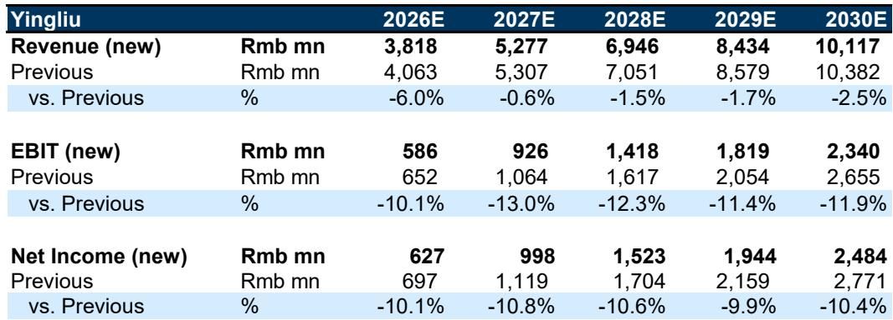
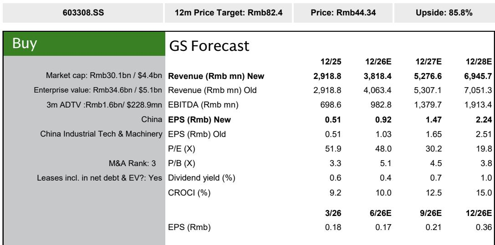
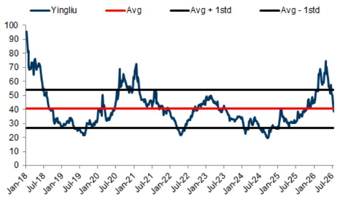

# 应流股份产能扩张加速，但市场真正关心的是燃气轮机需求是否已达峰值

应流股份的双引擎产值在2026年第二季度达到约4.2亿元人民币，得益于月产量从4月和5月的1.3-1.4亿元攀升至6月的约1.5亿元。公司目前正在安装三台新机器，每台在满产后每月可增加约1000万元产值。第一台机器于5月20日到货，预计8月完成调试；第二台已就位，预计9月开始生产；第三台将于7月29日到货，预计10月启动。若按此进度，第三季度双引擎产值可能增至4.5-4.8亿元，第四季度增至4.8-5.3亿元，而第一季度为4亿元，第二季度为4.2亿元。

产能建设本身并非问题所在。应流正在执行其扩张计划，收入轨迹清晰可见：研究团队预计第二季度收入为9.16亿元，同比增长27%，净利润为1.18亿元，同比增长23%。毛利率从第一季度的33.7%温和回升至34.5%，原因是镍、钴、钨等原材料价格压力环比开始缓解。公司已通过某些长期协议中的合同调整机制部分转嫁了较高的成本，但管理层并未追求激进的提价。战略重点是销量增长和客户关系深化，而非短期利润率最大化。

市场讨论的焦点已经转移。读者不再质疑应流能否完成自身的产能爬坡。问题在于全球燃气轮机周期是否已达峰值。该公司股价已回调至38.6倍远期市盈率，低于自2018年以来约40倍的历史平均水平，且比其30倍的历史低谷市盈率高出约20%。研究团队维持报告评级，但指出需要超大规模数据中心运营商提供2026年之后的资本支出计划，以更好地了解数据中心电力需求。在获得这一明确信息之前，该股可能仍将作为周期股进行交易。

以下部分将审视应流近期表现的关键驱动因素、其续签长期协议的战略意义、与西门子能源不断深化的合作关系，以及为读者权衡周期问题提供的决策框架。

## 订单势头依然强劲，积压订单超过22亿元，本季度新接订单约5亿元

应流的积压订单从第一季度末的约21亿元增加到目前的超过22亿元，扣除第二季度约4.2亿元的双引擎产品交付。这意味着本季度新接订单约5亿元，使年初至今的订单总额达到13.4亿元。这相当于此前全年30亿元目标的45%完成率，尽管管理层已将目标提高至40亿元，研究团队认为这一目标目前较为进取。

理解积压订单数字所涵盖和未涵盖的内容很重要。应流仅在能够承诺在52周内交付时才记录确定订单。更长期的意向和框架协议不包括在内。这种保守的会计处理意味着报告的积压订单低估了真实的需求管道。第二季度约5亿元的订单包括来自安萨尔多（Ansaldo）的1-2亿元、贝克休斯（Baker Hughes）的滚动订单、上海电气的一个新订单、斗山（Doosan）的样件订单以及赛峰（Safran）的订单。

这些订单的构成很重要。仅安萨尔多一家，年初至今已签署了4.5亿元的订单。与斗山的样件工作以及赛峰的持续订单表明，应流正在将其客户基础扩展到核心关系之外。这种多元化降低了对单一原始设备制造商的依赖，即使某个客户的订购模式出现波动，也为销量增长提供了多种途径。

对读者而言，关键启示是订单势头在相对意义上并未放缓。问题在于这一速度能否维持或加速。研究团队的答案是条件性的：订单增长不太可能保持在2026年看到的异常高水平，但在本世纪初安装的涡轮机更换周期和数据中心增量需求的支持下，应能保持强劲。西门子能源在6月29日的业绩预告电话会议上表示，预计未来几年全球燃气轮机市场将维持每年约110-120吉瓦的需求。

## 续签的贝克休斯协议将可见性延伸至2031年，承诺数量大幅增加并包含原材料保护条款

应流近期与贝克休斯续签了长期协议，有效期至2031年。与2023年6月签署的上一份协议相比，续签的框架协议涵盖了更广泛的产品范围和大幅增加的承诺数量。根据最新协议，预计月产量包括：八款LT16燃气轮机型号每月约14套，五款MS5002E产品类别每月4套，以及MS5001和LM9000平台各一套。

这意味着一旦协议达到目标运行率，年交付总量将超过200套。预计从2027年起，更高的数量将开始转化为确定订单，交付将从2028年及以后开始。此外，7月10日，应流获得了Frame5Max产品的认证，每台内容价值数百万人民币，预期市场份额为50%，每月订单为四套。公司还开始研发LT12产品。

该协议包含一个原材料调整机制。如果原材料价格变动超过10%，产品价格可以重新谈判。这一条款显著降低了应流在近几个季度因合金价格波动而压缩利润的风险。镍、钴和钨分别约占销售成本中原材料成本的57%、14%和较低的个位数百分比。这些价格同比分别上涨约19%、67%和322%，但在最近一个季度环比持平或略有下降。

该协议的战略意义超出了承诺数量本身。贝克休斯是全球主要的燃气轮机原始设备制造商之一，协议延长至2031年为应流提供了大多数同行无法提供的收入可见性。更广泛的产品范围和更高的数量表明，贝克休斯将应流视为战略供应商，而不仅仅是次要来源。原材料调整机制也意味着，在合同期内，应流的利润率状况应变得更加可预测，从而减少了盈利波动的一个关键来源。

## 与西门子能源的合作正从验证阶段迈向量产，并在海南设立联合实验室

应流与西门子能源在大型和中型燃气轮机平台上的合作持续深化。公司预计所有相关的4000F样机将在2026年期间进入量产。它还在为8000H平台开发组件，并推进SGT-450、SGT-700和SGT-800中型燃气轮机的项目。除了单个组件项目外，应流和西门子能源正在海南建立一个联合实验室。

从样机验证到量产的过渡是一个关键的转折点。样机制造展示了技术能力；量产则展示了制造可靠性、成本竞争力以及满足关键燃气轮机组件所需质量标准的能力。西门子能源的关系尤为重要，因为它涵盖了用于公用事业规模发电的大型框架式涡轮机和用于工业应用以及潜在数据中心电源的中型涡轮机。

海南的联合实验室是双方长期承诺的信号。这表明西门子能源将应流视为持续研发和工艺改进的合作伙伴，而不仅仅是合同制造商。这种关系为原始设备制造商创造了转换成本，并且随着西门子能源自身产能限制的持续，应流更有可能获得额外的产品分配。

研究团队的投资论点明确指出，包括西门子能源在内的全球原始设备制造商面临严重的产能限制，涡轮叶片是关键瓶颈，原因是严格的冶金要求以及供应集中在PCC和Howmet等西方供应商手中，这些供应商优先考虑航空航天领域并面临劳动力短缺。应流凭借可用产能、较低的平均售价、可比的品质以及强大的研发和客户关系，处于有利地位，能够捕捉需求溢出。

## 读者的决策框架：基于超大规模数据中心资本支出可见性的三种估值情景

应流当前估值中的核心矛盾在于近期执行可见性与中期需求不确定性之间。公司正在执行产能扩张，订单强劲，长期协议正在以更高数量续签，与西门子能源的关系也在深化。然而，该股的市盈率低于其历史平均水平，且存在跌至约30倍低谷市盈率的下行空间。

读者可以围绕超大规模数据中心资本支出可见性的三种情景来构建决策框架：

**情景一：超大规模数据中心在未来6-12个月内提供2027年及以后的明确支出计划。** 在此情景下，数据中心电力需求的持久性变得可见，燃气轮机订单可见性将延伸至2028-29年及以后。研究团队的目标市盈率意味着较当前水平有88%的上涨空间，该股可能重新评级至其历史平均市盈率或以上。这是研究团队的基本情景，反映在报告评级中。

**情景二：超大规模数据中心资本支出计划在2027年之前仍不透明。** 在此情景下，读者继续将应流视为周期股，并按其人工智能时代之前的市盈率进行估值。该股可能在其约30倍的历史低谷市盈率或附近交易，意味着较当前水平约有20%的下行空间。然而，基于现有积压订单、长期协议和产能扩张，公司的收入和盈利将继续增长，从而在估值和基本面之间形成脱节。

**情景三：超大规模数据中心减少或推迟数据中心资本支出计划。** 这是研究报告确定的关键下行风险。如果数据中心需求减弱，超大规模数据中心取消燃气轮机制造商的订单，应流的订单管道将受到影响。然而，公司对2000年代初期安装的涡轮机更换周期的敞口，以及其在贝克休斯、西门子能源、安萨尔多、上海电气、斗山和赛峰等客户中的多元化客户基础，提供了一定的缓冲。

研究团队的盈利修正反映了谨慎但不悲观的观点。他们将2026-30年预期每股收益下调了约10-11%，主要反映了基于公司最新产能扩张计划的收入爬坡更新，以及管理层优先考虑销量增长和战略市场份额而非定价行动。目标价基于10%的股权成本贴现至2027年。

对读者而言，决策框架最终关乎时间跨度以及对数据中心需求论点的信心。应流的近期执行强劲，其长期协议提供了至2031年的收入可见性，且其全球市场份额不足1%，留下了长期增长空间。不确定性不在于公司的执行能力，而在于宏观需求环境是否能够支撑公司盈利轨迹所证明的估值倍数。

*仅供参考。部分内容可能基于源材料通过人工智能辅助生成、翻译、总结或编辑，可能存在遗漏或错误。请独立核实。本文不构成投资、法律、税务、会计或其他专业建议。*

仅供参考。部分内容可能基于源材料通过人工智能辅助生成、翻译、总结或编辑，可能存在遗漏或错误。请独立核实。本文不构成投资、法律、税务、会计或其他专业建议。

