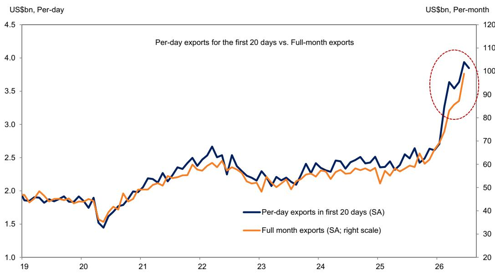

# 韩国7月出口回调：全球科技需求进入阶段性调整，而非趋势逆转

韩国7月前20个工作日日均出口额经季节性调整后环比下降2.3%，结束了此前连续两个月的增长态势。整体出口数据环比下降5.4%，但更值得关注的是：此前连续九个月增长的半导体出口基本持平，环比仅微降0.3%。这并非崩溃，而是一次节奏转换。推动韩国出口在2024年初持续攀升的全球贸易周期，正进入一个各产品、各目的地、各价格区间的增长动能不再均衡的阶段。对于关注亚洲最可靠贸易风向标的观察者而言，7月数据要求重新评估哪些需求驱动因素具有可持续性，哪些正在减弱。

时机值得关注。此次回调之前，月度出口增幅曾持续加速，上一周期环比增长达8.2%。单一20天窗口期不足以构成趋势，但下降的构成揭示了短期内难以逆转的结构性压力。计算机出口（其他科技产品子类别）环比收缩23.1%。非科技产品出口（包括石油产品、钢铁、汽车及汽车零部件）因广泛疲软而下降5.6%。贸易顺差从上月创纪录的174亿美元收窄至122亿美元。这一模式表明，疫情后库存补充和能源价格正常化带来的轻松增长已被消化，剩余的是由选择性终端市场支出和政策驱动竞争所塑造的需求环境。

对于读者而言，核心问题并非韩国出口机器是否正在失灵，而是当前数据预示的是周期中期盘整，还是更长期减速的开始。答案取决于三个因素：半导体需求在存储芯片热潮之外的持久性、美国与中国需求格局的分化，以及非科技出口在多大程度上受到结构性而非周期性逆风的影响。

## 半导体出口停滞反映从数量驱动向价格驱动的增长转变，而非需求崩溃

7月半导体出口近乎持平的表现（环比-0.3%）是报告中最受关注的数据。在连续九个月强劲增长后，这一暂停引发了两种相互竞争的解释。一种观点认为全球芯片周期已见顶，库存缓冲已重建，消费电子和企业IT的终端需求正趋于正常化。另一种观点认为，半导体贸易的构成正在发生变化：高价值存储芯片，尤其是用于AI数据中心的高带宽存储器（HBM），订单依然强劲，但传统DRAM和NAND因供应赶上而面临价格修正。

证据支持第二种解释。近几个月来，韩国半导体出口的增长主要由存储芯片价格上涨而非单位销量增长驱动。随着传统存储芯片现货价格企稳或走软，月度环比增长率自然放缓。这是正常化，而非逆转。AI驱动的高带宽内存需求仍受到超大规模企业资本支出计划的结构性支撑，这些计划将持续至2025年。7月数据揭示的是，由价格驱动的轻松增长阶段已过去，半导体出口的下一轮增长将取决于汽车、工业和移动设备等非AI终端市场的销量吸收情况。

对于观察者而言，这意味着半导体出口数据作为整体贸易周期的高频信号，其可靠性将下降。该行业对整体增长的贡献将收窄，存储子领域之间的分化将扩大。涉及传统存储或大宗逻辑芯片的公司面临利润率压力，而与AI特定组件相关的公司则继续受益于结构性需求。

## 对台湾和美国出口下降揭示全球需求环境的两速分化，中国提供稳定支撑

7月出口的地理分布是报告中最引人注目的信号。对美出口环比下降10.4%，对台出口环比骤降28.4%。这两个目的地合计约占整体环比降幅的三分之二。相比之下，对中国大陆出口以3.4%的温和环比增速延续了九个月的增长态势。对香港、马来西亚、日本等其他亚洲经济体的出口普遍疲软。

这种分化并非偶然。美国出口下降反映了进口商因预期关税上调及供应链中断而提前备货的时期结束后的正常化。对台出口下降更具结构性：台湾是韩国用于半导体制造和电子组装的中间产品的主要目的地，其大幅下降表明全球电子供应链正处于去库存阶段。相比之下，中国继续以稳定速度吸收韩国出口，这得益于对石化产品、显示面板以及与国内制造业投资相关的机械的需求。

战略含义显而易见。关于美国引领全球贸易复苏的说法并不完整。尽管美国消费者支出和企业投资依然稳健，但进口数据显示库存周期正对进一步增长构成阻力。中国尽管面临众所周知的经济挑战，但通过更具政策支持且周期性较弱的需求，为韩国出口提供了稳定基础。对于供应链横跨这些市场的公司而言，风险并不均匀。面向美国的电子产品和汽车零部件面临短期下行风险，而与中国相关的工业投入品则提供相对稳定性。

## 非科技出口疲软范围广泛，表明多行业工业需求正在软化

7月非科技出口环比下降5.6%，石油产品、钢铁、汽车及汽车零部件均出现下降。这种广泛性令人担忧，因为它表明疲软并非局限于单一行业或暂时性因素。石油产品出口对炼油利润率和全球油价敏感，两者均已回落。钢铁出口面临中国产能过剩和发达市场建筑需求疲软的双重压力。汽车及汽车零部件出口则受到经销商库存正常化、电动汽车普及率放缓以及中国制造商在第三方市场竞争加剧的挤压。

共同点是，非科技出口正对失去动力的全球工业周期做出反应。欧元区、日本及部分东南亚地区的制造业采购经理人指数（PMI）持续收缩或勉强扩张。美国资本品订单在疫情后激增后已有所放缓。对于韩国出口商而言，非科技领域比受益于AI和数据中心结构性需求驱动因素的科技领域更容易受到这些宏观逆风的影响。

对于决策者而言，这意味着韩国出口结构正变得更加依赖少数科技产品。只要半导体需求保持强劲，这种集中风险是可控的，但它使整体贸易平衡容易受到芯片周期任何中断的影响。中期内，向服务出口、知识产权和高价值制造业的多元化发展将是降低这种脆弱性的必要举措。

## 解读周期转折点出口数据的决策框架

7月数据为使用韩国贸易数据作为全球需求领先指标的读者提供了一个构建决策框架的自然机会。该框架包含三个维度：产品周期、目的地暴露度和库存阶段。

首先，产品周期。半导体出口应在子领域层面而非总量层面进行分析。存储芯片价格趋势、AI相关芯片订单和非内存需求各自遵循不同周期。混合这些成分的总量增长率可能产生误导。其次，目的地暴露度。美国和中国不再同步波动。如果对中国出口保持稳定，对美出口下降并不自动意味着全球疲软。这两个市场现在由不同驱动因素主导：美国需求由消费主导且对库存敏感；中国需求由投资主导且受政策支持。第三，库存阶段。出口数据只有与目的地库存水平相比较时才有意义。出口下降伴随库存上升意味着需求疲软。出口下降伴随库存下降意味着补库存周期后的正常化。当前环境——电子产品去库存与工业品库存稳定并存——表明科技领域属于前者，非科技领域属于后者。

将这一框架应用于7月数据，可得出一个条件性展望。如果半导体子领域数据显示HBM和AI相关组件持续强劲，则整体出口减速属于周期中期盘整。如果广泛的存储芯片疲软持续至8月，则这一暂停将成为警示信号。同样，如果关税提前备货效应消退后美国进口需求企稳，地理分化将收窄。如果持续，则两速世界将成为贸易格局的永久特征。

## 贸易顺差收窄反映出口温和与进口韧性，而非竞争力恶化

贸易顺差从174亿美元收窄至122亿美元是报告中最引人注目的数字，但需要仔细解读。总进口环比下降4.9%，在连续两个月增长后回落。然而，机械和半导体制造设备进口上升，而下降集中在半导体、手机和能源相关产品。

这一构成具有启发性。资本设备进口上升表明韩国制造商仍在投资产能扩张，尤其是在先进芯片制造领域。能源进口下降反映了全球油价走低和冬季供暖需求减少，而非经济疲软。半导体进口下降部分是对出口暂停的镜像反映：如果韩国芯片制造商销售减少，他们购买的中间投入品也会减少。

因此，顺差收窄并非竞争力丧失的迹象。它是出口和进口量同步温和放缓（时间上略有不对称）的机械性结果。按任何标准衡量，顺差仍处于历史高位。顺差收窄所传达的信号是，此前数月推动顺差扩大的有利贸易条件带来的顺风正在减弱。对于货币和债券市场而言，这减少了韩元上行压力和韩国国债回报表现下行压力的一个来源。影响虽小，但值得关注。

*仅供参考。部分内容可能基于源材料通过AI辅助生成、翻译、总结或编辑，可能存在遗漏或错误。请独立核实。本文不构成专业建议。*

仅供参考。部分内容可能基于源材料通过AI辅助生成、翻译、总结或编辑，可能存在遗漏或错误。请独立核实。本文不构成专业建议。

