# Asia AI观察

## 强化紧缩政策的理由

- 亚洲的增长正受到AI硬件出口和数据中心投资的推动，而劳动力方面的扰动目前有限
- AI正日益影响亚洲的价格动态，上游成本压力随时间推移传导至更广泛的价格
- 这一背景可能促使部分亚洲央行（如韩国和台湾）转向更紧缩的货币政策

## 增长前景

经济学 亚洲

人工智能（AI）为许多亚洲经济体带来了显著的增长潜力。最直接的渠道是AI硬件出口的激增——在台湾和越南相当于GDP的近一半——以及数据中心投资的加速，这在马来西亚尤为突出。除了这些短期催化剂，AI还可能通过生产率提升来提振长期增长潜力。

## 劳动力影响

AI的第二轮效应目前较为温和：尚未出现大规模裁员，也没有生产率的阶跃式变化。通过财报电话会议分析，我们发现中国大陆的公司可能面临最直接的劳动力影响——这或许可作为其他亚洲经济体的“早期预警信号”。在整个地区，AI的应用将取代部分岗位，但通过技能再培训和重新部署可以缓解这一影响。同样重要的是，AI既可以替代劳动力，也可以增强劳动力，从而提高许多职业的人均产出。

## 价格动态的交叉影响

亚洲的价格动态正越来越多地受到AI基础设施建设的影响，而非传统的石油和食品周期。随着大型云服务商加大资本支出，需求集中在少数特定投入品上，首先推高了上游成本，随后通过更高的计算和服务价格逐步传导至更广泛的价格。影响将因经济体在AI技术栈中的位置而异——上游硬件生产商、中游组装商或下游应用方。价格风险呈现不对称性：上游供应商（如韩国和台湾）可能比下游纯应用方（如印度和印度尼西亚）更早感受到压力。

## 央行政策影响

AI超级周期强化了那些具有显著AI驱动增长潜力且处于技术供应链上游的经济体实施更紧缩货币政策的理由，因为这些经济体可能首先面临成本压力。韩国和台湾是两个典型例子，AI可能使天平倾向于进一步收紧货币政策。

这是我们关于颠覆性技术主题的最新报告。如果您希望订阅我们的九大主题，请点击此处。

## 披露与免责声明

本报告必须连同披露附录中的披露内容、分析师认证以及构成报告一部分的免责声明一起阅读。

## Justin Feng

香港上海HSBC银行有限公司
justin.feng@hsbc.com.hk
+852 22887108

## Frederic Neumann

首席亚洲经济学家，全球研究亚洲联席主管
香港上海HSBC银行有限公司
fredericneumann@hsbc.com.hk
+852 2822 4556

## Mark McDonald

AI与数据科学主管
HSBC银行（英国）
mark.mcdonald@hsbcib.com
+44 20 7991 3119

## Thomas Devlin

分析师，数据科学
HSBC证券（美国）公司
thomas.devlin@us.hsbc.com
+1 212 525 0672

## Abanti Bhaumik

班加罗尔 助理

2026年Extel全球固定收益研究调查
7月6日至24日
点击投票

报告发布机构：香港上海HSBC银行有限公司

查看HSBC全球研究：https://www.research.hsbc.com

## AI对亚洲央行意味着什么

亚洲的央行正面临一系列异常广泛且快速变化的挑战。

中东地缘政治局势仍存在不确定性，给亚洲经济体的能源和工业供应链带来变数。与此同时，与今年厄尔尼诺现象相关的食品和大宗商品价格可能上涨，加上新任美联储主席Kevin Warsh领导下美国货币政策的不确定性，使亚洲央行保持警惕（参见《美联储、厄尔尼诺与AI》，2026年7月3日）。

AI热潮——在大型科技公司强劲资本支出意愿的推动下依然火热——为政策制定者增添了新的复杂性。

## AI主题对亚洲央行政策有何影响？

需要说明的是，并非所有央行都朝着同一方向行动。在2026年下半年，我们预计日本、韩国、台湾、印度、新加坡、印度尼西亚、越南、菲律宾和新西兰将加息，而中国大陆、香港、马来西亚、泰国、孟加拉国和澳大利亚预计将维持政策利率不变（参见《亚洲经济季刊：仍在奔跑》，2026年6月24日）。

如果AI在不大幅推高价格的情况下提升生产率，将强化维持利率不变的理由。反之，如果AI数据中心建设更像是一种负面的供给侧冲击，则可能强化计划加息央行的紧缩倾向。

在本报告中，我们通过评估AI在未来一到两年内如何影响亚洲经济体的增长、劳动力和价格前景，来探讨AI热潮在当前政策周期中对亚洲央行的潜在意义。

## 增长前景

AI有望成为一项真正的变革性技术，对实体经济产生深远影响。在亚洲，AI基础设施建设的首轮宏观效应已体现在出口激增和数据中心投资上。如图1所示，AI的增长影响在AI硬件出口（在台湾和越南相当于GDP的近一半）和数据中心投资（在马来西亚最为突出）中最为明显。

图1：AI相关出口（2025年）和数据中心资本支出*
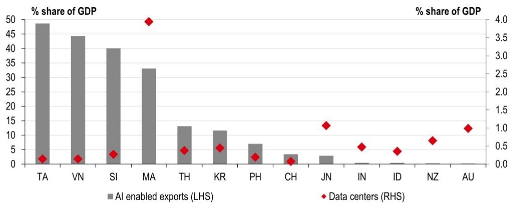
来源：IMF、ITC贸易地图、Cushman & Wakefield、HSBC。注：CH代表中国大陆。*数据中心资本支出指截至2025年预计在2030年前投入运营的开发项目所需的总投资（包括土地成本）。

图2：美国大型云服务商* AI资本支出
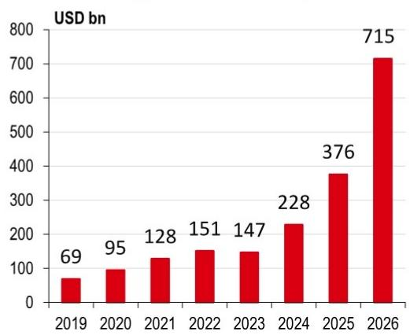
来源：彭博、HSBC。注：*亚马逊、谷歌、Meta和微软。2026年数据为截至2026年4月30日的公司指引。

图3：全球半导体销售额
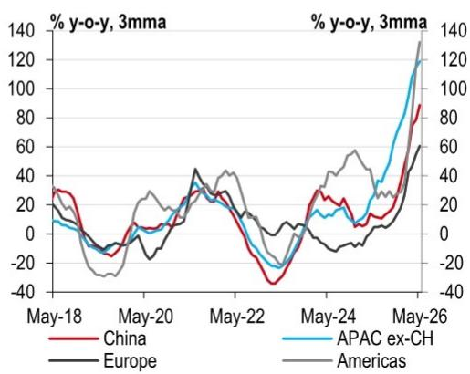
来源：Macrobond、HSBC

2022年，当OpenAI发布早期ChatGPT演示版，引发公众对面向消费者的AI的广泛兴趣时（对Justin和Thomas而言，这作为学生时代确实是一个改变人生的时刻），美国四大云服务商——亚马逊、谷歌、Meta和微软——在AI资本支出上花费了约1500亿美元。如图2所示，这一数字预计今年将飙升至远高于7000亿美元，大致相当于瑞典整个GDP的规模。

这场支出热潮正在为整个技术栈的AI基础设施建设提供资金，从半导体芯片（见图3）到数据中心设备，如服务器、光纤网络和液冷系统。

许多亚洲经济体高度暴露于这些增长机遇，尤其是通过AI硬件出口或数据中心投资。

台湾可以说是全球AI生态系统的关键枢纽。自AI热潮开始以来，美国英伟达的Hopper（以及后来的Blackwell）GPU（图形处理单元）已成为训练和推理的主力。然而，作为无晶圆厂芯片设计商，英伟达依赖台湾的台积电进行制造。

台积电是全球领先的代工厂（约70%市场份额），也是相对少见一家以商业可行良率量产领先的2纳米（nm）芯片的公司，同时还通过其南京和上海工厂为AMD（英伟达最接近的竞争对手）以及中国大陆客户在成熟节点（28nm及以上，受美国技术限制）制造芯片。这种客户覆盖的广度凸显了台积电在全球AI硬件价值链中的核心地位（参见《聚焦台湾》，2026年6月12日）。

韩国是AI相关需求驱动的存储芯片“超级周期”的主要受益者（参见《聚焦韩国》，2026年5月20日）。

DRAM是计算机中常见的高速、易失性（无持续电源无法保留数据）存储器。与AI需求密切相关的高带宽存储器（HBM）将DRAM垂直堆叠，以提供大型语言模型（LLM）所需的极高速度。而NAND则提供非易失性存储（即使断电也能保留数据）。DRAM和NAND都是AI数据中心所必需的。韩国的两大巨头三星和SK海力士约占全球DRAM市场的70%和NAND闪存的一半以上。

日本是芯片制造设备、化学品和材料的主要供应商

日本在半导体价值链中扮演着关键角色，是芯片制造设备、化学品和材料的主要供应商（参见《聚焦日本》，2026年2月10日）。日本政府最近提出了一项370万亿日元（约2.3万亿美元）、为期14年的战略投资计划，重点关注AI、半导体和其他关键技术。在国内和外国读者的推动下，日本也出现了AI数据中心热潮。

中国大陆与美国云服务商资本支出周期的直接关联程度低于台湾或韩国，但国内AI需求正在迅速增长。自2022年10月美国实施全面芯片限制以来，中国加速了供应链本地化，为华为、代工厂中芯国际、存储芯片生产商长江存储（NAND）和长鑫存储（DRAM）、设备制造商上海微电子等国内领军企业创造了机遇（参见《聚焦中国大陆》，2026年4月15日）。北京还计划在未来五年内投资约2万亿元人民币（约2950亿美元）用于数据中心，目标是从本地供应商采购至少80%的AI芯片。

澳大利亚正经历数据中心投资热潮

东南亚长期以来一直是半导体组装、测试和封装的中心。两个东盟经济体拥有重要的前端制造：新加坡（存储芯片）和马来西亚（汽车芯片）。几个东盟经济体——如马来西亚和泰国——也已成为数据中心投资的关键目的地（见图4）。通过在地缘政治摩擦加剧中务实对冲，许多东盟经济体利用其中立性和本地优势，吸引了来自中国、美国和欧盟在数据中心、芯片、汽车、绿色能源和电子领域的投资（参见《“G2”世界中的亚洲》，2026年5月14日）。

澳大利亚的数据中心投资也呈现强劲增长。然而，由于约85%的设备依赖进口，短期国内增长提振可能小于生产更多AI硬件和组件的经济体（参见Paul Bloxham，《数据中心热潮：来自LNG热潮的启示》，2026年6月29日）。

除了两个直接的增长催化剂——AI硬件出口和数据中心投资——AI还可能通过生产率提升来提振长期增长。这种提升的规模将取决于AI最终被证明具有多大的变革性（仍存在激烈争论）以及各经济体采用该技术的有效性，根据IMF的AI准备指数，这可能有利于发达市场（见图5）。

图4：数据中心外国直接投资的主要接收方
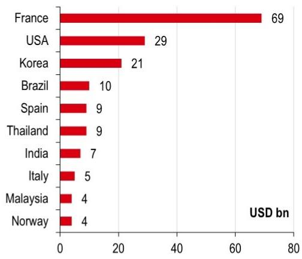
来源：UNCTAD、HSBC。注：数据涵盖2025年前三个季度。

图5：AI准备指数
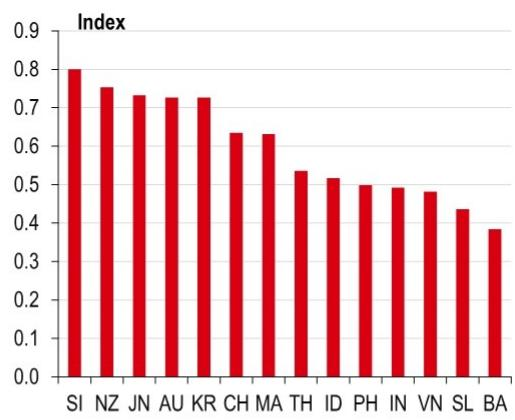
来源：IMF、HSBC

## 目前AI的应用通常未导致大规模裁员

## 劳动力影响

除了最初的基础设施建设，AI的第二轮宏观效应目前较为温和，没有出现大规模裁员或生产率的阶跃式变化。应用仍在逐步推进，类似于过去的通用技术：生产率随时间提升，部分岗位被取代，新的岗位出现，大规模失业得以避免（尽管失业率短期内可能略有上升）。当然，如果应用加速，更快的能力提升可能会扩大劳动力替代（参见James Pomeroy和Bethan Ellis，《游戏规则改变者》，2026年4月20日）。

## 亚洲经济体可能面临哪些劳动力影响？

首先，我们比较了亚洲新兴市场与发达市场各行业财报电话会议评论中的“显性”和“隐性”信号（见图6和图7）。不出所料，早期信号在服务业中较强——尤其是信息技术（IT）、金融和可选消费——并且在新兴市场中更为明显。

图6：AI对亚洲新兴市场经济体劳动力市场的潜在影响

来源：LSEG、TKRD、富时罗素、HSBC。注：柱内数字表示公司数量。新兴市场（EM）经济体包括中国大陆、印度、泰国、马来西亚、菲律宾和印度尼西亚。

图7：AI对亚洲发达市场经济体劳动力市场的潜在影响
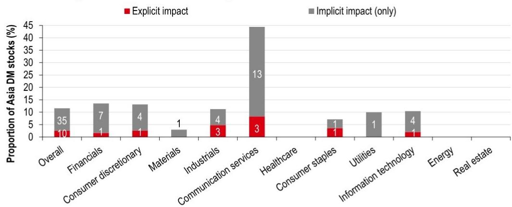
来源：LSEG、TKRD、富时罗素、HSBC。注：柱内数字表示公司数量。发达市场（DM）经济体包括日本、韩国、台湾、香港、新加坡、澳大利亚和新西兰。

中国大陆公司报告的潜在劳动力影响最高...

虽然尚未出现大规模裁员，但其他亚洲经济体可以将中国大陆视为AI劳动力影响的潜在风向标。如图8所示，该地区的公司报告的显性影响（直接与裁员相关）和隐性影响（无直接关联，但有替代或放缓招聘的迹象）数量均为亚洲最高。

图8：各亚洲经济体AI对劳动力市场的潜在影响
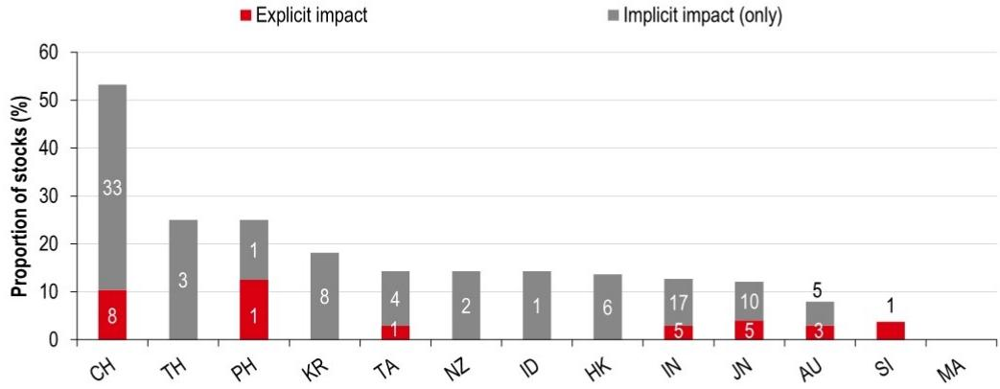
来源：LSEG、TKRD、富时罗素、HSBC。注：柱内数字表示公司数量。CH代表中国大陆。

中国大陆相比亚洲其他地区更高的潜在劳动力影响，反映了其快速的AI应用率（定义为财报电话会议记录中提及实际AI应用的公司比例）以及AI与业务流程的更深层次整合（见图9和表1）。

图9：中国大陆拥有亚洲最高的AI应用率，甚至超过美国*

来源：LSEG、TKRD、富时罗素、HSBC。注：CH代表中国大陆。*由于数据库覆盖范围的限制以及我们依赖英文财报电话会议记录，我们的分析可能高估了中国大陆的数据。

具有高科技敞口的经济体，如韩国和台湾，在AI应用和使用方面也排名靠前。泰国的受访公司得分也较高。相比之下，印度尼西亚和菲律宾的AI应用迹象较少。

表1：各亚洲经济体及行业的平均AI使用得分

<table><tr><td></td><td>有财报电话会议的公司数</td><td>市场得分</td><td>通信服务</td><td>可选消费</td><td>必需消费</td><td>能源</td><td>金融</td><td>医疗保健</td><td>工业</td><td>科技</td><td>材料</td><td>房地产</td><td>公用事业</td></tr><tr><td>中国大陆</td><td>77</td><td>2.9</td><td>4.1</td><td>3.2</td><td>2.2</td><td>0.0</td><td>3.3</td><td>1.3</td><td>3.1</td><td>2.5</td><td>4.0</td><td>1.5</td><td>0.0</td></tr><tr><td>泰国</td><td>12</td><td>2.3</td><td>3.0</td><td>0.0</td><td>0.0</td><td>2.0</td><td>3.5</td><td>3.3</td><td>2.0</td><td></td><td>2.5</td><td></td><td></td></tr><tr><td>韩国</td><td>44</td><td>1.8</td><td>2.6</td><td>1.3</td><td>1.0</td><td>1.3</td><td>2.5</td><td></td><td>1.2</td><td>0.7</td><td>0.7</td><td></td><td></td></tr><tr><td>新西兰</td><td>14</td><td>1.7</td><td>3.3</td><td>2.5</td><td>0.0</td><td></td><td></td><td>1.0</td><td>1.8</td><td>4.3</td><td></td><td>0.0</td><td>1.6</td></tr><tr><td>印度</td><td>173</td><td>1.5</td><td>2.9</td><td>1.2</td><td>1.2</td><td>0.8</td><td>2.2</td><td>1.1</td><td>1.4</td><td>4.3</td><td>1.1</td><td>0.7</td><td>0.9</td></tr><tr><td>香港</td><td>44</td><td>1.5</td><td>4.3</td><td>1.5</td><td>1.4</td><td></td><td>1.6</td><td>2.0</td><td>2.4</td><td>2.2</td><td>0.0</td><td>0.6</td><td>1.5</td></tr><tr><td>澳大利亚</td><td>101</td><td>1.5</td><td>3.4</td><td>1.0</td><td>1.4</td><td>0.9</td><td>2.8</td><td>2.1</td><td>1.9</td><td>1.6</td><td>0.5</td><td>0.0</td><td>2.2</td></tr><tr><td>日本</td><td>124</td><td>1.5</td><td>2.7</td><td>1.7</td><td>1.4</td><td>1.1</td><td>1.8</td><td>1.6</td><td>1.3</td><td>1.6</td><td>0.6</td><td>0.3</td><td></td></tr><tr><td>台湾</td><td>35</td><td>1.3</td><td>3.1</td><td>5.0</td><td></td><td></td><td>0.8</td><td></td><td>0.0</td><td>1.2</td><td></td><td></td><td></td></tr><tr><td>马来西亚</td><td>7</td><td>1.2</td><td>1.3</td><td></td><td></td><td></td><td>0.0</td><td>2.8</td><td>0.0</td><td></td><td>0.0</td><td></td><td>3.0</td></tr><tr><td>印度尼西亚</td><td>7</td><td>1.1</td><td>0.0</td><td>3.5</td><td></td><td></td><td>1.0</td><td></td><td></td><td></td><td>0.0</td><td></td><td></td></tr><tr><td>新加坡</td><td>27</td><td>1.0</td><td>2.8</td><td></td><td>0.0</td><td></td><td>2.2</td><td></td><td>0.8</td><td>2.2</td><td></td><td>0.3</td><td>0.0</td></tr><tr><td>菲律宾</td><td>8</td><td>0.9</td><td>3.4</td><td>0.0</td><td>0.0</td><td></td><td>3.5</td><td></td><td>0.0</td><td></td><td></td><td>0.0</td><td>0.0</td></tr></table>

来源：LSEG、TKRD、富时罗素、FactSet、HSBC

AI的应用并不一定意味着业务流程外包或其他白领行业的净失业。正如HSBC的Bethan Ellis最近指出的，一些研究高估了替代风险，低估了AI作为增强力量帮助人们更高效完成工作的潜力（参见《AI与劳动力市场》，2026年7月13日）。

与任何创新一样，AI将取代部分劳动者。中国大陆可能是一个早期测试案例，尤其是在AI可能减少入门级岗位需求而青年就业面临压力的情况下。更广泛地说，较高收入的亚洲经济体可能面临更大的职业暴露，因为其就业集中在服务业和科技领域（见图10和图11）。

也就是说，“创造性破坏”是一个熟悉的经济概念：机械化农业减少了农业劳动力，但扩大了制造业、物流和服务业的机会；工业化打乱了一些行业，但创造了工厂就业；互联网缩减了新闻和实体零售的部分领域，同时催生了电子商务、应用开发和社交媒体（参见《游戏规则改变者》，2026年4月20日）。本着同样的增强精神，印度和菲律宾的业务流程外包劳动力可以通过技能再培训，从常规处理转向更高附加值的活动，而自动化则承担重复性任务。

对于日本等老龄化、高收入经济体而言，劳动力替代型投资长期来看是有益的。更可能的结果不是大规模裁员，而是劳动力重新分配到增长领域，如AI法律、伦理与合规以及人机协同验证。通过持续投资于技能再培训和有效利用增强技术，替代挑战可能没有头条新闻所警告的那么严重。

图10：按地区和收入水平划分的生成式AI职业暴露
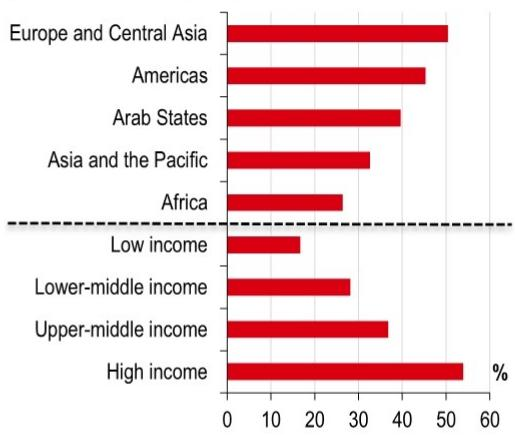
来源：国际劳工组织（ILO）、HSBC

图11：东盟地区生成式AI职业暴露
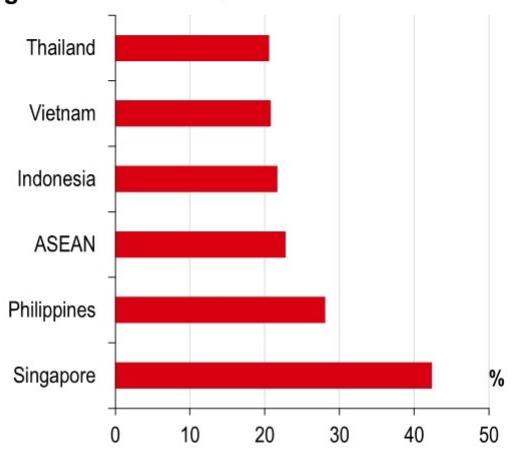
来源：国际劳工组织（ILO）、HSBC

## 价格动态的交叉影响

亚洲的整体价格水平看起来仍相当可控，但正在小幅上升，即使核心指标保持温和（见图12）。这表明压力仍集中在燃料、食品和管制价格上——而非基础需求的广泛重新加速。在6月中旬美国-伊朗停火后，油价确实回落至冲突前水平附近，HSBC最近下调了油价预测，指出原油基本面趋于温和（见图13；Kim Fustier等，《石油市场：下调预测：短期供应过剩，后期供应过剩》，2026年7月8日）。

然而，这并非简单的消退。在撰写本文时，真正的和平协议仍难以达成，因此地缘政治风险溢价并未消失——只是变得更难定价。即使原油价格保持低位，炼油利润率预计仍将居高不下，这意味着零售价格——尤其是柴油——可能只会逐步调整。实际上，原油可以快速下跌，但运输和分销成本通常下降得更慢。

较为温和的整体数据也可能掩盖其他领域的压力。一个“哥斯拉级”的厄尔尼诺周期是东南亚和印度部分地区食品和管制公用事业价格的短期风险。ENSO（厄尔尼诺-南方涛动）冲击通常不会改写长期价格故事，但它们仍可能导致剧烈的局部价格飙升，这对家庭和央行而言都很重要——央行通常不愿根据天气预报来收紧政策。

更大的变化是结构性的。随着能源价格下行趋势的建立，亚洲的价格动力正在增加一个“硅层”。下一个持续的压力点可能更多来自AI硬件供应链，而非石油。

AI不像石油那样传导。它从芯片和组件开始，经过组装和出口，最终通过更高的计算成本传导至服务价格。这也意味着它不会以相同方式影响所有经济体——亚洲的经验将根据经济体在技术栈中的位置分为三大类：上游生产商、中游组装商和下游应用方。

## 上游：工厂层面的成本压力

6月份的制造业PMI显示供应中断正在缓解，但恢复并不均衡。交货时间有所改善，但短缺、运输延误和供应商限制仍然存在。这一AI周期正落在一个尚未完全修复的供应链上。台湾正在囤货以防范AI驱动的半导体需求激增带来的价格上涨和短缺，而韩国的PMI仍显示材料短缺和交货延迟推高了成本。

图12：亚洲（除日本）价格水平，同比%
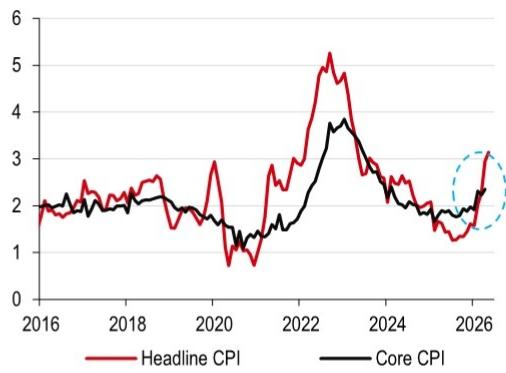

图13：不确定性中的布伦特原油
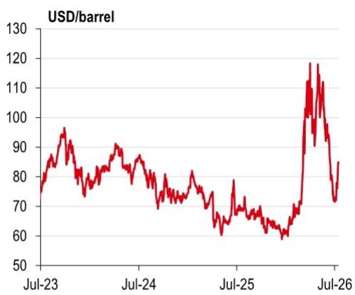

图14：生产者价格飙升
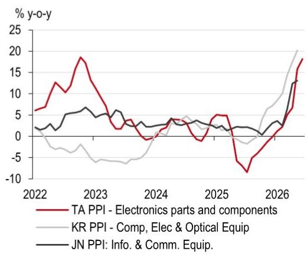
来源：CEIC、HSBC

图15：台湾价格水平，同比%
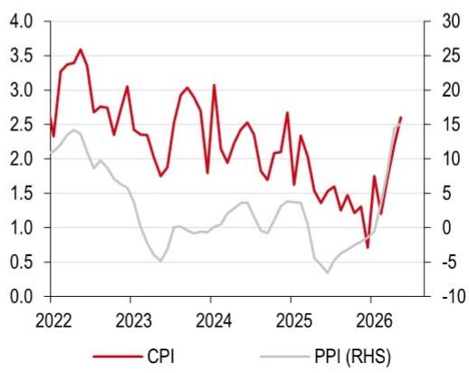
来源：CEIC、HSBC
价格传导在韩国和台湾更快、更明显...

除了能源，高科技组件和物流的瓶颈正在推高台湾、韩国和日本等关键上游市场的生产者价格（见图14）。这是一个额外的价格推动力，且始于上游。在台湾和韩国（以及较小程度上的日本），对AI服务器和数据中心设备的激增需求正促使芯片制造商将有限产能转向利润最高的AI相关产品。

一个明显的例子是高带宽存储器（HBM）。随着更多生产转向HBM，更标准存储产品的供应可能收紧，推高DRAM和NAND等更广泛类别的价格。结果很直接：成本首先在制造商端上升，推高生产者价格，然后才在消费者价格中显现。

向CPI的传导较慢，且通过两种方式实现。一种是国内。更高的电子产品价格滞后地传导至消费品，随着企业IT和计算成本上升，服务价格上调，高科技集群中出现工资溢出效应。台湾和韩国就是这种情况（见图15和图16）。

...与日本相比

日本与台湾和韩国之间存在重要差异。即使AI在医疗保健、制造业和金融领域的应用不断增加，AI硬件在日本更大、更多元化的经济中所占的份额远小于台湾或韩国。日本企业也倾向于吸收成本上涨而非快速传导。这有助于解释为什么日本的CPI可能更长时间滞后于PPI的推动（见图17）。

图16：韩国价格水平，同比%
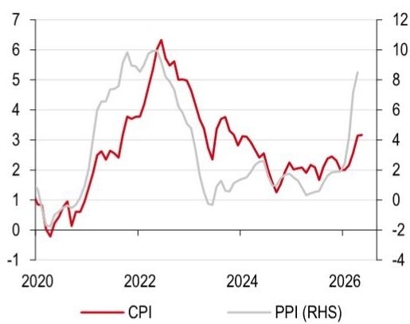
来源：CEIC、HSBC

图17：日本价格水平，同比%
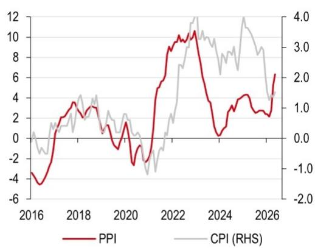
来源：CEIC、HSBC

另一个渠道是外部。由组件、设备资本支出和工程人才竞争驱动的持续上游成本压力，推高了出口价格（见图18），提高了AI供应链下游中游组装商的投入成本。

## 中游：价格下行缓冲

随着AI价格脉冲向下游移动，它遇到了中国大陆作为该地区减震器的作用——图19清晰地捕捉到了这一点。中国大陆正在进口上游芯片价格上涨并出口价格下行。投入成本可能随着上游生产商流入的更高价格组件而上升，但中国大陆的国内定价环境仍然非通胀性，从而抑制了出口价格。成本上升，但价格没有。

机制很简单。中国大陆位于组装管道的中心，规模庞大，工厂竞争激烈，产能持续扩张。在这种环境下，更高的投入成本更可能通过利润率压缩和效率提升来吸收，而非通过提高售价来传导。

结果是形成了一个价格下行缓冲。它抑制了上游芯片价格上涨向全球价格的传导，并减缓了向下游CPI的传导。上游价格上涨遇到了中游缓冲。

图18：出口价格指数，同比%
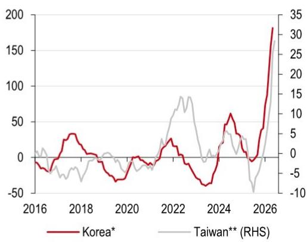
来源：CEIC、HSBC。注：*半导体。**电机；影像及声音记录设备。

图19：价格下行缓冲
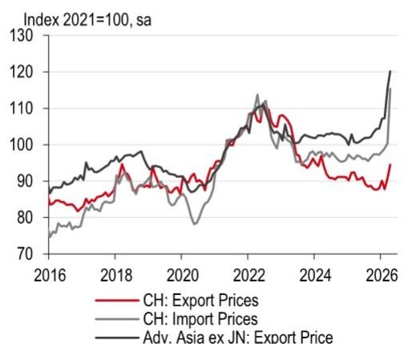
来源：CPB、HSBC。注：这些是反映电子趋势的整体指数。CH指中国大陆。

## 下游：滞后传导

在管道的最远端是下游基础设施消费者——如印度和印度尼西亚等大型需求驱动型经济体，以及更纯粹的采用型东盟市场。对它们而言，AI并非以本地工厂冲击的形式出现。它更像是一种进口的间接成本，并且存在滞后。

这种滞后正是图20所显示的。在亚洲（除日本外），投入价格领先于产出价格。企业支付更多，但尚未完全传导。

在下游采用型经济体中，这种差距往往持续存在，因为需求条件和竞争动态限制了立即重新定价。压力在后台累积，只有在企业预算重置时才变得可见。随着采购周期更替和传统企业合同到期，企业续约时面临更昂贵的硬件架构和以美元计价的云及基础设施费用。这时，更高的成本开始渗入更广泛的间接费用——并最终传导至面向消费者的服务价格。

图20：成本上升，定价延迟（来自制造业PMI）
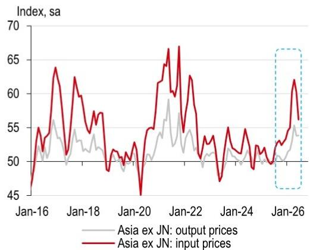
来源：标普全球、CEIC、HSBC

图21：亚洲传导仪表盘（来自制造业PMI）
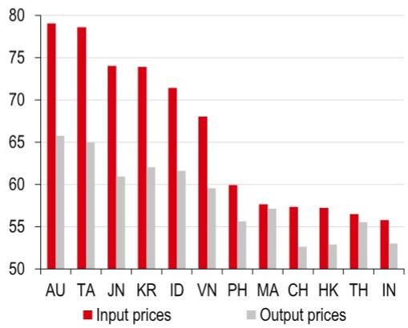
来源：标普全球、CEIC、HSBC。注：CH指中国大陆。

## 不对称的AI价格影响

将AI加入影响价格的因素组合中，改变了价格格局。在石油冲击中，价格上涨是广泛且快速的。在AI周期中，价格上涨是狭窄的、上游的、分阶段的。生产商首先感受到，采用者随后感受到。

图21使这种不对称性可见。通过按投入价格压力强度对经济体进行排序并显示相应的产出价格，它有效地排名了谁在吸收成本、谁在传导成本。投入价格高且产出价格跟上的地方，价格在传导。投入价格高但产出价格滞后的地方，价格被存储在利润率中并推迟到后续重新定价。这种分化是关键。

AI冲击在亚洲并不均匀，因为暴露程度取决于你在技术栈中的位置。上游生产商承受最尖锐、最早的压力，而下游采用者则经历更缓慢、更稀释的调整，因为成本基础随时间重置。

## 央行政策影响

关于AI是推动价格上涨还是价格下行存在一些争论

央行正越来越多地将AI应用纳入其展望。一些观察人士，包括前美联储官员Kevin Warsh，认为AI的广泛使用将通过提升生产率来推动价格下行——使经济体能够更快增长而不会引发持续的价格压力。其他美联储理事会成员则强调不同的渠道：AI相关的资本支出本身可能推动价格上涨，这塑造了关于政策是否需要更长时间保持紧缩的辩论。这些问题现在也在亚洲成为焦点。

对于部分亚洲经济体，AI可能在未来两年内带来增长潜力和价格上行...

## 亚洲央行将如何应对？

在本报告中，我们涵盖了AI在未来一到两年内对增长、劳动力和价格的潜在影响。

AI热潮正在提振对半导体及相关硬件的需求，支持台湾、韩国、日本、中国大陆、新加坡、马来西亚和泰国等经济体。它也在推动数据中心投资——在马来西亚最为明显。劳动力影响是一个风险，中国大陆可能是一个早期测试案例，但劳动力增强的潜力可能被低估，目前几乎没有即将发生大规模裁员的证据。重要的是，AI的价格影响看起来是不对称的：最直接的压力可能出现在上游（例如，韩国和台湾），而下游采用者如印度和印度尼西亚可能看到更缓慢、更延迟的调整。

在此背景下，我们认为AI超级周期最有力地支持了那些具有显著AI增长潜力且处于供应链上游的经济体实施更紧缩的货币政策，因为这些经济体的价格压力应首先显现。

这使得韩国和台湾的央行成为焦点。HSBC的Jin Choi预计到今年年底每个央行将再加息一次（韩国银行加息25个基点至3.00%，台湾央行加息12.5个基点至2.125%）。他还指出，2027年存在进一步收紧的上行风险，具体取决于激增的AI出口向国内活动的传导程度以及可能进一步提振本已强劲资本支出的地方财政政策（参见《韩国银行》，2026年7月16日；《台湾央行观察》，2026年6月12日）。

在其他地方——如日本、马来西亚和越南——AI的推动力似乎较弱，但仍存在一些增长潜力和与AI相关的价格压力，尽管程度低于韩国和台湾。在日本，我们预计12月将再加息25个基点，使政策利率达到1.25%，因为日本央行继续政策正常化（参见《日本银行》，2026年6月16日）。如前所述，AI硬件在日本更大、更多元化的经济中所占份额小于台湾或韩国，日本企业历史上吸收成本上涨而非快速传导——尽管这种行为可能随时间改变。

在整个亚洲，当前AI建设阶段使天平倾向于保持限制性政策。关键行业的增长潜力、目前劳动力冲击的有限证据以及始于上游并扩散至采用者的价格风险上升，都指向这一方向。是的，随着时间的推移，更强的生产率增长可能成为价格下行的力量。然而，短期内，投资阶段是高度资本密集型的，需求对相对固定的供应构成压力，因为AI继续“吞噬”从芯片到电力的一切。

展望未来，下一个关键的宏观观察点可能是从第一阶段（投资驱动）向第二阶段的过渡，届时可衡量的生产率提升开始主导叙事并重塑货币政策辩论。

## 相关报告

《AI与劳动力市场：头条新闻错在哪里》，Bethan Ellis（2026年7月13日）
《打破数据：数十亿的AI消费者剩余》，James Pomeroy（2026年7月9日）
《亚洲经济评论：美联储、厄尔尼诺与AI》，Frederic Neumann和Justin Feng（2026年7月3日）
《亚洲每周图表：计算这个！》，Frederic Neumann等（2026年6月26日）
《共享电路：AI如何重塑亚洲贸易版图》，Ines Lam等（2026年6月25日）
《聚焦台湾：最新电子指标对亚洲意味着什么》，Justin Feng等（2026年6月12日）
《欧洲的AI影响：发达EMEA股票信号》，Duncan Toms等（2026年5月27日）
《波动中的反弹：听好了》，Shiva Joon等（2026年5月11日）
《聚焦韩国：最新电子指标对亚洲意味着什么》，Justin Feng等（2026年5月20日）
《新兴市场的AI：转向应用：GEMs股票策略》，Alastair Pinder等（2026年4月21日）
《游戏规则改变者：AI应用呈指数级增长的宏观影响》，James Pomeroy和Bethan Ellis（2026年4月20日）
《聚焦中国大陆：最新电子指标对亚洲意味着什么》，Justin Feng等（2026年4月15日）
《AI：现在太具颠覆性了吗？听好了》，Mark McDonald等（2026年2月26日）
《聚焦日本：最新电子指标对亚洲意味着什么》，Justin Feng等（2026年2月10日）
《亚洲半导体：关于中美存储芯片竞赛的五个问题》，Justin Feng和Frederic Neumann（2025年12月10日）
《日本电子：关于芯片制造复兴的五个问题》，Justin Feng和Frederic Neumann（2025年8月28日）
《亚洲AI硬件：为成功而连接》，Justin Feng和Frederic Neumann（2024年10月8日）
《亚洲半导体：处于有利位置》，Justin Feng和Frederic Neumann（2024年6月25日）

# 披露附录

## 分析师认证

主要负责本报告的下述分析师、经济学家或策略师，包括其姓名出现在报告单个或多个章节作者栏中的任何分析师，以及在分部加总估值中被列为子公司覆盖分析师的分析师，证明其对相关证券或发行人的意见、其作为作者章节中表达的任何观点或预测、以及本报告中表达的任何其他观点或预测（包括研究报告封底表达的任何观点）准确反映了其个人观点，并且其薪酬的任何部分过去、现在或将来均不直接或间接与本研究报告中的具体推荐或观点相关：Justin Feng、Frederic Neumann、Mark McDonald和Thomas Devlin

## 重要披露

本文件由HSBC部编制并分发，仅供HSBC客户使用，不得通过新闻或其他方式向其他人士发布。

本文件仅供参考，不应被视为出售或招揽购买其中提及的证券或其他产品的要约，也不应被视为参与任何交易策略的邀约。本文件中的建议为一般性建议，不应被解释为个人建议，因其在编制时未考虑任何特定读者的目标、财务状况或需求。因此，读者在根据建议采取行动
