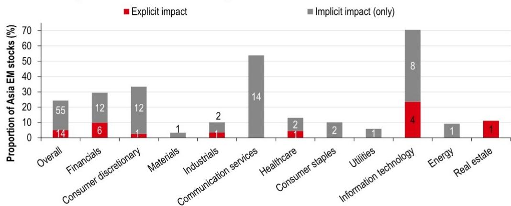
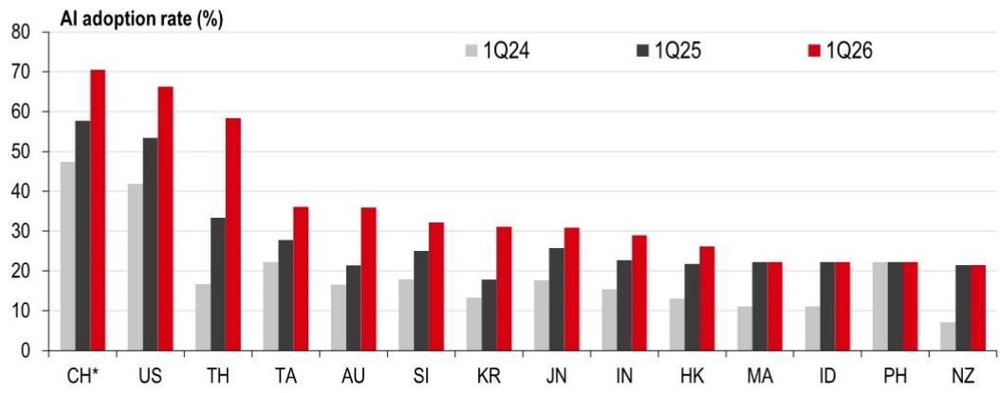

# HSBC：货币市场与相关指标观察

亚洲地区正在经历一轮由人工智能驱动的结构性变化，其影响已超越传统的出口与研究拉动框架。HSBC最新报告指出，AI硬件出口和数据中心研究正在显著提升部分亚洲地区的增长，但与此同时，上游成本不确定性正通过技术供应链逐步传导至更广泛的价格体系。这一变化可能推动韩国、台湾等地区的央行转向更紧的货币政策立场。

报告的核心判断是：AI对亚洲的影响不再是远期叙事，而是正在重塑通胀动态和央行的政策权衡。与传统的食品和能源价格周期不同，AI基础设施研究带来的需求集中在狭窄的投入品上，先推高上游成本，再通过算力和服务价格逐步渗透到更广泛的通胀中。这意味着，不同地区在AI技术栈中的位置——上游硬件生产、中游组装、下游应用——将决定它们感受到的价格不确定性顺序和强度。

## 1. AI硬件出口与数据中心研究构成增长的主要驱动力

报告数据显示，AI硬件出口在台湾和越南已达到相当于GDP近一半的水平，而数据中心研究在马来西亚尤为突出。美国四大超大规模云服务商——亚马逊、谷歌、Meta和微软——的AI资本支出预计将从2022年的约1500亿美元增至2026年的超过7000亿美元，这一规模接近瑞典全年GDP。

台湾在全球AI生态系统中的枢纽地位尤为突出。台积电作为全球领先的晶圆代工厂，市占率约70%，是相对少见能以商业可行良率量产2纳米芯片的企业。韩国则受益于AI驱动的存储芯片“超级周期”，三星和SK海力士合计占全球DRAM市场约70%和NAND闪存超过一半的份额。日本作为芯片制造设备、化学品和材料的主要供应国，近期提出了370万亿日元、为期14年的战略研究计划，重点聚焦AI和半导体。

> **KC评论：** 报告通过具体地区在AI供应链中的角色定位，揭示了增长受益的不对称性。台湾和韩国受益于硬件制造，马来西亚受益于数据中心研究，而澳大利亚虽然数据中心研究增长强劲，但由于约85%的设备依赖进口，国内增长拉动相对较小。这种差异化的受益格局，是理解后续通胀和政策分化的重要基础。

## 2. 中国大陆的AI采用率领先亚洲，劳动力影响值得关注

HSBC通过分析企业财报电话会议记录发现，AI对劳动力市场的第二轮效应目前仍然温和，尚未出现大规模裁员或生产率跃升。但中国大陆企业的AI采用率在亚洲最高，甚至超过美国，其劳动力影响信号也最为明显——既有直接与裁员相关的显性影响，也有通过替代或节奏变化招聘体现的隐性影响。

报告将中国大陆视为亚洲其他地区的“煤矿中的金丝雀”，即早期预警信号。中国大陆较高的劳动力影响反映了其快速的AI采用率和AI与业务流程的深度融合。相比之下，印尼和菲律宾的AI采用信号尚不明显。不过，报告也指出，AI采用并不必然导致净失业——AI可以作为劳动力的增强工具，帮助人们更高效地完成工作，而非简单地替代。

## 3. 通胀不确定性呈现不对称分布，上游地区不确定性更早

AI基础设施建设正在改变亚洲的通胀动态。报告认为，随着超大规模云服务商增加资本支出，需求集中在半导体、冷却系统等狭窄的投入品上，先推高上游成本，再通过更高的算力和服务价格逐步传导至更广泛的通胀。

通胀不确定性呈现不对称分布：韩国和台湾等上游硬件供应商可能比印度和印尼等下游纯应用地区更早感受到价格不确定性。这一判断基于地区在AI技术栈中的位置——上游生产商面临更直接的成本推动，而下游应用者则更多通过服务价格间接感受到通胀传导。

## 4. 韩国和台湾的央行可能面临更紧的政策不确定性

报告认为，AI超级周期强化了那些既有显著AI驱动增长、又处于技术供应链上游的地区收紧货币政策的理由。韩国和台湾是两个典型例子，AI可能使天平向进一步收紧倾斜。

HSBC在2026年下半年的利率预测中，预计日本、韩国、台湾、印度、新加坡、印尼、越南、菲律宾和新西兰将加息，而中国大陆、香港、马来西亚、泰国、孟加拉国和澳大利亚则维持利率不变。AI的影响方向取决于其最终效果：如果AI提升生产率而不显著推高通胀，则支持维持利率不变；如果AI数据中心建设更像一个谨慎的供给冲击，则可能强化计划加息央行的紧缩倾向。

> **KC评论：** 报告提供了一个简洁的观察框架：地区在AI技术栈中的位置决定了增长受益、通胀不确定性和货币政策路径。上游硬件生产国面临增长与通胀的双重不确定性，政策权衡更为复杂；下游应用国则更多关注生产率提升和劳动力影响。这一框架可以帮助读者理解不同亚洲地区央行决策的差异化逻辑。

报告的核心价值在于，它将AI从一个技术叙事转化为一个可操作的宏观分析框架。对于关注亚洲市场的决策者而言，理解地区在AI供应链中的位置，比单纯追踪AI概念股的涨跌更为重要。这不仅是增长故事，更是通胀和政策故事的起点。

For informational purposes only. Portions may be generated,translated,summarized,or edited with AI assistance based on source materials and may contain omissions or errors. Please verify independently. This is not investment,legal,tax,accounting,or other professional advice.

For informational purposes only. Portions may be generated,translated,summarized,or edited with AI assistance based on source materials and may contain omissions or errors. Please verify independently. This is not investment,legal,tax,accounting,or other professional advice.

