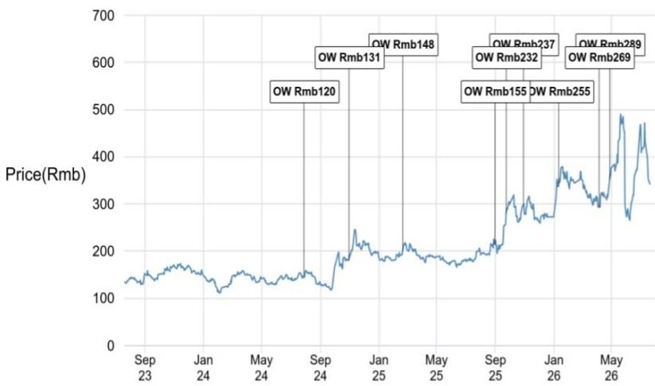

# JPM：AI、WAIC与半导体行业技术应用观察

中国AI芯片产业正经历一次结构性转变。JPM在2026年7月发布的WAIC 2026观展报告中指出，行业焦点已从单芯片性能竞赛转向系统级部署，从单纯扩大产能转向构建真正的token宏观环境。这一判断基于分析师对展会两天的实地观察，涵盖芯片性能基准、架构演进以及应用层需求变化三个维度。

报告的核心观察是，国内AI芯片厂商的竞争基线已经重置。实现等效于Hopper级别的单芯片性能已成为入场门槛，而非差异化优势。例如，沐曦发布的Tiangai 300芯片，在特定推理指标上声称性能比Hopper架构高出10%至20%。更重要的是，Prefill/Decode分离架构已从实验性方案转变为行业标准，成为大规模LLM推理降本的主流机制。这确认了推理是国内GPU当前最成熟的商业化应用场景，而训练则被视为下一个可规模化的重要市场。

> **KC评论：** 报告将“等效Hopper级性能”定义为基线而非亮点，意味着国内AI芯片市场的竞争维度正在改变。单纯比拼芯片峰值算力的阶段可能正在过去，系统级能力、软件生态和部署效率将成为新的区分因素。

## 1. 超节点方案成为应对制程瓶颈与万亿参数模型的关键架构

WAIC 2026上最显著的架构进展是超节点方案的广泛展示。报告认为，超节点的出现是为了应对两个结构性约束：国内制程节点的天花板，以及万亿参数大语言模型（如Kimi K3的2.8万亿参数架构）的到来。由于国产AI芯片在相对性能上存在短板，超节点通过芯片间互联、交换/网络架构和软件层面的不同设计，将数十到数千张卡整合为统一计算域，以突破单芯片边界。液冷、光互联和正交机柜架构，在下一代部署中可能从差异化要素变为最低要求。

## 2. Agentic AI 成为重塑基础设施需求的核心应用层力量

报告指出，Agentic AI正在成为重塑基础设施需求的关键应用层力量。作为数字代理的AI智能体消耗token的速率比人类用户高出数个数量级，从而创造出指数级的需求曲线。在中国，token工厂概念的推广代表了一种有意识的工业化战略，旨在使AI token在众多实际应用中变得可负担且无处不在。然而，报告也认为，生态在异构调度行业标准、token质量衡量以及不同垂直领域最优超节点规模等关键维度上仍不成熟。

## 3. 本土AI供应链中的受益环节与公司

基于上述判断，JPM在本土AI供应链中给出了具体偏好。报告认为，沐曦（Iluvatar CoreX）在二级AI芯片厂商中处于最佳位置，得益于其已锁定的供应和高质量云服务商客户的设计中标。此外，后端服务提供商有望受益于先进封装和测试需求的增长，因此看好长电科技（JCET）。在晶圆制造设备领域，强劲的存储和先进逻辑晶圆厂资本开支构成支撑，北方华创（NAURA）和中微公司（AMEC）是报告偏好的标的。

> **KC评论：** 报告对供应链受益环节的排序值得注意：芯片设计、后端封装测试、再到设备。这种自上而下的逻辑暗示，在系统级部署趋势下，整个产业链的瓶颈和机会点可能正在从单一环节向多环节扩散。

For informational purposes only. Portions may be generated,translated,summarized,or edited with AI assistance based on source materials and may contain omissions or errors. Please verify independently. This is not investment,legal,tax,accounting,or other professional advice.

For informational purposes only. Portions may be generated,translated,summarized,or edited with AI assistance based on source materials and may contain omissions or errors. Please verify independently. This is not investment,legal,tax,accounting,or other professional advice.

