# The five C's for a broadening

Global Equity Strategy

- We remain constructive on global equities but expect a broadening in performance driven by the five C's

Corporate earnings, Central banks, Capex, Consumer and Capital flows

- Middle East tensions and higher energy prices are factors to monitor, but for now offset by improving fundamentals elsewhere

We remain constructive on global equity markets, but are increasingly positioning for a rotation in performance. Early signs of that shift are already emerging. Our global long-versus-short momentum factor has moved 15% over the past 3 weeks, but we believe the reversal likely has further to run. The rally in momentum stocks year-to-date has been one of the strongest on record. Historical precedent suggests that, after a 20% rise in the momentum factor, the subsequent reversal typically persists for around six months. The current episode is particularly unusual: after initially rising 20%, momentum subsequently squeezed another 25% higher. In our view, that leaves the factor increasingly vulnerable to a sharper and more sustained reversal.

Other signs of a potential rotation are also becoming more evident. Concentration across global equity indices – particularly in the US and EM – remains close to record highs. Yet, for all the focus on AI and technology outperformance, the rest of the market has, broadly speaking, also performed well. Equal-weighted indices in the US, EM, and Europe are up 12%, 5%, and 10%, respectively, year-to-date. Renewed tensions in the Middle East and a large spike in energy prices are factors to monitor, but for now we believe the improving fundamental backdrop elsewhere should more than offset this.

We believe a further rally and sustained broadening in global equity-market performance can be supported by the five Cs:

Corporate earnings: US earnings growth looks strong and broadening beyond tech/energy with revision improving. EM and Europe EPS are also accelerating.

Central banks: Markets are pricing 37bps of hike by mid-2027; further hawkish repricing may be limited, which should support cyclicals.

Capex: Broadening depends on steady AI capex: cuts look unlikely as monetisation emerges, but big hyperscaler upgrades are limited, moderating semiconductor outperformance after strong gains.

Consumer: Despite a slowdown in real-time spending data, outlook remains constructive amid strong labor data, World Cup boost and wealth effects. Cons. discretionary valuations are at moderate levels, and earnings expectations look too pessimistic.

Capital flows: Despite record US IPO and secondary issuance, equity demand looks strong: buybacks remain large, retail ETF inflows are accelerating, global inflows are rising, Europe funds are rotating into cyclicals, and EM ex-tech is seeing inflows.

## Disclosures & Disclaimer

This report must be read with the disclosures and the analyst certifications in the Disclosure appendix, and with the Disclaimer, which forms part of it.

Equity Strategy Global

Alastair Pinder, CFA
Head EM and Global Equity Strategist
HSBC Securities (USA) Inc.
alastair.pinder@us.hsbc.com
+1 212 525 5972

## Pankaj Agarwala\*, CFA

Pankaj Agarwala, SFA
EM and Global Equity Strategist
HSBC Securities and Capital Markets (India) Private Limited
pankajagarwala@hsbc.co.in
+91 0 80 30013716

\* Employed by a non-US affiliate of HSBC Securities (USA) Inc, and is not registered/ qualified pursuant to FINRA regulations

## No country for bears

The $24^{\text{th}}$ edition of the EM Sentiment Survey Click to view

Issuer of report: HSBC Securities (USA) Inc.

View HSBC Global Investment Research at: https://www.research.hsbc.com

## The five C's for a broadening

We believe a further rally and sustained broadening in global equity-market performance can be supported by the five Cs:

Corporate earnings: Earnings season is upon us, and we think the setup once again looks favorable for the US. Consensus expects the S&P 500 to deliver earnings growth of nearly 23% y-o-y, but the bulk of this – 85% – is expected to come from tech and energy, where earnings are forecast to grow 62% and 124% y-o-y, respectively $^{1}$ . Yet, for all the focus on tech and its outsized contribution to overall US earnings growth, we think the market is underestimating the potential breadth of the expansion. The consensus expects the median US stock to see EPS growth slow from 15% y-o-y in Q1 to 9% y-o-y in Q2. Areas such as consumer discretionary and industrials are expected by consensus to experience a sharp deceleration, but we believe consensus is underestimating the resilience of corporate earnings despite the spike in energy costs amid the Middle East conflict. Corporate guidance trends also point to a broadening in earnings momentum. The ratio of companies raising guidance relative to those lowering it has reached the top-seventh percentile, as management teams become more positive. The US earnings revisions ratio has risen to 73%, its highest level since 2021 and in the top-fifth percentile since 2000 – indicative of early-cycle market dynamics. Nor is the potential broadening confined to the US. In emerging markets, consensus expects EPS growth to accelerate to 35% in Q2, predominantly driven by semiconductors. However, even excluding Taiwan and Korea, EM earnings are expected to grow close to 10.5% y-o-y, their fastest pace since Q2-22. Meanwhile, European earnings could grow 15% y-o-y in Q2, their strongest rate since 2022.

Central banks: Market pricing for the Fed has shifted dramatically in recent months. As recently as March, the options market was pricing a 70% probability that the Fed would leave rates unchanged by the April 2027 meeting and a 25% probability of 25bp of rate cuts. Fast-forward to today, and the market is assigning roughly a 35% probability to both a 25bp and a 50bp rate hike. In our view, this creates a relatively high bar for further hawkish repricing. It was a surprise that, at the June FOMC meeting – the first under new Fed Chair Kevin Warsh – the committee actively discussed the potential need for rate hikes later this year. However, HSBC economists expect the FOMC to keep the federal funds target range unchanged throughout 2026 and 2027 $^{2}$ . Core inflation has accelerated, but there is a notable divergence between core PCE, at 3.4% y-o-y, and Warsh's preferred Dallas Fed trimmed-mean PCE measure, which stands much closer to the Fed's 2% target at 2.4% y-o-y. The recent soft inflation data with headline CPI fell 0.4% m/m (consensus -0.1%) should also push back against the hawkish narrative $^{3}$ . We think a shift toward pricing fewer Fed rate hikes, alongside a “no landing” scenario, would support a stronger rotation into cyclical sectors and small caps. Indeed, the sweet spot for equity markets historically has been a gradual unwinding of rate expectations: during episodes in which the 12m Fed futures have fallen 0-25bps over a 3m period, equities have rallied over 4% on average.

Capex: The sweet spot for a broadening trade is neither cuts to AI capex nor another round of material increases in spending expectations. In our view, concerns about capex cuts are overdone, at least for now, as early signs of monetization are clearly emerging. Anthropic is currently operating at a revenue run rate of USD47bn. Despite concerns about falling token costs, the more important data point may come from Ramp AI, which shows that monthly AI spending per employee continues to rise from a low base. Median spending is just USD10.66, up 2.5x y-o-y, versus the top-10th percentile which is currently spending USD516 per employee per month. At the same time, material upgrades to hyperscaler capex estimates from current levels appear unlikely. The powerful earnings upgrades across semiconductors and memory have been driven directly by rising US hyperscaler capex. Consensus estimates for 2026 and 2027 have been raised by USD200bn and USD300bn, respectively, year-to-date, with around 70% of that capex directed toward GPUs and servers. This has effectively redirected free cash flow from US hyperscalers – where FCF is expected to fall from USD220bn in Q1-25 to -USD2bn by Q4-26e – to NVIDIA and Micron, where FCF is expected to rise from USD74bn to USD280bn during the same period. However, the scope for capex upgrades of a similar magnitude over the next 12-18 months is limited, in our view, which should moderate the speed of semiconductor outperformance.

Consumer: The consumer is another important source of support for a broadening trade, particularly in the US. Overall, we believe US consumer data remain healthy. Although real-time spending data from Bloomberg Second Measure has slowed in recent weeks – largely because of lower spending on gasoline – we are beginning to see signs of stabilization. Several other factors remain supportive: (1) Employment data remain resilient, with initial jobless claims at multi-year lows; (2) Consumer confidence, as measured by Morning Consult, is recovering sharply, particularly among higher-income households; (3) The FIFA World Cup should provide an additional, albeit temporary, boost as OpenTable data already show y-o-y growth in US seated diners at multi-year highs; and (4) Higher equity markets and the AI boom are generating a pronounced wealth effect, with more than 50% of US household wealth held in equities. Overall, we believe the market remains too cautious on the consumer discretionary sector. Excluding Amazon and Tesla, the sector trades at a 12-month forward PE of just 16.6x, placing it in the bottom-tenth percentile since 2015. Meanwhile, the median consumer stock is expected to see earnings growth slow from 15.5% y-o-y in Q1 to 4.5% in Q2, which we believe is overly pessimistic.

Capital flows: Sustained equity demand is also essential to support a rotation and broadening in market performance. There has been considerable debate over whether the record volume of US IPOs expected this year – driven by the mega-cap technology listings of OpenAI, Anthropic, and SpaceX – could mark a market peak or create excess supply. We estimate that total US IPO issuance, including the mega-caps, could exceed USD270bn this year, alongside an additional USD470bn of secondary issuance. This would make 2026 the heaviest year of issuance on record for the US equity market. Even so, we see sufficient demand to absorb the supply. First, buybacks remain substantial. Announced buybacks already total USD850bn this year, almost USD100bn more than at the same point in 2025. Our estimates suggest that net US buybacks – buybacks less primary and secondary issuance – could still reach USD700bn in 2026, broadly in line with 2025. Retail demand for equities also appears relentless. US ETFs have attracted around USD550bn year-to-date, equivalent to a monthly pace of nearly USD85bn, compared with roughly USD62bn in 2025. Outside the US, there are further signs that equity demand is broadening. Amid an easing in global energy prices, weekly global equity fund inflows have risen to their highest level since March 2021. In Europe, funds are increasing their exposure to cyclicals relative to defensives from low levels – a shift consistent with broader risk-on positioning among buy-side investors and an improving sell-side outlook for cyclical sectors. Meanwhile, although foreign outflows from EM equities have reached a record USD90bn so far this year, they have been entirely driven by EM's tech trident: TSMC, Samsung Electronics, and SK Hynix. Excluding those three stocks, EM equities have attracted close to USD20bn of foreign inflows year-to-date $^{4}$ .

## Our preferences from a broadening story

Globally, our preferred areas that should benefit from a broadening include: in the US we like the consumer discretionary sector, as well as the banks which have had a strong start to the earnings season supported by good loan growth, generally favorable NII dynamics, robust IB fees and sales & trading, continued efficiency progress, and benign credit. In Europe, we believe that some of the beaten up cyclical areas could also recover – this includes airlines and hotels (which should be buoyed by lower energy prices and recovering tourism), luxury names (strong US consumer, stabilization in mainland China and sharp acceleration in spending in pockets of Asia like Korea), and also the defense sector. We continue to like the banks that have seen renewed price momentum in recent weeks and where the forward dividend yield is the highest across all sectors $^{5}$ . A higher rate backdrop and/or steeper curves could continue to support the sector. Within EM, we anchor our views on three conviction themes $^{6}$ : (1) cyclical recovery plays that are resilient to higher food price pressures: South Africa, Chile, and parts of CEE; (2) AI spillovers and innovation winners: Korea consumer names, which should benefit from higher compensation from the semi names, and also mainland China’s tech hardware stack, which benefits from faster technology self-reliance and provides diversification from the reliance on US hyperscaler capex; and (3) Deep-value plays: such as Brazil and Türkiye, which have underperformed by more than fundamentals warrant and/or where valuations look excessively cheap.

HSBC global equity strategy regional and sector allocation  
Global regional allocation

<table><tr><td>HSBC view</td><td>Region</td><td>Benchmark weight</td></tr><tr><td>Overweight</td><td>US</td><td>62%</td></tr><tr><td>Overweight</td><td>Emerging Markets</td><td>10%</td></tr><tr><td>Neutral</td><td>Europe (ex UK)</td><td>11%</td></tr><tr><td>Neutral</td><td>Developed Asia ex JP</td><td>5%</td></tr><tr><td>Neutral</td><td>UK</td><td>3%</td></tr><tr><td>Neutral</td><td>Canada</td><td>3%</td></tr><tr><td>Underweight</td><td>Japan</td><td>6%</td></tr></table>

Global sector allocation

<table><tr><td>HSBC view</td><td>Sector</td><td>Benchmark weight</td></tr><tr><td>Overweight</td><td>Technology</td><td>34%</td></tr><tr><td>Overweight</td><td>Financials</td><td>16%</td></tr><tr><td>Overweight</td><td>Basic Materials</td><td>3%</td></tr><tr><td>Neutral</td><td>Industrials</td><td>12%</td></tr><tr><td>Neutral</td><td>Consumer Discretionary</td><td>11%</td></tr><tr><td>Neutral</td><td>Healthcare</td><td>8%</td></tr><tr><td>Neutral</td><td>Energy</td><td>4%</td></tr><tr><td>Neutral</td><td>Real Estate</td><td>2%</td></tr><tr><td>Underweight</td><td>Consumer Staples</td><td>4%</td></tr><tr><td>Underweight</td><td>Telecoms</td><td>3%</td></tr><tr><td>Underweight</td><td>Utilities</td><td>3%</td></tr></table>

1. Global momentum factor has had an extraordinary run...  
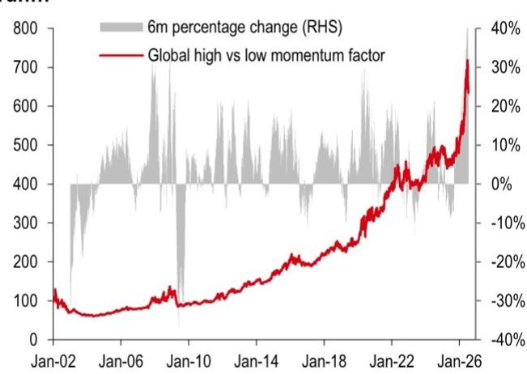  
Source: FTSE Russell, FactSet, HSBC

2. ... but momentum stocks appear to have overrun and could continue to struggle the next few months  
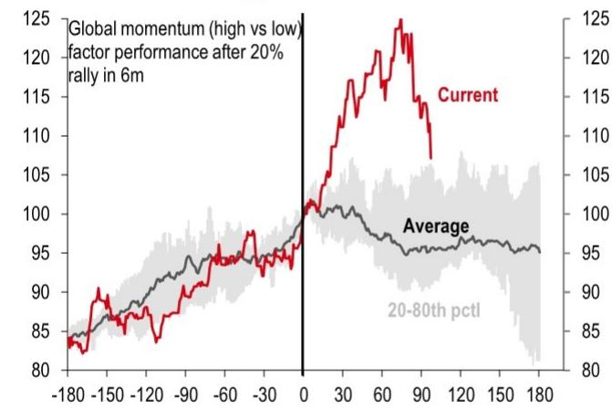  
Source: FTSE Russell, FactSet, HSBC

3. Equal-weighted performance has been admirable despite underperforming broader benchmarks  
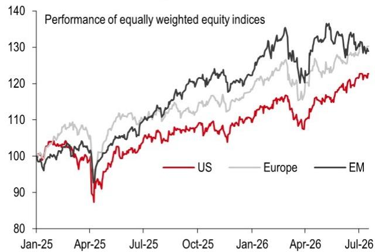  
Source: FTSE Russell, FactSet, HSBC

4. A rotation could support a move into mid-caps  
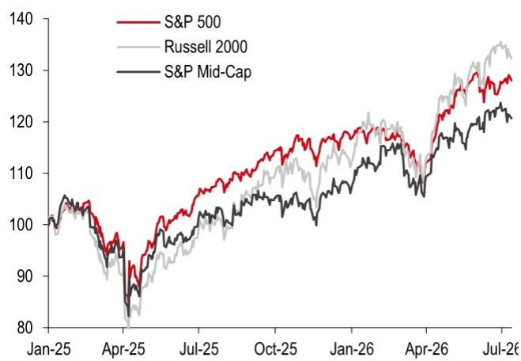  
Source: FTSE Russell, FactSet, HSBC

5. Concentration in benchmark equities is at record highs in indices for US and EM  
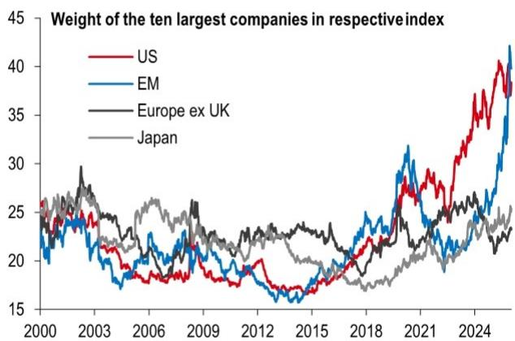  
Source: FTSE Russell, FactSet, HSBC

6. S&P 500 stock correlations has fallen to record lows indicating a high level of alpha opportunities  
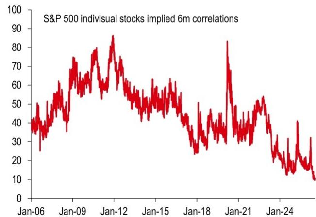  
Source: Bloomberg, HSBC

7. LLM token expenditure has fallen...  
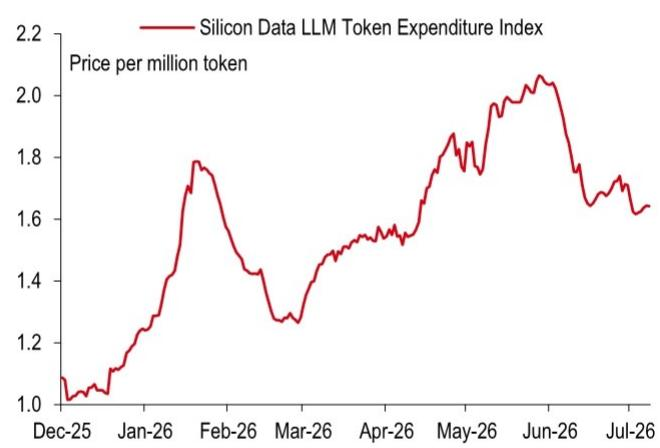  
Source: Bloomberg, HSBC

8. ... but AI spend per employee has risen sharply  
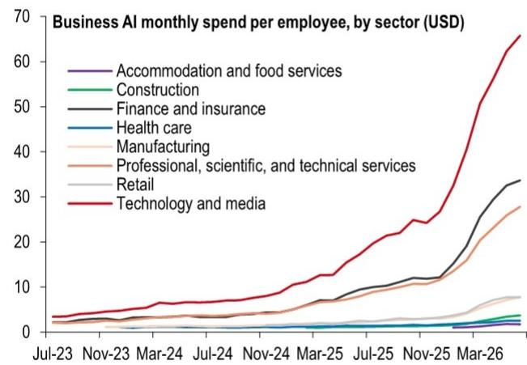  
Source: RampAI, HSBC

9. Annualized revenue trends for Anthropic and Open AI are rising rapidly  
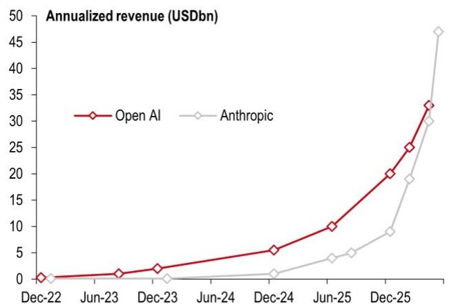  
Source: EpochAI, HSBC

10. Consensus anticipates almost USD1trn of capex per year from 2027  
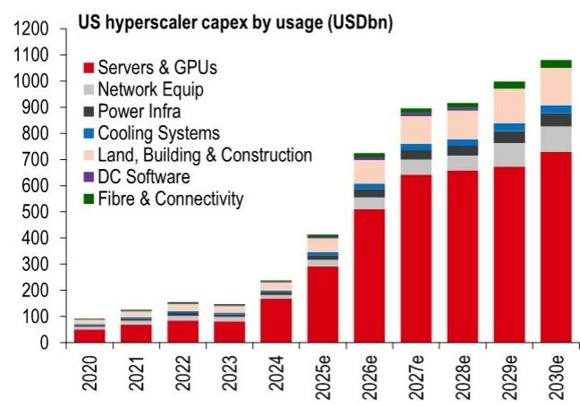  
Source: FTSE Russell, FactSet, HSBC

11. Evolution of consensus estimates for US hyperscalers  
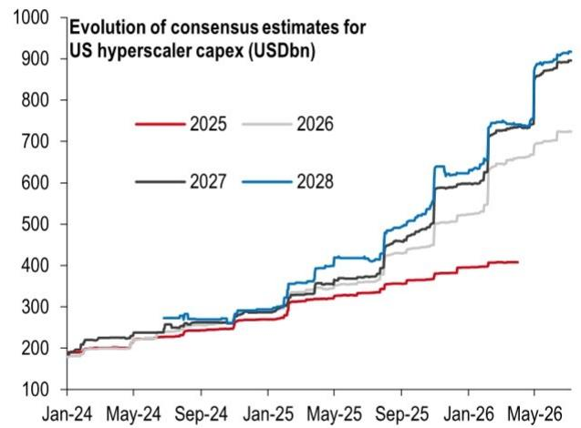  
Source: FTSE Russell, FactSet, HSBC

12. A free cash flow transfer from hyperscalers to semis  
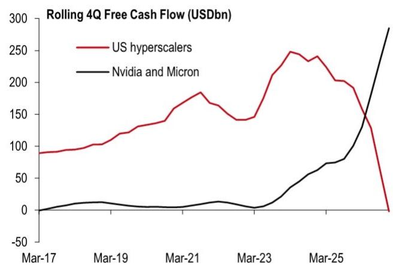  
Source: FTSE Russell, FactSet, HSBC

13. S&P 500 EPS growth  
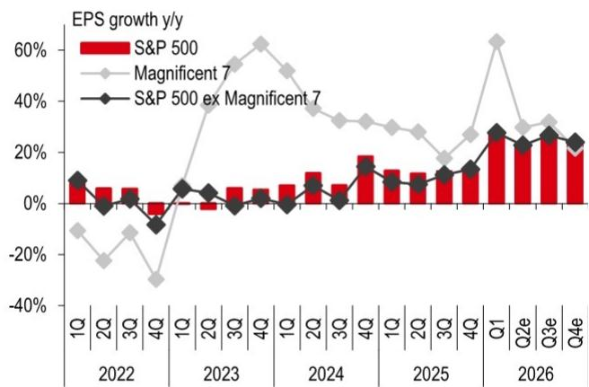  
Source: FTSE Russell, FactSet, HSBC

14. EPS growth estimate trends by quarter  
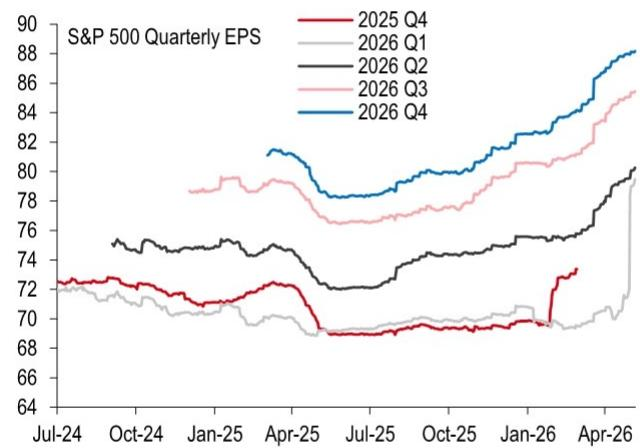  
Source: FTSE Russell, FactSet, HSBC

15. US corporates have been lifting their guidance  
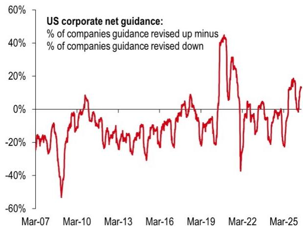  
Source: Bloomberg, HSBC

16. Earnings revisions, particularly in the US, are near all-time highs  
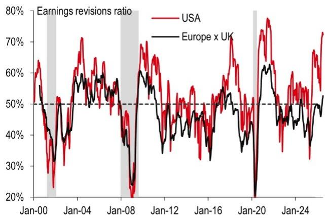  
Source: FTSE Russell, FactSet, HSBC

17. European earnings growth is expected to catch up with the US in the coming quarters  
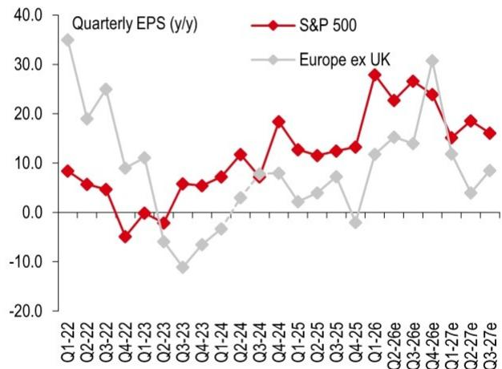  
Source: FTSE Russell, FactSet, HSBC

18. Even stripping out Taiwan and Korea, earnings growth for the rest of EM is improving  
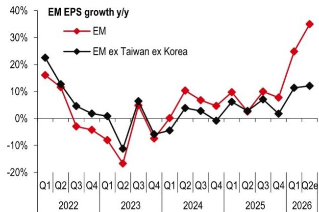  
Source: FTSE Russell, FactSet, HSBC

19. Different inflation signals depending on what measure you focus on  
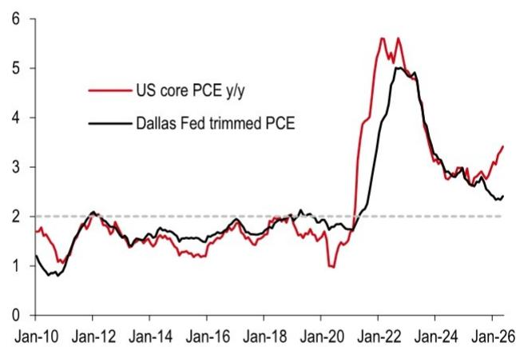  
Source: Bloomberg, HSBC

20. Market pricing for the Fed has arguably turned too hawkish...  
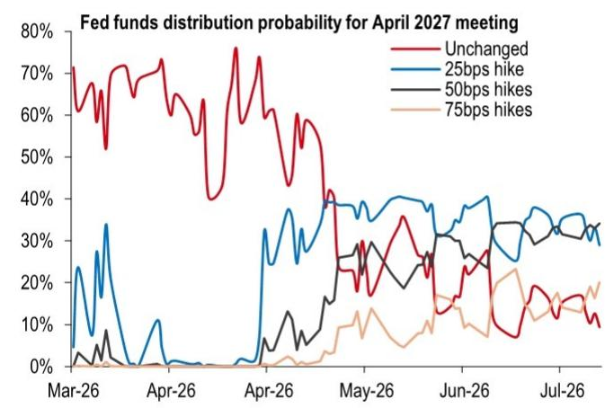  
Source: CBOE, HSBC

21. ... and a modest unwinding of hike expectations would be a boost for equities  
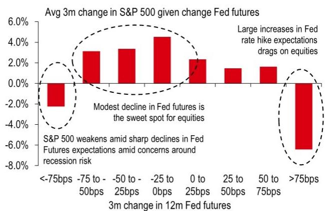  
Source: FTSE Russell, FactSet, HSBC

22. Lower bond volatility would indicate equity valuations can re-rate further  
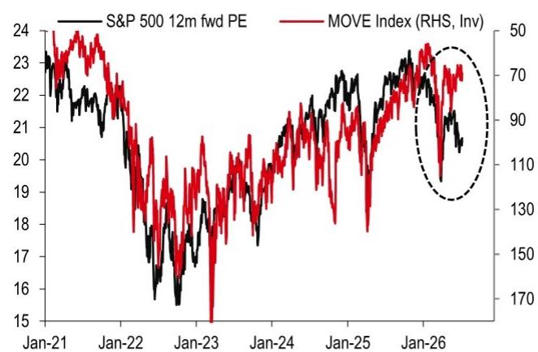  
Source: FTSE Russell, FactSet, HSBC

23. Valuations for the Magnificent 7 look cheap vs history  
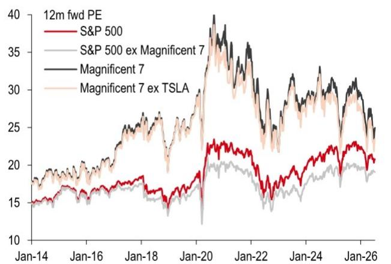  
Source: FTSE Russell, FactSet, HSBC

24. ROE vs Price-to-Book framework  
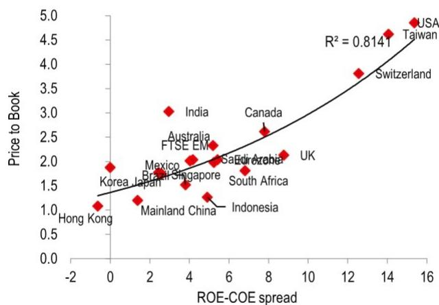  
Source: FTSE Russell, FactSet, HSBC

25. Some softness in consumer spending trends, but we expect this to recover  
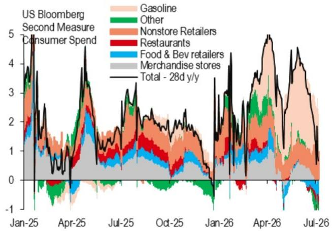  
Source: Bloomberg, HSBC

26. Labor data remain remarkably strong  
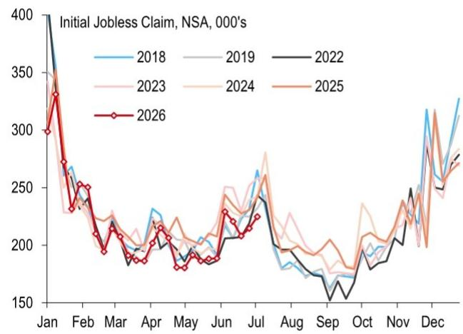  
Source: Bloomberg, HSBC

27. The FIFA World Cup has likely provided a boost to tourism and leisure in the US  
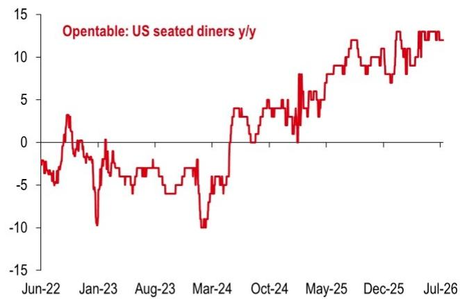  
Source: OpenTable, HSBC

28. Higher US equity prices can provide a meaningful wealth effect  
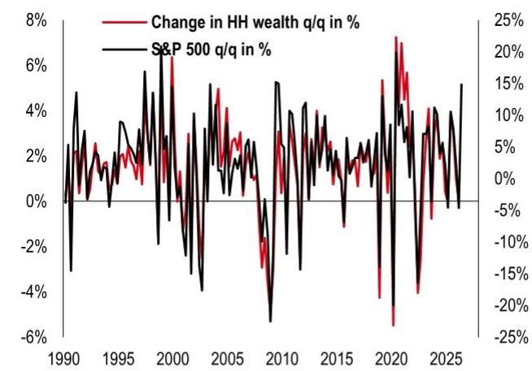  
Source: Bloomberg, HSBC

29. Consumer names look cheap...  
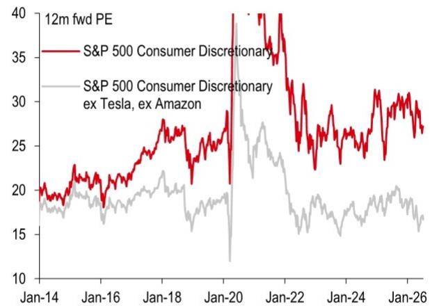  
Source: FTSE Russell, FactSet, HSBC

30. ... and earnings expectations are undemanding  
  
Source: FTSE Russell, FactSet, HSBC

31. Buyback announcements are running well above 2025 levels  
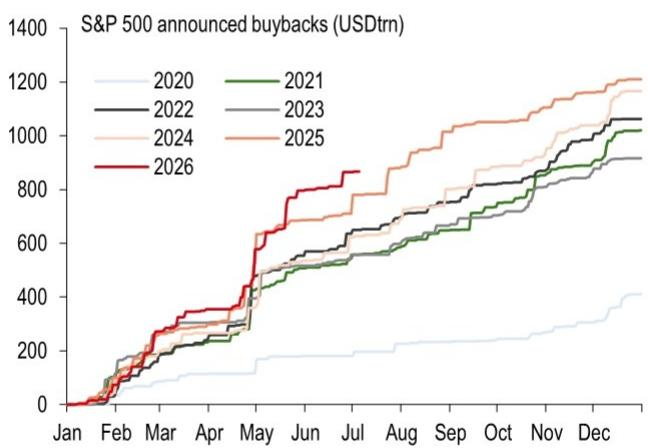  
Source: Bloomberg, HSBC

32. Even with accelerated primary and secondary issuance, US net buybacks should remain elevated  
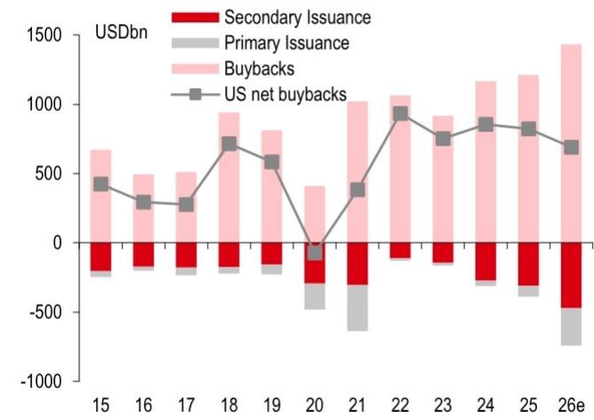  
Source: Bloomberg, HSBC

33. Another incredible year for US ETF flows  
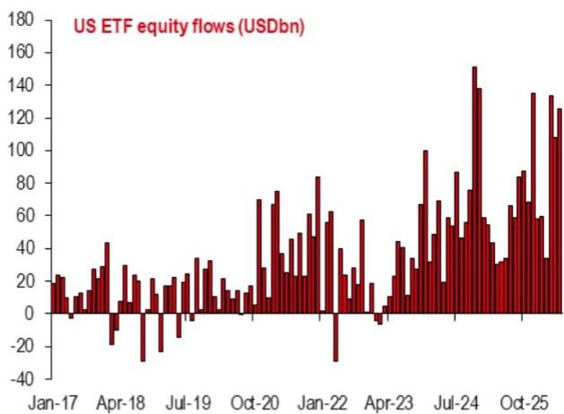  
Source: Bloomberg, HSBC

34. There's almost USD3.5trn sitting in time deposits in the US  
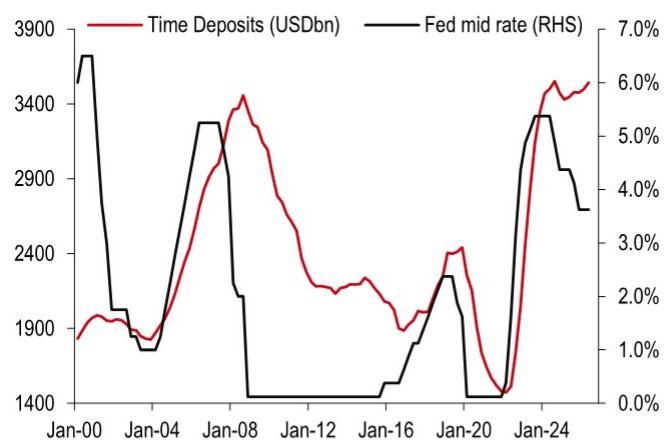  
Source: Bloomberg, HSBC

35. Global funds are seeing huge inflows  
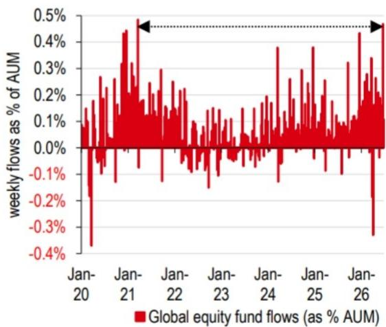  
Source: Morningstar, HSBC

36. Foreign outflows from EM equities have reached record levels this year but predominantly from tech  
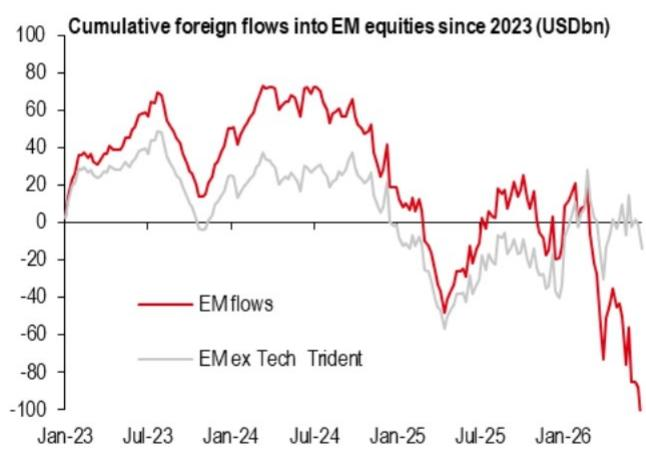  
Source: Bloomberg, HSBC

37. European earnings revisions have broadened...  
  
Source: FTSE Russell, FactSet, HSBC

38. ... and a weaker EUR should help further  
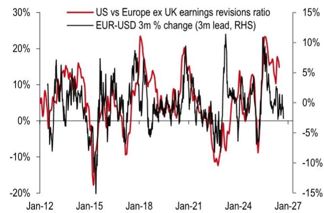  
Source: FTSE Russell, FactSet, HSBC

39. Downgrades in Eurozone GDP but worst is likely behind us  
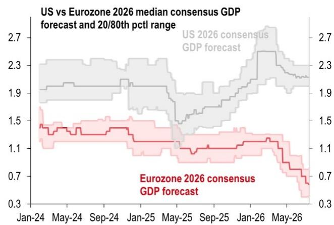  
Source: Bloomberg, HSBC

40. We see room for a broader rotation in European airlines, luxury, hotels and leisure  
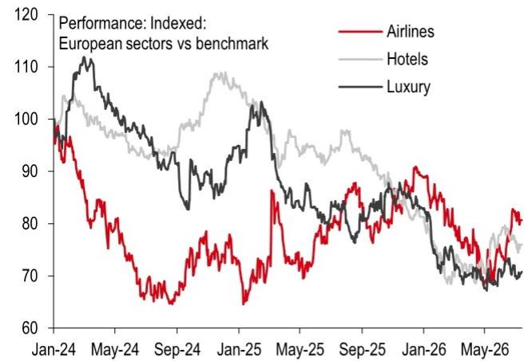  
Source: FTSE Russell, FactSet, HSBC

41. Luxury 12m fwd PE  
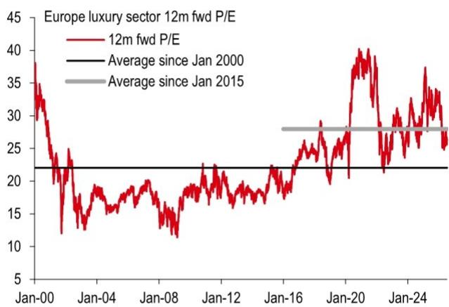  
Source: FTSE Russell, FactSet, HSBC

42. Defense stocks look to be recovering again  
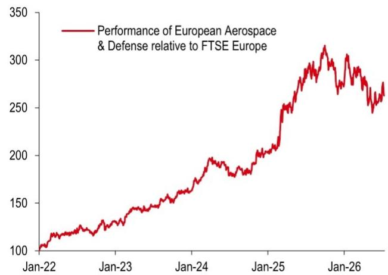  
Source: FTSE Russell, FactSet, HSBC

# Disclosure appendix

## Analyst Certification

The following analyst(s), economist(s), or strategist(s) who is(are) primarily responsible for this report, including any analyst(s) whose name(s) appear(s) as author of an individual section or sections of the report and any analyst(s) named as the covering analyst(s) of a subsidiary company in a sum-of-the-parts valuation certifies(y) that the opinion(s) on the subject security(ies) or issuer(s), any views or forecasts expressed in the section(s) of which such individual(s) is(are) named as author(s), and any other views or forecasts expressed herein, including any views expressed on the back page of the research report, accurately reflect their personal view(s) and that no part of their compensation was, is or will be directly or indirectly related to the specific recommendation(s) or views contained in this research report: Alastair Pinder, CFA and Pankaj Agarwala, CFA

## Important disclosures

## Equities: Stock ratings and basis for financial analysis

HSBC and its affiliates, including the issuer of this report ("HSBC") believes an investor's decision to buy or sell a stock should depend on individual circumstances such as the investor's existing holdings, risk tolerance and other considerations and that investors utilise various disciplines and investment horizons when making investment decisions. Ratings should not be used or relied on in isolation as investment advice. Different securities firms use a variety of ratings terms as well as different rating systems to describe their recommendations and therefore investors should carefully read the definitions of the ratings used in each research report. Further, investors should carefully read the entire research report and not infer its contents from the rating because research reports contain more complete information concerning the analysts' views and the basis for the rating.

## From 23rd March 2015 HSBC has assigned ratings on the following basis:

The target price is based on the analyst's assessment of the stock's actual current value, although we expect it to take six to 12 months for the market price to reflect this. When the target price is more than $20\%$ above the current share price, the stock will be classified as a Buy; when it is between $5\%$ and $20\%$ above the current share price, the stock may be classified as a Buy or a Hold; when it is between $5\%$ below and $5\%$ above the current share price, the stock will be classified as a Hold; when it is between $5\%$ and $20\%$ below the current share price, the stock may be classified as a Hold or a Reduce; and when it is more than $20\%$ below the current share price, the stock will be classified as a Reduce.

Our ratings are re-calibrated against these bands at the time of any 'material change' (initiation or resumption of coverage, change in target price or estimates).

Upside/Downside is the percentage difference between the target price and the share price.

## Prior to this date, HSBC's rating structure was applied on the following basis:

For each stock we set a required rate of return calculated from the cost of equity for that stock's domestic or, as appropriate, regional market established by our strategy team. The target price for a stock represented the value the analyst expected the stock to reach over our performance horizon. The performance horizon was 12 months. For a stock to be classified as Overweight, the potential return, which equals the percentage difference between the current share price and the target price, including the forecast dividend yield when indicated, had to exceed the required return by at least 5 percentage points over the succeeding 12 months (or 10 percentage points for a stock classified as Volatile\*). For a stock to be classified as Underweight, the stock was expected to underperform its required return by at least 5 percentage points over the succeeding 12 months (or 10 percentage points for a stock classified as Volatile\*). Stocks between these bands were classified as Neutral.

\*A stock was classified as volatile if its historical volatility had exceeded $40\%$ , if the stock had been listed for less than 12 months (unless it was in an industry or sector where volatility is low) or if the analyst expected significant volatility. However, stocks which we did not consider volatile may in fact also have behaved in such a way. Historical volatility was defined as the past month's average of the daily 365-day moving average volatilities. In order to avoid misleadingly frequent changes in rating, however, volatility had to move 2.5 percentage points past the $40\%$ benchmark in either direction for a stock's status to change.

## Rating distribution for long-term investment opportunities

As of 30 June 2026, the distribution of all independent ratings published by HSBC is as follows:

Buy 61% (13% of these provided with Investment Banking Services in the past 12 months)

Hold 34% (10% of these provided with Investment Banking Services in the past 12 months)

Sell 5% (8% of these provided with Investment Banking Services in the past 12 months)

For the purposes of the distribution above the following mapping structure is used during the transition from the previous to current rating models: under our previous model, Overweight = Buy, Neutral = Hold and Underweight = Sell; under our current model Buy = Buy, Hold = Hold and Reduce = Sell. For rating definitions under both models, please see “Stock ratings and basis for financial analysis” above.

For the distribution of non-independent ratings published by HSBC, please see the disclosure page available at http://www.hsbcnet.com/gbm/financial-regulation/investment-recommendations-disclosures.

To view a list of all the independent fundamental ratings/recommendations disseminated by HSBC during the preceding 12-month period, and the location where we publish our quarterly distribution of non-fundamental recommendations (applicable to Fixed Income and Currencies research only), please use the following links to access the disclosure page:

Clients of HSBC Private Bank: www.research.privatebank.hsbc.com/Disclosures

All other clients: www.research.hsbc.com/A/Disclosures

HSBC and its affiliates will from time to time sell to and buy from customers the securities/instruments, both equity and debt (including derivatives) of companies covered in HSBC on a principal or agency basis or act as a market maker or liquidity provider in the securities/instruments mentioned in this report.

Analysts, economists, and strategists are paid in part by reference to the profitability of HSBC which includes investment banking, sales & trading, and principal trading revenues.

Whether, or in what time frame, an update of this analysis will be published is not determined in advance.

Non-U.S. analysts may not be associated persons of HSBC Securities (USA) Inc, and therefore may not be subject to FINRA Rule 2241 or FINRA Rule 2242 restrictions on communications with the subject company, public appearances and trading securities held by the analysts.

Economic sanctions laws imposed by certain jurisdictions such as the US, the EU, the UK, and others, may prohibit persons subject to those laws from making certain types of investments, including by transacting or dealing in securities of particular issuers, sectors, or regions. This report does not constitute advice in relation to any such laws and should not be construed as an inducement to transact in securities in breach of such laws.

For disclosures in respect of any company mentioned in this report, please see the most recently published report on that company available at www.hsbcnet.com/research. HSBC Private Bank clients should contact their Relationship Manager for queries regarding other research reports. In order to find out more about the proprietary models used to produce this report, please contact the authoring analyst.

## Additional disclosures

1 This report is dated as at 20 July 2026.

2 All market data included in this report are dated as at close 16 July 2026, unless a different date and/or a specific time of day is indicated in the report.

3 HSBC has procedures in place to identify and manage any potential conflicts of interest that arise in connection with its Research business. HSBC's analysts and its other staff who are involved in the preparation and dissemination of Research operate and have a management reporting line independent of HSBC's Investment Banking business. Information Barrier procedures are in place between the Investment Banking, Principal Trading, and Research businesses to ensure that any confidential and/or price sensitive information is handled in an appropriate manner.

4 You are not permitted to use, for reference, any data in this document for the purpose of (i) determining the interest payable, or other sums due, under loan agreements or under other financial contracts or instruments, (ii) determining the price at which a financial instrument may be bought or sold or traded or redeemed, or the value of a financial instrument, and/or (iii) measuring the performance of a financial instrument or of an investment fund.

Production & distribution disclosures

1. This report was produced and signed off by the author on 17 Jul 2026 17:47 GMT.

2. In order to see when this report was first disseminated please see the disclosure page available at https://www.research.hsbc.com/R/34/hDvLQC9

## Disclaimer

Legal entities as at 13 May 2026:

HSBC Bank plc; HSBC Continental Europe; HSBC Continental Europe SA, Germany; HSBC Bank Middle East Limited, DIFC; HSBC Bank Middle East Limited, Dubai branch; HSBC Yatirim Menkul Degerler AS, Istanbul; The Hongkong and Shanghai Banking Corporation Limited, Hong Kong; The Hongkong and Shanghai Banking Corporation Limited, Singapore Branch; The Hongkong and Shanghai Banking Corporation Limited, Seoul
