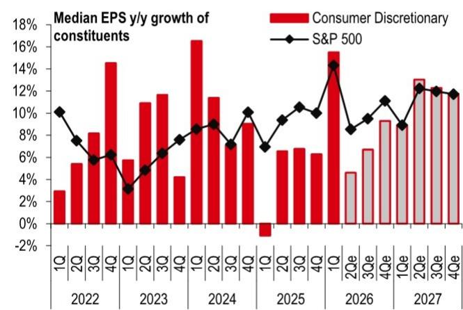
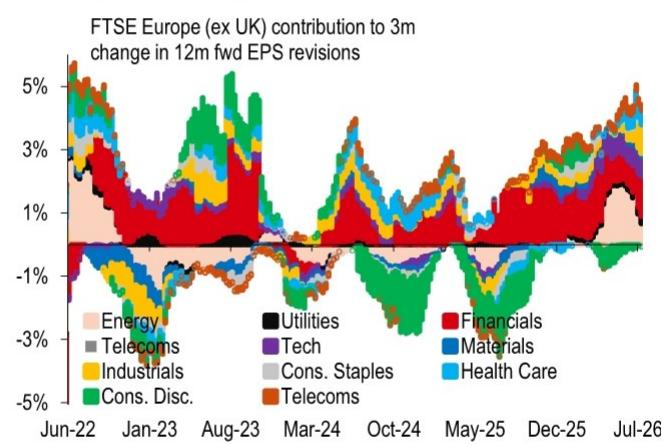

# HSBC：HSBC全球权益策略，扩散的五C因素

全球动量因子在过去三周内下跌了15%，而此前该因子经历了有记录以来较强劲的上涨之一。HSBC全球权益策略团队在最新报告中指出，动量因子在最初上涨20%后，又进一步压缩上涨了25%，这种极端走势使得该因子更容易出现更剧烈、更持久的反转。报告认为，全球权益市场的表现正在从少数头部公司向更广泛的板块扩散，这一过程由五个关键因素支撑。

报告观察到一个关键信号：尽管市场高度聚焦于AI和科技板块的超额表现，但其他板块整体表现并不差。美国、新兴市场和欧洲的等权重指数年初至今分别上涨了12%、5%和10%。与此同时，全球权益指数的集中度——尤其是在美国和新兴市场——仍接近历史高位。这种集中度与等权重指数上涨并存的状态，暗示市场内部正在发生结构性变化。

> **KC评论：** 动量因子的极端表现和集中度高位，是判断市场是否即将轮动的两个重要先行指标。报告用等权重指数表现来佐证“扩散”正在发生，而非仅仅停留在预测层面。

## 1. 企业盈利增长正在从科技和能源向外扩散

美国标普500指数第二季度盈利增长预计接近23%，但其中85%来自科技和能源板块。HSBC认为，市场低估了盈利扩张的广度。中位数美股第二季度每股盈利增速预计从第一季度的15%节奏变化至9%，但消费类和工业类板块的预期可能过于悲观。企业指引趋势也指向盈利动能正在扩散：上调指引的公司与下调指引的公司之比已升至2000年以来的第五分位。美国盈利修正比达到73%，为2021年以来最高水平。

新兴市场方面，即便剔除台湾和韩国，第二季度盈利增速预计仍可达10.5%左右，为2022年第二季度以来最快。欧洲企业盈利增速预计为15%，为2022年以来较强。

## 2. 市场对美联储的定价可能已过度偏紧

截至报告发布时，期权市场定价显示，到2027年4月美联储加息25个基点和50个基点的概率均在35%左右。HSBC宏观环境学家预计，联邦产品利率目标区间在2026年和2027年将保持不变。报告指出，核心PCE同比为3.4%，但美联储主席沃什偏好的达拉斯联储截尾均值PCE仅为2.4%，更接近2%的目标。近期CPI环比下降0.4%，也削弱了加息叙事的依据。

HSBC认为，市场对加息的定价可能已经过度，进一步鹰派重估的空间有限。历史数据显示，当12个月联邦产品期货在三个月内下降0-25个基点时，权益市场平均上涨超过4%。这种情景对周期性板块和小盘股的轮动最为有利。

## 3. AI资本支出预期已接近天花板，但削减不确定性有限

报告认为，AI资本支出既不会大幅削减，也不会出现另一轮大规模上调。Anthropic的年化收入运行率已达470亿美元，表明变现正在发生。Ramp AI数据显示，每位员工每月的AI支出中位数仅为10.66美元，但同比增长2.5倍；前十分位员工每月支出已达516美元，显示企业AI投入仍在从低基数上升。

然而，超大规模云服务商的资本支出预期大幅上调的空间有限。年初至今，2026年和2027年的资本支出共识预期已分别上调2000亿和3000亿美元，其中约70%流向GPU和服务器。这导致自由现金流从超大规模云服务商（预计从2025年第一季度的2200亿美元降至2026年第四季度的-20亿美元）转移至英伟达和美光（同期从740亿美元升至2800亿美元）。报告认为，未来12-18个月内类似规模的资本支出上调不太可能重现，这将节奏变化半导体板块的超额表现速度。

## 4. 消费者数据仍具韧性，可选消费估值处于历史低位

尽管实时支出数据近期节奏变化，但HSBC认为美国消费者基本面依然健康。初请失业金人数处于多年低位，Morning Consult消费者信心指数正在回升，尤其是高收入群体。国际足联世界杯可能带来额外提振，OpenTable数据显示美国餐厅入座率同比增长已处于多年高位。超过50%的美国家庭财富以权益形式持有，市场上涨带来的财富效应也不容忽视。

报告特别指出，市场对可选消费板块可能过于悲观。剔除亚马逊和特斯拉后，该板块12个月远期市盈率仅为16.6倍，处于2015年以来的第十百分位。中位数消费类公司第二季度盈利增速预计从第一季度的15.5%节奏变化至4.5%，HSBC认为这一预期过于悲观。

## 5. 资金流入结构显示需求足以消化创纪录的供给

今年美国IPO发行量预计将超过2700亿美元，加上4700亿美元的二次发行，将成为有记录以来发行量最大的一年。但HSBC认为需求足以吸收供给。已宣布的公司回购总额已达8500亿美元，比2025年同期多出近1000亿美元。美国ETF年初至今已吸引约5500亿美元，月均流入近850亿美元，高于2025年的约620亿美元。

全球范围内，资金流入也在扩散。全球权益产品周度流入已升至2021年3月以来最高水平。欧洲产品正在从防御板块转向周期性板块。新兴市场方面，尽管今年外资流出已达创纪录的900亿美元，但完全由台积电、三星电子和SK海力士这三只科技股驱动。剔除这三只公司后，新兴市场今年已吸引近200亿美元的外资流入。

> **KC评论：** 报告对资金面的分析提供了一个重要观察框架：区分“总量”和“结构”。新兴市场的外资流出看起来惊人，但拆解后发现是集中抛售少数科技股，其他板块反而在吸引资金。这种结构分化是判断轮动是否可持续的关键。

HSBC的全球配置显示，超配美国和新兴市场，对欧洲、发达亚洲（除日本）、英国和加拿大持中性，低配日本。板块层面，超配科技、资金和基础材料，低配消费必需品、电信和公用事业。报告认为，消费者可选、银行、欧洲的航空酒店、奢侈品和国防，以及新兴市场中的南非、智利、部分中欧国家、韩国消费股和中国科技硬件，都可能从这轮扩散中受益。

For informational purposes only. Portions may be generated,translated,summarized,or edited with AI assistance based on source materials and may contain omissions or errors. Please verify independently. This is not investment,legal,tax,accounting,or other professional advice.

For informational purposes only. Portions may be generated,translated,summarized,or edited with AI assistance based on source materials and may contain omissions or errors. Please verify independently. This is not investment,legal,tax,accounting,or other professional advice.

