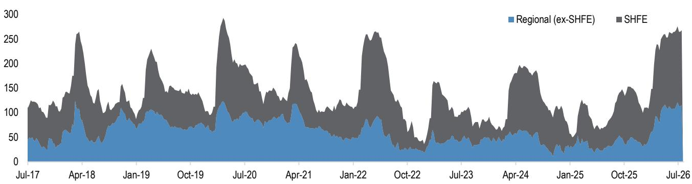
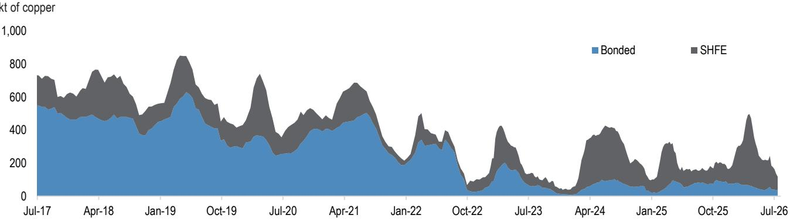
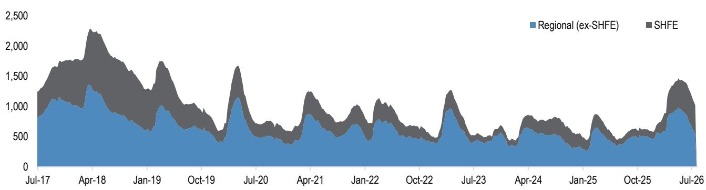

# 铜铝库存信号：宏观头条忽略的中国需求变化

中国铜显性库存已降至约12万吨，比2025年低点还低3万吨，创下近十年来同期最紧水平。作为衡量现货市场紧张程度的实时指标，洋山铜溢价自2025年5月以来首次飙升至每吨100美元。截至2026年7月17日当周记录的这两组数据，与占据头条的宏观叙事形成鲜明对比。尽管中国二季度GDP同比增速从一季度的5.0%放缓至4.3%，社会融资总量增速降至7.4%的历史低位，但金属现货市场释放出不同信号：6月和7月铜铝消费正在加速。

宏观总量走弱与现货市场收紧之间的张力，是当前研究金属市场的核心课题。答案在于数据的时间差。被广泛引用的2026年前五个月消费加权终端铜需求同比下降5%，是一个回顾性统计，反映的是去库存最严重时期的情况。而6月和7月的高频库存数据显示，需求轨迹已经转变。单周铜库存减少1.7万吨，同期铝库存减少5.4万吨，这是春节以来较强的去库存势头。这不是统计上的偶然，而是5月数据未能捕捉到的消费模式结构性转变。

对于依赖滞后指标的研究者而言，风险在于当现货紧张转化为交易所价格上涨时，可能措手不及。商品研究团队已在预测，中国以外市场三季度将出现较大缺口，可能需要更高的交易所定价来吸引中国保税仓库的金属进入全球市场。布局窗口正在收窄。

## 铜市场已进入宏观数据无法解释的现货短缺

中国铜显性库存目前为11.9万吨，不仅低于2025年低点，也远低于7月中旬的五年历史区间。单周1.7万吨的库存减少，与5月需求数据预测之外的消费加速相一致。洋山铜溢价突破每吨100美元，证实这种紧张不仅是库存报告的统计现象，而是真实的现货市场状况。进口商愿意支付一年多未见的高溢价，表明国内供应无法满足当前需求。

关键洞察在于表观消费与终端需求之间的脱节。5月，铜表观消费同比增长8%，而终端消费下降5%。这一差异是由补库存活动推高表观消费数据所致。5月的疲弱终端数据已被后续变化所取代。高频库存追踪显示，6月和7月终端消费已显著增强。我们观察到的去库存并非因冶炼厂减产，而是下游加工企业为满足订单而消耗库存。当库存达到当前极低水平时，下一阶段必然是通过价格调整来平衡需求或吸引新供应。

## 铝去库存速度显示结构性收紧，而非季节性波动

铝显性库存已回落至约100万吨，几周前库存仍处高位时，这一水平似乎难以想象。单周5.4万吨的库存减少是春节以来较强，而春节通常是一年中去库存最积极的阶段。这一速度在7月得以维持——通常该月库存会累积或至少去库存放缓——表明需求环境强于季节性规律。

铝的故事尤其具有启发性，因为其终端用途比铜更广泛，涵盖建筑、交通、包装和电子。当铝去库存同时在这些渠道加速时，表明工业活动正在广泛复苏，而非特定行业的异常。100万吨的库存水平仍高于此前周期的低点，但对价格形成而言，下降速度才是关键。如果当前速度再持续两到三周，库存将跌破五年均值，市场将面临与铜相同的现货紧张局面。

对观察者而言，铝的上涨尚未完全反映在共识预期中。中国以外市场的三季度缺口预测只会加剧紧张，因为中国半成品出口与国内需求将争夺有限的初级金属供应。

## 锌作为反向信号：补库存证实金属复苏具有选择性而非普遍性

铜铝发出紧张信号时，锌则呈现不同图景。锌在岸库存总量为26.8万吨，比同期五年历史均值高出13万吨以上。过去一周市场出现3000吨补库存，这一模式已持续数周。这种差异并非对铜铝论点的否定，而是确认需求复苏具有选择性，集中在特定工业领域。

锌主要用于建筑和基础设施领域的镀锌钢生产，这两个行业仍面临压力。中国二季度固定资产投资显著收缩，建筑周期尚未好转。锌库存增加与房地产行业需求疲弱以及基础设施支出增速低于预期相一致。这种选择性疲弱正是高频库存数据价值所在。仅看GDP和社会融资总量增长的宏观视角，会忽略电网投资、电动汽车生产和可再生能源安装等铜密集型行业活跃，而锌密集型行业仍处调整期。

策略启示是，现货数据支持做多铜、做空锌的配置。两种金属的分化并非单一宏观因素所致，而是其终端需求结构在中国经济中受到不同驱动。

## 决策框架：如何利用高频库存数据预判交易所价格变动

对于需要布局未来三到六个月的研究者而言，高频库存数据提供了比GDP或贷款增长数据更可靠的领先指标。该框架基于三个连续信号。

第一个信号是去库存速度。当单周库存减少连续三周超过五年均值时，表明消费加速超出供应链补货能力。铜铝目前均满足这一条件。第二个信号是现货溢价。当洋山铜溢价突破每吨80美元并维持时，确认紧张状况未通过进口缓解。每吨100美元的溢价表明，全球市场需要重新定价以吸引边际供应。第三个信号是库存消费比。按当前显性库存水平，中国铜库存约可维持两周消费。历史数据显示，当该比率低于三周时，交易所价格往往因消费者恐慌性采购而大幅上涨。

对中国以外市场观察者而言，三季度缺口预测可能大于当前模型估算。如果中国继续以当前速度去库存，原本出口到世界其他地区的金属将被国内消耗。交易所必须提高定价以吸引中国保税仓库的金属流出，这一过程已经开始。

## 权益市场尚未反映转折：估值脱节在部分矿企中创造机会

现货市场信号尚未完全反映在欧洲金属和采矿公司的估值中。一家拥有超过30%棕地增长潜力（至2028年）的大型铜生产商，其估值隐含自由现金流无转折，尽管库存数据使铜价支撑成为可能。该生产商预计2028年产生的自由现金流转折由产量增长驱动，而非价格假设，这意味着其权益对铜价的杠杆作用未被当前估值捕捉。

相反，涉及铁矿石和钻石的多元化矿企面临不同风险。中国铁矿石库存过去一周减少300万吨，此前九周持平，表明钢厂利润因焦煤价格上涨而承压。钢材库存环比持平，同比上涨12%，显示钢铁需求复苏落后于铜铝。铁矿石和钻石敞口较大的矿企，其铁矿石部门面临成本上升，2026年上半年钻石部门业绩可能疲弱。铜与铁矿石基本面的分化，强化了选择性配置铜相关标的而非广泛矿业权益的理由。

策略结论清晰。宏观数据是回顾性的，错过了现货市场已在定价的转折。高频库存数据是最可靠的领先指标，它显示中国铜铝需求在6月和7月显著加速。等待GDP数据确认复苏的观察者，将错过现货溢价和权益估值的变化。在洋山溢价仍为每吨100美元、交易所尚未重新定价全球缺口之前，正是关注之时。

*仅供参考。部分内容可能基于源材料通过AI辅助生成、翻译、总结或编辑，可能存在遗漏或错误。请独立核实。本文不构成专业建议。*

仅供参考。部分内容可能基于源材料通过AI辅助生成、翻译、总结或编辑，可能存在遗漏或错误。请独立核实。本文不构成专业建议。

