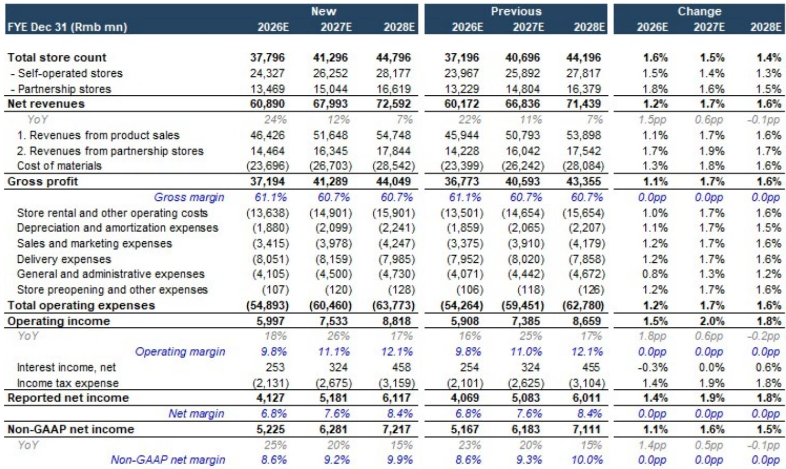
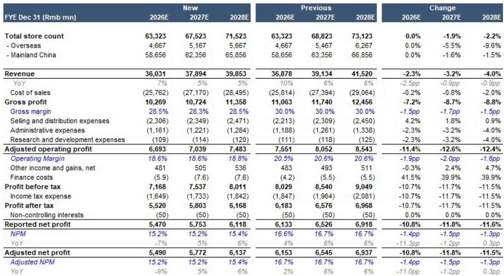
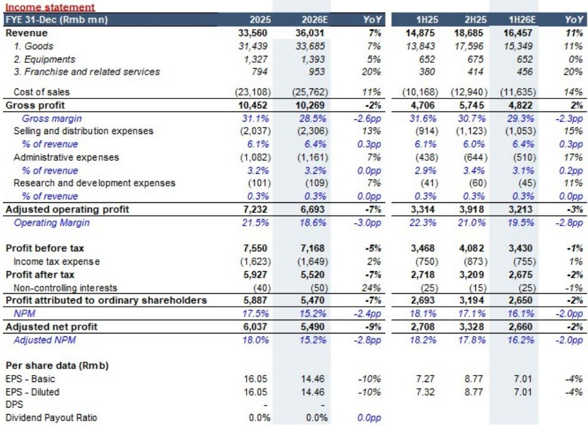

# 中国茶饮与咖啡市场出现结构性分化：瑞幸持续增长，加盟密集型品牌面临挑战

2026年中国饮品连锁市场已不再是单一的扩张叙事，而是呈现出结构性分化。2026年上半年，瑞幸咖啡净新增约5800家门店，接近古茗985家净新增的六倍，也大幅超过蜜雪冰城的4527家。与此同时，蜜雪冰城和古茗的估值在第二季度已分别下跌23%和25%，这一变化发生在同店销售数据完全恶化之前。市场并非情绪化反应，而是在提前反映行业运营数据正在确认的趋势：消费者习惯已牢固转向外卖平台，加盟商情绪转弱，推动上一轮增长的加盟密集型商业模式正触及结构性天花板。相对少见摆脱这一压力的公司是瑞幸，且其优势正在扩大。

这种分化之所以重要，是因为它并非周期性现象。中国饮品行业正在经历增长引擎的重塑。去年，所有主要品牌都受益于门店扩张和消费热情的共同推动。今年，潮水退去，依赖加盟商资金扩张的船只开始暴露。加盟商而非消费者，是这个行业的早期预警系统。当他们开设第二家门店或翻新现有门店的意愿下降时，整个扩张模式就会停滞。古茗大幅下调指引——将2026财年净开店目标削减43%——是加盟商主导模式承压的最清晰信号。对于观察者而言，问题是这是暂时停顿还是永久性调整。

## 加盟模式面临结构性信心危机，品牌支持难以轻易修复

加盟商是中国饮品连锁的“煤矿中的金丝雀”，他们正在发出清晰的警示信号。核心问题并非消费者停止购买茶饮或咖啡，而是开设新加盟店的经济效益已恶化到典型加盟商的风险收益计算不再可行的程度。2026年上半年，古茗和蜜雪冰城的同店销售已转为负值或呈下降趋势，客流量全面走弱。对于加盟商而言，营收压力远比品牌在公司层面实现的订单结构或毛利率边际改善更为重要。看到进店顾客减少的加盟商，不会将资金投入第二家门店，也会推迟翻新现有门店。

数据证实了这一行为转变。2026年上半年，古茗仅净新增985家门店，较市场预期的速度大幅放缓。公司自身将全年净开店目标削减43%，表明管理层认为没有快速解决方案。蜜雪冰城尽管拥有超过59000家门店的庞大基础，也面临类似情况。其2026财年毛利率预计收缩2.6个百分点，调整后营业利润预计同比下降7%。这些数字并非品牌经历短暂疲软期的表现，而是商业模式正在失去前进动力的信号。

这些品牌面临的诱惑是增加补贴和营销支持以保持加盟商积极性。但这会产生熟悉的权衡：加大支持力度则压缩利润，或接受更慢的扩张。两者兼顾不可持续。古茗和蜜雪冰城的风险在于，它们可能陷入一个循环：即使门店层面的经济效益恶化，也必须投入更多来维持加盟商兴趣。这正是已导致指引下调的机制，而2026年下半年可能比上半年更弱，因为第三季度面临更严峻的同比基数。

## 瑞幸垂直整合模式创造结构性成本与控制优势，加盟密集型竞争对手难以复制

瑞幸的优异表现并非偶然。这是根本不同运营模式的结果，这种模式在加盟密集型模式崩溃之处展现出韧性。在瑞幸约33000家门店中，约22000家为直营。这使公司拥有任何依赖加盟的竞争对手无法匹敌的运营控制力。当瑞幸需要调整定价、推出促销或新产品时，无需与数千个独立加盟商协商，可在整个网络内即时执行。

财务结果反映了这一结构性优势。瑞幸2026财年预计营收增长24%，达到近610亿元人民币，调整后营业利润预计增长18%至约60亿元人民币。更重要的是，盈利拐点似乎即将到来。公司调整后营业利润预计2026年上半年下降2%，但下半年将飙升37%。这意味着下半年复苏由利润率扩张驱动，而非仅靠营收增长。公司毛利率稳定在约61%，而蜜雪冰城正在收缩，古茗最多持平。

瑞幸的优势有三方面。首先，直营门店使其完全掌控客户体验和运营标准。其次，数字化和直接面向消费者渠道的投资创造了加盟密集型品牌难以复制的留存飞轮。第三，规模和供应链整合带来结构性成本优势，使其在快速开店的同时维持利润率。市场已认识到这一点。瑞幸2026财年远期市盈率为12.9倍，考虑到盈利增长轨迹，这一估值合理，一旦公司公布第二季度业绩，共识上调可能随之而来。

## 霸王茶姬占据防御性位置，但高端定位在消费趋紧环境下限制上行空间

霸王茶姬的情况更为复杂。该品牌保持高端定位，平均售价每杯21.8元，远高于行业平均水平。这使其维持了超过55%的毛利率，调整后营业利润预计2026年下半年强劲反弹，同比增长75%。然而，高端定位伴随自身风险。在消费者价格敏感度上升、客流量下降的环境中，高端品牌往往最先感受到压力。霸王茶姬2025年同店销售下降约24%，虽然基数效应使复苏更容易，但潜在消费行为可能不支持持续反弹。

公司的门店扩张计划反映了这种谨慎。霸王茶姬2026财年预计仅净新增400家门店，较2025年新增1013家大幅放缓。这表明管理层优先考虑门店层面盈利能力而非营收增长，在当前环境下是明智策略。市场似乎已计入较慢的开店节奏，这限制了下行风险。但上行空间也受限。霸王茶姬的高端模式在消费者升级时表现良好，但在消费趋紧环境中较为脆弱。品牌2026年下半年的复苏很大程度上是低基数效应，而非消费需求的根本改善。

更有趣的问题是霸王茶姬能否在不牺牲销量的情况下维持高端定位。公司日均杯数已从2024年的837杯降至2026年预估的469杯，下降近44%。这在一定程度上是门店成熟和市场饱和的结果，但也反映了在注重性价比的市场中维持高端定价的挑战。霸王茶姬依赖微信小程序折扣和仅限堂食优惠来引导订单远离外卖平台的策略，可能有助于利润率，但并未解决根本的销量挑战。

## 观察框架：区分结构性韧性与周期性复苏

中国饮品市场的分化提供了清晰的观察框架。关键区别在于公司是拥有结构性韧性，还是寄望于周期性复苏。瑞幸明显属于第一类。其垂直整合模式、运营控制力和成本优势不依赖于消费情绪或加盟商信心的复苏。即使在充满挑战的环境中，公司也能继续增长并改善利润率。2026年下半年预期的盈利拐点由内部运营改善驱动，而非外部利好因素。

古茗和蜜雪冰城属于第二类。它们的复苏取决于同店销售稳定、加盟商信心恢复以及客流量整体改善。这些均无保证。两家公司下半年展望弱于上半年，进一步下调指引的风险真实存在。对古茗而言，实现2026财年预期需要在下半年再净增1200家门店，并在第四季度稳定同店销售。这是高难度目标。对蜜雪冰城而言，挑战更为严峻：公司需要扭转毛利率下降和门店层面生产力下滑的趋势，同时管理超过63000家门店的加盟网络。

霸王茶姬处于中间位置。其高端定位提供了利润缓冲，但销量挑战是结构性的。如果市场保持谨慎，公司相对表现可能良好，但相对上行空间受限于其商业模式的约束。最具吸引力的入场时机可能在2026年晚些时候，届时更清晰的比较基数将提高可见度，尤其是对古茗而言，其增长潜力和竞争力在短期挑战下依然保持。

观察顺序清晰：瑞幸优先，其次是霸王茶姬，然后是古茗，蜜雪冰城居后。这一排序不仅反映当前表现，更体现每种商业模式的结构性持久力。在市场从扩张转向整合的过程中，最能掌控自身命运的公司将带来可持续的回报。

*仅供参考。部分内容可能基于源材料通过AI辅助生成、翻译、总结或编辑，可能存在遗漏或错误。请独立核实。本文不构成专业建议。*

仅供参考。部分内容可能基于源材料通过AI辅助生成、翻译、总结或编辑，可能存在遗漏或错误。请独立核实。本文不构成专业建议。

