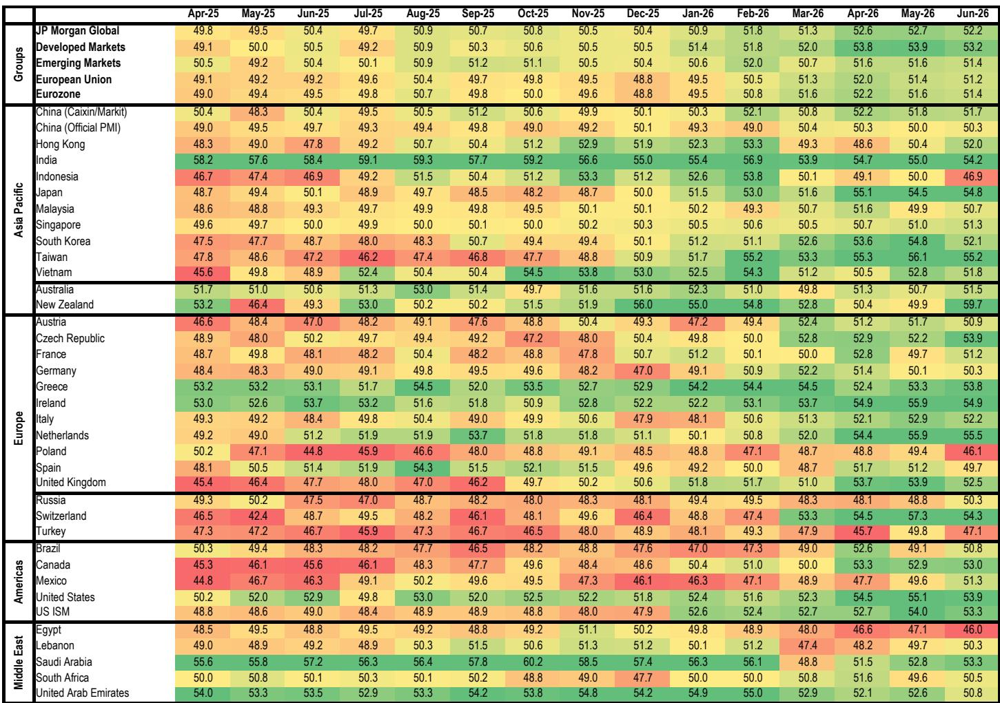
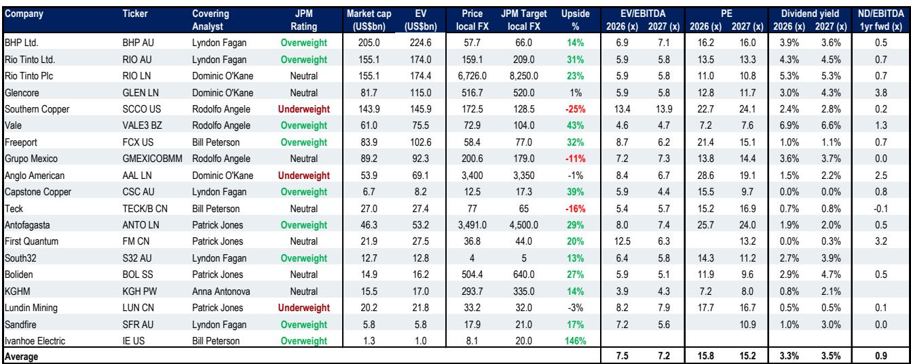
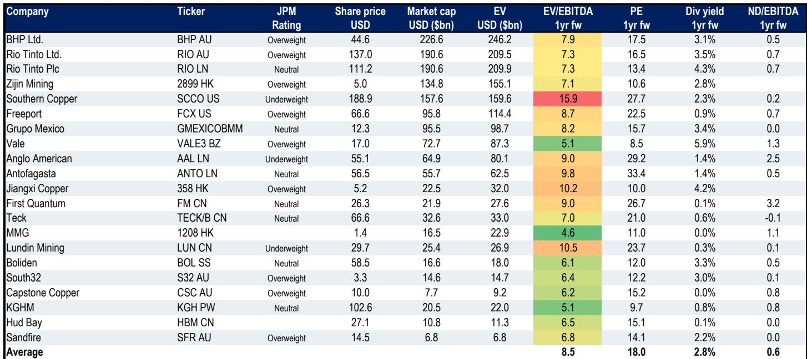

# 全球铜市场库存结构变化观察

全球铜市场正在经历一次显著的库存结构变化。根据相关监测报告，截至2026年5月，全球可见铜库存已从3月的137万吨降至105万吨，这一变化主要来自中国市场——相关交易所及保税仓库库存减少了45万吨，降至约12万吨。与此同时，美国境内的库存因贸易政策预期而持续增加，目前已达到约72.5万吨，占全球总量的70%。

报告的核心观察是：铜价当前约每磅6-6.2美元（年内上涨约8%）的表现，更多来自中国市场的逢低关注和美国贸易政策预期这两个因素，而非实际需求的强劲。相关研究主管指出，虽然矿山供应偏紧和结构性需求支撑中期前景，但在每吨约13600美元、同比涨幅超过40%的价位上，面对2025年全球精炼铜市场超过50万吨的过剩，铜价是否具有吸引力值得进一步观察。

## 1. 中国去库与美国囤货形成镜像

全球铜库存的结构性分化是当前市场最突出的特征。中国市场的去库速度较快：相关交易所及保税仓库库存从3月到5月下降了45万吨，降至约12万吨，这意味着除美国以外的全球库存已基本回归2025年水平。而美国境内库存则因贸易政策预期持续增加，目前约72.5万吨的库存规模占全球可见库存的七成。

这种镜像变化背后是两种不同的驱动力。中国方面，精炼铜产量上升但进口量下降，导致国内库存快速消化；美国方面，自2025年初以来，相关市场之间的价差持续吸引铜流入美国，18个月内累计增加了约120万吨。报告认为，这种格局正在使中国市场的关注底线有所上移，向每吨13500美元靠拢。

> **观察评论：** 中国去库与美国囤货看似都是库存变化，但性质不同。前者反映的是国内供需再平衡，后者则是政策预期驱动的套利行为。读者可以关注这两类库存变化的可持续性，因为政策落地后的去库节奏将直接影响铜价走势。

## 2. 矿山供应增长缓慢，但精炼端仍有过剩

从供应端看，全球矿山产量增长温和。截至2026年4月，全球矿山铜产量同比增长仅1.4%，年化产量约2310万吨。主要产铜国中，智利产量同比下降明显，4月年化产量降至约500万吨，同比降幅达13.8%；刚果民主共和国仍是增长最快的地区，年化产量约360万吨，同比增长5.2%。俄罗斯产量增长显著，年化产量约140万吨，同比增长18.7%。

但矿山端的紧张并未传导至精炼端。报告明确指出，2025年全球精炼铜市场仍处于超过50万吨的过剩状态。这意味着当前铜价的高位更多由库存转移和预期驱动，而非实际供需缺口。相关研究认为，2026年下半年的关键观察点不是供需平衡表，而是政策——尤其是美国贸易政策的具体落地方式。

## 3. 政策路径决定价格方向

报告对政策前景给出了具体假设：可能采取分阶段、逐步升级的方案，预计2027年1月起对精炼铜阴极征收15%关税，2028年1月升至30%。这一设计的目的是将进口铜留在美国境内作为关键储备。

在这一框架下，相关研究预计铜价将呈现逐步向每吨15000美元推进的趋势。不确定性偏向上行，因为美国以外库存的快速下降可能形成一个较为紧张的局面。但报告也提醒，如果政策不确定性消除或低于预期，美国库存可能转为去化，届时价格支撑将有所减弱。

> **观察评论：** 政策路径是当前铜价最关键的变量，但也是最难预测的。报告提供了一个可操作的观察框架：关注美国库存变化与相关市场价差的关系。如果价差收窄而美国库存仍不下降，说明市场对政策的预期仍在定价；如果价差收窄伴随库存下降，则可能意味着政策预期开始消退。

## 4. 矿企分化：产量增长与成本不确定性并存

在公司层面，相关研究对不同矿企给出了差异化判断。澳大利亚市场，该机构对必和必拓、力拓、Capstone Copper、South32和Sandfire均给予积极看法，认为这些公司铜业务占比高、产量增长可期。北美市场，Freeport-McMoRan是关注重点，因其在铜业务上的集中度和运营效率。

欧洲、中东和非洲地区，该机构近期将Antofagasta的评级上调，理由是其铜产量增长领先同行（预计到2028年增长约30%），自由现金流和资本回报率将迎来变化，且估值有所改善。而Anglo American则被给予保守看法，并已被列入谨慎观察名单，原因是其独特的成本不确定性——巴西和南非的铁矿石运费高企，加上钻石业务表现一般，可能对2026年第二季度生产业绩构成不确定性。

一个值得关注的尾部不确定性来自Collahuasi铜矿的淡化厂暂停运营。该矿由Anglo American和Glencore各持股44%，报告认为如果暂停时间延长，可能影响2026年下半年或2027年的铜回收率。这一不确定性对两家公司的影响程度不同，取决于各自的生产结构和成本分布。

总体而言，这份报告描绘了一个由政策预期主导、基本面支撑但尚未完全体现的铜市场。库存的地理分布变化比总量变化更具信息量，而政策的最终形态将决定价格是继续向上还是回归基本面。对于铜矿读者而言，产量增长、成本控制和地区不确定性暴露的差异，正在成为区分公司表现的关键维度。

For informational purposes only. Portions may be generated,translated,summarized,or edited with AI assistance based on source materials and may contain omissions or errors. Please verify independently. This is not investment,legal,tax,accounting,or other professional advice.

For informational purposes only. Portions may be generated,translated,summarized,or edited with AI assistance based on source materials and may contain omissions or errors. Please verify independently. This is not investment,legal,tax,accounting,or other professional advice.

