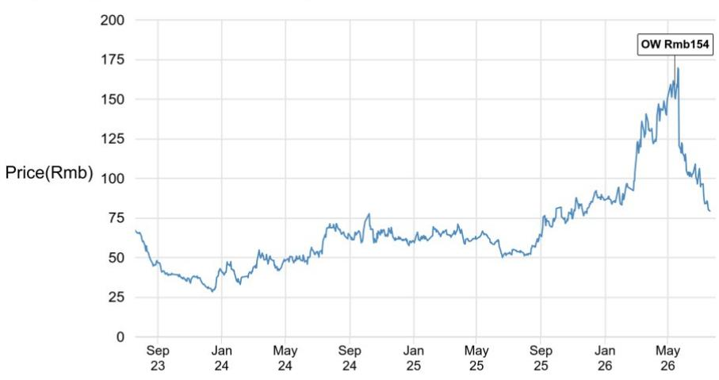

# 德业股份 - A

## 闭门交流纪要：需求前景稳健

我们与德业股份董事会秘书进行了闭门交流。管理层分享称，2026年上半年强劲的业绩表现得益于住宅及工商业储能系统需求的回升，部分原因与能源供应变化有关，上半年收入已达到全年200亿元目标的约50%。我们认为管理层有可能在二季度业绩说明会上调高全年目标。增长动力来自新兴市场，包括东欧、东南亚、中东、印度、巴基斯坦和非洲。尽管面临电芯及电力电子器件成本压力，管理层仍致力于维持稳定的利润率展望，下半年将通过推出新产品来降低成本。渠道库存水平健康。德业股份的香港上市计划正在等待监管审批；募集资金将用于中国及马来西亚的产能扩张、研发以及品牌和渠道建设。我们维持对德业股份的积极看法，预期其将受益于新兴市场光伏+储能渗透率提升带来的分布式储能增长潜力。

- **管理层分享上半年业绩预告更多细节**：德业股份预告2026年上半年净利润约27亿元，同比增长超过75%，得益于住宅及工商业储能系统需求回升。上半年收入达到全年200亿元目标的一半。德业股份在财务指引方面一向较为保守。我们认为，德业股份有可能在2026年二季度业绩说明会上调高全年收入目标。

- **强劲增长主要由新兴市场的储能需求驱动**：约40%的收入来自欧盟市场，东欧地区增长尤为强劲，包括罗马尼亚、保加利亚、波兰和乌克兰。亚洲市场约占另外40%，德业股份在东南亚、中东、印度和巴基斯坦均实现强劲增长，主要由于电力需求上升以及中东地区能源供应变化。非洲市场占上半年收入的12-13%。由于光伏/储能渗透率较低，管理层对未来需求前景保持积极态度，并持续开拓该市场。管理层预计，受政策变化影响，澳大利亚市场（收入占比为个位数百分比）下半年增长可能放缓。地缘政治因素可能影响美国市场前景，德业股份在美国的收入占比仅为2-3%。

- **管理层目标在电芯及电力电子器件成本压力下维持稳定的利润率**：管理层分享称，上半年电芯价格上涨给电池包业务带来利润率压力，但公司目标维持约30%的稳定利润率。同时，逆变器价格相对稳定，而电力电子器件价格有所上涨。德业股份上半年利用库存的电力电子器件维持了稳定的利润率，并计划在下半年推出新产品类型以缓解成本压力。

- **管理层表示渠道库存水平健康**：管理层认为渠道库存合理，没有严重积压，因为分销商从2022-23年的地缘冲突中吸取了经验。此外，管理层评论称，7月份出货量平稳，因欧洲正值淡季。

- **战略更新**：德业股份的香港上市计划正在等待中国证监会监管审批；管理层初步目标为三季度，希望在2026年四季度前完成发行。香港上市募集资金计划用于中国及马来西亚的制造产能扩张、研发以及品牌和渠道建设。管理层估计，马来西亚工厂的资本支出约为10亿元，该工厂旨在应对未来政策风险。

- **观点与展望**：我们维持对德业股份的积极看法。德业股份是一家分布式储能系统制造商，在新兴市场具有先发优势。我们预期德业股份将受益于新兴市场光伏+储能渗透率提升带来的分布式储能增长潜力。详情请参阅我们的首次覆盖报告（链接）。

# 研究观点、估值与风险

德业股份 - A（积极看法；目标价：154.00元）

## 研究观点

德业股份是分布式储能系统的先行者和成本领先者，尤其在新兴市场。其传统家电业务通过垂直整合实现了优越的利润率和有竞争力的定价。公司受益于能源供应变化、燃料价格变动以及全球可再生能源政策激励带来的强劲需求，多元化的地域布局和稳健的供应链支撑了持续增长和韧性。我们对德业股份持积极看法。

## 估值

我们对2027年6月的目标价为154元，基于25倍市盈率，采用2027/2028财年预期每股收益的平均值。我们的目标倍数得到德业股份高增长、在新兴市场的先发优势以及相对同业强劲的盈利动力的支撑，但略低于该股票的历史平均水平，考虑到2026/2027财年约50%的平均盈利增长，略低于2021-2025年55%的盈利复合年增长率。

## 评级与目标价风险

下行风险：如果分布式储能需求减弱，特别是由于化石燃料价格快速下跌或新兴市场增长放缓，我们的评级和目标价将面临最大风险。如果锂及其他上游成本上升速度快于德业股份调整价格的能力，或竞争加剧导致被迫降价，利润率可能受到压缩。此外，贸易/政策限制（例如，对中国制造逆变器的补贴排除）可能限制进入关键终端市场。

---

分析师认证：本报告封面标注"AC"的研究分析师证明（或，当多位研究分析师主要负责本报告时，封面或文档内标注"AC"的研究分析师分别证明，就其在本研究中覆盖的每个证券或发行人而言）：(1) 本报告中表达的所有观点准确反映了研究分析师对任何及所有主题证券或发行人的个人观点；(2) 研究分析师的报酬中没有任何部分直接或间接地与本研究报告中表达的具体建议或观点相关。对于封面列出的所有韩国研究分析师（如适用），他们还根据KOFIA要求证明，研究分析师的分析是善意作出的，且观点反映了研究分析师本人的意见，没有受到不当影响或干预。

本报告中列出的所有作者均为研究分析师，除非另有说明，他们独立进行研究。在欧洲，本报告中可能显示行业专家（销售和交易）作为联系人，但他们不是报告的作者或研究部门的一部分。

## 重要披露

- **做市商/流动性提供者**：JPM是德业股份 - A或相关实体金融工具的做市商和/或流动性提供者。

- **客户**：JPM目前拥有，或在过去12个月内曾拥有以下实体作为客户：德业股份 - A或相关实体。

- **客户/非投资银行、证券相关**：JPM目前拥有，或在过去12个月内曾拥有以下实体作为客户，且提供的服务为非投资银行、证券相关：德业股份 - A或相关实体。

- **客户/非证券相关**：JPM目前拥有，或在过去12个月内曾拥有以下实体作为客户，且提供的服务为非证券相关：德业股份 - A或相关实体。

- **潜在投资银行报酬**：JPM预计在未来三个月内将从德业股份 - A或相关实体收取或寻求投资银行服务报酬。

- **已收非投资银行报酬**：JPM在过去12个月内已从德业股份 - A或相关实体收取非投资银行产品或服务报酬。

- **债务头寸**：JPM可能持有德业股份 - A或相关实体的债务证券头寸（如有）。

公司特定披露：JPM确实并寻求与其研究报告所覆盖的公司开展业务。因此，读者应注意，该公司可能存在利益冲突，可能影响本报告的客观性。读者应将本报告视为做出投资决策的单一因素。重要披露，包括价格图表和信用意见历史表（如适用），可通过访问https://www.jpmm.com/research/disclosures、致电1-800-477-0406或发送电子邮件至research.disclosure.inquiries@JPM.com获取，适用于汇编报告及所有JPM覆盖的公司和某些未覆盖的公司。

德业股份 - A (605117.SS, 605117 CH) 价格图表

| 日期 | 评级 | 价格（元） | 目标价（元） |
|------|------|-----------|-------------|
| 2026年5月14日 | 积极 | 158.87 | 154 |

来源：Bloomberg Finance L.P. 和 JPM；价格数据已根据股票分割和股息进行调整。首次覆盖日期为2026年5月14日。所有股价均为前一交易日收盘价。
图表显示JPM对该股票的持续覆盖；当前分析师可能在整个期间内覆盖也可能未覆盖该股票。JPM评级或名称：OW = 积极，N = 中性，UW = 谨慎，NR = 未评级

## 股票研究评级、名称及分析师覆盖范围说明

JPM使用以下评级体系：积极（在本报告所示目标价期间内，我们预期该股票将跑赢研究分析师或其团队覆盖范围内股票的平均总回报）；中性（在本报告所示目标价期间内，我们预期该股票将与研究分析师或其团队覆盖范围内股票的平均总回报表现一致）；谨慎（在本报告所示目标价期间内，我们预期该股票将跑输研究分析师或其团队覆盖范围内股票的平均总回报）。NR为未评级。在此情况下，JPM已因缺乏充分基本面依据或法律、监管或政策原因而移除该股票的评级及（如适用）目标价。先前的评级及（如适用）目标价不再适用。NR名称并非推荐或评级。部分覆盖股票有评级但无目标价；在此情况下，我们预期该股票将跑赢/表现一致/跑输研究分析师或其团队在相关区域覆盖范围内股票的平均总回报。在亚洲（除澳大利亚和印度外）及英国中小盘股票研究中，每只股票的预期总回报与基准国家市场指数的预期总回报进行比较，而非与研究分析师的覆盖范围进行比较。如果本报告的重要披露部分未显示，认证研究分析师的覆盖范围可在JPM研究网站https://www.JPMmarkets.com上找到。

覆盖范围：Hon, Alan：中信博 - A (688408.SS)、中广核电力 (1816) (1816.HK)、大全新能源 (DQ)、大唐新能源 (1798) (1798.HK)、德业股份 - A (605117.SS)、英维克 - A (002837.SZ)、信义玻璃 (6865.HK)、协鑫科技 (3800.HK)、金风科技 - A (002202.SZ)、金风科技 - H (2208.HK)、福斯特 - A (603806.SS)、华能水电 - A (600025.SS)、隆基绿能 - A (601012.SS)、龙源电力 (0916) (0916.HK)、迈为股份 - A (300751.SZ)、明阳智能 - A (601615.SS)、东方电缆 - A (603606.SS)、国投电力 - A (600886.SS)、先导智能 - A (300724.SZ)、川投能源 - A (600674.SS)、阳光电源 - A (300274.SZ)、通威股份 - A (600438.SS)、信义光能 (0968) (0968.HK)、长江电力 - A (600900.SS)

JPM股票研究评级分布，截至2026年7月4日

| | 积极（买入） | 中性（持有） | 谨慎（卖出） |
|---|------------|------------|------------|
| JPM全球股票研究覆盖* | 53% | 36% | 12% |
| 投行客户** | 83% | 80% | 73% |
| JPMS股票研究覆盖* | 51% | 37% | 12% |
| 投行客户** | 95% | 92% | 87% |

*请注意，由于四舍五入，百分比可能不总和为100%。
**在过去12个月内JPM已提供投资银行服务的每个"买入"、"持有"和"卖出"类别中主题公司的百分比。

就FINRA评级分布规则而言，我们的积极评级属于报告评级类别；我们的中性评级属于持有评级类别；我们的谨慎评级属于报告评级类别。请注意，带有NR名称的股票不包含在上述表格中。此信息截至最近一个日历季度末。

## 股票估值与风险

有关覆盖公司或目标价的估值方法和风险，请参阅最新的公司特定研究报告，访问http://www.JPMmarkets.com，联系首席分析师或您的JPM代表，或发送电子邮件至research.disclosure.inquiries@JPM.com。有关专有模型的实质性信息，请参阅公司特定研究报告中的财务摘要和公司概况表，这些可在我们的客户网站http://www.JPMmarkets.com的公司页面上下载。本报告还阐述了所使用的基本假设。

## 研究交流历史

过去12个月内JPM研究交流的历史可在http://www.JPMmarkets.com的研究与评论页面上获取，您也可以按分析师姓名、行业或金融工具进行搜索。

## 分析师报酬

负责编制本报告的研究分析师的报酬基于多种因素，包括研究的质量和准确性、客户反馈、竞争因素以及公司整体收入。

## 非美国分析师注册

除非另有说明，本报告封面列出的非美国分析师是非JPM Securities LLC美国关联公司的员工，可能未根据FINRA规则注册为研究分析师，可能不是JPM Securities LLC的关联人士，且可能不受FINRA规则2241或2242关于与覆盖公司沟通、公开露面以及研究分析师账户持有证券交易的限制。

## 其他披露

JPM是JPM Chase & Co.及其全球子公司和关联公司投资银行业务的营销名称。

英国MiFID FICC研究拆分豁免：英国客户应参考英国MiFID研究拆分豁免，了解JPM实施FICC研究豁免的详情以及相关FICC研究分类的指导。

所有向客户提供的研究材料均同时在我们的客户网站JPM Markets上提供，除非相关法律特别允许。并非所有研究内容都会重新分发、通过电子邮件发送或提供给第三方聚合商。如需获取特定股票的所有研究材料，请联系您的销售代表。

本研究材料中对中国、香港、台湾和澳门的任何长格式名称分别为中国大陆、中国香港特别行政区、中国台湾和中国澳门特别行政区。

JPM可能不时撰写关于受美国、欧盟、英国或其他相关司法管辖区政府当局实施或管理的经济或金融制裁所针对的发行人或证券（受制裁证券）的文章。本报告中的任何内容均无意被解读为鼓励、促进、推动或以其他方式批准对受制裁证券的投资或交易。客户在做出投资决策时应了解自身的法律和合规义务。

本研究报告中讨论的任何数字或加密资产均受快速变化的监管环境影响。有关加密资产（包括比特币和以太坊）的相关监管建议，请参阅https://www.JPM.com/disclosures/cryptoasset-disclosure。

本研究报告的作者可能未获许可在您的司法管辖区开展受监管活动，如果未获许可，则不会声称能够这样做。

交易所交易基金（ETF）：JPM Securities LLC（"JPMS"）作为几乎所有美国上市ETF的授权参与者。如果本报告中提及任何ETF，JPMS可能因分销这些ETF股份而赚取佣金和基于交易的报酬，并可能因执行其他交易相关服务（如向ETF股份的空头卖家提供证券借贷）而赚取费用。JPMS还可能为ETF本身提供服务，包括担任ETF的经纪商或交易商。此外，JPMS的关联公司可能为ETF提供服务，包括信托、托管、管理、借贷、指数计算和/或维护及其他服务。

期权和期货相关研究：如果本文所含信息涉及期权或期货相关研究，此类信息仅提供给已收到适当期权或期货风险披露文件的人士。请联系您的JPM代表或访问https://www.theocc.com/components/docs/riskstoc.pdf获取期权清算公司的标准化期权的特征和风险，或访问https://www.finra.org/sites/default/files/2020-08/Security_Futures_Risk_Disclosure_Statement_2020.pdf获取证券期货风险披露声明。

银行间同业拆借利率（IBOR）及其他基准利率的变更：某些利率基准目前或未来可能受到持续的国际、国内及其他监管指导、改革和改革建议的影响。更多信息，请查阅：https://www.JPM.com/global/disclosures/interbank_offered_rates

私人银行客户：如果您作为JPM Chase & Co.及其子公司（"JPM私人银行"）私人银行业务的客户接收研究，研究由JPM私人银行提供，而非JPM的任何其他部门，包括但不限于JPM企业与投资银行及其全球研究部门。

负责制作和分发研究的法律实体：编写本材料的Reg AC研究分析师姓名下方标识的法律实体是负责制作本研究的法律实体。如果多位Reg AC研究分析师编写了本材料且其姓名下方标识了不同的法律实体，这些法律实体共同负责制作本研究。如果分析师姓名下列出了多个法律实体，除非另有说明，第一个法律实体负责制作。来自不同JPM关联公司的研究分析师可能对本材料的制作做出了贡献，但可能未获许可在您的司法管辖区开展受监管活动（且不会声称能够这样做）。除非下文法律实体披露中另有说明，本材料已由负责制作的法律实体分发，或者如果分析师姓名下列出了多个法律实体，第一个法律实体将负责分发。如果您有任何疑问，请联系您所在司法管辖区的相关研究分析师或分发本研究材料的实体。

## 法律实体披露及国家/地区特定披露

阿根廷：JPM Chase Bank N.A Sucursal Buenos Aires受阿根廷中央银行（BCRA）和阿根廷国家证券委员会（CNV - ALYC y AN Integral N°51）监管。

澳大利亚：JPM Securities Australia Limited（"JPMSAL"）（ABN 61 003 245 234/AFS牌照号：238066）受澳大利亚证券和投资委员会监管，是ASX Limited的市场参与者、ASX Clear Pty Limited的清算和结算参与者以及ASX Clear (Futures) Pty Limited的清算参与者。本材料由JPMSAL在澳大利亚仅向"批发客户"（定义见《2001年公司法》第761G条）发行和分发。所有覆盖的金融产品清单可通过访问https://www.jpmm.com/research/disclosures获取。JPM力求覆盖与国内外读者基础相关的所有全球行业分类标准（GICS）行业以及各种市值规模的公司。如适用，在对主题公司进行公开尽职调查的过程中，研究分析师团队可能通过公司访问、与公司代表讨论、管理层演示等方式进行尽职调查。JPMSAL发布的研究已按照JPM澳大利亚的研究独立性政策编制，该政策可在以下链接获取：JPM澳大利亚 - 研究独立性政策。

巴西：Banco JPM S.A.受巴西证券委员会（CVM）和巴西中央银行监管。JPM监察员：0800-7700847 / 0800-7700810（听障人士）/ ouvidoria.jp.morgan@jpmchase.com。

加拿大：JPM Securities Canada Inc.是一家注册投资交易商，受加拿大投资监管组织和安大略证券委员会监管，是加拿大交易所的参与会员。本材料由JPM Securities Canada Inc.在加拿大分发。

智利：Inversiones JPM Limitada是一家在智利注册的未受监管实体。

中国：JPM Securities (China) Company Limited已获中国证监会批准开展证券投资咨询业务。

哥伦比亚：Banco JPM Colombia S.A.受哥伦比亚金融监管局（SFC）监管。本材料中对哥伦比亚境外实体提供的产品或服务的任何引用仅供描述性目的。此类引用不构成也不应被解释为在哥伦比亚领土内的促销活动或金融产品或服务的提供，如适用哥伦比亚法规所定义。

迪拜国际金融中心（DIFC）：JPM Chase Bank, N.A., Dubai Branch受迪拜金融服务局（DFSA）监管，注册地址为迪拜国际金融中心 - The Gate, West Wing, Level 3 and 9 PO Box 506551, Dubai, UAE。本材料由JPM Chase Bank, N.A., Dubai Branch向被视为DFSA规则下的专业客户或市场对手方的人士分发。

欧洲经济区（EEA）：除非另有说明，研究由JPM SE（"JPM SE"）在EEA分发，JPM SE是一家由联邦金融监管局（BaFin）授权、由BaFin、德国中央银行（Deutsche Bundesbank）和欧洲中央银行（ECB）共同监管的信贷机构。JPM SE是一家总部位于法兰克福的公司，注册地址为TaunusTurm, Taunustor 1, Frankfurt am Main, 60310, Germany。本材料已在EEA向被视为专业读者（或同等资格）的人士分发，依据MiFID II第4条第1款第10项及附件II及其在各自母国的实施（"EEA专业读者"）。非EEA专业读者不得依据或依赖本材料。本材料相关的任何投资或投资活动仅面向EEA相关人士，并仅与EEA相关人士进行。

香港：JPM Securities (Asia Pacific) Limited（CE编号AAJ321）受香港金融管理局和香港证券及期货事务监察委员会监管，JPM Broking (Hong Kong) Limited（CE编号AAB027）受香港证券及期货事务监察委员会监管。JPM Chase Bank, N.A., Hong Kong Branch（CE编号AAL996）受香港金融管理局和香港证券及期货事务监察委员会监管，根据美国法律组织，责任有限。如果本材料的分发在香港是受监管活动，则本材料由JPM Securities (Asia Pacific) Limited和/或JPM Broking (Hong Kong) Limited在香港分发。

印度：JPM India Private Limited（公司识别号 - U67120MH1992FTC068724），注册地址为JPM Tower, Off. C.S.T. Road, Kalina, Santacruz - East, Mumbai – 400098，在印度证券交易委员会（SEBI）注册为"研究分析师"，注册号为INH000001873。JPM India Private Limited还在SEBI注册为印度国家证券交易所和孟买证券交易所的会员（SEBI注册号 – INZ000239730）以及商人银行家（SEBI注册号 - MB/INM000002970）。电话：91-22-6157 3000，传真：91-22-6157 3990，网站：http://www.jpmipl.com。JPM Chase Bank, N.A. - Mumbai Branch由印度储备银行（RBI）发牌（牌照号：53/Licence No. BY.4/94；SEBI - IN/CUS/014/ CDSL : IN-DP-CDSL-444-2008/ IN-DP-NSDL-285-2008/ INBI00000984/ INE231311239）作为印度的持牌商业银行，这是其开展银行业务及印度银行分行允许从事的其他活动的主要牌照。对于非本地研究材料，本材料不由JPM India Private Limited在印度分发。合规官：Ashutosh Sharma；ashutosh.j.sharma@jpmchase.com；+912261575002。投诉官：Ramprasadh K，jpmipl.research.feedback@JPM.com；+912261573000。SEBI授予的注册和NISM的认证不以任何方式保证中介机构的业绩或向读者提供回报保证。请访问条款和条件及最重要的条款和条件（MITC）。年度合规审计报告可在http://www.jpmipl.com/#research获取。

印度尼西亚：PT JPM Sekuritas Indonesia是印度尼西亚证券交易所的会员，受金融服务管理局（OJK）注册和监管。

韩国：JPM Securities (Far East) Limited, Seoul Branch是韩国交易所（KRX）的会员。JPM Chase Bank, N.A., Seoul Branch在韩国注册为外国银行分行（JPM Chase Bank, N.A.）。两个实体均受金融服务委员会（FSC）和金融监督院（FSS）监管。对于非宏观研究材料，本材料由JPM Securities (Far East) Limited, Seoul Branch在韩国分发。

日本：JPM Securities Japan Co., Ltd.和JPM Chase Bank, N.A., Tokyo Branch受日本金融厅监管。

马来西亚：本材料由JPM Securities (Malaysia) Sdn Bhd（18146-X）在马来西亚发行和分发，该公司是马来西亚证券交易所的参与组织，并持有马来西亚证券委员会颁发的资本市场服务牌照。

墨西哥：JPM Casa de Bolsa, S.A. de C.V., JPM Grupo Financiero是墨西哥证券交易所（"Bolsa Mexicana de Valores"）和机构证券交易所（"Bolsa Institucional de Valores"）的会员，并获国家银行和证券委员会（"Comisión Nacional Bancaria y de Valores"）授权作为经纪交易商。

新西兰：本材料由JPMSAL在新西兰仅向"批发客户"（定义见《2013年金融市场行为法》）发行和分发。JPMSAL根据《2008年金融服务提供商（注册和争议解决）法》注册为金融服务提供商。

菲律宾：JPM Securities Philippines Inc.是菲律宾证券交易所的交易参与者，也是菲律宾证券清算公司和证券读者保护基金的会员。它受证券交易委员会监管。

新加坡：本材料由JPM Securities Singapore Private Limited（JPMSS）[MDDI (P) 057/08/2025 and Co. Reg. No.: 199405335R]和/或JPM Chase Bank, N.A., Singapore branch（JPMCB Singapore）在新加坡发行和分发，两者均受新加坡金融管理局监管。JPMSS是新加坡交易所证券交易有限公司的会员。本材料仅向《证券及期货法》（第289章）第4A条定义的认可读者、专家读者和机构读者在新加坡发行和分发。本材料无意向任何零售读者或不属于"认可读者"、"专家读者"或"机构读者"类别的任何其他读者发行或分发。新加坡的收件人应就本材料引起或与之相关的任何事宜联系JPMSS或JPMCB Singapore。

南非：JPM Equities South Africa Proprietary Limited和JPM Chase Bank, N.A., Johannesburg Branch是约翰内斯堡证券交易所的会员，受金融服务行为监管局（FSCA）监管。

台湾：JPM Securities (Taiwan) Limited是台湾证券交易所的参与者（公司型），受台湾证券期货局监管。与股权证券相关的材料由JPM Securities (Taiwan) Limited在台湾发行和分发，受牌照范围及适用法律法规的限制。如果JPM Securities (Taiwan) Limited制作关于未在台湾证券交易所或台北交易所上市的证券（"非台湾上市证券"）的研究材料，这些材料不构成适用台湾法规下的证券推荐，且为免生疑问，JPM Securities (Taiwan) Limited不担任非台湾上市证券的经纪商。根据《证券商推介客户买卖有价证券管理办法》（及其修订或补充）第7-1条第2款和/或其他适用法律法规，请注意，本材料的收件人不得从事与本材料相关的可能产生利益冲突的任何活动，除非本材料的"重要披露"中另有披露。

泰国：本材料由JPM Securities (Thailand) Ltd.在泰国发行和分发，该公司是泰国证券交易所的会员，受财政部和证券交易委员会监管。注册地址为548 One City Center Building, 50th Floor, Ploenchit Road, Lymphini, Pathum Wan, Bangkok 10330。

英国：研究由JPM Securities plc（"JPMS plc"）在英国制作，该公司是伦敦证券交易所的会员，受审慎监管局授权并由金融行为监管局和审慎监管局监管；或由JPM Markets Limited（"JPMML Ltd"）制作，该公司受金融行为监管局授权和监管。除非另有说明，本材料由JPMS plc在英国分发，且仅面向：(a) 具有投资相关事务专业经验的人士，属于《2000年金融服务和市场法（金融促销）令》2005年第19(5)条的范围；(b) 该法令第49条所述人士（高净值公司、非法人协会或合伙企业、高价值信托的受托人等）；或(c) 可以合法接收此通讯的任何其他人士；所有这些人士被称为"英国相关人士"。非英国相关人士不得依据或依赖本材料。本材料相关的任何投资或投资活动仅面向英国相关人士，并仅与英国相关人士进行。JPM EMEA关于预防和避免与研究制作相关的利益冲突的政策说明可在以下链接获取：JPM EMEA - 研究独立性政策。

美国：JPM Securities LLC（"JPMS"）是NYSE、FINRA、SIPC和NFA的会员。JPM Chase Bank, N.A.是FDIC的会员。非美国关联公司发布的材料由JPMS在美国分发，JPMS对其内容承担责任。

一般信息：可根据要求提供额外信息。本材料中的信息来自被认为可靠的来源。尽管已采取一切合理谨慎措施确风险自担材料中陈述的事实准确，且其中包含的预测、意见和预期公平合理，但JPM Chase & Co.或其关联公司和/或子公司（统称"JPM"）对所提供的材料的完整性或准确性不作任何陈述或保证，除非涉及JPM和研究分析师与作为材料主题的发行人的参与相关的披露。因此，不应依赖本材料所含信息的准确性、公平性或完整性。由于计算、调整、翻译成不同语言和/或当地监管限制（如适用），本材料中可能存在某些数据差异和/或内容限制。这些差异不应影响对材料中可能讨论的主题公司的整体研究分析、观点和/或建议。人工智能工具可能已用于本材料的准备，包括协助数据分析、模式识别和内容起草。JPM对因使用本材料或其内容而产生的任何损失不承担任何责任，且JPM或其各自的董事、高级职员或员工均不对本材料的内容负责，除非相关司法管辖区的相关监管机构或该监管制度可能施加的责任和义务。本材料中包含的意见、预测或预测仅代表JPM截至材料日期的当前意见或判断，如有变更，恕不另行通知。可能根据公司特定发展或公告、市场状况或任何其他公开可用信息定期提供关于公司/行业的更新。无法保证未来结果或事件与此类意见、预测或预测一致，这些仅代表一种可能的结果。此外，此类意见、预测或预测受某些风险、不确定性和假设的影响，这些尚未得到验证，未来的实际结果或事件可能存在重大差异。本材料中提及的任何投资的价值或收入可能波动和/或受汇率变化影响。除非另有说明，所有定价均为所讨论证券的市场收盘价指示性价格。过往表现并不预示未来结果。因此，读者可能收回少于最初投资的金额。本材料不构成购买或出售任何金融工具的要约或招揽。本文中的意见和建议未考虑个别客户的情况、目标或需求，不构成对特定客户推荐特定证券、金融工具或策略。本材料可能包含关于结构化证券、期权、期货和其他衍生品的观点。这些是复杂的工具，可能涉及高风险，仅适合能够理解和承担相关风险的成熟读者。本材料的收件人必须就本文提及的任何证券或金融工具做出独立决定，并应寻求其认为必要的独立财务、法律、税务或其他顾问的建议。JPM可能基于研究分析师的观点和研究进行自营交易，也可能以与本材料所持观点不一致的方式为其自身账户或客户账户进行交易，且JPM无义务确保此类其他沟通引起本材料任何收件人的注意。JPM内部的其他人员，包括策略师、销售人员和其他研究分析师，可能持有与本材料所持观点不一致的观点。未参与本材料编制的JPM员工可能持有本材料中提及的证券（或此类证券的衍生品）并以与本材料讨论的方式不同的方式进行交易。本材料在任何司法管辖区均不构成对任何发行人、其产品或服务或其证券的广告或营销。

保密与安全通知：此传输可能包含根据适用法律享有特权、保密、法律特权且/或免于披露的信息。如果您不是预期的收件人，特此通知您，披露、复制、分发或使用本文所含信息（包括依赖该信息）是严格禁止的。尽管此传输及其任何附件被认为不含任何可能影响接收和打开它的任何计算机系统的病毒或其他缺陷，但收件人有责任确保其不含病毒，JPM Chase & Co.及其子公司和关联公司（如适用）对因使用而产生的任何损失或损害不承担任何责任。如果您错误地收到此传输，请立即联系发件人并完全销毁该材料，无论是电子版还是硬拷贝版。此消息受电子监控：https://www.JPM.com/disclosures/email

MSCI：本文中的某些信息（"信息"）经MSCI Inc.、其关联公司和信息提供商（"MSCI"）许可复制 ©2026。未经适当许可，不得复制或传播该信息。MSCI对信息不作任何明示或暗示的保证（包括适销性或适用性），并在法律允许的范围内免除所有责任。任何信息均不构成研究交流，除非是来自MSCI ESG Research的任何适用信息。另请参阅msci.com/disclaimer

Sustainalytics：本文中包含的某些信息、数据、分析和意见经Sustainalytics许可复制，并且：(1) 包含Sustainalytics的专有信息；(2) 除非特别授权，不得复制或重新分发；(3) 不构成研究交流或对任何产品或项目的认可；(4) 仅用于信息目的；(5) 不保证完整、准确或及时。Sustainalytics不对任何交易决策、损害或其他损失负责。数据的使用受限于https://www.sustainalytics.com/legal-disclaimers上的条件。©2026 Sustainalytics。保留所有权利。

"其他披露"最后修订于2026年7月4日。

版权所有2026 JPM Chase & Co.保留所有权利。未经JPM书面同意，不得转载、出售或重新分发本材料或其任何部分。未经JPM事先书面同意，严禁在任何第三方人工智能系统或模型中使用或分享从JPM或授权第三方收到的任何研究材料（"JPM数据"），当此类JPM数据可供第三方访问时。
