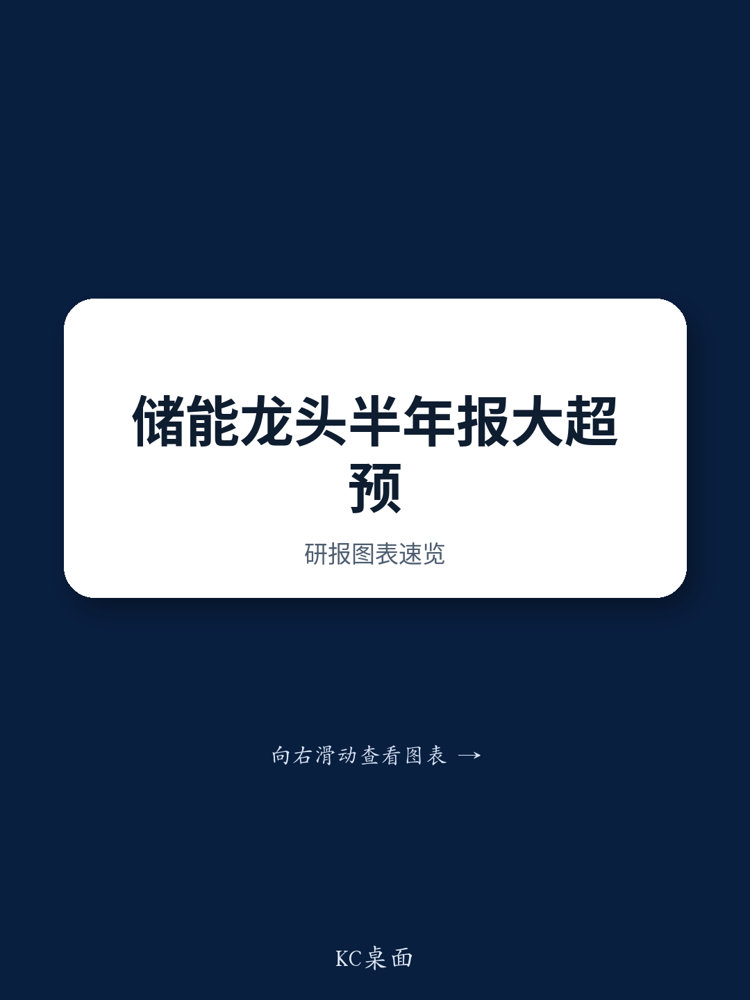

# JPM：德业股份新兴市场储能需求展望

德业股份2026年上半年预告净利润约27亿元，同比增长超过75%，收入已达到全年200亿元目标的一半。JPM在与公司董事会秘书交流后发布报告指出，这一增长主要由住宅和工商业储能需求拉动，而新兴市场是核心驱动力。报告认为，管理层有可能在二季度业绩会上调高全年收入指引。

## 1. 新兴市场贡献约六成收入，欧洲与亚洲各占四成

德业股份上半年收入结构中，欧洲市场约占40%，增长尤其强劲的区域集中在东欧，包括罗马尼亚、保加利亚、波兰和乌克兰。亚洲市场同样贡献约40%，东南亚、中东、印度和巴基斯坦需求显著上升，主要受电力需求增长以及中东地区能源供应中断影响。非洲市场占上半年收入的12%至13%，由于太阳能和储能渗透率仍低，管理层对该区域未来需求保持积极预期。澳大利亚市场因政策变化，下半年增速可能节奏变化，但该地区收入占比仅为个位数。美国市场受地缘政治因素影响存在不确定性，但德业在美国的收入敞口仅2%至3%。

> **KC评论：** 德业的收入结构高度分散，单一市场政策不确定性有限。东欧和中东的能源供应中断是短期催化剂，而非洲和东南亚的低渗透率则提供了更长期的需求基础。读者应关注这些区域电力基础设施研究和电价变化对储能需求的持续影响。

## 2. 管理层目标维持约30%毛利率，通过新品应对成本不确定性

报告显示，上半年电池芯价格上涨对电池包业务造成利润率不确定性，但管理层目标维持约30%的稳定毛利率。逆变器价格相对平稳，而功率电子器件价格出现上涨。德业上半年通过使用功率电子器件库存来稳定利润率，并计划在下半年推出新产品类型以降低成本不确定性。渠道库存方面，管理层认为库存水平合理，没有严重积压，因为分销商从2022至2023年的俄乌冲突中吸取了经验。7月出货量因欧洲淡季而保持平稳。

## 3. 香港IPO待监管审批，募资用于产能与品牌建设

德业股份的香港上市计划正在等待监管备案批准，管理层初步目标在第三季度完成，希望在第四季度前完成发行。募资所得将用于中国和马来西亚的制造产能扩张、研发以及品牌和渠道建设。马来西亚工厂的资本支出估计约为10亿元人民币，旨在缓解未来政策不确定性。这一布局表明公司正在为应对潜在的贸易政策变化做准备，同时保持在中国市场的制造基础。

## 4. 观察框架：新兴市场储能需求的驱动因素与不确定性

从德业的案例可以提炼一个分析新兴市场储能需求的框架。需求驱动因素包括：电力供应稳定性（如中东冲突导致的能源中断）、电力需求增长（如东南亚和印度的工业化进程）、以及政策激励（如各国可再生能源目标）。不确定性因素则包括：电池等上游成本波动、地缘政治对特定市场的准入限制、以及竞争加剧导致的价格不确定性。德业通过分散市场布局、垂直整合和产品迭代来管理这些不确定性，其在新兴市场的先发优势是当前增长的核心支撑。

For informational purposes only. Portions may be generated,translated,summarized,or edited with AI assistance based on source materials and may contain omissions or errors. Please verify independently. This is not investment,legal,tax,accounting,or other professional advice.

For informational purposes only. Portions may be generated,translated,summarized,or edited with AI assistance based on source materials and may contain omissions or errors. Please verify independently. This is not investment,legal,tax,accounting,or other professional advice.

