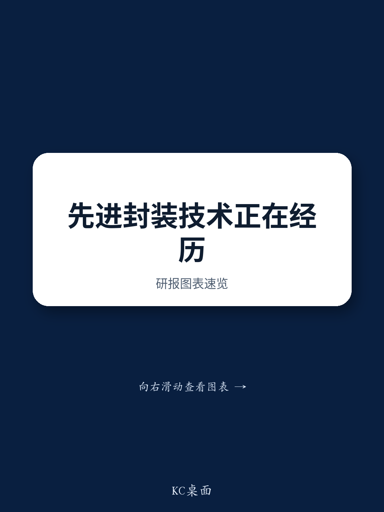

# AI硬件的下一个瓶颈不是芯片——而是基板

对下一代AI性能最关键的限制因素不再是晶体管密度或光刻技术。而是将芯片封装在一起的物理基板。根据某全球性研究机构举办的一场详细技术研讨会，行业正接近先进半导体封装的一个基本极限，这可能会推迟整个AI加速器产品路线图直至本十年末。核心问题很简单：随着光罩尺寸扩大以在单个封装上容纳更多计算和内存，多年来服务于行业的基板材料和组装工艺在翘曲、热膨胀系数不匹配和焊接可靠性等压力下正逐渐失效。

其影响巨大。某公司计划于2029年推出的下一代产品依赖于在特定封装架构中实现9.5倍光罩尺寸。根据该研讨会的技术评估，这一目标面临严峻的实施难度，焊接最早在2027年上半年就被确定为具体的失效点。即使是目前正在为另一款产品评估的5.5倍中间光罩尺寸，据报道进展也不顺利。如果封装技术无法扩展，整个AI性能提升轨迹将遭遇瓶颈。

这一封装瓶颈为电子元件供应链创造了一个战略转折点。赢家将不是那些能设计出最佳芯片架构的公司，而是那些能解决基板问题的公司——具体来说，是以精确的平整度和可靠的互连，大规模提供高刚性、低热膨胀系数基板的能力。这一动态指向竞争优势集中在少数日本材料和基板专业公司手中，同时也为某公司的代工雄心、另一家公司的供应链策略以及玻璃基板采用的时间表带来了新的问题。

## 封装架构的扩展极限为基板导向的竞争者创造了机会

先进封装中的根本矛盾在于光罩尺寸与机械可靠性之间。某封装架构采用带有嵌入式硅桥的模塑重分布层，而非全硅中介层，旨在实现更大的封装。某代工厂已公开披露了到2029年从3.3倍到5.5倍再到9.5倍光罩尺寸的路线图。但工程现实是，组装来自不同热膨胀系数材料（模塑树脂、铜重分布层布线、硅桥、芯片和ABF基板）的大型模块会产生严重的翘曲和连接问题。

研讨会指出，基板尺寸从3.3倍光罩时的85毫米×85毫米，增加到5.5倍时的110毫米×110毫米，最终到9.5倍时的130毫米×140毫米。在这些尺寸下，组装过程中的机械应力成为主要的失效模式。这意味着该封装架构的成功不再仅仅是代工厂的工艺问题，它关键取决于基板提供高刚性和平整度的能力。这正是日本基板制造商获得相对竞争优势的地方。他们在制造具有可控热膨胀系数和最小翘曲的大型高质量ABF基板方面的专业知识，成为整个封装路线图的先决条件。

战略后果是明确的。随着光罩尺寸增加，基板从被动组件转变为系统性能的主动约束。能够可靠地生产具有必要机械性能的大尺寸基板的公司将捕获不成比例的价值，因为能够大规模满足这些规格的供应商非常少。

## 另一种封装架构提供了一个有前景的替代方案，但某公司必须解决其生产可信度差距

某公司的另一种封装架构为现有方案提供了一个有趣的对比。通过在硅桥本身嵌入硅通孔，该架构实现了从基板侧向高带宽内存和逻辑芯片传输信号和电力，从而无需大型中介层。这种设计避免了同时键合整个大型模块，使整体结构不易翘曲。研讨会指出，该公司声称其架构可支持高达12倍的光罩尺寸，显著超过了当前代工厂的路线图。

这一技术优势是真实的。该架构之所以能实现比现有方案更高的连接可靠性，正是因为它不需要同时键合一个大型的多材料组件。对于下一代高带宽内存，当凸点间距可能从65微米缩小到36微米时，直接在桥上优化电力传输的能力成为高频、低压运行的一个有意义差异化因素。

然而，研讨会也强调了一个关键差距：该架构没有成熟的大规模生产记录。某代工服务部门缺乏为外部客户提供可靠的大规模生产能力，且基板侧的能力也不足。尽管一些公司已表达了兴趣，但该公司能否将其架构作为可行的量产技术推出仍不确定。计划将组装技术授权给另一家公司并外包组装，是认识到该公司无法独自解决这个问题。

对于日本基板供应商来说，这种情况创造了双重机会。如果该架构成功，拥有深厚基板专业知识的日本公司将成为其封装生态系统的重要供应商。如果该架构失败或延迟，现有方案扩展的压力将变得更加严峻，这同样有利于同一批基板专业公司。无论哪种情况，基板瓶颈都有利于拥有成熟制造能力的现有企业。

## 玻璃基板是理论上的解决方案，但实际量产仍需数年

玻璃基板因其优越的低热膨胀系数、高刚性和平整度——正是缓解大型封装翘曲所需的特性——而被广泛讨论为未来的基板材料。多家公司视玻璃基板为下一代封装的关键。研讨会证实，几乎所有主要基板制造商都在开发玻璃基板技术。

然而，从开发到量产之间的差距是巨大的。据研讨会称，目前只有一家公司拥有量产设施并已推进到小规模生产。其他几家主要公司仍处于开发阶段，且未公布量产启动日期。另一家公司已宣布与某化学公司合作建设生产工厂，目标是在2028年进行原型制作，但客户认证之后还需要额外时间。还有一家公司尚未承诺进行大规模投资。

研讨会的评估直言不讳：玻璃基板的大规模生产在2030年之前将很困难。基础设施——包括量产工厂、特种材料供应链和客户认证流程——根本还不存在。这一时间表创造了一个多年的窗口期，在此期间，有机核心基板必须承担先进封装的重任。近期某代工厂宣布将与两家公司合作开发用于特定封装架构的玻璃基板，这表明生态系统认识到这一差距并正试图加速，但这并未改变根本的时间表。

对于观察者和策略师而言，这意味着有机核心技术并非正在被淘汰的旧产品。它是必须支撑行业至少到2029-2030年的主力。那些能够推动有机核心性能——特别是通过实现更低热膨胀系数和更高刚性——的公司将拥有定价权和战略重要性。

## 基板供应链已成为一个战略瓶颈，且替代方案寥寥无几

研讨会关于基板供应链的分析揭示了能力的惊人集中。对于有机核心，某公司的特种玻璃布实际上是高端产品的相对少见供应商。其他玻璃布制造商在技术上无法跟上步伐。该公司正在根据来自多家终端用户的需求扩大产能，但进展缓慢，因为它看到了竞争对手追赶和未来潜在供应过剩的风险。

同样，另一家公司是供应能够在低热膨胀系数、高刚性基板所需的硬质材料中进行稳定微孔加工的钻孔工具领导者。研讨会指出，其他公司无法跟上步伐。这意味着整个先进封装生态系统依赖于极少数专门的日本材料和工具公司。

这种集中造成了脆弱性。任何一家关键供应商的中断都会波及整个AI供应链。这也意味着像某公司这样与这些关键供应商有长期关系的基板制造商，能够优先获得最好的材料和工具。新进入者不仅面临建立基板制造能力的挑战，还面临着从受限的上游获取供应的挑战。

战略要点是，基板瓶颈不仅仅是关于制造能力。它关乎一个分层依赖结构，其中最关键的约束在于材料和工具层面。控制这些上游输入的公司对整个封装路线图具有超乎寻常的影响力。

## 评估基板技术研究的决策框架

对于评估竞争格局的读者，研讨会的发现可以提炼为一个包含四个维度的结构化框架。首先，评估基板材料路线图。有机核心将至少在2028年之前占据主导地位，玻璃核心在2030年之后才变得相关。拥有强大有机核心能力和清晰玻璃核心开发路径的公司具有较强的定位。其次，评估供应链依赖关系。关键瓶颈是某公司的玻璃布和另一家公司的钻孔工具。任何未考虑获取这些供应商的基板策略都带有执行风险。

第三，分析封装架构的适配性。现有方案有利于具有高刚性、大尺寸有机核心能力的基板制造商。另一种方案有利于能够与某公司生态系统集成的基板制造商。其他架构代表了更长期的替代方案，但面临自身的可行性挑战。能够服务于多种架构的公司拥有最具韧性的商业模式。第四，考虑终端客户动态。某公司对一种新架构的兴趣，该架构将完全取消传统的ABF基板并使用特定地区的PCB供应链，这对日本基板制造商构成了直接挑战。然而，研讨会对该架构的可行性表示怀疑，指出它需要将线宽缩小到10微米或更小（目前为15-20微米），同时改变芯片侧布线规则，这将使与现有芯片的标准化变得复杂。

该框架表明，最具吸引力的位置由那些结合了有机核心领导力、获取关键上游供应商的渠道以及能够同时服务于两种主要封装架构的公司所持有。最不具吸引力的位置是那些依赖于2030年之前实现玻璃核心量产或依赖于像新架构这样未经证实的架构成功开发的公司。

## 封装瓶颈重塑了AI价值链中的竞争优势

半导体行业长期以来一直专注于前端创新——更小的节点、新的晶体管架构、先进的光刻技术。研讨会的分析清楚地表明，下一个竞争前沿在后端。大规模可靠地封装大型异构芯片的能力正成为AI性能的约束条件。

这种转变对供应链中价值的归属有着深远的影响。长期以来被视为商品化供应商的基板和封装公司，正成为战略合作伙伴，其能力决定了整个产品世代的可行性。在有机核心基板、特种玻璃布和精密钻孔工具方面拥有深厚专业知识的日本公司，有望捕获不成比例的价值。

同时，玻璃基板的时间表为现有企业巩固其地位创造了一个机会窗口。那些能够在未来四到五年内解决有机核心扩展挑战的公司，将建立起客户关系、制造规模和工艺专长，这些是玻璃核心新进入者难以取代的。当玻璃核心转型到来时，可能更多是演进而非革命，有机核心领导者最有能力适应。

对于AI硬件生态系统来说，最重要的战略问题不是哪种芯片架构将占主导地位。而是哪种基板技术将实现下一代封装，以及哪些公司将控制关键输入。这些问题的答案将决定本十年末AI性能的发展轨迹。

*仅供参考。部分内容可能基于源材料通过AI辅助生成、翻译、总结或编辑，可能包含遗漏或错误。请独立核实。本文不构成任何专业建议。*
