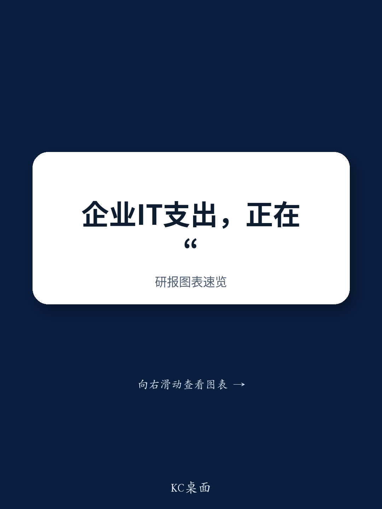

# JPM：硬件与网络渠道交流，美国大型VAR谈企业支出与OEM趋势

一份来自JPM与一家大型美国增值经销商（VAR）的交流纪要，揭示了当前企业IT支出中几个值得关注的信号。需求不仅没有节奏变化，反而以超出常规年度增长目标的速度在推进，且订单积压已延伸至2026年下半年和2027年。这份报告的核心判断是：企业IT支出正经历一轮由AI基础设施、安全需求和本地部署回流共同驱动的结构性增长，而非简单的周期性补库。

报告指出，收入增长同时来自出货量和价格两个维度。12个月的积压订单被VAR描述为“前所未有”。客户正在加速下单，通过更大规模的订单来锁定供应。但VAR强调，这反映的是真实需求，而非囤货，并明确表示看不到需求“断崖式下跌”的条件。

## 1. 内存成本变化重塑OEM定价与供应格局

一个被报告重点提及的供应链变化是内存成本。内存价格在组件成本中的占比快速上升，使得存储和计算类产品受到的影响最为显著。部分OEM厂商已将报价有效期从之前的60-90天缩短至一到两周，有些甚至保留在发货时重新定价的权利。与此同时，存储、计算和AI集群的交付周期已延长至六个月以上。网络设备因内存使用量较低，受影响相对较小。VAR预计，这种供应紧张的局面将持续贯穿2026年下半年和2027年。

> **KC评论：** 定价权正在从客户向OEM转移。报价有效期的大幅缩短，意味着企业客户在规划IT预算时，需要将更短的价格锁定窗口和更长的交付周期纳入考量，这本身就会推动提前下单，从而进一步强化当前的积压态势。

## 2. 服务器与存储市场全面走强，Dell在AI领域表现突出

在服务器领域，Dell被VAR视为主要OEM中的佼佼者，其在AI工厂建设上的策略成效显著。HPE也在获得客户采用，而Cisco与Nvidia的合作同样吸引了关注。SuperMicro和Lenovo在客户中的相关性也在提升。存储方面，面向AI的厂商（如Vast、Weka）正在获得增长动力，同时传统存储厂商Dell、Everpure和NetApp依然保持强势。报告援引VAR的说法，到7月份，传统存储厂商的业绩已经超过了去年全年的水平。

网络设备市场同样全面走强。在传统数据中心网络领域，Arista和Cisco正在相互争夺份额；而在AI网络领域，Nvidia表现强劲，白牌交换机在超大规模云厂商中份额持续提升。在企业边缘网络（如分支机构和园区），Cisco凭借焕新的产品线和客户大规模网络升级的需求，获得了强劲增长，HPE/Juniper是其主要的替代选择。

## 3. 本地部署回流与AI安全支出成为新的研究方向

报告揭示了两个正在加速的趋势。第一个是本地部署（On-prem）的回流。VAR指出了两个驱动因素：一是客户对未经过重新设计就直接迁移到云上的工作负载产生的高额云账单感到不满；二是不愿将专有或敏感数据放置在云端。此外，成本分析现在越来越倾向于支持在本地处理大规模Token消耗的工作负载。报告提到，2026年的私有数据中心支出已经超过了前一年的水平。

第二个趋势是AI安全支出的增长。报告特别提到了“Mythos类”前沿模型（包括但不限于Anthropic）带来的不确定性。VAR表示，这类模型串联漏洞并执行攻击的能力已被描述为“严重”且超越人类能力。这正推动客户为AI、安全和基础设施更新划拨预算，且这部分预算被认为是新增的，而非从其他项目中挪用。可观测性工具也被列为研究类别。

## 4. Token消费从“开放”转向“信用额度”模式，Copilot仍是默认选择

报告观察到企业AI使用行为的一个关键变化：Token消费管理已成为与客户日常沟通的工作流，其紧迫性在过去一到两个季度显著提升。VAR将其类比为早期云消费周期——容易开始，难以控制。其公司已专门设立了“AI FinOps”业务，专注于消费可见性和产出效率。一个被提及的现象是“Tokenmaxxing”，即员工为了完成AI采用指标而游戏化地消耗Token，而不考虑实际生产力。一年前大多数客户对Token消费还相当宽松，现在几乎所有客户都在设定消费上限，并采用基于例外审批的模式，类似于信用卡额度。报告认为，这虽然会在短期内抑制消费收入的增长，但对支出的可持续性而言是积极的。

在AI应用层面，Microsoft的M365 Copilot凭借其庞大的Office 365安装基数，仍然是企业客户的“默认”选择。客户在内部和外部广泛使用其进行企业数据访问、邮件、日程管理和工作流自动化。尽管客户也在认真评估替代方案，如Claude Cowork和Gemini Enterprise，但目前尚无迹象表明这些替代品正在驱动客户替换Microsoft Copilot的使用。

这份报告提供了一个观察企业IT支出结构的窗口：需求并非均匀分布，而是由AI基础设施、安全升级和本地部署回流这三个相互关联的引擎共同驱动。内存供应链的紧张和定价模式的变化，正在成为影响OEM竞争格局和客户采购节奏的新变量。

For informational purposes only. Portions may be generated,translated,summarized,or edited with AI assistance based on source materials and may contain omissions or errors. Please verify independently. This is not investment,legal,tax,accounting,or other professional advice.

For informational purposes only. Portions may be generated,translated,summarized,or edited with AI assistance based on source materials and may contain omissions or errors. Please verify independently. This is not investment,legal,tax,accounting,or other professional advice.

